# Azure Communication Services Architecture Guide

This guide presents an overview of Azure Communication Services architecture primitives. It's based on proven practices derived from customer engagements.

 - TODO: Descriptive section headers
 - TODO: Remove images that we don't want to publish

## Section Header 1
 - TODO: If this one is meant to be published, we'll want to improve readability (pinching horizontally for readability on mobile, straight lines, more neutral colors for the colored backgrounds (Ed recommended light gray on the three colored blocks))
 - TODO: Brief developer-friendly description

## Section Header 2

- TODO: Brief developer-friendly description

[ 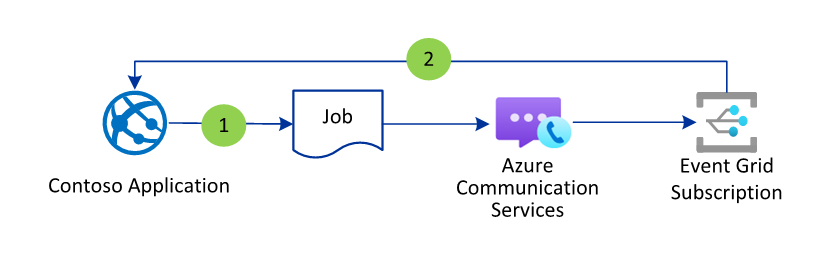 ](./media/router-job-submission.png#lightbox)

## Section Header 3

- TODO: Brief developer-friendly description

## Section Header 4

- TODO: Brief developer-friendly description

[ 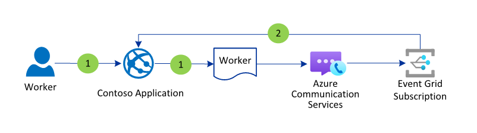 ](./media/router-worker-registration.png#lightbox)

## Section Header 5
- TODO: Readability TLC - the text is a bit small here.
- TODO: Brief developer-friendly description

[ 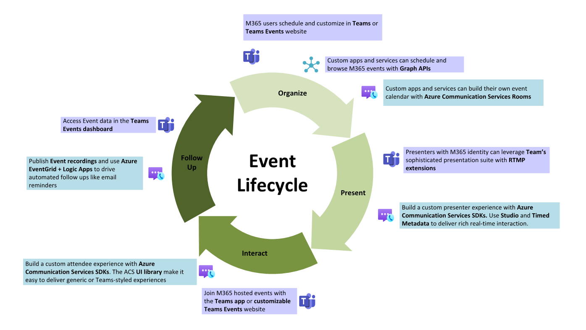 ](./media/event-cycle.png#lightbox)

## Section Header 6
- TODO: Brief developer-friendly description

[ 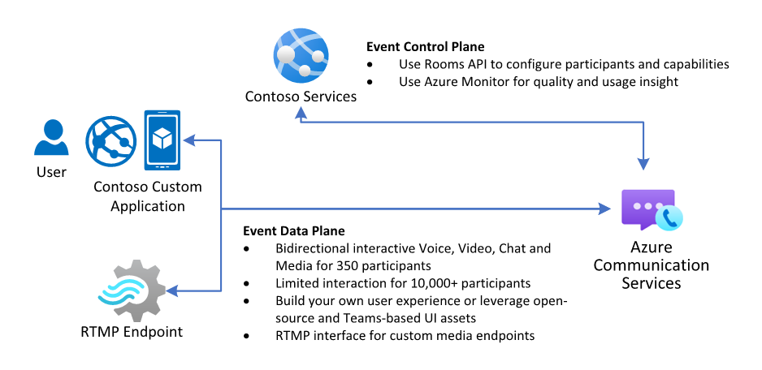 ](./media/events.png#lightbox)

## Section Header 7

- TODO: Brief developer-friendly description
- TODO: descriptive filename

[ 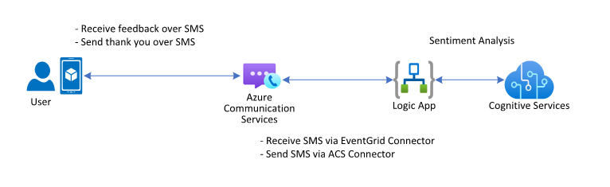 ](./media/page-6-1.png#lightbox)

## Section Header 8

- TODO: Brief developer-friendly description
- TODO: descriptive filename

[ 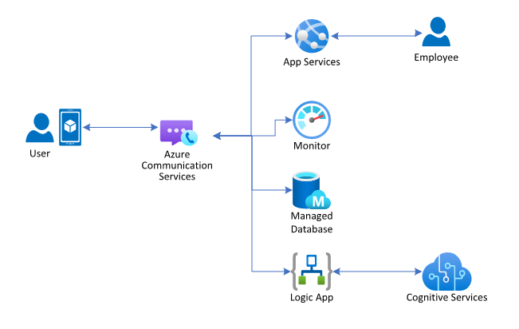 ](./media/page-6-2.png#lightbox)

## Section Header 9

- TODO: Brief developer-friendly description
- TODO: descriptive filename

[ 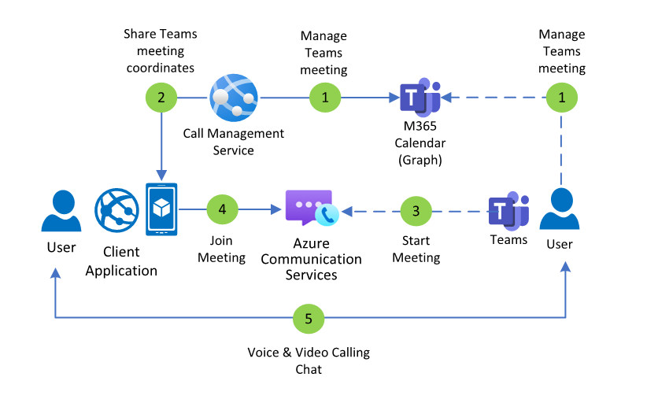 ](./media/page-9.png#lightbox)

## Section Header 10

- TODO: Brief developer-friendly description
- TODO: descriptive filename

[ 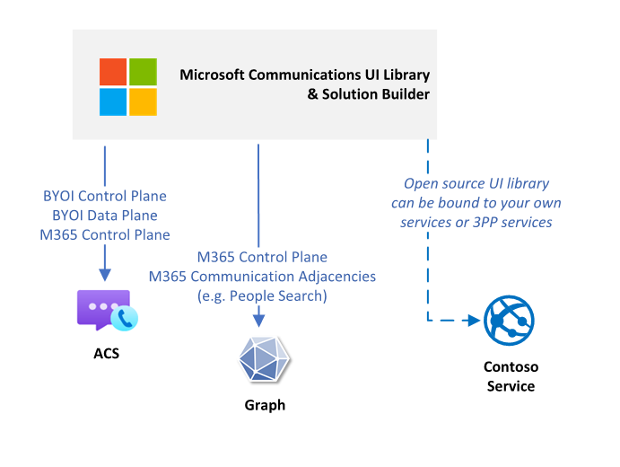 ](./media/page-11.png#lightbox)

## Section Header 11

- TODO: Brief developer-friendly description
- TODO: descriptive filename

[ 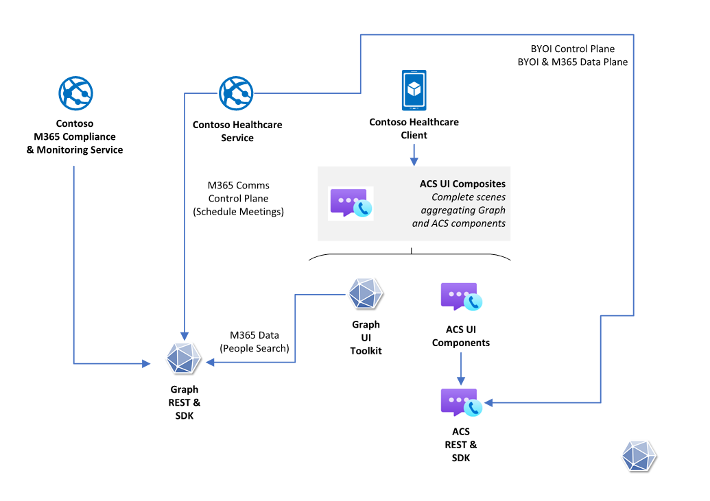 ](./media/page-12-1.png#lightbox)

## Section Header 12

- TODO: Brief developer-friendly description
- TODO: descriptive filename

[ 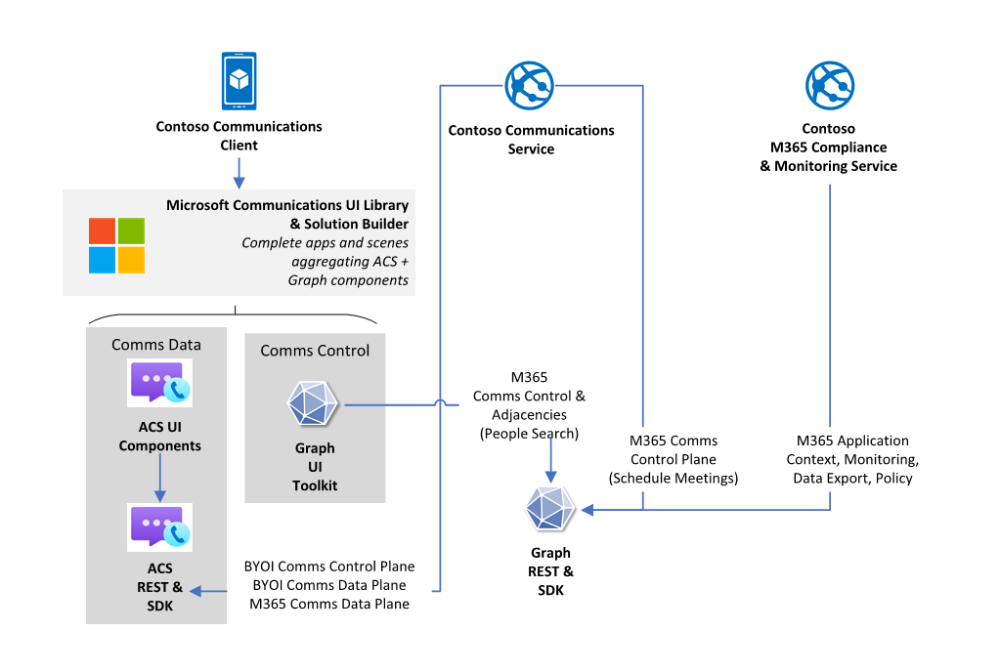 ](./media/page-12-2.png#lightbox)

## Section Header 13

- TODO: Brief developer-friendly description
- TODO: descriptive filename

[ 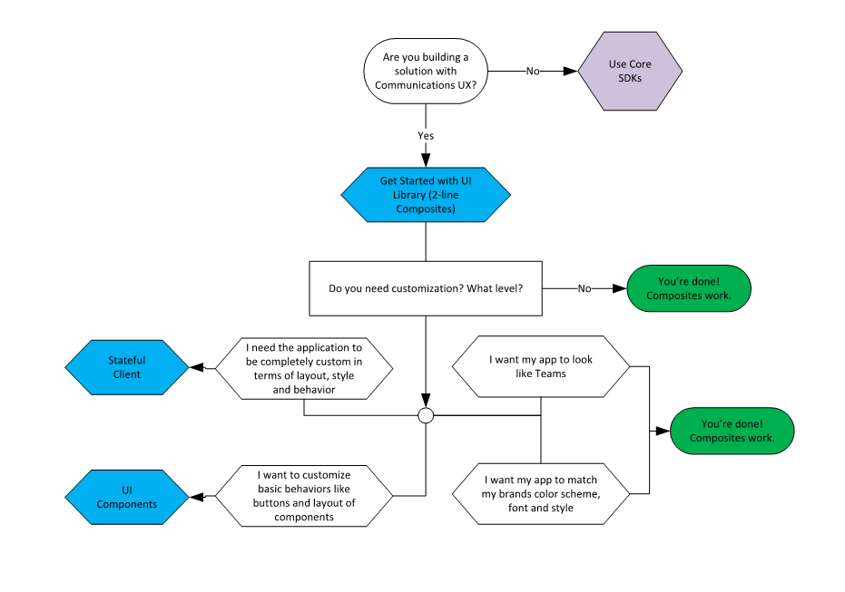 ](./media/page-13.png#lightbox)

## Section Header 14

- TODO: Brief developer-friendly description

## Section Header 15

- TODO: Brief developer-friendly description

