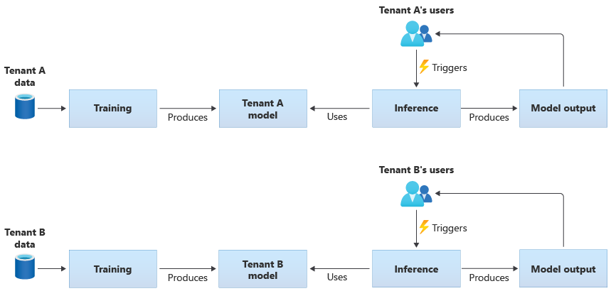
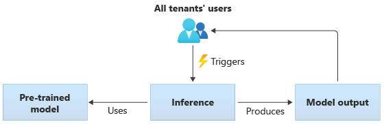
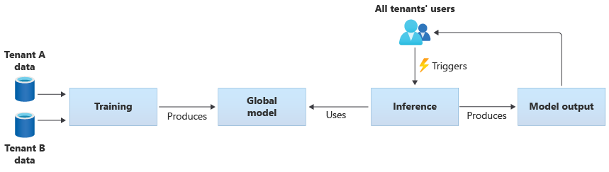
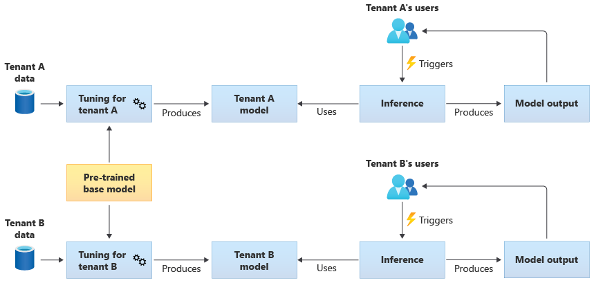

# Architectural approaches for AI and ML in multitenant solutions

An ever-increasing number of multitenant solutions are built around artificial intelligence (AI) and machine learning (ML). A multitenant AI/ML solution is one that provides similar ML-based capabilities to any number of tenants. Tenants generally can't see or share the data of any other tenant, but in some situations, tenants might use the same models as other tenants.

Multitenant AI/ML architectures need to consider the requirements for data and models, as well as the compute resources that are required to train models and to perform inference from models. It's important to consider how multitenant AI/ML models are deployed, distributed, and orchestrated, and to ensure that your solution is accurate, reliable, and scalable.

## Key considerations and requirements

When you work with AI and ML, it's important to separately consider your requirements for *training* and for *inference*. The purpose of training is to build a predictive model that's based on a set of data. You perform inference when you use the model to predict something in your application. Each of these processes has different requirements. In a multitenant solution, you should consider how your [tenancy model](../considerations/tenancy-models.yml) affects each process. By considering each of these requirements, you can ensure that your solution provides accurate results, performs well under load, is cost-efficient, and can scale for your future growth.

### Tenant isolation

Ensure that tenants don't gain unauthorized or unwanted access to the data or models of other tenants. Treat models with a similar sensitivity to the raw data that trained them. Ensure that your tenants understand how their data is used to train models, and how models trained on other tenants' data might be used for inference purposes on their workloads.

There are three common approaches for working with ML models in multitenant solutions: tenant-specific models, shared models, and tuned shared models.

#### Tenant-specific models

Tenant-specific models are trained only on the data for a single tenant, and then they are applied to that single tenant. Tenant-specific models are appropriate when your tenants' data is sensitive, or when there's little scope to learn from the data that's provided by one tenant, and you apply the model to another tenant. The following diagram illustrates how you might build a solution with tenant-specific models for two tenants:

#### Shared models

In solutions that use shared models, all tenants perform inference based on the same shared model. Shared models might be pretrained models that you acquire or obtain from a community source. The following diagram illustrates how a single pretrained model can be used for inference by all tenants:

You also can build your own shared models by training them from the data provided by all of your tenants. The following diagram illustrates a single shared model, which is trained on data from all tenants:

> [!IMPORTANT]
> If you train a shared model from your tenants' data, ensure that your tenants understand and agree to the use of their data. Ensure identifying information is removed from your tenants' data.
>
> Consider what to do, if a tenant objects to their data being used to train a model that will be applied to another tenant. For example, would you be able to exclude specific tenants' data from the training data set?

#### Tuned shared models

You also might choose to acquire a pretrained base model, and then perform further model tuning to make it applicable to each of your tenants, based on their own data. The following diagram illustrates this approach:

### Scalability

Consider how the growth of your solution affects your use of AI and ML components. Growth can refer to an increase in the number of tenants, the amount of data stored for each tenant, the number of users, and the volume of requests to your solution.

**Training:** There are several factors that influence the resources that are required to train your models. These factors include the number of models you need to train, the amount of data that you train the models with, and the frequency at which you train or retrain models. If you create tenant-specific models, then as your number of tenants grows, the amount of compute resources and storage that you require will also be likely to grow. If you create shared models and train them based on data from all of your tenants, it's less likely that the resources for training will scale at the same rate as the growth in your number of tenants. However, an increase in the overall amount of training data will affect the resources that are consumed, to train both the shared and tenant-specific models.

**Inference:** The resources that are required for inference are usually proportional to the number of requests that access the models for inference. As the number of tenants increase, the number of requests is also likely to increase.

It's a good general practice to use Azure services that scale well. Because AI/ML workloads tend to make use of containers, Azure Kubernetes Service (AKS) and Azure Container Instances (ACI) tend to be common choices for AI/ML workloads. AKS is usually a good choice to enable high scale, and to dynamically scale your compute resources based on demand. For small workloads, ACI can be a simple compute platform to configure, although it doesn't scale as easily as AKS.

### Performance

Consider the performance requirements for the AI/ML components of your solution, for both training and inference. It's important to clarify your latency and performance requirements for each process, so that you can measure and improve as required.

**Training:** Training is often performed as a batch process, which means that it might not be as performance-sensitive as other parts of your workload. However, you need to ensure that you provision sufficient resources to perform your model training efficiently, including as you scale.

**Inference:** Inference is a latency-sensitive process, often requiring a fast or even real-time response. Even if you don't need to perform inference in real time, ensure you monitor the performance of your solution and use the appropriate services to optimize your workload.

Consider using Azure's high-performance computing capabilities for your AI and ML workloads. Azure provides many different types of virtual machines and other hardware instances. Consider whether your solution would benefit from using CPUs, [GPUs](/azure/machine-learning/how-to-deploy-inferencing-gpus), [FPGAs](/azure/machine-learning/how-to-deploy-fpga-web-service), or other hardware-accelerated environments. Azure also provides real-time inference with NVIDIA GPUs, including NVIDIA Triton Inference Servers. For low-priority compute requirements, consider using [AKS spot node pools](/azure/aks/spot-node-pool). To learn more about optimizing compute services in a multitenant solution, see [Architectural approaches for compute in multitenant solutions](compute.md).

Model training typically requires a lot of interactions with your data stores, so it's also important to consider your data strategy and the performance that your data tier provides. For more information about multitenancy and data services, see [Architectural approaches for storage and data in multitenant solutions](storage-data.yml).

Consider profiling your solution's performance. For example, [Azure Machine Learning provides profiling capabilities](/azure/machine-learning/how-to-deploy-profile-model) that you can use when developing and instrumenting your solution.

### Implementation complexity

When you build a solution to use AI and ML, you can choose to use prebuilt components, or to build custom components. There are two key decisions you need to make. The first is the *platform or service* you use for AI and ML. The second is whether you use pretrained models or build your own custom models.

**Platforms:** There are many Azure services that you can use for your AI and ML workloads. For example, Azure Cognitive Services and Azure OpenAI Service provide APIs to perform inference against prebuilt models, and Microsoft manages the underlying resources. Azure Cognitive Services enables you to quickly deploy a new solution, but it gives you less control over how training and inference are performed, and it might not suit every type of workload. In contrast, Azure Machine Learning is a platform that enables you to build, train, and use your own ML models. Azure Machine Learning provides control and flexibility, but it increases the complexity of your design and implementation. Review the [machine learning products and technologies from Microsoft](../../../data-guide/technology-choices/data-science-and-machine-learning.md) to make an informed decision when selecting an approach.

**Models:** Even when you don't use a full model that's provided by a service like Azure Cognitive Services, you can still accelerate your development by using a pretrained model. If a pretrained model doesn't precisely suit your needs, consider extending a pretrained model by applying a technique called *transfer learning* or *fine-tunning*. Transfer learning enables you to extend an existing model and apply it to a different domain. For example, if you're building a multitenant music recommendation service, you might consider building off a pretrained model of music recommendations, and use transfer learning to train the model for a specific user's music preferences.

By using a prebuilt ML platforms like Azure Cognitive Services or Azure OpenAI Service, or a pretrained model, you can significantly reduce your initial research and development costs. The use of prebuilt platforms might save you many months of research, and avoid the need to recruit highly qualified data scientists to train, design, and optimize models. 

### Cost optimization

Generally, AI and ML workloads incur the greatest proportion of their costs from the compute resources that are required for model training and inference. Review [Architectural approaches for compute in multitenant solutions](compute.md) to understand how to optimize the cost of your compute workload for your requirements. 

Consider the following requirements when planning your AI and ML costs:

- **Determine compute SKUs for training.** For example, refer to [guidance on how to do this with Azure ML](/azure/cloud-adoption-framework/ready/azure-best-practices/optimize-ai-machine-learning-cost#determine-the-compute-size-for-training).
- **Determine compute SKUs for inference.** For an example cost estimate for inference, [refer to the guidance for Azure ML](/azure/cloud-adoption-framework/ready/azure-best-practices/optimize-ai-machine-learning-cost#determine-the-compute-size-for-inference).
- **Monitor your utilization.** By observing the utilization of your compute resources, you can determine whether you should decrease or increase their capacity by deploying different SKUs, or scale the compute resources as your requirements change. See [Azure Machine Learning Monitor](/azure/machine-learning/monitor-azure-machine-learning).
- **Optimize your compute clustering environment.** When you use compute clusters, monitor cluster utilization or configure [autoscaling](/python/api/azureml-core/azureml.core.compute.amlcompute.scalesettings) to scale down compute nodes.  
- **Share your compute resources.** Consider whether you can optimize the cost of your compute resources by sharing them across multiple tenants. 
- **Consider your budget.** Understand whether you have a fixed budget, and monitor your consumption accordingly. You can [set up budgets](/azure/machine-learning/concept-plan-manage-cost#create-budgets) to prevent overspending and to allocate quotas based on tenant priority.

## Approaches and patterns to consider

Azure provides a set of services to enable AI and ML workloads. There are several common architectural approaches used in multitenant solutions: to use prebuilt AI/ML solutions, to build a custom AI/ML architecture by using Azure Machine Learning, and to use one of the Azure analytics platforms.

### Use prebuilt AI/ML services

It's a good practice to try to use prebuilt AI/ML services, where you can. For example, your organization might be beginning to look at AI/ML and want to quickly integrate with a useful service. Or, you might have basic requirements that don't require custom ML model training and development. Prebuilt ML services enable you to use inference without building and training your own models.

Azure provides several services that provide AI and ML technology across a range of domains, including language understanding, speech recognition, knowledge, document and form recognition, and computer vision. Azure's prebuilt AI/ML services include [Azure Cognitive Services](https://azure.microsoft.com/services/cognitive-services), [Azure OpenAI Service](https://azure.microsoft.com/en-us/products/cognitive-services/openai-service), [Azure Cognitive Search](/azure/search/search-what-is-azure-search), and [Azure Form Recognizer](https://azure.microsoft.com/services/form-recognizer). Each service provides a simple interface for integration, and a collection of pretrained and tested models. As managed services, they provide service-level agreements and require little configuration or ongoing management. You don't need to develop or test your own models to use these services.

Many managed ML services don't require model training or data, so there's usually no tenant data isolation concerns. However, when you work with Cognitive Search in a multitenant solution, review [Design patterns for multitenant SaaS applications and Azure Cognitive Search](/azure/search/search-modeling-multitenant-saas-applications).

Consider the scale requirements for the components in your solution. For example, many of the APIs within Azure Cognitive Services support a maximum number of requests per second. If you deploy a single Cognitive Services resource to share across your tenants, then as the number of tenants increases, you might need to [scale to multiple resources](resource-organization.yml).

> [!NOTE]
> Some managed services enable you to train with your own data, including the [Custom Vision service](/azure/cognitive-services/custom-vision-service/overview), the [Face API](/azure/cognitive-services/face/face-api-how-to-topics/how-to-add-faces), [Form Recognizer custom models](/azure/applied-ai-services/form-recognizer/concept-custom), and some [OpenAI models that support customization and fine-tunning](/azure/cognitive-services/openai/how-to/fine-tuning). When you work with these services, it's important to consider the [isolation requirements](#tenant-isolation) for your tenants' data.

### Custom AI/ML architecture

If your solution requires custom models, or you work in a domain that isn't covered by a managed ML service, then consider building your own AI/ML architecture. [Azure Machine Learning](/azure/machine-learning) provides a suite of capabilities to orchestrate the training and deployment of ML models. Azure Machine Learning supports many open-source machine learning libraries, including [PyTorch](https://azure.microsoft.com/develop/pytorch), [Tensorflow](/azure/machine-learning/how-to-train-tensorflow), [Scikit](/azure/machine-learning/how-to-train-scikit-learn), and [Keras](/azure/machine-learning/how-to-train-keras). You can continuously monitor models' performance metrics, detect data drift, and trigger retraining to improve model performance. Throughout the lifecycle of your ML models, Azure Machine Learning enables auditability and governance with built-in tracking and lineage for all your ML artifacts.

When working in a multitenant solution, it's important to consider the [isolation requirements of your tenants](#tenant-isolation) during both the training and inference stages. You also need to determine your model training and deployment process. Azure Machine Learning provides a pipeline to train models, and to deploy them to an environment to be used for inference. In a multitenant context, consider whether models should be deployed to shared compute resources, or if each tenant has dedicated resources. Design your model deployment pipelines, based on your [isolation model](../considerations/tenancy-models.yml) and your [tenant deployment process](deployment-configuration.yml).

When you use open-source models, you might need to retrain these models by using transfer learning or tuning. Consider how you will manage the different models and training data for each tenant, as well as versions of the model.

The following diagram illustrates an example architecture that uses Azure Machine Learning. The example uses the [tenant-specific models](#tenant-specific-models) isolation approach.

### Integrated AI/ML solutions

Azure provides several powerful analytics platforms that can be used for a range of purposes. These platforms include [Azure Synapse Analytics](/azure/synapse-analytics/overview-what-is), [Databricks](/azure/databricks/scenarios/ml/), and [Apache Spark](/azure/synapse-analytics/spark/apache-spark-machine-learning-training).

You can consider using these platforms for AI/ML, when you need to scale your ML capabilities to a very large number of tenants, and when you need large-scale compute and orchestration. You also might consider using these platforms for AI/ML, when you need a broad analytics platform for other parts of your solution, such as for data analytics and integration with reporting through Microsoft Power BI. You can deploy a single platform that covers all of your analytics and AI/ML needs. When you implement data platforms in a multitenant solution, review [Architectural approaches for storage and data in multitenant solutions](storage-data.yml).

## Antipatterns to avoid

- **Failure to consider isolation requirements.** It's important to carefully consider how you [isolate tenants' data and models](#tenant-isolation), both for training and inference. Failing to do so might violate legal or contractual requirements. It also might reduce the accuracy of your models to train across multiple tenants' data, if the data is substantially different.
- **Noisy Neighbors.** Consider whether your training or inference processes could be subject to the [Noisy Neighbor problem](../../../antipatterns/noisy-neighbor/noisy-neighbor.yml). For example, if you have several large tenants and a single small tenant, ensure that the model training for the large tenants doesn't inadvertently consume all of the compute resources and starve the smaller tenants. Use resource governance and monitoring to mitigate the risk of a tenant's compute workload that's affected by the activity of the other tenants.

## Contributors

*This article is maintained by Microsoft. It was originally written by the following contributors.*

Principal author:

 * [Kevin Ashley](http://linkedin.com/in/kashlik) | Senior Customer Engineer, FastTrack for Azure
 
Other contributors:

 * [Paul Burpo](http://linkedin.com/in/paul-burpo) | Principal Customer Engineer, FastTrack for Azure
 * [John Downs](http://linkedin.com/in/john-downs) | Principal Customer Engineer, FastTrack for Azure
 * [Daniel Scott-Raynsford](http://linkedin.com/in/dscottraynsford) | Partner Technology Strategist
 * [Arsen Vladimirskiy](http://linkedin.com/in/arsenv) | Principal Customer Engineer, FastTrack for Azure

## Next steps

Review [Architectural approaches for compute in multitenant solutions](compute.md) approaches.
