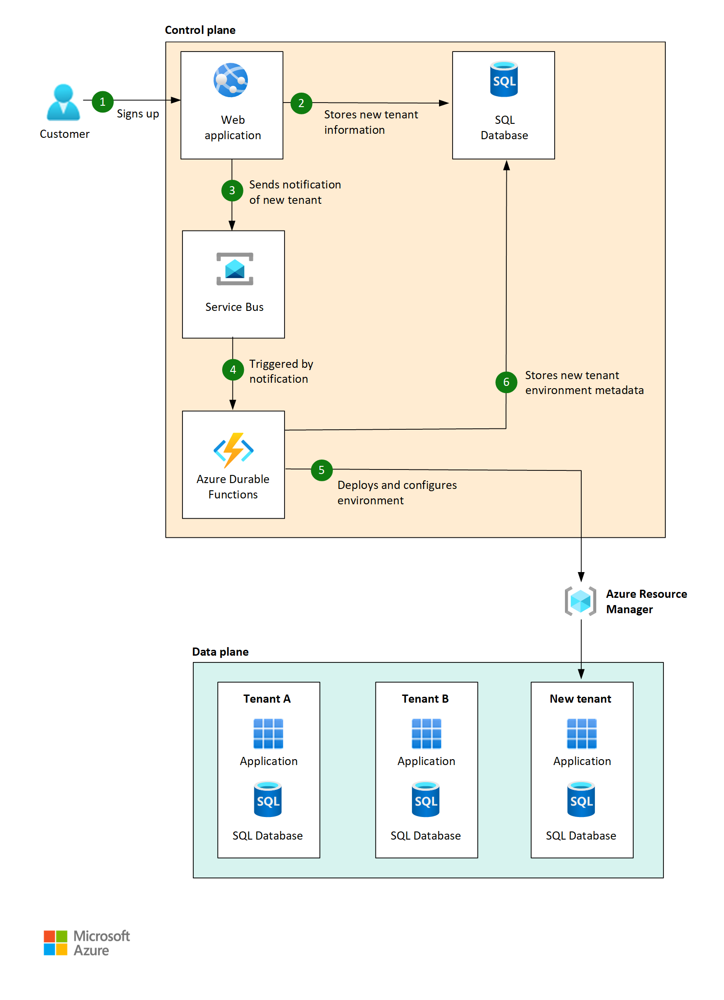
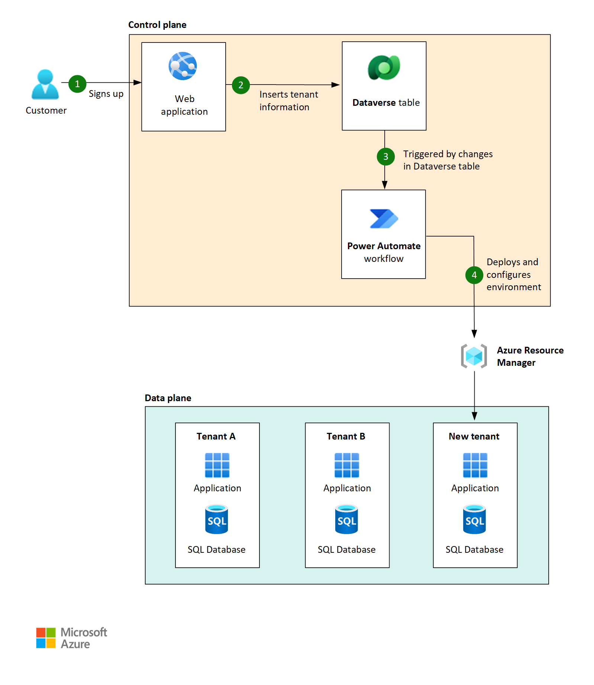
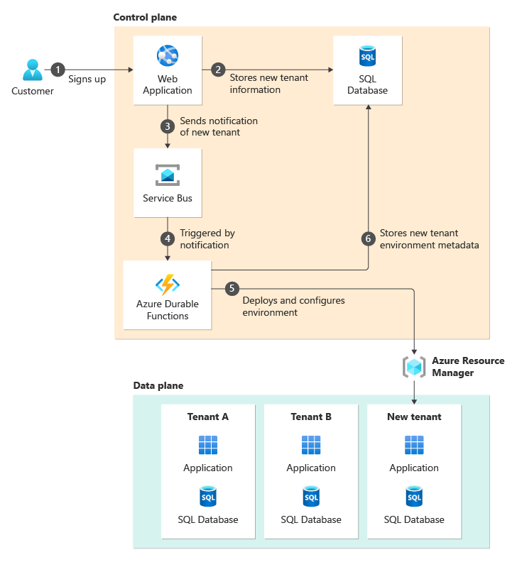

# Architectural approaches for control planes in multitenant solutions

Control planes are an important part of SaaS and multitenant solutions, especially to help manage a solution at scale. Typically, there are two main components that make up a control plane: 

 - The tenant catalog, which contains information like tenant metadata, mappings of tenants to deployment stamps or other infrastructure components, and tenant-specific configuration.
 - Processes to manage changes to the environment triggered by tenant [lifecycle events](../considerations/tenant-lifecycle.md). For example, tenant onboarding, tenant offboarding, and any regular maintenance required.

A control plane is itself an application. As such, it is important to think about your control plane carefully, and to design it with the same rigor and care you use with any other part of your solution. For more information on what a control plane is, why you should use it, and considerations for designing one, see [Considerations for multitenant control planes](../considerations/control-planes.yml).

In this article, we describe some approaches you can consider for designing and building a control plane. The list of approaches found here is non-exhaustive, and is intended only for the purpose of providing examples, not to suggest that you should only consider these approaches.

## Approaches and patterns to consider

The following table summarizes the differences between some of the approaches you could consider for a control plane:

| Consideration  | Manual processes | Low-code | Custom | 
|---|---|---|---|
| Operational overhead | High | Low-Medium | Low |
| Time and complexity to implement | Low | Medium | High |
| Maintenance responsibilities | Low | Medium | High |

### Manual processes

It's not always essential to build a fully automated control plane, especially when you're starting out and only have a small number of tenants.

You might keep a tenant catalog somewhere central, like in an Excel workbook or a JSON file that's stored somewhere centrally that your team can access. It's a good idea to keep the information in a structured format so you can easily work with the data programmatically. Keep information about the tenants, their configuration, and the deployment information you need, like the SKUs you deploy for their resources, or the stamps they're allocated to.

> [!NOTE]
> A manual control plane is a great way to get started with managing your multitenant application, but it is only suitable for a low number of tenants. You should only use this approach if you have only a few tenants, and you do not need automated or self-service onboarding.

For processes like tenant onboarding and maintenance activities:

> [!div class="checklist"]
>
> - **Create scripts wherever possible, even if you execute them manually.** By using scripts, you ensure that the steps are run consistently for each tenant.
> - **For things that you can't script initially, document the process thoroughly and in explicit detail.** You'll want to be sure you document the "how" as well as the "why" because if somebody ends up automating this in the future, they should have a good understanding of what's going on.

The following diagram illustrates how manual processes might serve as an initial control plane: 

#### Advantages of this approach

- Lightweight: This approach is often easy to develop and easy to change when it's just documentation and scripts, so when you're figuring out your processes you can rapidly iterate and evolve them.

#### Disadvantages of this approach

- Lack of control: This approach relies on everybody involved doing the correct thing. Somebody might veer from the prescribed processes, either accidentally or intentionally. Every variation in process increases the risk of inconsistency in your environment, which makes ongoing management much harder.
- Access control difficulty: Typically when you use this approach you have to grant broadly scoped, highly permissive access to anybody who operates your solution, which makes it hard to follow the [principle of least privilege](/azure/active-directory/develop/secure-least-privileged-access).
- Scalability: The work required to run manual processes scales with the number of tenants to manage. 
- Testability: Manual processes are difficult to validate and test.

#### When to consider moving to another approach

- When your team can't keep up with the amount of work they need to do to maintain the application, such as when your number of tenants scales beyond a critical point. For most teams, the critical point is around 10 tenants.
- When you need to mitigate risk of inconsistencies. For example, you might observe some mistakes creeping in because somebody isn't following the processes correctly, or there's too much ambiguity in the processes.
- You anticipate tenant growth beyond more than a few tenants (for example, more than 5-10) and you need to prepare for the work involved in administering this number of tenants.

### Low-code control plane

A low-code, or no-code, control plane is a type of control plane that is built using a platform designed to enable you to automate business processes and track information. There are many platforms that exist today that allow you to do this without writing custom code. Using one of these platforms can be a good approach to enable the low-code building of a control plane.

The Microsoft Power Platform is an example of one of these platforms. If you were to use Power Platform, you might keep your tenant catalog in Dynamics 365, Dataverse, or in Microsoft 365. You could also consider keeping the same tenant catalog you use for your manual processes, if you don't want to fully commit yet to having everything automated.

For tenant onboarding and maintenance, you could then use Microsoft Power Automate to run workflows that perform tenant management, tenant configuration, trigger pipelines or API calls, and so on. You could use Power Automate to watch for changes to your tenant catalog, if the data is somewhere accessible to Power Automate. If you choose to use a manual tenant catalog, Power Automate workflows can also be triggered manually. You can also choose to include manual approval steps in your workflows, if you need somebody from your team to verify something or perform some additional steps that can't be fully automated.

The following diagram illustrates how you might construct a control plane using the Microsoft Power Platform:

#### Advantages of this approach

- **Lightweight**: It's often quick and inexpensive to build a set of low-code workflows and connect it to the surrounding systems.
- **Make use of platform tooling**: You can use native platform features to store data, create administrative portals for your team to use, and monitor the workflows as they run.
- **Customizability**: If you need more customization, you can typically augment your workflows with custom code and processes. For example, you might use Power Automate to trigger a deployment workflow in GitHub Actions, or you might invoke some Azure Functions to run your own code. This helps facilitate a gradual implementation as well.
- **Low overhead**: Low-code services are typically fully managed, so you don't need to manage infrastructure.

#### Disadvantages of this approach

- **Expertise**: Low-code platforms typically require proprietary knowledge in order to build with them and effectively use them. Many organizations already use these tools, so you might have expertise already, but you also might not. You should consider whether or not you may need to have your team upskill in order to make effective use of these platforms.
- **Management**: Management of large amounts of low-code configuration can be challenging to handle.
- **Testability**: Consider how you might test and promote changes to your control plane. In a managed platform, forming a typical DevOps process around this is more difficult, as changes are normally made through configuration, not code.
- **Design**: You need to think carefully about how to meet your non-functional requirements, such as security and reliability. These are often managed for you in a low-code platform.

#### When to consider moving to another approach

- Eventually, your requirements could become more complex than what makes sense for you to build into a low-code solution. When you find you're needing to work around limitations in the tooling to meet your needs, it probably makes sense to move away from a managed solution and towards a custom control plane.

### Custom control plane

You could also consider building your own completely customized control plane. This provides you with the most flexibility and power, but also requires the most work. It is most common to keep your tenant catalog in a database. You don't work directly with the catalog in this case, but would instead manage it through an administrative interface.

Typically, you build a set of control plane components designed around all your tenant administrative functions. These components might include an administrative portal or other user interface, an API, and background processing components. Deployment pipelines might also make up your control plane as well if you need to do things such as deploy code or infrastructure when tenant lifecycle events occur.

It is important to ensure that any long-running processing uses appropriate tooling. For example, you might use [Durable Functions](/azure/azure-functions/durable/durable-functions-overview) or [Logic Apps](/azure/logic-apps/logic-apps-overview) for components that orchestrate tenant onboarding or deployments, or for components that need to communicate with external systems.

The following diagram illustrates how you might construct a basic custom control plane:

#### Advantages of this approach

- **Full flexibility and customizability**: You have complete control over what your control plane does and can change it if your requirements change.
- **Testability**: You can use a standard software development life-cycle (SDLC) for your control plane application and implement normal approaches for testing and deployments, just like you would for your main applications.

#### Disadvantages of this approach

- **Maintenance responsibilities**: There is a higher amount of maintenance overhead in this approach, as you must build everything yourself. A control plane is as important as any other part of your application. As such, you need to take great care in developing and running your control plane to ensure it is reliable.

### Hybrid approaches

You could also consider using a hybrid approach. You might use a combination of manual and automated systems, or you might use a managed platform like Power Platform and augment it with custom applications. Implementing a hybrid approach is good to consider if you need the customizability that comes with the custom control plane, but don't necessarily want to build and maintain a fully custom system. Keep in mind that, at some point, your automated customizations to your manual processes or your managed platform could become as complex as a fully customized system. The tipping point is different for every organization, but if you find that your hybrid approach has become cumbersome to maintain, you should consider building a fully custom system.

### Gradual implementation

Even if you know that you don't want any manual processes in your control plane, you don't necessarily have to start there. A common approach as you are getting started building your application is to start with a manual control plane. As your application progresses and onboards more tenants, you should then begin to identify bottleneck areas and automate those as necessary, moving into more of a hybrid approach. As you automate more and more, you can eventually find yourself with a 100% automated control plane.

## Antipatterns to avoid

- **Relying on manual processes for too long.** While it's reasonable to use manual processes when you start out, or when you have a small number of tenants and require fairly lightweight management, it's important to plan how you will scale to an automated solution as you grow. If you find that you're needing to hire additional resources to keep up with the demand of your manual processes, that is a good sign that you should begin automating parts of your control plane.
- **Using inappropriate tools for long-running workflows.** For example, using standard Azure Functions or synchronous API calls to submit ARM deployments or orchestrate across multiple steps. See the [asynchronous request-reply pattern](/azure/architecture/patterns/async-request-reply) too.

## Contributors

*This article is maintained by Microsoft. It was originally written by the following contributors.*

Principal Authors:

- [John Downs](https://www.linkedin.com/in/john-downs/)
- [Landon Pierce](https://www.linkedin.com/in/landon-pierce/)

Other Contributors:

- [Bohdan Cherchyk](https://www.linkedin.com/in/cherchyk/)
- [Arsen Vladimirskiy](https://www.linkedin.com/in/arsenv/)

## Next steps

Review [Architectural considerations for control planes in a multitenant solution](../considerations/control-planes.yml).