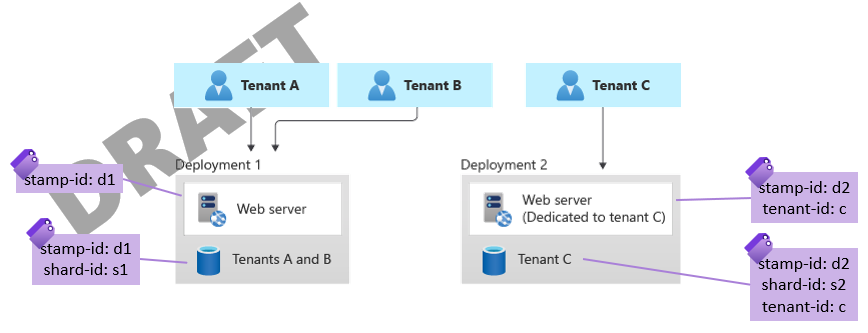

Multitenant solutions often require special consideration when you measure and allocate costs, and when you optimize costs. On this page, we describe some key guidance for solution architects to consider about the measurement, allocation, and optimization of costs for a multitenant application.

## Key considerations and requirements

Consider the requirements you have for measuring the consumption for your solution. This is discussed in more detail on [Measure the consumption of each tenant](../considerations/measure-consumption.md). 

### Purpose of measurement

It's important to decide what your goal is. The following are examples of goals:

- **Calculate an approximate cost of goods sold for each tenant.** For example, if you deploy a significant number of shared resources, you might only be interested in a rough approximation of the cost incurred for each tenant.
- **Calculate the exact cost incurred by each tenant.** For example, if you charge your tenants for the exact amount of consumption they incur, you need to have precise information about how much each tenant's resources cost.
- **Identify outlier tenants that cost significantly more than others.** For example, if you provide a [flat-rate pricing model](../considerations/pricing-models.md#flat-rate-pricing), you might need to determine whether any tenants are consuming a disproportionate amount of your provisioned capacity, so that you can apply fair-use policies. In many situations, this use case doesn't require precise measurement of costs.
- **Reduce the overall Azure cost for your solution.** For example, you might want to look at the cost of every component, and then determine whether you have over-provisioned for the workload.

By understanding the goal of measuring the consumption by a tenant, you can determine whether the cost allocations need to be approximate or highly precise, which affects the specific tools you can use and the practices you can follow.

### Shared components

You might be able to reduce the cost of a multitenant solution by moving tenants to shared infrastructure. However, you need to carefully consider the impact of sharing resources, such as whether your tenants will begin to experience the [Noisy Neighbor problem](../../../antipatterns/noisy-neighbor/noisy-neighbor.yml).

You also need to consider how you measure and allocate the costs of shared components. For example, you can evenly divide the cost between each of the tenants that use the shared component. Or, you can meter each tenant's usage to get a more precise measurement of their consumption of shared components.

## Approaches and patterns to consider

### Allocate costs by using resource tags

Azure enables you to [apply tags to your resources](/azure/azure-resource-manager/management/tag-resources). A tag is a key-value pair. You use tags to add custom metadata. Tags are useful for many management operations, and they're also useful for analyzing the cost of your Azure consumption. After you apply tags, [you can determine costs associated with each tag](/azure/cost-management-billing/costs/cost-analysis-common-uses#view-costs-for-a-specific-tag).

The way you use tags in a multitenant solution is likely to be different, depending on your architecture.

In some solutions, you might deploy dedicates resources for each tenant, such as if you deploy dedicated [Deployment Stamps](../../../patterns/deployment-stamp.yml) for each tenant. In these situations, it's clear that any Azure consumption for those resources should be allocated to that tenant, and so you can tag your Azure resources with the tenant ID.

In other situations, you might have sets of shared resources. For example, when you apply the [Sharding pattern](../../../patterns/sharding.yml), you might deploy multiple databases and spread your tenants across them. Consider tagging the resources with an identifier for the _group_ of tenants. You might not be able to easily allocate costs to a single tenant, but you can at least narrow down the cost to a set of tenants, when you use this approach. You can also use the consumption information to help you rebalance tenants across the shards, if you notice that a specific shard is accruing higher costs than the others.

> [!NOTE]
> There is a [limit to the number of tags](/azure/azure-resource-manager/management/tag-resources#limitations) that can be applied to a resource. When you work with shared resources, it's best not to add a tag for every tenant that shares the resource. Instead, consider adding a tag with the shard ID or another way to identify the group of tenants.

Consider an example multitenant solution that's built using the [Deployment Stamps pattern](../../../patterns/deployment-stamp.yml) and a [vertically partitioned tenancy model](../considerations/tenancy-models.yml#vertically-partitioned-deployments). Each deployment stamp includes a shared web server and sharded databases. Tags can be applied to each of the Azure components, as shown in the following diagram.

The tagging strategy employed here is as follows:

- Every resource has a `stamp-id` tag.
- Every sharded database has a `shard-id` tag.
- Every resource dedicated to a specific tenant has a `tenant-id` tag.

With this tagging strategy, it's easy to filter the cost information to a single stamp. It's also easy to find the cost of the tenant-specific resources, such as the total cost of the database for tenant C. Shared components don't have a `tenant-id` tag, but the cost of the shared components for a stamp can be divided between the tenants who are assigned to use that stamp or shard.

### Instrument your application

In situations where you don't have a direct relationship between an Azure resource and a tenant, consider instrumenting your application to collect telemetry.

Your application tier might already collect logs and metrics that are helpful to answer questions about metering, for example:

- Approximately how many API requests are made per tenant?
- What times of the day are specific tenants busiest?
- How do tenant A's usage patterns compare to tenant B's usage patterns?

In Azure, these metrics are often captured by [Application Insights](/azure/azure-monitor/app/app-insights-overview). By using [telemetry initializers](/azure/azure-monitor/app/api-filtering-sampling), you can enrich the telemetry captured by Application Insights, to include a tenant identifier or other custom data.

However, Application Insights and other logging and monitoring solutions are not appropriate for precise cost measurement or for metering purposes. Application Insights is designed to [sample data](/azure/azure-monitor/app/sampling), especially when your application has a high volume of requests. Sampling is designed to reduce the cost of monitoring your solution, because capturing every piece of telemetry can often become expensive.

If you need to track precise details about consumption or usage for billing purposes, you should instead build a custom pipeline to log the necessary data. You should then aggregate the data, based on your requirements. Azure services that can be helpful for this purpose include [Event Hubs](https://azure.microsoft.com/services/event-hubs), to capture large volumes of telemetry, and [Stream Analytics](https://azure.microsoft.com/services/stream-analytics), to process it in real time.

### Use Azure Reservations and Azure savings plan to reduce costs

**Azure Reservations:** [Azure Reservations](/azure/cost-management-billing/reservations/save-compute-costs-reservations) enable you to reduce your Azure costs by pre-committing to a certain level of spend. Reservations apply to a number of Azure resource types. 

Reservations can be used effectively in a multitenant solution. Note the following considerations:

- When you deploy a multitenant solution that includes shared resources, consider the baseline level of consumption that you need for the workload. You might consider a reservation for that baseline consumption, and then you'd pay standard rates for higher consumption during unpredictable peaks.
- When you deploy resources for each tenant, consider whether you can pre-commit to the resource consumption for a specific tenant, or across your portfolio of tenants.

Azure Reservations enables you to [scope your reservations](/azure/cost-management-billing/reservations/prepare-buy-reservation#scope-reservations) to apply to a resource group, a subscription, or a set of subscriptions. This means that you can take advantage of reservations, even if you shard your workload across multiple subscriptions.

Reservation scopes can also be helpful, when you have tenants with unpredictable workloads. For example, consider a solution in which tenant A only needs one instance of a specific resource, but tenants B and C each need two. Then tenant B becomes less busy, so you reduce the instance count, and tenant A gets busier, so you increase the instance count. Your reservations are applied to the tenants that need them.

**Azure savings plan for compute:** Azure savings plan for compute is a flexible cost-saving plan that generates significant savings over pay-as-you-go prices. You agree to a one-year or three-year contract and receive discounts on eligible compute services. These services include virtual machines, dedicated hosts, container instances, Azure premium functions, and Azure app services. Savings apply to these compute services regardless of the region, instance size, or operating system. For more information, see [Azure savings plan overview](https://azure.microsoft.com/pricing/offers/savings-plan-compute/#benefits-and-features) and [Azure savings plan documentation](/azure/cost-management-billing/savings-plan/savings-plan-compute-overview).

**Combine reservations and savings plan:** To further optimize cost and flexibility, you can combine an Azure savings plan with Azure Reservations.

## Antipatterns to avoid

- **Not tracking costs at all.** It's important to have at least an approximate idea of the costs you're incurring, and how each tenant impacts the cost of delivering your solution. Otherwise, if your costs change over time, you have no baseline to compare against. You also might not be able to predict how a growth in tenants will impact your costs and profitability.
- **Making assumptions or guessing.** Ensure your cost measurement is based on real information. You might not need a high degree of precision, but even your estimates should be informed by real measurements.
- **Unnecessary precision.** You might not need to have a detailed accounting of every cost that's incurred for every tenant. Building unnecessarily precise cost measurement and optimization processes can be counterproductive, because it adds engineering complexity and creates brittle processes.
- **Real-time measurement.** Most solutions don't need up-to-the-minute cost measurements. Because metering and consumption data can be complex to process, you should log the necessary data and then asynchronously aggregate and process the data later.
- **Using monitoring tools for billing.** As described in [Instrument your application](#instrument-your-application), ensure you use tools that are designed for cost monitoring and metering. Application monitoring solutions are typically not good candidates for this type of data, especially when you need high precision.

## Contributors

*This article is maintained by Microsoft. It was originally written by the following contributors.*

Principal author:

 * [John Downs](http://linkedin.com/in/john-downs) | Principal Customer Engineer, FastTrack for Azure

Other contributors:

 * [Sherri Babylon](https://www.linkedin.com/in/sbabylon) | Senior Customer Engineer, FastTrack for Azure
 * [Arsen Vladimirskiy](http://linkedin.com/in/arsenv) | Principal Customer Engineer, FastTrack for Azure

*To see non-public LinkedIn profiles, sign in to LinkedIn.*

## Next steps

- [Measure the consumption of each tenant](../considerations/measure-consumption.md)
