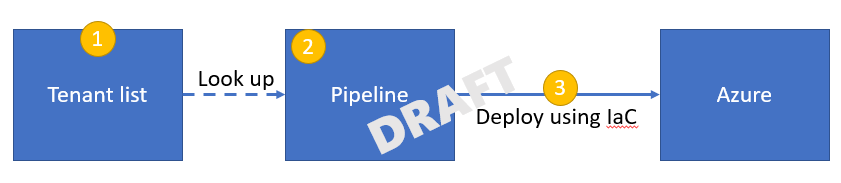
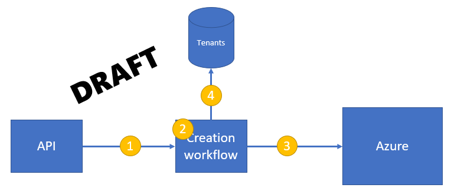
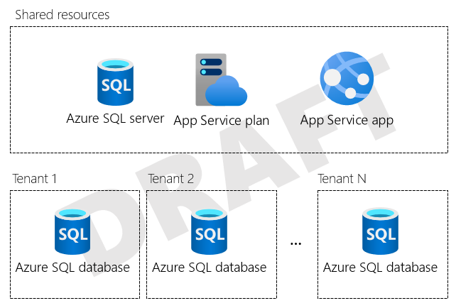
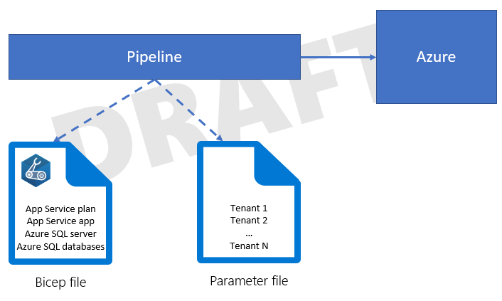
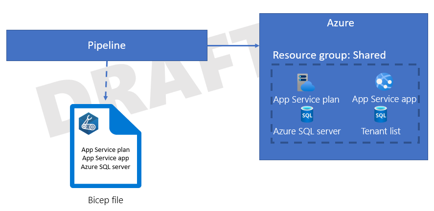
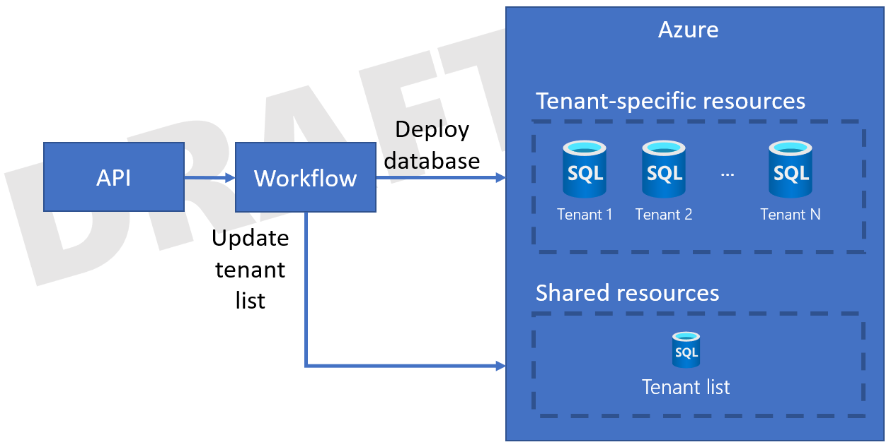

Regardless of your architecture and the components you use to implement it, you need to deploy and configure your solution's components. In a multitenant environment, it's important to consider how you deploy your Azure resources, especially when you deploy dedicated resources for each tenant, or when you reconfigure resources based on the number of tenants in your system. On this page, we provide solution architects with guidance about deploying multitenant solutions, and we demonstrate some approaches to consider when you plan your deployment strategy.

## Key considerations and requirements

It's important to have a clear idea of your requirements, before you plan your deployment strategy. Specific considerations include the following:

- **Expected scale:** Do you expect to support a small number of tenants (such as five or less), or will you grow to a large number of tenants?
- **Automated or supported onboarding:** When a tenant is ready to be onboarded, will they be able to complete the process themselves by following an automated procedure? Or, do new tenants initiate a request, and you manually onboard them after you receive the request? Are there manual approval steps required from your team, such as to prevent the abuse of your service?
- **Provisioning time:** When a tenant is ready to be onboarded, how quickly does the onboarding process need to be completed? If you don't have a clear answer, consider whether this should be measured in seconds, minutes, hours, or days.
- **Azure Marketplace:** Do you plan to use the Azure Marketplace to initiate the deployment? If you do, there are [requirements that you need to meet to add new tenants](/azure/marketplace/plan-azure-application-offer).

You should also consider onboarding and provisioning steps, automation, and resource management responsibility.

### Onboarding and provisioning steps

Consider everything that you need to do when onboarding a tenant, and document this list and workflow, even if it's performed manually. The onboarding workflow typically includes the following:

- Acceptance of commercial agreements.
- Collection of the information that you need to configure your system for the new tenant.
- Manual approval steps, for example, to prevent fraud or abuse of your service.
- The provisioning of resources in Azure.
- [Creating or configuring domain names](../considerations/domain-names.yml).
- Perform post-deployment configuration tasks, such as creating the first user account for the tenant and securely transmitting its credentials to the tenant.
- Manual configuration changes, such as DNS record changes.

Clearly document the workflow that's required to onboard a new tenant.

Additionally, consider the specific Azure resources that you need to provision for a tenant. Even if you don't provision dedicated resources for each tenant, consider whether you sometimes need to deploy resources when a new tenant is onboarded. This might occur when a tenant requires their data to be stored in a specific region, or when you approach the limits of a stamp or component in your solution and need to create another instance for the next batch of tenants.

Consider whether the onboarding process is likely to be disruptive to other tenants, especially to those who share the same infrastructure. For example, if you need to modify shared databases, could this process cause a performance impact that other tenants might notice? Consider whether you can avoid these effects, or mitigate them by performing the onboarding process outside of normal operating hours.

### Automation

Automated deployments are always advisable for cloud-hosted solutions. When working with multitenant solutions, deployment automation becomes even more important for the following reasons:

- **Scale:** Manual deployment processes become increasingly complex and time-consuming, as your tenant population increases. An automated deployment approach is easier to scale as the number of tenants grows.
- **Repeatable:** In a multitenant environment, use a consistent process for deployments across all tenants. Manual processes introduce the chance of error, or of steps being performed for some tenants and not others. These manual processes leave your environment in an inconsistent state, which makes it harder for your team to manage the solution.
- **Impact of outages:** Manual deployments are significantly more risky and prone to outages than automated deployments. In a multitenant environment, the impact of a system-wide outage (due to a deployment error) can be high, since every tenant could be affected.

When you deploy to a multitenant environment, you should use deployment pipelines, and use infrastructure as code (IaC) technologies, such as [Bicep](/azure/azure-resource-manager/bicep/overview), JSON ARM templates, Terraform, or the Azure SDKs.

If you plan to offer your solution through the Azure Marketplace, you should provide a fully automated onboarding process for new tenants. This process is described in the [SaaS fulfillment APIs documentation](/azure/marketplace/partner-center-portal/pc-saas-fulfillment-operations-api).

### Maximum resource capacity

When you programmatically deploy tenant resources onto shared resources, consider the capacity limit for each resource. When you approach that limit, you might need to create another instance of the resource to support further scale. Consider the limits of each resource that you deploy, and the conditions that will trigger you to deploy another instance.

For example, suppose your solution includes an Azure SQL logical server, and your solution provisions a dedicated database on that server for each tenant. A [single logical server has limits](/azure/azure-sql/database/resource-limits-logical-server#logical-server-limits), which include a maximum number of databases that a logical server supports. As you approach these limits, you might need to provision new servers so that you can continue to onboard tenants. Consider whether you automate this process or manually monitor the growth.

### Resource management responsibility

In some multitenant solutions, you deploy dedicated Azure resources for each tenant, such as a database for each tenant. Or, you might decide on a set number of tenants to house on a single instance of a resource, so the number of tenants you have dictates the set of resources that you deploy to Azure. In other solutions, you deploy a single set of shared resources, and you then reconfigure the resources when you onboard new tenants.

Each of these models requires you to deploy and manage resources in different ways, and you must consider how you will deploy and manage the lifecycle of the resources that you provision. Two common approaches are as follows:

- To treat tenants as *configuration* of the resources that you deploy, and use your deployment pipelines to deploy and configure those resources.
- To treat tenants as *data*, and have a [control plane](../considerations/control-planes.yml) provision and configure infrastructure for your tenants.

Further discussion of these approaches is provided below.

### Testing

Plan to thoroughly test your solution during and after every deployment. You can use automated testing to verify the functional and non-functional behavior of your solution. Ensure you test your tenant isolation model, and consider using tools like [Azure Chaos Studio](/azure/chaos-studio/chaos-studio-overview) to deliberately introduce faults that simulate real-world outages and verify that your solution functions even when a component is unavailable or malfunctioning.

## Approaches and patterns to consider

Several design patterns from the Azure Architecture Center, and the wider community, are of relevance to the deployment and configuration of multitenant solutions.

### Deployment Stamps pattern

The [Deployment Stamps pattern](../../../patterns/deployment-stamp.yml) involves deploying dedicated infrastructure for a tenant or group of tenants. A single stamp might contain multiple tenants, or it might be dedicated to a single tenant. You can choose to deploy a single stamp, or you can coordinate a deployment across multiple stamps. If you deploy dedicated stamps for each tenant, you can also consider deploying entire stamps programmatically.

### Deployment rings

[Deployment rings](/azure/devops/migrate/phase-rollout-with-rings) enable you to roll out updates to different groups of infrastructure at different times. This approach is commonly used with the [Deployment Stamps pattern](../../../patterns/deployment-stamp.yml), and groups of stamps can be assigned to distinct rings based on tenant preferences, workload types, and other considerations. For more information, see [Deployment rings](../considerations/updates.md#deployment-rings).

### Feature flags

[Feature flags](/devops/operate/progressive-experimentation-feature-flags) enable you to progressively expose new features or versions of your solution to different tenants, while you maintain a single codebase. Consider using [Azure App Configuration](/azure/azure-app-configuration/overview) to manage your feature flags. For more information, see [Feature flags](../considerations/updates.md#feature-flags).

Sometimes you need to selectively enable specific features for certain customers. For example, you might have different [pricing tiers](../considerations/pricing-models.md) that allow access to certain capabilities. Feature flags aren't usually the right choice for these scenarios. Instead, consider building a process to track and enforce the *license entitlements* that each customer has.

## Antipatterns to avoid

When you deploy and configure multitenant solutions, it's important to avoid situations that inhibit your ability to scale. These include the following:

- **Manual deployment and testing.** As described above, manual deployment processes add risk and slow your ability to deploy. Consider using pipelines for automated deployments, programmatically creating of resources from your solution's code, or a combination of both.
- **Specialized customizations for tenants.** Avoid deploying features or a configuration that only applies to a single tenant. This approach adds complexity to your deployments and testing processes. Instead, use the same resource types and codebase for each tenant, and use strategies like [feature flags](#feature-flags) for temporary changes or for features that are rolled out progressively, or use [different pricing tiers](../considerations/pricing-models.md) with license entitlements to selectively enable features for tenants that require them. Use a consistent and automated deployment process, even for tenants that have isolated or dedicated resources.

## Tenant lists as configuration or data

You can consider the following two approaches when you deploy resources in a multitenant solution:

- **Use an automated deployment pipeline to deploy every resource.** As new tenants are added, reconfigure your pipeline to provision the resources for each tenant.
- **Use an automated deployment pipeline to deploy shared resources that don't depend on the number of tenants.** For resources that are deployed for each tenant, create them within your application.

When considering the two approaches, you should distinguish between treating your tenant list as a *configuration* or as *data*. This distinction is also important when you consider how to build a [control plane](../considerations/control-planes.yml) for your system.

### Tenant list as configuration

When you treat your tenant list as configuration, you deploy all your resources from a centralized deployment pipeline. When new tenants are onboarded, you reconfigure the pipeline or its parameters. Typically, the reconfiguration happens through manual changes, as illustrated in the following diagram.

The process to onboard a new tenant might be similar to the following:

1. Update the tenant list. This typically happens manually by configuring the pipeline itself, or by modifying a parameters file that's included in the pipeline's configuration.
1. Trigger the pipeline to run.
1. The pipeline redeploys your complete set of Azure resources, including any new tenant-specific resources.

This approach tends to work well for small numbers of tenants, and for architectures where all resources are shared. It's a simple approach because all of your Azure resources can be deployed and configured by using a single process.

However, when you approach a larger number of tenants, say 5 to 10 or more, it becomes cumbersome to reconfigure the pipeline as you add tenants. The time it takes to run the deployment pipeline often increases significantly too. This approach also doesn't easily support self-service tenant creation, and the lead time before a tenant is onboarded can be longer because you need to trigger your pipeline to run.

### Tenant list as data

When you treat your tenant list as data, you still deploy your shared components by using a pipeline. However, for resources and configuration settings that need to be deployed for each tenant, you imperatively deploy or configure your resources. For example, your control plane can use the [Azure SDKs](https://azure.microsoft.com/downloads) to create a specific resource or to initiate the deployment of a parameterized template.

The process to onboard a new tenant might be similar to the following, and would happen asynchronously:

1. Request a tenant be onboarded, such as by initiating an API request to your system's control plane.
1. A workflow component receives the creation request and orchestrates the remaining steps.
1. The workflow initiates the deployment of tenant-specific resources to Azure. This could be achieved by using an imperative programming model, such as by using the Azure SDKs, or by imperatively triggering the deployment of a Bicep or Terraform template.
1. When the deployment is completed, the workflow saves the new tenant's details to the central tenant catalog. The data stored for each tenant might include the tenant ID and the resource IDs for all of the tenant-specific resources that the workflow created.

By doing this, you can provision resources for new tenants without redeploying your entire solution. The time involved in provisioning new resources for each tenant is likely to be shorter, because only those resources need to be deployed.

However, this approach is often much more time-consuming to build, and the effort you spend needs to be justified by the number of tenants or the provisioning timeframes you need to meet.

For more information on this approach, see [Considerations for multitenant control planes](../considerations/control-planes.yml).

> [!NOTE]
> Azure deployment and configuration operations often take time to complete. Ensure you use an appropriate process to initiate and monitor these long-running operations. For example, you might consider following the [Asynchronous Request-Reply pattern](../../../patterns/async-request-reply.yml). Use technologies that are designed to support long-running operations, like [Azure Logic Apps](https://azure.microsoft.com/services/logic-apps/) and [Durable Functions](/azure/azure-functions/durable/durable-functions-overview).

### Example

Contoso runs a multitenant solution for their customers. Currently, they have six tenants, and they expect to grow to 300 tenants within the next 18 months. Contoso follows the [Multitenant app with dedicated databases for each tenant](storage-data.yml#multitenant-app-with-dedicated-databases-for-each-tenant) approach. They have deployed a single set of App Service resources and an Azure SQL logical server that are shared between all of their tenants, and they deploy a dedicated Azure SQL database for each tenant, as shown in the following diagram.

Contoso uses Bicep to deploy their Azure resources.

#### Option 1 - Use deployment pipelines for everything

Contoso might consider deploying all of their resources by using a deployment pipeline. Their pipeline deploys a Bicep file that includes all of their Azure resources, including the Azure SQL databases for each tenant. A parameter file defines the list of tenants, and the Bicep file uses a [resource loop](/azure/azure-resource-manager/bicep/loop-resources) to deploy a database for each of the listed tenants, as shown in the following diagram.

If Contoso follows this model, then they need to update their parameter file as part of the onboarding of a new tenant. Then they need to re-run their pipeline. Also, they need to manually keep track of whether they are near any limits, such as if they grow at an unexpectedly high rate and approach the maximum number of databases that are supported on a single Azure SQL logical server.

#### Option 2 - Use a combination of deployment pipelines and imperative resource creation

Alternatively, Contoso might consider separating the responsibility for the Azure deployments.

Contoso uses a Bicep file that defines the shared resources that should be deployed. The shared resources support all of their tenants and include a tenant map database, as shown in the following diagram.

The Contoso team then builds a control plane that includes a tenant onboarding API. When their sales team has completed the sale to a new customer, Microsoft Dynamics triggers the API to begin the onboarding process. Contoso also provides a self-service web interface for customers to use, and that triggers the API too.

The API asynchronously starts a workflow that onboards their new tenants. The workflow initiates the deployment of a new Azure SQL database, which might be done by one of the following approaches:

- Use the Azure SDK to initiate the deployment of a second Bicep file that defines the Azure SQL database.
- Use the Azure SDK to imperatively create an Azure SQL database, by using the [management library](/dotnet/api/overview/azure/sql#management-library).

After the database is deployed, the workflow adds the tenant to the tenant list database, as shown in the following diagram.

Ongoing database schema updates are initiated by their application tier.

## Contributors

*This article is maintained by Microsoft. It was originally written by the following contributors.*

Principal author:

 * [John Downs](http://linkedin.com/in/john-downs) | Principal Customer Engineer, FastTrack for Azure

Other contributors:

 * [Bohdan Cherchyk](http://linkedin.com/in/cherchyk) | Senior Customer Engineer, FastTrack for Azure
 * [Arsen Vladimirskiy](http://linkedin.com/in/arsenv) | Principal Customer Engineer, FastTrack for Azure

*To see non-public LinkedIn profiles, sign in to LinkedIn.*

## Next steps

- Review the [considerations for updating a multitenant solution](../considerations/updates.md).
- Consider [architectural approaches for storage and data](storage-data.yml).
- Consider [how to use Azure Resource Manager in a multitenant solution](../service/resource-manager.md).
