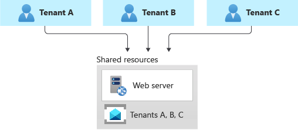
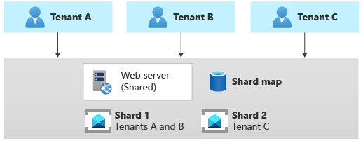
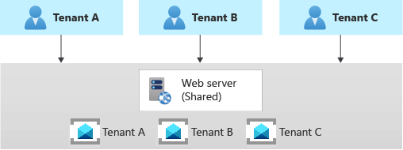

# Architectural approaches for messaging in multitenant solutions

Asynchronous messaging and event-driven communication are critical when building distributed applications that comprise several internal and external services. When you design a multitenant solution, you must analyze how to share or partition messages that belong to different tenants.

Sharing the same messaging system or event-streaming service can significantly reduce operational cost and management complexity. However, using a dedicated messaging system for each tenant provides better data isolation, reduces the risk of data leakage, eliminates the [Noisy Neighbor issue](../../../antipatterns/noisy-neighbor/noisy-neighbor.yml), and allows you to charge Azure costs back to your tenants more easily.

This article provides guidelines that solution architects can follow when deciding how to use messaging or eventing infrastructure in a multitenant solution.

## Messages, data points, and discrete events

There's an essential distinction between services that deliver an event and systems that send a message. An *event* is a lightweight notification of a condition or a state change. Usually, an event describes something that's already happened. A *message* contains raw data that's produced by a service to be consumed or stored elsewhere. Messages can often be thought of as implicit instructions or requests.

The following table describes the main kinds of messaging types, along with example multitenant solutions that might use that type of entity.

| Entity type | Contents | Examples |
|-|-|-|
| Discrete events | Hold information about specific actions that the publishing application has carried out. | <ul><li>A music-sharing platform tracks the fact that a specific user in a specific tenant has listened to a particular music track.</li><li>A manufacturing SaaS application pushes real-time information to customers and third parties about equipment maintenance, systems health, and contract updates.</li></ul> |
| Series events | Carry informational data points as elements in an ongoing, continuous stream. | <ul><li>A multitenant building control system receives telemetry events, such as temperature or humidity readings from sensors that belong to multiple customers.</li><li>A client-side script on a web page collects user actions and sends them to a click-analytics solution.</li></ul> |
| Messages | Often carry information necessary for a receiving service to execute steps in a workflow or a processing chain. | <ul><li>A B2B finance application receives a message to begin processing a tenant's banking records.</li><li>A customer of a B2C email service initiates a data records compliance request that needs to be processed gradually over several days.</li></ul> |

For more information, see [Events, Data Points, and Messages - Choosing the right Azure messaging service for your data](https://azure.microsoft.com/blog/events-data-points-and-messages-choosing-the-right-azure-messaging-service-for-your-data)

Azure provides several messaging services that you can use to support your messaging requirements, including [Azure Event Hubs](/azure/event-hubs/event-hubs-about), [Azure Event Grid](/azure/event-grid/overview), and [Azure Service Bus](/azure/service-bus-messaging/service-bus-messaging-overview). To learn about how to select the right service for your needs, see [Choose between Azure messaging services - Event Grid, Event Hubs, and Service Bus](/azure/event-grid/compare-messaging-services).

You can also deploy and manage your own messaging service on virtual machines, containers, or in services like AKS. When you do so, you take on the responsibility to deploy, manage, and maintain your messaging infrastructure.

## Key considerations and requirements

The [deployment and tenancy model](../considerations/tenancy-models.md) that you choose for your solution has a deep impact on security, performance, data isolation, management, and the ability to cross-charge resource costs to tenants. This analysis includes the model that you select for your messaging and eventing infrastructure. In this section, we review some of the key decisions you must make when you plan for a messaging system in your multitenant solution.

### Scale

The number of tenants, the complexity of message flows and `eventstream`, the volume of messages, the expected traffic profile, and the isolation level should drive decisions when planning messaging or eventing infrastructure.

The first step is conducting exhaustive capacity planning and establishing the maximum capacity for a messaging system in terms of throughput to properly handle the expected volume of messages under regular and peak traffic.

When your solution handles many tenants and you decide to adopt a separate messaging system for each tenant, you need a consistent strategy to automate the deployment, monitoring, alerting, and scaling of each infrastructure.

For example, you can deploy a messaging system for a tenant during the provisioning process using an infrastructure as code (IaC) tool such as Terraform, Bicep, or Azure Resource Manager (ARM) templates and a DevOps system such as Azure DevOps or GitHub Actions. For more information, see [Architectural approaches for the deployment and configuration of multitenant solutions](/azure/architecture/guide/multitenant/approaches/deployment-configuration).

The messaging system could be sized with a maximum throughput in messages per unit of time. If the system supports dynamic autoscaling, its capacity could be increased or decreased automatically, based on the traffic conditions and metrics to meet the expected service-level agreement.

### Performance predictability and reliability

For a limited number of tenants, using a single messaging system can be an excellent solution to meet functional requirements in terms of throughput and reduce total cost of ownership. A multitenant application might share the same messaging entities, such as queues and topics, across multiple customers. Alternatively, you might use a dedicated set of components for each tenant to increase tenant isolation. However, sharing the same messaging infrastructure across multiple tenants can expose the entire solution to the [Noisy Neighbor issue](../../../antipatterns/noisy-neighbor/noisy-neighbor.yml). The activity of one tenant can harm other tenants in terms of performance and operability.

In this case, the messaging system should be properly sized to sustain the expected traffic load at peak time. Ideally, it should support autoscaling—dynamically scaling out when traffic increases and scaling in when traffic decreases. A dedicated messaging system for each tenant can also mitigate the Noisy Neighbor risk, but managing many messaging systems increases solution complexity.

A multitenant application can adopt a hybrid approach, where core services use the same set of queues and topics in a single, shared messaging system to implement internal, asynchronous communications. In contrast, other services can adopt a dedicated group of messaging entities or even a dedicated messaging system for each tenant to mitigate the Noisy Neighbor issue and guarantee data isolation.

### Complexity of management and operations

Plan from the beginning how you intend to operate, monitor, and maintain your messaging and eventing infrastructure and how your multitenancy approach affects your operations and processes. For example, consider the following possibilities:

- Suppose you share a messaging system across multiple tenants. How can your solution collect and report the per-tenant usage metrics or throttle the number of messages that each tenant can send or receive?
- How will you migrate tenants, if they need to move to a different type of messaging service, a different deployment, or another region?
- When your messaging system leverages a PaaS service, you should ask the following question:
  - How can you customize the pricing tier for each tenant, based on the features and isolation level (shared or dedicated) that are requested by the tenant?
  - How can you create tenant-specific managed identities and Azure role assignments to assign the proper permissions only to the messaging entities that the tenant should be allowed to access? For example, see [Authenticate a managed identity with Microsoft Entra ID to access Azure Service Bus resources](/azure/service-bus-messaging/service-bus-managed-service-identity).
- You might plan to host the messaging system that's used by your application in a dedicated set of virtual machines or containers, one for each tenant. If so, how do you plan to deploy, upgrade, monitor, and scale out these systems?

### Cost

Generally, the higher the density of tenants to your deployment infrastructure, the lower the cost to provision that infrastructure. However, shared infrastructure increases the likelihood of issues like the [Noisy Neighbor issue](../../../antipatterns/noisy-neighbor/noisy-neighbor.yml), so consider the tradeoffs carefully.

## Approaches and patterns to consider

When you plan a multitenant solution that involves messaging, consider the level of isolation between tenants that you might need. Review the following considerations and observations:

- **Encryption keys:** If tenants need to use their own key to encrypt and decrypt messages, confirm the scope at which your messaging service supports isolating keys. For example, if you use Service Bus, you might need to create a separate Azure Service Bus Premium namespace for each tenant that needs their own keys so that you can use [customer-managed keys](/azure/service-bus-messaging/configure-customer-managed-key).
- **Business continuity:** Identify any tenants that need a high level of recoverability and business continuity, and consider using zone redundancy, geo-redundancy, and geo-disaster recovery capabilities for these tenants where available.
- **Worker processing:** When you use separate queue resources or a dedicated messaging system for each tenant, it's reasonable to adopt a separate pool of worker processes, for each of them to increase the data isolation level and reduce the complexity of dealing with multiple messaging entities. Each instance of the processing system could adopt different credentials, such as a connection string, a service principal, or a managed identity, in order to access the dedicated messaging system. This approach provides a better security level and isolation between tenants, but it requires an increased complexity in identity management.

### Shared messaging system

You might consider deploying a shared messaging system, such as a single Azure Service Bus namespace, and sharing it across all of your tenants.

This approach provides the highest density of tenants to the infrastructure, so it reduces the overall total cost of ownership. It also often reduces the management overhead, since there's a single messaging system or resource to manage and secure.

However, when you share a resource or an entire infrastructure across multiple tenants, consider the following caveats:

- Always keep in mind and consider the constraints, scaling capabilities, quotas, and limits of the resource in question. For example, the maximum number of [Event Hubs in a single namespace](/azure/event-hubs/event-hubs-quotas), or the maximum throughput limits, might eventually become a hard blocker, if and when your architecture grows to support more tenants.
- As mentioned in the above sections, the [Noisy Neighbor problem](/azure/architecture/antipatterns/noisy-neighbor/noisy-neighbor) might become a factor, when you share a resource across multiple tenants, especially if some are particularly busy or if they generate higher traffic than others. In this case, consider applying the [Throttling pattern](/azure/architecture/patterns/throttling) or the [Rate Limiting pattern](/azure/architecture/patterns/rate-limiting-pattern) to mitigate these effects. For example, you could limit the maximum number of messages that a single tenant can send or receive in the unit of time.
- You might have difficulty monitoring the activity and [measuring the resource consumption](../considerations/measure-consumption.md) for an individual tenant. Some services, such as some tiers of Azure Service Bus, charge for messaging operations. Hence, when you share a namespace across multiple tenants, your application should be able to keep track of the number of messaging operations done on behalf of each tenant and the chargeback costs to them. Other services don't provide the same level of detail.

Tenants might have different requirements for security, intra-region resiliency, disaster recovery, or location. If these don't match your messaging system configuration, you might not be able to accommodate them just with a single resource.

### Sharding pattern

The [Sharding pattern](../../../patterns/sharding.yml) involves deploying multiple messaging systems, called *shards*, which contain one or more tenants' messaging entities, such as queues and topics. Unlike deployment stamps, shards don't imply that the entire infrastructure is duplicated. You might shard messaging systems without also duplicating or sharding other infrastructure in your solution.

Every messaging system or *shard* can have different characteristics in terms of reliability, SKU, and location. For example, you could shard your tenants across multiple messaging systems with different characteristics, based on their location or needs in terms of performance, reliability, data protection, or business continuity.

When you use the sharding pattern, you need to use a [sharding strategy](/azure/architecture/patterns/sharding#sharding-strategies), in order to map a given tenant to the messaging system that contains its queues. The [lookup strategy](/azure/architecture/patterns/sharding#sharding-strategies) uses a map to individuate the target messaging system, based on the tenant name or ID. Multiple tenants might share the same shard, but the messaging entities used by a single tenant won't be spread across multiple shards. The map can be implemented with a single dictionary that maps the tenant's name to the name or reference of the target messaging system. The map can be stored in a distributed cache accessible, by all the instances of a multitenant application, or in a persistent store, such as a table in a relational database or a table in a storage account.

The Sharding pattern can scale to support a high volume of tenants. Additionally, depending on your workload, you might be able to achieve a high density of tenants to shards, so the cost can be attractive. The Sharding pattern can also be used to address [Azure subscription and service quotas, limits, and constraints](/azure/azure-resource-manager/management/azure-subscription-service-limits).

### Multitenant app with dedicated messaging system for each tenant

Another common approach is to deploy a single multitenant application with dedicated messaging systems for each tenant. In this tenancy model, you have some shared components, such as computing resources, while other services are provisioned and managed using a single-tenant, dedicated deployment approach. For example, you could build a single application tier and then deploy individual messaging systems for each tenant, as shown in the following illustration.

Horizontally partitioned deployments can help you mitigate a noisy-neighbor problem if you've identified that most of the load on your system is due to specific components that you can deploy separately for each tenant. For example, you might need to use a separate messaging or `eventstream` system for each tenant because a single instance isn't enough to keep up with traffic that multiple tenants generate. When you use a dedicated messaging system for each tenant, if a single tenant causes a large volume of messages or events, this might affect the shared components but not other tenants' messaging systems.

Because you provision dedicated resources for each tenant, the cost for this approach can be higher than a shared hosting model. However, it's easier to charge back resource costs of a dedicated system to the tenant that uses it when adopting this tenancy model. This approach allows you to achieve high density for other services, such as computing resources, and reduces these components' costs.

With a horizontally partitioned deployment, you need to adopt an automated process for deploying and managing a multitenant application's services, especially those used by a single tenant.

## Contributors

*This article is maintained by Microsoft. It was originally written by the following contributors.*

Principal author:

- [Paolo Salvatori](https://www.linkedin.com/in/paolo-salvatori) | Principal Customer Engineer, FastTrack for Azure

Other contributors:

- [John Downs](https://www.linkedin.com/in/john-downs/) | Principal Software Engineer, Azure Patterns & Practices
- [Clemens Vasters](https://www.linkedin.com/in/clemensv) | Principal Architect, Messaging Services and Standards
- [Arsen Vladimirskiy](https://www.linkedin.com/in/arsenv) | Principal Customer Engineer, FastTrack for Azure

## Next steps

For more information about messaging design patterns, see the following resources:

- [Claim-Check pattern](/azure/architecture/patterns/claim-check)
- [Competing Consumers pattern](/azure/architecture/patterns/competing-consumers)
- [Event Sourcing pattern](/azure/architecture/patterns/event-sourcing)
- [Pipes and Filters pattern](/azure/architecture/patterns/pipes-and-filters)
- [Publisher-Subscriber pattern](/azure/architecture/patterns/publisher-subscriber)
- [Sequential Convoy pattern](/azure/architecture/patterns/sequential-convoy)
