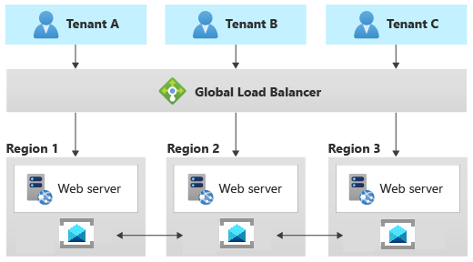

# Architectural approaches for messaging

Asynchronous messaging and event-driven communication are critical assets when building a distributed application composed of several internal and external services. When designing a single-tenant or multitenant solution, it's crucial to conduct a preliminary analysis to define how to share or partition messages that pertain to different tenants. Sharing the same messaging system or event-streaming service can significantly reduce the operational cost and management complexity. However, using a dedicated messaging system for each tenant provides better data isolation, reduces the risk of data leakage, eliminates the [Noisy Neighbor issue](../../../antipatterns/noisy-neighbor/index.md), and allows to chargeback Azure costs to tenants easily. In this article, you can find a distinction between messages and events and some guidelines that solution architects can follow when deciding which approach to use for a messaging or eventing infrastructure in a multitenant solution.

<!-- Notes on things to discuss:
* Separating queues/topics by tenant/message type
* For a better isolation, adopt separate namespaces per tenant when using Service and Event Hubs
* Event Grid domains
* Event Hubs considerations

Patterns:
https://docs.microsoft.com/en-nz/azure/architecture/patterns/publisher-subscriber
https://docs.microsoft.com/en-nz/azure/architecture/patterns/priority-queue
https://docs.microsoft.com/en-nz/azure/architecture/patterns/pipes-and-filters
Claim Check - to avoid sending sensitive info through a shared queue
-->

## Messages, data points, and discrete events

All messaging systems have similar functionalities, transport protocols, and usage scenarios. For example, most of the modern messaging systems support asynchronous communications using volatile or persistent queues, AMQP and HTTPS transport protocols, at least once-delivery, and so forth. However, looking more closely at the type of published information and how data is consumed and processed by client applications, we can distinguish between different kinds of messages and events. There's an essential distinction between services that deliver an event and systems that send a message. For more information, see:

- [Choose between Azure messaging services - Event Grid, Event Hubs, and Service Bus](/azure/event-grid/compare-messaging-services)
- [Events, Data Points, and Messages - Choosing the right Azure messaging service for your data](/blog/events-data-points-and-messages-choosing-the-right-azure-messaging-service-for-your-data/)

### Events

An event is a lightweight notification of a condition or a state change. Events can be discrete units or part of a series. Events are messages that don't generally convey a publisher's intent other than to inform. An event captures a fact and communicates it to other services or components. A consumer of the event can process the event as it pleases and doesn't fulfill any specific expectations the publisher holds. We can classify events into two main categories: 

- Discrete events hold information about specific actions that the publishing application has carried out. When using asynchronous event-driven communication, an application publishes a notification event when something happens within its domain. One or more consuming applications needs to be aware of this state change, like a price change in a product catalog application. Consumers subscribe to the events to receive them asynchronously. When a given event happens, the consuming applications might update their domain entities, which can cause more integration events to be published.
- Series events carry informational data points, such as temperature readings from devices for analysis or user actions in a click-analytics solution, as elements in an ongoing, continuous stream. An event stream is related to a specific context like the temperature or humidity reported by a field device: all the events related to the same context have a strict temporal order that matters when processing these events with an event stream processing engine. Analyzing streams of events carrying data points requires accumulating these events in a buffer that spans a desired time window or a selected number of items and then processing these events using a near-real-time solution or machine-trained algorithm. The analysis of a series of events may yield signals, like the average of a value measured over a time window crossing a threshold, and those signals may then be raised as discrete, actionable events.

Discrete events report state change and are actionable. The event payload has information about what happened but, in general, doesn't have the complete data that triggered the event. For example, an event notifies consumers that a reporting microservice created a new file in a storage account. The event payload may have general information about the file, but it doesn't have the file itself. Discrete events are ideal for serverless solutions that need to scale.

Series events report a condition and are analyzable. Discrete events are time-ordered and interrelated. In some contexts, the consumer needs to receive the complete sequence of events to analyze what happened and take the necessary action.

### Messages

Messages contain raw data produced by a service to be consumed or stored elsewhere. Messages often carry information necessary for a receiving service to execute steps in a workflow or a processing chain. An example of this kind of communication is the [Command pattern](https://en.wikipedia.org/wiki/Command_pattern). The publisher may also expect the receiver(s) of a message to execute a series of actions and report back the outcome of their processing with an asynchronous message. A contract exists between the message publisher and message receiver(s). For example, the publisher sends a message with some raw data and expects the consumer to create a file from that data and send back a response message when done. In other situations, a sender process could send an asynchronous, one-way message to ask another service to perform a given operation, but with no expectation of getting back an acknowledgment or response message from it.

This kind of contractual message handling is quite different from a publisher publishing discrete events to an audience of consumer agents without any specific expectation of how they will handle these notifications.

### Scenarios

Here is a list of typical scenarios for messages, data points, and discrete events:

- Events:
  - A music sharing platform tracks the fact that a specific user in a specific tenant has listened to a particular music track.
  - In an online store web application, the catalog microservice sends an event using a the [Publisher-Subscriber pattern](/azure/architecture/patterns/publisher-subscriber) to other microservices to notify them that an item price has changed.
  - A manufactoring company pushes real-time information to customers and 3rd parties about equipment maintenance, systems health, and contract updates.
- Data points:
  - A Building control system receives telemetry events such as temperature or humidity readings from sensors belonging to multiple customers.
  - An event-driven monitoring system receives and processes diagnostics logs in a near-real-time fashion from multiple services such as web servers.
  - A client-side script on a web page collects user actions and sends them to a click-analytics solution.
- Messages:
  - B2B finance application receives a message to process a tenant's banking records.
  - A long-running workflow receives a message that triggers the execution of the next step.
  - The basket microservice of an online store application sends a CreateOrder command using an asynchronous, persistent message to the ordering microservice.

## Key considerations and requirements

The deployment and tenancy model that you choose for your solution has a deep impact on security, performance, data isolation, management, and the ability to cross-charge resource costs to tenants. This analysis includes the model that you select for your messaging and eventing infrastructure. In this section, we review some of the key decisions you must make when you plan for a messaging system in your multitenant solution. 

### Scale

The number of tenants, the complexity of message flows and event streams, the volume of messages, the expected traffic profile, and the isolation level should drive the decisions when planning for a messaging or eventing infrastructure.

The first step consists in conducting exhaustive capacity planning and establishing the necessary maximum capacity for a messaging system in terms of throughput to properly handle the expected volume of messages under regular or peak traffic.

Some service offerings, such as the [Azure Service Bus premium tier](/azure/service-bus-messaging/service-bus-premium-messaging), provide resource isolation at the CPU and memory level so that each customer workload runs in isolation. This resource container is called a *messaging unit*. Each premium namespace is allocated at least one messaging unit. You can purchase 1, 2, 4, 8, or 16 messaging units for each Service Bus Premium namespace. A single workload or entity can span multiple messaging units, and you can change the number of messaging units as necessary. The result is a predictable and repeatable performance for your Service Bus-based solution. For more information, see [Service Bus Premium and Standard messaging tiers](/azure/service-bus-messaging/service-bus-premium-messaging). 
Likewise, Azure Event Hubs pricing tiers allow you to size the namespace based on the expected volume of inbound and outbound events.  For example, the Premium offering is billed by [Processing Units](/azure/event-hubs/event-hubs-scalability#processing-units), which correspond to a share of isolated resources (CPU, Memory, and Storage) in the underlying infrastructure. The effective ingest and stream throughput per PU will depend on various factors, including:

- Number of producers and consumers
- Payload size
- Partition count
- Egress request rate
- Usage of Event Hubs Capture, Schema Registry, and other advanced features

For more information, see [Overview of Event Hubs Premium](/azure/event-hubs/event-hubs-premium-overview).

When your solution handles a considerable number of tenants, and you decide to adopt a separate messaging system for each tenant, you need to have a consistent strategy to automate the deployment, monitoring, alerting, and scaling of each infrastructure separately from one other. For example, a messaging system for a given tenant could be deployed during the provisioning process using an infrastructure as code (IaC) tool such a Terraform, Bicep, or ARM JSON templates and a DevOps system such as Azure DevOps or GitHub Actions. The messaging system could be sized with a maximum throughput in messages per unit time and, if the system supports dynamic autoscaling, its capacity could be increased or decreased on the flight based on the traffic conditions and metrics to meet the expected service level agreement.

### Performance predictability

When designing and building a messaging system for a few tenants, using a single messaging system could be an excellent solution to meet the functional requirements in terms of throughput and reduce the total cost of ownership. A multitenant application may share the same messaging entities such as queues and topics across multiple customers or use a dedicated set of components for each to increase tenant isolation. On the other hand, sharing the same messaging infrastructure across multiple tenants may expose the entire solution to the [Noisy Neighbor issue](../../../antipatterns/noisy-neighbor/index.md) issue as the activity of one tenant could harm other tenants in terms of performance and operativity. A dedicated messaging system for each tenant could mitigate this risk, but managing a large number of messaging systems could increase the complexity of the solution.
When deploying a messaging system to virtual machines, you should co-locate these virtual machines with the compute resources to reduce the network latency. These virtual machines should not be shared with other services or applications to avoid the messaging infrastructure to compete for the system resources such as CPU, memory, and network bandwidth with other systems. Likewise, when containerizing and hosting the messaging system on a Kubernetes cluster, consider using node selectors and taints to schedule the execution of its pods on a dedicated node pool, not shared with other workloads,  to avoid the [Noisy Neighbor issue](/azure/architecture/antipatterns/noisy-neighbor/). 

### Isolation

When designing the messaging system for a multi-tenant solution, you should consider that different types of applications require a different kind of isolation based on tenants' performance, privacy, and auditing requirements.

- Multiple tenants can share the same messaging entities such as queues, topics, and subscriptions in the same messaging system. For example, a multitenant application could receive messages carrying data for multiple tenants from a single [Azure Service Bus](/azure/service-bus-messaging/service-bus-messaging-overview)  queue. This solution can lead to performance and scalability issues: if some of the tenants generate a larger volume of orders than others, this could cause a backlog of messages. This problem, also known as [Noisy Neighbor issue](/azure/architecture/antipatterns/noisy-neighbor/), can degrade the service level agreement in terms of latency for some tenants. The problem is more evident if the consumer application reads and processes messages from the queue one at a time in a strict chronological order, and the time necessary to process a message depends on the number of items in the payload. When sharing one ore more queue resources across multiple tenants, the messaging infrastructure and processing systems should be able to accommodate the scale and throughput requirements based expected traffic. This architectural approach is well-suited in those scenarios where a multitenant solution adopts a single pool of worker processes to receive, process, and send messages for all tenants.
- Multiple tenants share the same messaging system but use different topic or queue resources. This approach provides better isolation and data protection at a higher cost, increased operational complexity, and lower agility because system administrators have to provision, monitor, and maintain a higher number of queue resources. This solution ensures a consistent and predictable experience for all tenants in terms of performance and service level agreement as it prevents any tenant from creating a bottleneck that can impact other tenants. 
- A separate, dedicated messaging system is used for each tenant: for example, a multitenant solution can use a distinct  [Azure Service Bus](/azure/service-bus-messaging/service-bus-messaging-overview) namespace for each tenant. This solution provides the maximum degree of isolation at a higher complexity and operational cost. This approach guarantees consistent performance and allows for fine-tuning the messaging system based on specific tenant needs. When a new tenant is onboarded, in addition to a fully dedicated Azure Service Bus namespace, the provisioning application should create a separate managed identity or a service principal with the proper RBAC permissions to access the newly created namespace. When deleting a tenant from the system, the application should remove the messaging system and any dedicated resource priorly created for the tenant. The main disadvantage of this approach is that it increases operational complexity and reduces agility, especially when the number of tenants grows over time.  
- If tenants need to use their own key to encrypt and decrypt messages, a multitenant solution should provide the option to adopt a separate Azure Service Bus Premium namespace for each tenant. For more information, see [Configure customer-managed keys for encrypting Azure Service Bus data at rest](/azure/service-bus-messaging/configure-customer-managed-key).
- If tenants need a high level of resiliency and business continuity, a multitenant solution should provide the ability to provision a Premium Service Bus namespace with geo-disaster recovery and [availability zones](/azure/availability-zones/az-overview) enabled. For more information, see [Azure Service Bus Geo-disaster recovery](/azure/service-bus-messaging/service-bus-geo-dr).
- When using separate queue resources or a dedicated messaging system for each tenant, it's reasonable to adopt a separate pool of worker processes for each of them to increase the data isolation level and reduce the complexity of dealing with multiple messaging entities. Each instance of the processing system could adopt different credentials such as a connection string, a service principal, or a managed identity to access the dedicated messaging system.

Likewise, event-driven application can provide different levels of isolation:

- An event-driven application receives events from multiple tenants, via a single, shared [Azure Event Hub](/azure/event-hubs/event-hubs-about). This solution provides a high level of agility, because onboarding a new tenant does not require creating a dedicated event-ingestion resource, but it provides a low data protection level as it inter-mingles messages from multiple tenants in the same data structure.
- Tenants can opt for a dedicated Event Hub or Kafka topic to avoid the [Noisy Neighbor issue](/azure/architecture/antipatterns/noisy-neighbor/) and meet their data isolation requirements when events must not be co-mingled with those of other tenants for security and data protection.
- If tenants need a high level of resiliency and business continuity, a multitenant should provide the ability to provision a Premium Event Hubs namespace with geo-disaster recovery and [availability zones](/azure/availability-zones/az-overview) enabled. For more information, see  [Azure Event Hubs - Geo-disaster recovery](/azure/event-hubs/event-hubs-geo-dr?tabs=portal).
- Dedicated Event Hubs with Event Hubs Capture enabled should be created for those customers that need to archive events to an Azure Storage Account for regulatory compliance reasons and obligations. For more information, see [Capture events through Azure Event Hubs in Azure Blob Storage or Azure Data Lake Storage](/azure/event-hubs/event-hubs-capture-overview).
- A single multitenant application can send notifications to multiple internal and external systems using [Azure Event Grid](/azure/event-grid/overview). In this case, a separate Event Grid subscription should be created for each consumer application. Event Grid saves events in a durable store and immediately tries to deliver each message at least once for each matching subscription. If a subscriber's endpoint doesn't acknowledge receipt of an event or if there is a failure, Event Grid retries delivery based on a fixed retry schedule and retry policy up to 24 hours. If you application makes use of multiple Event Grids to send notifications to a large number of external organizations, you may consider using event domains that allow an application to publish events to thousands of topics, one for each tenant. For more information, see [Understand event domains for managing Event Grid topics](/azure/event-grid/event-domains).

### Complexity of implementation

When designing a multitenant solution, it is essential to consider how the system will evolve in the medium-long term to prevent its complexity from growing over time until it is necessary to redesign part or the entire solution to cope with an increasing number of tenants. When designing a messaging system, you should consider the expected growth in message volumes and tenants in the next few years and create a system that can scale out to keep up with the predicted traffic and reduce the complexity of operations such as provisioning, monitoring, and maintenance.
The solution should automatically create or delete the necessary messaging entities any time a tenant application is provisioned or unprovisioned without the need for manual operations. 
A particular concern for multitenant data solutions is the level of customization you support. Any customization should be automatically configured and applied by the application provisioning system (e.g., a DevOps system) based on a set of initial parameters whenever a single-tenant or multitenant application is deployed.

### Complexity of management and operations

Plan from the beginning how you intend to operate, monitor, and maintain your messaging and eventing infrastructure and how your multitenancy approach affects your operations and processes. For example:

- If you plan to host the messaging system used by your application in a dedicated set of virtual machines, one for each tenant, how do you plan to deploy, upgrade, monitor, and scale out these systems?
- Likewise, if you containerize and host your messaging system in a shared Kubernetes cluster, how do you plan to deploy, upgrade, monitor, and scale out individual messaging systems?
- Suppose you share a messaging system across multiple tenants. How can your solution collects and reports per-tenant usage metrics or throttle the number of messages each tenant can send or receive?
- When your messaging system leverages a PaaS service such as Azure Service Bus:
  - How can you customize the pricing tier for each tenant based on the features and isolation level (shared or dedicated) requested by the tenant? 
  - How can you create a per-tenant manage identity and Azure role assignment to assign the proper permissions only to the messaging entities such as queues, topics, and subscriptions that the tenant can access? For more information,  see [Authenticate a managed identity with Azure Active Directory to access Azure Service Bus resources](/azure/service-bus-messaging/service-bus-managed-service-identity)
- How will you migrate tenants if they need to move to a different type of messaging service, a different deployment, or another region?

### Cost

Generally, the higher the density of tenants to your deployment infrastructure, the lower the cost to provision that infrastructure. However, shared infrastructure increases the likelihood of issues like the [Noisy Neighbor issue](../../../antipatterns/noisy-neighbor/index.md), so consider the tradeoffs carefully.

## Approaches and patterns to consider

Several [Cloud Design Patterns](/azure/architecture/patterns/) from the Azure Architecture Center can be applied to a multitenant messaging system. You might choose to follow one or more patterns consistently, or you could consider mixing and matching patterns based on your needs. For example, you might use a multitenant Service Bus namespace for most of your tenants, but deploy a dedicated, single-tenant Service Bus namespace for those tenants who pay more or who have higher requirements in terms or isolation and performance. Similarly, it's often a good practice to scale by using deployment stamps, even when you use a multitenant Service Bus namespace or dedicated namespaces within a stamp.

### Deployment Stamps pattern

For more information about the Deployment Stamps and multitenancy, see [Overview](/azure/architecture/guide/multitenant/approaches/overview#deployment-stamps-pattern). For more information about tenancy models, see [Tenancy models to consider for a multitenant solution](/azure/architecture/guide/multitenant/considerations/tenancy-models).

### Shared messaging system

You might consider deploying a shared messaging system such as Azure Service Bus and sharing it across all of your tenants.

This approach provides the highest density of tenants to infrastructure, so it reduces the overall total cost of ownership. It also often reduces the management overhead since there's a single messaging system or resource to manage and secure.
However, when you share a resource or an entire infrastructure across multiple tenants, there are several caveats to consider:

- Always keep in mind and consider the constraints, scaling capabilities, quotas, and limits of the resource in question. For example, the maximum number of [Service  Bus namespaces in an Azure subscription](/azure/service-bus-messaging/service-bus-quotas), the maximum number of [Event Hubs in a single namespace](/azure/event-hubs/event-hubs-quotas), or the maximum throughput limits, may eventually become a hard blocker if and when your architecture grows to support more tenants. Carefully consider the maximum scale you need to achieve in terms of the number of namespaces per single Azure subscription or queues per single namespace. Then compare your current and future estimates to the existing quotas and limits of the messaging system of choice before selecting this pattern.
- As remarked in the above sections, the [Noisy Neighbor problem](/azure/architecture/antipatterns/noisy-neighbor/) might become a factor when sharing a resource across multiple tenants, especially if some are particularly busy or generate higher traffic than others. In this case, consider applying the [Throttling pattern](/azure/architecture/patterns/throttling) or the [Rate Limiting pattern](/azure/architecture/patterns/rate-limiting-pattern) to mitigate these effects, for example, the maximum number of messages that a single tenant can send or receive in the unit of time.
- You might have difficulty monitoring the activity and [measuring the resource consumption](/azure/architecture/guide/multitenant/considerations/measure-consumption) for a single tenant. Some services, such as Azure Service Bus, charge messaging operations. Hence, when sharing a namespace across multiple tenants, your application should be able to keep track of the number of messaging operations done on behalf of each tenant and chargeback costs to them. Other services don't provide the same level of detail. 
Tenants may have different requirements for security, intra-region resiliency, disaster recovery, or location. If these don't match your messaging system configuration, you might not be able to accommodate them just with a single resource.

### Sharding pattern

The [Sharding pattern](../../../patterns/sharding.md) involves deploying multiple messaging systems, called *shards*, that contain one or more tenants' messaging entities such as queues and topics. Unlike deployment stamps, shards don't imply that the entire infrastructure is duplicated. You might shard messaging systems without also duplicating or sharding other infrastructure in your solution.

Every messaging system or *shard* can have different characteristics in terms of reliability, SKU, and location. For example, you could shard your tenants across multiple messaging systems with different characteristics based on their location or needs in terms of performance, reliability, data protection, or business continuity.

When using the sharding pattern, you need to use a [sharding strategy](/azure/architecture/patterns/sharding#sharding-strategies) to map a given tenant to the messaging system that contains its queues. The [lookup strategy](/azure/architecture/patterns/sharding#sharding-strategies) uses a map to individuate the target messaging system based on the tenant name or id. Multiple tenants might share the same shard, but the messaging entities used by a single tenant won't be spread across multiple shards. The map can be implemented with a single dictionary that maps the tenant's name to the name or reference of the target messaging system. The map can be stored in a distributed cache accessible by all the instances of a multitenant application or in a persistent store such as a table in a relational database or a table in a storage account.

The Sharding pattern can scale to very large numbers of tenants. Additionally, depending on your workload, you might be able to achieve a high density of tenants to shards, so the cost can be attractive. The Sharding pattern can also be used to address [Azure subscription and service quotas, limits and constraints](/azure/azure-resource-manager/management/azure-subscription-service-limits).

### Multitenant app with dedicated messaging system for each tenant

Another common approach is to deploy a single multitenant application, with dedicated messaging systems for each tenant. In this tenancy model, you have some shared components, for example computing resources, while other services are provisioned, and managed using a single-tenant, dedicated deployment approach. For example, you could build a single application tier, and then deploy individual messaging systems for each tenant, as shown in this illustration:

Horizontally partitioned deployments can help you mitigate a noisy-neighbor problem, if you've identified that most of the load on your system is due to specific components that you can deploy separately for each tenant. For example, you may need to use a separate messaging or event streaming system for each tenant because a single instance is not enough to keep up with traffic generated by multiple tenants. When using a dedicated messaging system for each tenant, if a single tenant causes a large volume of messages or events, this may affect shared components but not other tenants' messaging systems.

Because you provision dedicated resources for each tenant, the cost for this approach can be higher than a shared hosting model. On the other hand, it's easier to charge back resource costs of a dedicated system to the unique tenant that makes use of it when adopting this tenancy model. This approach allows achieving high density for other services such as computing resources and reduces these components' cost.

With a horizontally partitioned deployment, you need to adopt an automated process for deploying and managing a multitenant application's services, especially those used by a single tenant.

### Geodes pattern

The [Geode pattern](../../../patterns/geodes.md) involves deploying a collection of backend services into a set of geographical nodes, each of which can service any request for any client in any region. This pattern allows serving requests in an active-active style, improving latency and increasing availability by distributing request processing around the globe.

[Azure Service Bus](/azure/service-bus-messaging/service-bus-geo-dr) and [Azure Event Hubs](/azure/event-hubs/event-hubs-geo-dr) support metadata disaster recovery across a primary and secondary disaster recovery namespaces across separate regions and availability zones support for best intra-region resiliency. Besides, Azure Service Bus and Azure Event Hubs implement a set of federation patterns that actively replicate the same logical topic, queue, or event hub to be available in multiple namespaces, eventually located in different regions. For more information, see:

- [Message replication and cross-region federation](/azure/service-bus-messaging/service-bus-federation-overview)
- [Message replication tasks patterns](/azure/service-bus-messaging/service-bus-federation-patterns)
- [Multi-site and multi-region federation](/azure/event-hubs/event-hubs-federation-overview)
- [Event replication tasks patterns](/azure/event-hubs/event-hubs-federation-patterns)

## Next steps

For more information about messaging design patterns, see:

- [Claim-Check pattern](/azure/architecture/patterns/claim-check)
- [Competing Consumers pattern](/azure/architecture/patterns/competing-consumers)
- [Event Sourcing pattern](/azure/architecture/patterns/event-sourcing)
- [Pipes and Filters pattern](/azure/architecture/patterns/pipes-and-filters)
- [Publisher-Subscriber pattern](/azure/architecture/patterns/publisher-subscriber)
- [Sequential Convoy pattern](/azure/architecture/patterns/sequential-convoy)
