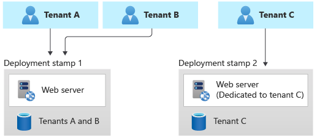

There are many different ways that you can design and build multitenant solutions in Azure. At one extreme, you can share every resource in your solution among all of your tenants. At the other extreme, you can deploy isolated resources for every tenant. It might seem simple to deploy separate resources for every tenant, and it can work for a small numbers of tenants. However, it typically doesn't provide cost effectiveness, and it can become difficult to manage your resources. There are also various approaches that fit between these extremes, and they all have tradeoffs like scale, isolation, cost efficiency, performance, implementation complexity, and manageability.

Throughout this section, we discuss the main categories of Azure services that comprise a solution, including [compute](compute.md), [storage and data](storage-data.yml), [networking](networking.md), [deployment](deployment-configuration.yml), [identity](identity.md), [messaging](messaging.md), [artificial intelligence and machine learning](ai-ml.md), and [IoT](iot.md). For each category, we outline the key patterns and approaches you can consider when you're designing a multitenant solution, and some antipatterns to avoid.

## Deployment Stamps pattern

The [Deployment Stamps pattern](../../../patterns/deployment-stamp.yml) is frequently used in multitenant solutions. It involves deploying dedicated infrastructure for a tenant or for a group of tenants. A single stamp might contain multiple tenants or might be dedicated to a single tenant.

When using single-tenant stamps, the Deployment Stamps pattern tends to be straightforward to implement, because each stamp is likely to be unaware of any other, so no multitenancy logic or capabilities need to be built into the application layer. When each tenant has their own dedicated stamp, this pattern provides the highest degree of isolation, and it mitigates the [Noisy Neighbor problem](../../../antipatterns/noisy-neighbor/noisy-neighbor.yml). It also provides the option for tenants to be configured or customized according to their own requirements, such as to be located in a specific geopolitical region or to have specific high availability requirements.

When using multitenant stamps, other patterns need to be considered to manage multitenancy within the stamp, and the Noisy Neighbor problem still might apply. However, by using the Deployment Stamps pattern, you can continue to scale as your solution grows.

The biggest problem with the Deployment Stamps pattern, when being used to serve a single tenant, tends to be the cost of the infrastructure. When using single-tenant stamps, each stamp needs to have its own separate set of infrastructure, which isn't shared with other tenants. You also need to ensure that the resources deployed for a stamp are sufficient to meet the peak load for that tenant's workload. Ensure that your [pricing model](../considerations/pricing-models.md) offsets the cost of deployment for the tenant's infrastructure.

Single-tenant stamps often work well when you have a small number of tenants. As your number of tenants grows, it's possible but increasingly difficult to manage a fleet of stamps ([see this case study as an example](https://devblogs.microsoft.com/azure-sql/running-1m-databases-on-azure-sql-for-a-large-saas-provider-microsoft-dynamics-365-and-power-platform)). You can also apply the Deployment Stamps pattern to create a fleet of multitenant stamps, which can provide benefits for resource and cost sharing.

To implement the Deployment Stamps pattern, it's important to use automated deployment approaches. Depending on your deployment strategy, you might consider managing your stamps within your deployment pipelines, by using declarative infrastructure as code, such as Bicep, ARM templates, or Terraform templates. Alternatively, you might consider building custom code to deploy and manage each stamp, such as by using [Azure SDKs](https://azure.microsoft.com/downloads).

## Intended audience

The articles in this section are intended to be useful for solution architects and lead developers of multitenant applications, including independent software vendors (ISVs) and startups who develop SaaS solutions. Much of the guidance in this section is generic and applies to multiple Azure services within a category.

## Next steps

We recommend you review the [approaches for resource organization in a multitenant solution](resource-organization.yml) before reviewing the guidance about specific categories of Azure services.