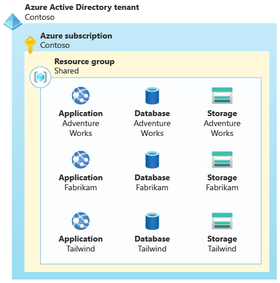
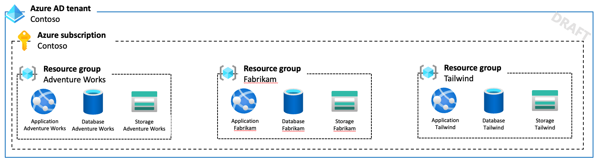
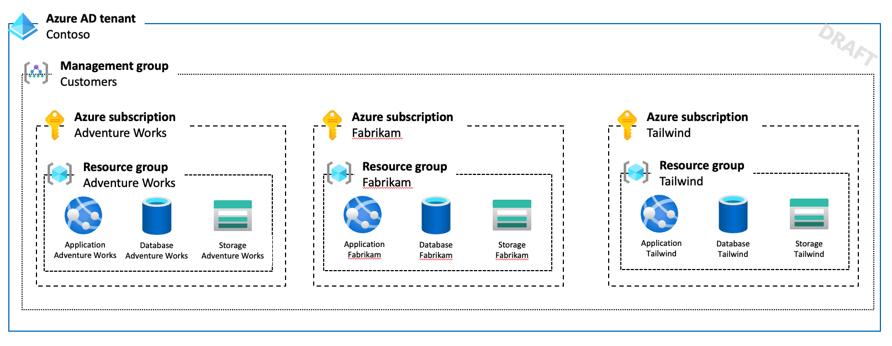
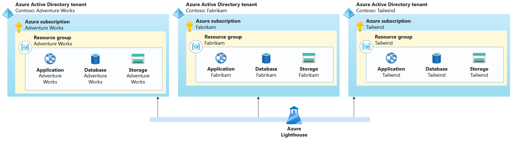
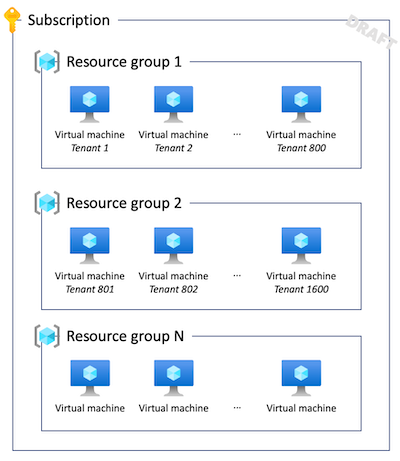

# Architectural approaches for multitenancy

There are many different ways that you can design and build multitenant solutions in Azure. At one extreme, you can deploy isolated resources for every tenant. A simple approach is to deploy separate resources, and it can work for a small numbers of tenants. However, it typically doesn't provide cost effectiveness, and it can become difficult to manage your resources. At the other extreme, you can share every resource in your solution between every tenant. There are also various approaches that fit between these extremes, and they all have tradeoffs: scale, isolation, cost efficiency, performance, implementation complexity, and manageability.

Throughout this section, we discuss the main categories of Azure services that comprise a solution, including [compute](compute.md), [storage and data](storage-data.md), messaging, IoT, and deployment. For each category, we outline the key patterns and approaches you can consider when you're designing a multitenant solution, and some antipatterns to avoid.

## Deployment Stamps pattern

The [Deployment Stamps pattern](../../../patterns/deployment-stamp.md) is frequently used in multitenant solutions. It involves deploying dedicated infrastructure for a tenant or for a group of tenants. A single stamp might contain multiple tenants or might be dedicated to a single tenant.

When using single-tenant stamps, the Deployment Stamps pattern tends to be straightforward to implement, because each stamp is likely to be unaware of any other, so no multitenancy logic or capabilities need to be built into the application layer. When each tenant has their own dedicated stamp, this pattern provides the highest degree of isolation, and it mitigates the [Noisy Neighbor problem](../../../antipatterns/noisy-neighbor/index.md). It also provides the option for tenants to be configured or customized according to their own requirements, such as to be located in a specific geopolitical region or to have specific high availability requirements.

When using multitenant stamps, other patterns need to be considered to manage multitenancy within the stamp, and the Noisy Neighbor problem still might apply. However, by using the Deployment Stamps pattern, you can continue to scale as your solution grows.

The biggest problem with the Deployment Stamps pattern, when being used to serve a single tenant, tends to be the cost of the infrastructure. When using single-tenant stamps, each stamp needs to have its own separate set of infrastructure, which isn't shared with other tenants. You also need to ensure that the resources deployed for a stamp are sufficient to meet the peak load for that tenant's workload. Ensure that your [pricing model](../considerations/pricing-models.md) offsets the cost of deployment for the tenant's infrastructure.

Single-tenant stamps often work well when you have a small number of tenants. As your number of tenants grows, it's possible but increasingly difficult to manage a fleet of stamps ([see this case study as an example](https://devblogs.microsoft.com/azure-sql/running-1m-databases-on-azure-sql-for-a-large-saas-provider-microsoft-dynamics-365-and-power-platform)). You can also apply the Deployment Stamps pattern to create a fleet of multitenant stamps, which can provide benefits for resource and cost sharing.

To implement the Deployment Stamps pattern, it's important to use automated deployment approaches. Depending on your deployment strategy, you might consider managing your stamps within your deployment pipelines, by using declarative infrastructure as code, such as Bicep, ARM templates, or Terraform templates. Alternatively, you might consider building custom code to deploy and manage each stamp, such as by using [Azure SDKs](https://azure.microsoft.com/downloads).

## Resource isolation
<!-- TODO -->

* There is a "spectrum" of resource organization from "shared" to completely isolated. All are valid approaches depending on needs and costs.
* There is a spectrum of partners going “we want all bazillion customers in 1 subscription” (which is not feasible for high scale environments today due to limits) to “we understand we need to partition customers/resources across subscriptions but that’s a lot of work” to “we want thousands of subscriptions with 1 customer per subscription because we want full isolation and don’t want to worry about limits” (which is applicable only when ISV’s pricing model is such that they can pass on the cost of the service to the customer since otherwise these deployments will have high COGS for the ISVs).

### Isolation within a shared resource
* See the guidance on the specific services for options and considerations.
* This often has upper limits (like number of nodes in AKS, transactions per second or storage in Azure Storage account) but the limits are usually going up.
* Still need to consider scale needs today and plan for partitioning if needed.

For example, suppose you are building a multitenant solution for Contoso. They could deploy shared resources for all of their customers to use:

### Separate resources in a resource group
* How will you identify them?
* Limits of same resource type in one RG.

For example, suppose Contoso has three customers. They might deploy dedicated resources for each customer, but place them in a single resource group:

They could also deploy shared components (e.g. application server and storage account and dedicated databases for tenants).

### Separate resource groups in a subscription
* Limits of RGs per subscription.

For example, Contoso might deploy individual RGs for each customer.

Might also use one resource group (or a set of RGs) for all shared resources, and tenant-specific RGs for tenant-specific resources.

### Separate subscriptions in a single Azure AD tenant

* Can organise through management groups
* Benefits: complete isolation, mitigating some of the Azure subscription limits, ease of thinking through what is a tenant, separate quota for each tenant so if one tenant needs to be scaled to 1000s of VMs it wouldn't negatively impact another tenant by "eating" into the same quota on the subscription.
* Challenges that maybe encountered are: quota management across subscriptions (consider using Quota API https://docs.microsoft.com/en-us/rest/api/reserved-vm-instances/quotaapi), support contract management across many subscriptions.

For example, suppose Contoso decided to create separate Azure subscriptions for each customer/tenant:

They use a management group to simplify the management of their subscriptions. All prod tenants are in a single MG, and they could keep any pre-prod tenants in a separate MG with different role assignments, policies, etc.

Also they use a single AAD tenant, which means their identities can be used for IAM throughout all of their Azure estate.

### Separate subscriptions in separate Azure AD tenants
* Complex to manage and makes it very difficult to share anything at all
* Role assignments, policies, etc are all separate
* Generally best avoided
* If you need to do it, use Lighthouse 

> [!WARNING]
> We don't generally recommend deploying multiple Azure Active Directory tenants for most multitenant solutions. It introduces extra complexity and reduces your ability to scale and manage your resources. Typically this approach is only used by managed service providers (MSPs), who run Azure environments on behalf of their customers.

For example, Contoso could deploy separate AAD tenants for each of their tenants:

They use Lighthouse to enable cross-tenant management.

## Plan to scale out

Regardless of your resource isolation model, it's important to consider when and how your solution will scale out across multiple resources. This might need to happen as the load on your system increases, or as the number of tenants grows.

### Resource limits

Azure resources have [limits and quotas](/azure/azure-resource-manager/management/azure-subscription-service-limits) that must be considered in your solution planning. For example, resources might support a maximum number of concurrent requests or tenant-specific configuration settings.

Additionally, the way you configure and use each resource affects the scalability supported by that resource. For example, for a given set of compute resources, your application will be able to successfully respond to a defined number of transactions per second. Beyond this point, you might need to scale out. Performance testing helps you to identify the point at which your resources no longer meet your requirements.

> [!NOTE]
> The principle of scaling to multiple resources applies even when you work with services that support multiple instances.
> 
> For example, Azure App Service supports scaling out the number of instances of your plan, but there are limits about how far you can scale. In a high-scale multitenant app, you might exceed these limits and need deploy additional App Service resources to match your growth.

When you share resources between tenants, consider *bin packing*. Determine the number of tenants that are supported by the resource when it's configured according to your requirements. Then, deploy as many resources as you need to serve your total number of tenants.

For example, suppose you deploy an Azure Application Gateway as part of a multitenant SaaS solution. After reviewing your application design, testing the application gateway's performance under load, and reviewing its configuration, you might determine that a single application gateway can be shared among 100 customers. According to your organization's growth plan, you expect to onboard 150 tenants in your first year. This means that you need to plan to deploy multiple application gateways to service your expected load:

### Resource group and subscription limits

Whether you work with shared or dedicated resources, it's important to account for the limits to the number of resources that can be [deployed into a resource group](/azure/azure-resource-manager/management/azure-subscription-service-limits#resource-group-limits) and [into an Azure subscription](/azure/azure-resource-manager/management/azure-subscription-service-limits#subscription-limits). As you approach these limits, you need to plan to scale across multiple resource groups or subscriptions.

For example, suppose you deploy a dedicated virtual machine for each of your tenants. You deploy them into a shared resource group. Azure supports deploying 800 resources of the same type into a single resource group, so when you reach this number, you need to deploy any new virtual machines into another resource group:

### Consider how to scale

<!-- TODO below -->

Need to plan how you will achieve this.

If you expect to only have a small number of tenants, maybe you can ignore it. But if you think you'll grow, plan how this will work. You might choose not to implement it immediately, but at least keep it in mind as you design and build your solution.

If you have an automated deployment process, consider you'll deploy and assign tenants to multiple resources. How will you detect that you need to deploy more resources? Will you spin them up AOT of JIT?

Ensure you don't bake in assumptions that there's only one resource, or set of resources, if there's any possibilty you can scale - use things like configuration or databases

<!-- TODO Arsen's comments:
In other words, even if for isolation purposes they can keep everything shared for "scale" purposes it may make sense to partition using the above deployment pattern.

So in essence even for fully multitenant aware applications that are sharing resources like AKS cluster there are cases (for large scale) when need to move to N AKS clusters in Y resource groups across N subscriptions.
-->

## Intended audience

The pages in this section are intended to be useful for solution architects and lead developers of multitenant applications, including independent software vendors (ISVs) and startups who develop SaaS solutions. Much of the guidance in this section is generic and applies to multiple Azure services within a category.

## Next steps

Review the guidance for each category of service:

- [Storage and data](storage-data.md)
- [Compute](compute.md)
