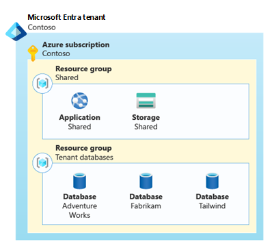
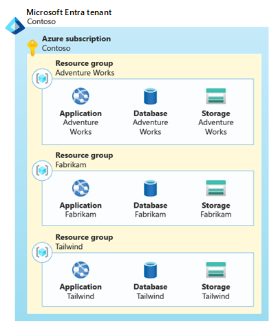
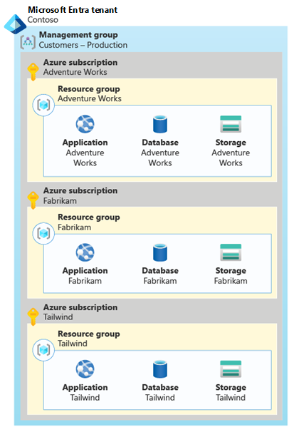
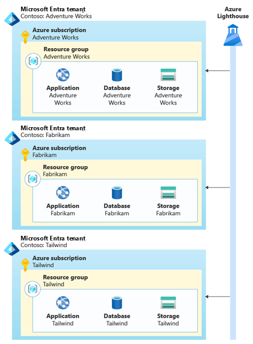

Azure provides many options for organizing your resources. In a multitenant solution, there are specific tradeoffs to consider, when you plan your resource organization strategy. In this article, we review two core elements of organizing your Azure resources: tenant isolation and scale-out across multiple resources. We also describe how to work with Azure's resource limits and quotas, and how to scale your solution beyond these limits.

## Key considerations and requirements

### Tenant isolation requirements

When you deploy a multitenant solution in Azure, you need to decide whether you dedicate resources to each tenant or share resources between multiple tenants. Throughout the multitenancy approaches and [service-specific guidance](../service/overview.md) sections of this series, we describe the options and trade-offs for many categories of resources. In general, there are a range of options for *tenant isolation*. Review [Tenancy models to consider for a multitenant solution](../considerations/tenancy-models.yml) for more guidance about how to decide on your isolation model.

### Scale

Most Azure resources, as well as resource groups and subscriptions, impose limits that can affect your ability to scale. You might need to consider *scaling out* or *bin packing* to meet your planned number of tenants or your planned system load.

If you know with certainty that you won't grow to large numbers of tenants or to a high load, don't overengineer your scale-out plan. But if you plan for your solution to grow, carefully consider your scale-out plan. Ensure that you architect for scale, by following the guidance in this article.

If you have an automated deployment process and need to scale across resources, determine how you'll deploy and assign tenants across multiple resource instances. For example, how will you detect that you're approaching the number of tenants that can be assigned to a specific resource? Will you plan to deploy new resources *just in time* for when you need them? Or, will you deploy a pool of resources *ahead of time* so they're ready for you to use when you need them?

> [!TIP]
> In the early stages of design and development, you might not choose to implement an automated scale-out process. You should still consider and clearly document the processes required to scale as you grow.

It's also important to avoid making assumptions in your code and configuration, which can limit your ability to scale. For example, you might need to scale out to multiple storage accounts. Ensure your application tier doesn't assume that it only connects to a single storage account for all tenants.

## Approaches and patterns to consider

### Tenant isolation

Azure resources are deployed and managed through a hierarchy. Most *resources* are deployed into [*resource groups*](/azure/azure-resource-manager/management/manage-resource-groups-portal), which are contained in *subscriptions*. [*Management groups*](/azure/governance/management-groups/overview) logically group subscriptions together. All of these hierarchical layers are associated with an [*Azure Active Directory (Azure AD) tenant*](/azure/active-directory/fundamentals/active-directory-how-subscriptions-associated-directory).

When you determine how to deploy resources for each tenant, you might isolate at different levels in the hierarchy. Each option is valid for certain types of multitenant solutions, and comes with benefits and tradeoffs. It's also common to combine approaches, using different isolation models for different components of a solution.

#### Isolation within a shared resource

You might choose to share an Azure resource among multiple tenants, and run all of their workloads on a single instance. Review the [service-specific guidance](../service/overview.md) for the Azure services you use to understand any specific considerations or options that might be important.

When you run single instances of a resource, you need to consider any service limits, subscription limits, or quotas that might be reached as you scale. For example, there's a maximum number of nodes that are supported by an Azure Kubernetes Service (AKS) cluster, and there's an upper limit on the number of transactions per second that are supported by a storage account. Consider how you'll [scale to multiple shared resources](#bin-packing) as you approach these limits.

You also need to ensure your application code is fully aware of multitenancy, and that it restricts access to the data for a specific tenant.

As an illustration of the shared resource approach, suppose Contoso is building a multitenant SaaS application that includes a web application, a database, and a storage account. They might decide to deploy shared resources, and they'd use these resources to service all of their customers. In the following diagram, a single set of resources is shared by all the customers.

#### Separate resources in a resource group

You can also deploy dedicated resources for each tenant. You might deploy an entire copy of your solution for a single tenant. Or, you might share some components between tenants and deploy other components that are dedicated to a specific tenant.

We recommend that you use resource groups to manage resources with the same lifecycle. In some multitenant systems, it makes sense to deploy resources for multiple tenants into a single resource group or a set of resource groups.

It's important that you consider how you deploy and manage these resources, including [whether the deployment of tenant-specific resources is initiated by your deployment pipeline or your application](deployment-configuration.yml#resource-management-responsibility). You also need to determine how you'll [clearly identify that specific resources relate to specific tenants](cost-management-allocation.yml). Consider using a clear [naming convention strategy](/azure/cloud-adoption-framework/ready/azure-best-practices/naming-and-tagging), [resource tags](cost-management-allocation.yml#allocate-costs-by-using-resource-tags), or a tenant catalog database.

It's a good practice to use separate resource groups for the resources you share between multiple tenants and the resources that you deploy for individual tenants. However, for some resources, [Azure limits the number of resources of a single type that can be deployed into a resource group](/azure/azure-resource-manager/management/resources-without-resource-group-limit). This limit means you might need to [scale across multiple resource groups](#resource-group-and-subscription-limits) as you grow.

Suppose Contoso has three customers: Adventure Works, Fabrikam, and Tailwind. They might choose to share the web application and storage account between the three customers, and then deploy individual databases for each tenant. In the following diagram, each customer is assigned a resource group that contains shared resources and a resource group that contains a database.

#### Separate resource groups in a subscription

When you deploy a set of resources for each tenant, consider using dedicated tenant-specific resource groups. For example, when you follow the [Deployment Stamps pattern](overview.yml#deployment-stamps-pattern), each stamp should be deployed into its own resource group. You can consider deploying multiple tenant-specific resource groups into a shared Azure subscription, which enables you to easily configure policies and access control rules.

You might choose to create a set of resource groups for each tenant, and also shared resource groups for any shared resources.

When you deploy tenant-specific resource groups into shared subscriptions, be aware of the maximum number of resource groups in each subscription, and other subscription-level limits that apply to the resources you deploy. As you approach these limits, you might need to [scale across multiple subscriptions](#resource-group-and-subscription-limits).

In our example, Contoso might choose to deploy a stamp for each of their customers and place the stamps in dedicated resource groups within a single subscription. In the following diagram, a subscription, which contains three resource groups, is created for each customer.

#### Separate subscriptions

By deploying tenant-specific subscriptions, you can completely isolate tenant-specific resources. Additionally, because most quotas and limits apply within a subscription, using a separate subscription per tenant ensures that each tenant has full use of any applicable quotas. For some Azure billing account types, [you can programmatically create subscriptions](/azure/cost-management-billing/manage/programmatically-create-subscription). You can also use [Azure reservations](/azure/cost-management-billing/reservations/save-compute-costs-reservations) and [Azure savings plan for compute](https://azure.microsoft.com/pricing/offers/savings-plan-compute/) across subscriptions.

Make you are aware of the number of subscriptions that you can create. The maximum number of subscriptions might differ, depending on your commercial relationship with Microsoft or a Microsoft partner, such as if you have an [enterprise agreement](/azure/cost-management-billing/manage/programmatically-create-subscription-enterprise-agreement?tabs=rest#limitations-of-azure-enterprise-subscription-creation-api).

However, it can be more difficult to request quota increases, when you work across a large number of subscriptions. The [Quota API](/rest/api/reserved-vm-instances/quotaapi) provides a programmatic interface for some resource types. However, for many resource types, quota increases must be requested by [initiating a support case](/azure/azure-resource-manager/management/azure-subscription-service-limits#managing-limits). It can also be challenging to work with Azure support agreements and support cases, when you work with many subscriptions.

Consider grouping your tenant-specific subscriptions into a [management group](/azure/governance/management-groups/overview) hierarchy, to enable easy management of access control rules and policies.

For example, suppose Contoso decided to create separate Azure subscriptions for each of their three customers, as shown in the following diagram. Each subscription contains a resource group, with the complete set of resources for that customer.

Each subscription contains a resource group, with the complete set of resources for that customer.

They use a management group to simplify the management of their subscriptions. By including *Production* in the management group's name, they can clearly distinguish any production tenants from non-production or test tenants. Non-production tenants would have different Azure access control rules and policies applied.

All of their subscriptions are associated with a single Azure Active Directory tenant. Using a single Azure AD tenant means that the Contoso team's identities, including users and service principals, can be used throughout their entire Azure estate.

#### Separate subscriptions in separate Azure AD tenants

It's also possible to manually create individual Azure Active Directory (Azure AD) tenants for each of your tenants, or to deploy your resources into subscriptions within your customers' Azure AD tenants. However, working with multiple Azure AD tenants makes it more difficult to authenticate, to manage role assignments, to apply global policies, and to perform many other management operations.

> [!WARNING]
> **We advise against creating multiple Azure Active Directory tenants for most multitenant solutions.** Working across Azure AD tenants introduces extra complexity and reduces your ability to scale and manage your resources. Typically, this approach is only used by managed service providers (MSPs), who operate Azure environments on behalf of their customers.
>
> A single Azure AD tenant can be used by multiple separate subscriptions and Azure resources. Before you make an effort to deploy multiple Azure AD tenants, [consider whether there are other approaches that could achieve your purposes](https://azure.microsoft.com/resources/securing-azure-environments-with-azure-active-directory).

In situations where you need to manage Azure resources in subscriptions that are tied to multiple Azure AD tenants, consider using [Azure Lighthouse](/azure/lighthouse/overview) to help manage your resources across your Azure AD tenants.

For example, Contoso could create separate Azure AD tenants and separate Azure subscriptions for each of their customers, as shown in the following diagram.

An Azure AD tenant is configured for each of Contoso's tenants, which contains a subscription and the resources required. Azure Lighthouse is connected to each Azure AD tenant.

### Bin packing

Regardless of your resource isolation model, it's important to consider when and how your solution will scale out across multiple resources. You might need to scale your resources, as the load on your system increases, or as the number of tenants grows. Consider *bin packing* to deploy an optimal number of resources for your requirements.

> [!TIP]
> In many solutions, it's easier to scale your entire set of resources together, instead of scaling resources individually. Consider following the [Deployment Stamps pattern](overview.yml#deployment-stamps-pattern).

#### Resource limits

Azure resources have [limits and quotas](/azure/azure-resource-manager/management/azure-subscription-service-limits) that must be considered in your solution planning. For example, resources might support a maximum number of concurrent requests or tenant-specific configuration settings.

The way you configure and use each resource also affects the scalability of that resource. For example, given a certain amount of compute resources, your application can successfully respond to a defined number of transactions per second. Beyond this point, you might need to scale out. Performance testing helps you to identify the point at which your resources no longer meet your requirements.

> [!NOTE]
> The principle of scaling to multiple resources applies even when you work with services that support multiple instances.
> 
> For example, Azure App Service supports scaling out the number of instances of your plan, but there are limits for how far you can scale a single plan. In a high-scale multitenant app, you might exceed these limits and need to deploy additional App Service resources to match your growth.

When you share some of your resources between tenants, you should first determine the number of tenants that the resource supports, when it's configured according to your requirements. Then, deploy as many resources as you need to serve your total number of tenants.

For example, suppose you deploy an Azure Application Gateway, as part of a multitenant SaaS solution. You review your application design, test the application gateway's performance under load, and review its configuration. Then, you determine that a single application gateway resource can be shared among 100 customers. According to your organization's growth plan, you expect to onboard 150 customers in your first year, so you need to plan to deploy multiple application gateways to service your expected load.

In the previous diagram, there are two application gateways. The first gateway is dedicated to customers 1 through 100, and the second is dedicated to customers 101 through 200.

#### Resource group and subscription limits

Whether you work with shared or dedicated resources, it's important to account for limits. Azure limits the number of resources that can be [deployed into a resource group](/azure/azure-resource-manager/management/azure-subscription-service-limits#resource-group-limits) and [into an Azure subscription](/azure/azure-resource-manager/management/azure-subscription-service-limits#subscription-limits). As you approach these limits, you need to plan to scale across multiple resource groups or subscriptions.

For example, suppose you deploy a dedicated application gateway, for each of your customers, into a shared resource group. For some resources, [Azure supports deploying up to 800 resources of the same type](/azure/azure-resource-manager/management/resources-without-resource-group-limit) into a single resource group. So, when you reach this limit, you need to deploy any new application gateways into another resource group. In the following diagram, there are two resource groups. Each resource group contains 800 application gateways.

#### Bin pack tenants across resource groups and subscriptions

You can also apply the bin packing concept across resources, resource groups, and subscriptions. For example, when you have a small number of tenants you might be able to deploy a single resource and share it among all of your tenants. The following diagram shows bin packing into a single resource.

As you grow, you might approach the capacity limit for a single resource, and scale out to multiple (*R*) resources. The following diagram shows bin packing across multiple resources.

Over time, you might reach the limit of the number of resources in a single resource group, and you would then deploy multiple (*R*) resources into multiple (*G*) resource groups. The following diagram shows bin packing across multiple resources, in multiple resource groups.

And as you grow even larger, you can deploy across multiple (*S*) subscriptions, each containing multiple (*G*) resource groups with multiple (*R*) resources. The following diagram shows bin packing across multiple resources, in multiple resource groups and subscriptions.

By planning your scale-out strategy, you can scale to extremely large numbers of tenants and sustain a high level of load.

### Tags

Resource tags enable you to add custom metadata to your Azure resources, which can be useful for management and tracking costs. For more details, see [Allocate costs by using resource tags](cost-management-allocation.yml#allocate-costs-by-using-resource-tags).

## Antipatterns to avoid

- **Not planning for scale.** Ensure you have a clear understanding of the limits of the resources you'll deploy, and which limits might become important, as your load or number of tenants increase. Plan how you'll deploy additional resources as you scale, and test the plan.
- **Not planning to bin pack.** Even if you don't need to grow immediately, plan to scale your Azure resources across multiple resources, resource groups, and subscriptions over time. Avoid making assumptions in your application code, like there being a single resource when you might need to scale to multiple resources in the future.
- **Scaling many individual resources.** If you have a complex resource topology, it can become difficult to scale individual components, one by one. It's often simpler to scale your solution as a unit, by following the [Deployment Stamps pattern](overview.yml#deployment-stamps-pattern).
- **Deploying isolated resources for each tenant, when not required.** In many solutions, it's more cost effective and efficient to deploy shared resources for multiple tenants.
- **Using separate Azure AD tenants.** In general, it's inadvisable to provision multiple Azure AD tenants. Managing resources across Azure AD tenants is complex. It's simpler to scale across subscriptions linked to a single Azure AD tenant.
- **Overarchitecting when you don't need to scale.** In some solutions, you know with certainty that you'll never grow beyond a certain level of scale. In these scenarios, there's no need to build complex scaling logic. However, if your organization plans to grow, then you will need to be prepared to scale&mdash;potentially at short notice.

## Contributors

*This article is maintained by Microsoft. It was originally written by the following contributors.*

Principal author:

 * [John Downs](http://linkedin.com/in/john-downs) | Principal Customer Engineer, FastTrack for Azure

Other contributors:

 * [Jason Beck](https://www.linkedin.com/in/jason-beck-75902061) | Senior Customer Engineer, FastTrack for Azure
 * [Bohdan Cherchyk](http://linkedin.com/in/cherchyk) | Senior Customer Engineer, FastTrack for Azure
 * [Laura Nicolas](https://www.linkedin.com/in/lauranicolasd) | Senior Customer Engineer, FastTrack for Azure
 * [Arsen Vladimirskiy](http://linkedin.com/in/arsenv) | Principal Customer Engineer, FastTrack for Azure
 * [Joshua Waddell](https://www.linkedin.com/in/joshua-waddell) | Senior Customer Engineer, FastTrack for Azure

*To see non-public LinkedIn profiles, sign in to LinkedIn.*

## Next steps

Review [Cost management and allocation](cost-management-allocation.yml) approaches.
