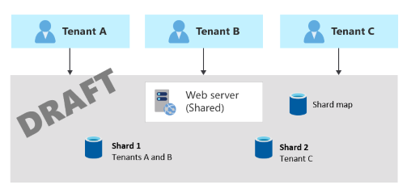
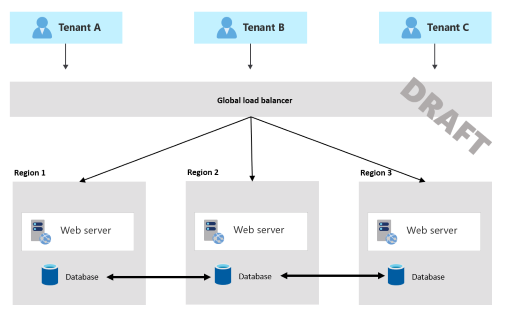

Data is often considered the most valuable part of a solution, because it represents your - and your customers' - valuable business information. So, it's important to carefully manage your data. When planning storage or data components for a multitenant system, you need to decide on an approach for sharing or isolating your tenants' data.

In this article, we provide guidance about the key considerations and requirements that are essential for solution architects when deciding on an approach to store data in a multitenant system. We then suggest some common patterns for applying multitenancy to storage and data services, and some antipatterns to avoid. Finally, we provide targeted guidance for some specific situations.

## Key considerations and requirements

It's important to consider the approaches you use for storage and data services from a number of perspectives, including the pillars of the [Azure Well-Architected Framework](/azure/architecture/framework).

### Scale

When you work with services that store your data, you should consider the number of tenants you have, and the volume of data you store. If you have a small number of tenants (such as five or fewer), and you're storing small amounts of data for each tenant, then it's likely to be a wasted effort to plan a highly scalable data storage approach, or to build a fully automated approach to manage your data resources. But as you grow, you increasingly benefit from having a clear strategy to scale your data and storage resources, and to apply automation to their management. When you have 50 tenants or more, or if you plan to reach that level of scale, then it's especially important to design your data and storage approach, with scale as a key consideration.

Consider the extent to which you plan to scale, and clearly plan your data storage architectural approach to meet that level of scale.

### Performance predictability

Multitenant data and storage services are particularly susceptible to the [Noisy Neighbor problem](../../../antipatterns/noisy-neighbor/noisy-neighbor.yml). It's important to consider whether your tenants might affect each other's performance. For example, do your tenants have overlapping peaks in their usage patterns over time? Do all of your customers use your solution at the same time each day, or are requests distributed evenly? Those factors will impact the level of isolation you need to design for, the amount of resources you need to provision, and the degree to which resources can be shared between tenants.

It's important to consider [Azure's resource and request quotas](/azure/azure-resource-manager/management/azure-subscription-service-limits) as part of this decision. For example, suppose you deploy a single storage account to contain all of your tenants' data. If you exceed a specific number of storage operations per second, Azure Storage will reject your application's requests, and all of your tenants will be impacted. This is called *throttling* behavior. It's important that you monitor for throttled requests.

### Data isolation

When designing a solution that contains multitenant data services, there are usually different options and levels of data isolation, each with their own benefits and tradeoffs. For example:

- When using Azure Cosmos DB, you can deploy separate containers for each tenant, and you can share databases and accounts between multiple tenants. Alternatively, you might consider deploying different databases or even accounts for each tenant, depending on the level of isolation required.
- When using Azure Storage for blob data, you can deploy separate blob containers for each tenant, or you can deploy separate storage accounts.
- When using Azure SQL, you can use separate tables in shared databases, or you can deploy separate databases or servers for each tenant.
- In all Azure services, you can consider deploying resources within a single shared Azure subscription, or you can use multiple Azure subscriptions - perhaps even one per tenant.

There is no single solution that works for every situation. The option you choose depends on a number of factors and the requirements of your tenants. For example, if you're designing a business-to-consumer (B2C) solution it might be reasonable to have a single data store for all of your data. However, if your tenants need to meet specific compliance or regulatory standards, you might need to apply a higher level of isolation. Similarly, you might have commercial requirements to physically isolate your customers' data, or you might need to enforce isolation to avoid the [Noisy Neighbor problem](../../../antipatterns/noisy-neighbor/noisy-neighbor.yml). Additionally, if tenants need to use their own encryption keys, they have individual backup and restore policies, or they need to have their data stored in different geographical locations, you might need to isolate them from other tenants, or group them with tenants that have similar policies.

### Complexity of implementation

It's important to consider the complexity of your implementation. It's good practice to keep your architecture as simple as possible, while still meeting your requirements. Avoid committing to an architecture that will become increasingly complex as you scale, or an architecture that you don't have the resources or expertise to develop and maintain.

Similarly, if your solution doesn't need to scale to a large number of tenants, or if you don't have concerns around performance or data isolation, then it's better to keep your solution simple and avoid adding unnecessary complexity.

A particular concern for multitenant data solutions is the level of customization you support. For example, can a tenant extend your data model or apply custom data rules? Ensure that you design for this requirement upfront. Avoid forking or providing customized infrastructure for individual tenants. Customized infrastructure inhibits your ability to scale, to test your solution, and to deploy updates. Instead, consider using [feature flags](/devops/operate/progressive-experimentation-feature-flags) and other forms of tenant configuration.

### Complexity of management and operations

Consider how you plan to operate your solution, and how your multitenancy approach affects your operations and processes. For example:

- **Management:** Consider management operations, such as regular maintenance activities. If you use multiple servers, file stores, or databases, plan how to initiate and monitor the maintenance operations for each tenant's resources.
- **Monitoring and metering:** If you monitor or meter your tenants, consider how your solution reports metrics, and whether they can be easily linked to the tenant that triggered the request.
- **Reporting:** Consider whether you need to report on aggegated data from across multiple isolated tenants. As your solution scales, it becomes cumbersome to run queries on each database individually and aggregate the results. A different approach is to have each tenant's applications publish data to a centralized data warehouse.
- **Schema updates:** If you use a database that enforces a schema, plan how you will deploy schema updates across your estate. Consider how your application knows which schema version to use for a specific tenant's database queries.
- **Requirements:** Consider your tenants' high availability requirements (for example, uptime service level agreements, or SLAs) and disaster recovery requirements (for example, recovery time objectives, or RTOs, and recovery point objectives, or RPOs). If tenants have different expectations, verify you can meet each tenant's requirements.
- **Migration:** Consider whether you'll enable tenants to move to a different type of service, a different deployment, or another region. If this is a capability you plan to offer, build processes and tools to ensure it's a repeatable and safe process.

### Cost

Generally, the higher the density of tenants to your deployment infrastructure, the lower the cost to provision that infrastructure. However, shared infrastructure increases the likelihood of issues like the [Noisy Neighbor problem](../../../antipatterns/noisy-neighbor/noisy-neighbor.yml), so consider the tradeoffs carefully.

## Approaches and patterns to consider

Several design patterns from the Azure Architecture Center are of relevance to multitenant storage and data services. You might choose to follow one pattern consistently. Or, you could consider mixing and matching patterns. For example, you might use a multitenant database for most of your tenants, but deploy single-tenant stamps for tenants who pay more or who have unusual requirements.

### Deployment Stamps pattern

For more information about how the [Deployment Stamps pattern](../../../patterns/deployment-stamp.yml) can be used to support a multitenant solution, see [Overview](overview.md#deployment-stamps-pattern).

> [!TIP]
> In multitenant solutions, it's a good practice to create deployment stamps. This recommendation applies even when you use a multitenant database or sharded databases within a stamp. By modelling your solution as a stamp, you can easily redeploy it as new business opportunities arise.

### Shared multitenant databases and file stores

You might consider deploying a shared multitenant database, storage account, or file share, and sharing it across all of your tenants.

This approach provides the highest density of tenants to infrastructure, so it tends to come at the lowest financial cost of any approach. It also often reduces the management overhead, because there's a single database or resource to manage, back up, and secure.

However, when you work with shared infrastructure, there are several drawbacks to consider:

- **Scale limits:** When you rely on a single resource, consider the supported scale and limits of that resource. For example, if your architecture relies on a single shared database, the maximum size of a database or file store, or the maximum throughput limits, will eventually become a hard blocker. Carefully consider the maximum scale you need to achieve, and compare it to your current and future limits, before you select this pattern.
- **Noisy neighbors:** The [Noisy Neighbor problem](../../../antipatterns/noisy-neighbor/noisy-neighbor.yml) might become a factor, especially if you have tenants that are particularly busy or generate higher workloads than others. Consider applying the [Throttling pattern](../../../patterns/throttling.yml) or the [Rate Limiting pattern](../../../patterns/rate-limiting-pattern.yml) to mitigate these effects.
- **Measuring tenants' consumption:** Consider whether you need to [measure the consumption](../considerations/measure-consumption.md) of each tenant. Some data services, such as Azure Cosmos DB, provide reporting on resource usage for each transaction, so this information can be tracked and aggregated to measure the consumption for each tenant. Other services don't provide the same level of detail. For example, when you use Azure Files with premium file eshares, you can access metrics for file capacity for each file share dimension, and the standard tier provides the metrics only at the storage account level.
- **Tenant requirements:** Tenants might have different requirements for security, backup, availability, or storage location. If these don't match your single resource's configuration, you might not be able to accommodate them.
- **Schema customization:** When you work with a relational database, or another situation where the schema of the data is important, then tenant-level schema customization is difficult.

### Sharding pattern

The [Sharding pattern](../../../patterns/sharding.yml) involves deploying multiple separate databases, called *shards*, that each contains one or more tenants' data. Unlike deployment stamps, shards don't imply that the entire infrastructure is duplicated. You might shard databases without also duplicating or sharding other infrastructure in your solution.

Sharding is closely related to *partitioning*, and the terms are often used interchangeably. Consider the [Horizontal, vertical, and functional data partitioning guidance](../../../best-practices/data-partitioning.yml).

The Sharding pattern can scale to very large numbers of tenants. Additionally, depending on your workload, you might be able to achieve a high density of tenants to shards, so the cost can be attractive. The Sharding pattern can also be used to address [Azure subscription and service quotas, limits and constraints](/azure/azure-resource-manager/management/azure-subscription-service-limits).

Some data stores, such as Azure Cosmos DB, provide native support for sharding or partitioning. When you work with other solutions, such as Azure SQL, it can be more complex to build a sharding infrastructure, and to route requests to the correct shard for a given tenant.

Sharding also makes it difficult to support tenant-level configuration differences, and to enable customers to provide their own encryption keys.

### Multitenant app with dedicated databases for each tenant

Another common approach is to deploy a single multitenant application, with dedicated databases for each tenant.

In this model, each tenant's data is isolated from the others, and you might be able to support some degree of customization for each tenant.

Because you provision dedicated data resources for each tenant, the cost for this approach can be higher than shared hosting models. However, Azure provides several options you can consider, in order to share the cost of hosting individual data resources across multiple tenants. For example, when you work with Azure SQL Database, you can consider [elastic pools](/azure/azure-sql/database/elastic-pool-overview). For Azure Cosmos DB, you can [provision throughput for a database](/azure/cosmos-db/set-throughput#set-throughput-on-a-database) and the throughput is shared between the containers in that database, although this approach is not appropriate when you need guaranteed performance for each container.

In this approach, because only the data components are deployed individually for each tenant, you likely can achieve high density for the other components in your solution and reduce the cost of those components.

> [!NOTE]
> It's important to use automated deployment approaches when you provision databases for each tenant. Otherwise, the complexity of manually deploying and managing the databases soon becomes overwhelming.

### Geode pattern

The [Geode pattern](../../../patterns/geodes.yml) is designed specifically for geographically distributed solutions, including multitenant solutions. It supports high load and high levels of resiliency. If you implement the Geode pattern, your data tier must be able to replicate the data across geographic regions, and it should support multi-geography writes.

Azure Cosmos DB provides [multi-region writes](/azure/cosmos-db/nosql/how-to-multi-master) to support this pattern, and [Azure Managed Instance for Apache Cassandra supports multi-region clusters](/azure/managed-instance-apache-cassandra/create-multi-region-cluster). Other data services are generally not able to support this pattern, without significant customization.

## Antipatterns to avoid

When you create multitenant data services, it's important to avoid situations that inhibit your ability to scale.

For relational databases, these include:

- **Table-based isolation.** When you work within a single database, avoid creating individual tables for each tenant. A single database can't support very large numbers of tenants when you use this approach, and it becomes increasingly difficult to query, manage, and update data. Instead, consider using a single set of multitenant tables with a tenant identifier column. Alternatively, you can use one of the patterns described above to deploy separate databases for each tenant.
- **Column-level tenant customization.** Avoid schema updates that only apply to a single tenant. For example, suppose you have a single multitenant database. Avoid adding a new column to meet a specific tenant's requirements. It might be acceptable for a small number of customizations, but this rapidly becomes unmanageable when you have a large number of customizations to consider. Instead, consider revising your data model to track custom data for each tenant in a dedicated table.
- **Manual schema changes.** Avoid updating your database schema manually, even if you only have a single shared database. It's easy to lose track of the updates you've applied, and if you need to scale out to more databases, it's challenging to identify the correct schema to apply. Instead, build tooling or an automated pipeline to deploy your schema changes, and use it consistently. Track the schema version used for each tenant in a dedicated database or lookup table.
- **Version dependencies.** Avoid having your application take a dependency on a single version of your database schema. As you scale, you might need to apply schema updates at different times for different tenants. Instead, ensure your application version is backwards-compatible with at least one previous schema version, and sequence destructive schema changes across multiple versions to support rollbacks.

## Databases

There are some features that can be useful for multitenancy. However, these aren't available in all database services. Consider whether you need these, when you decide on the service to use for your scenario:

- **Row-level security** can provide security isolation for specific tenants' data in a shared multitenant database. This feature is available in some databases, like Azure SQL Database and Azure Database for PostgreSQL flexible server.

    When you use row-level security you need to ensure the user's identity and tenant identity are propagated through the application and into the data store with each query. This approach can be complex to design, implement, test, and maintain. Many multitenant solutions don't use row-level security because of those complexities.

- **Tenant-level encryption** might be required to support tenants that provide their own encryption keys for their data. This feature is available in SQL Server and Azure SQL as part of [Always Encrypted](/sql/relational-databases/security/encryption/always-encrypted-database-engine). Azure Cosmos DB provides [customer-managed keys at the account level](/azure/cosmos-db/how-to-setup-cmk) and also [supports Always Encrypted](/azure/cosmos-db/how-to-always-encrypted).

- **Resource pooling** provides the ability to share resources and cost, between multiple databases or containers. This feature is available in Azure SQL Database [elastic pools](/azure/azure-sql/database/elastic-pool-overview) and [Azure SQL Managed Instance](/azure/azure-sql/managed-instance/sql-managed-instance-paas-overview), and in Azure Cosmos DB [database throughput](/azure/cosmos-db/set-throughput#set-throughput-on-a-database).

- **Sharding and partitioning** has stronger native support in some services than others. This feature is available in Azure Cosmos DB, by using its [logical and physical partitioning](/azure/cosmos-db/partitioning-overview). While Azure SQL Database doesn't natively support sharding, it provides [sharding tools](/azure/azure-sql/database/elastic-scale-introduction) to support this type of architecture.

Additionally, when you maintain a fleet of relational databases or other schema-based databases, consider where the schema upgrade process should be triggered. In a small estate of databases, you might consider using a deployment pipeline to deploy schema changes. As the number of databases increases, it might be better for your application tier to detect the schema version for a specific database and to initiate the upgrade process.

## File and blob storage

Consider the approach you use to isolate data within a storage account. For example, you might deploy separate storage accounts for each tenant, or you might share storage accounts and deploy individual containers. Alternatively, you might create shared blob containers, and then you can use the blob path to separate data for each tenant. Consider [Azure subscription limits and quotas](/azure/azure-resource-manager/management/azure-subscription-service-limits), and carefully plan your growth to ensure your Azure resources scale to support your future needs.

If you use shared containers, plan your authentication and authorization strategy carefully, to ensure that tenants can't access each other's data. Consider the [Valet Key pattern](../../../patterns/valet-key.yml) when you provide clients with access to Azure Storage resources.

## Cost allocation

Consider how you'll [measure consumption and allocate costs to tenants](../considerations/measure-consumption.md), for the use of shared data services. Whenever possible, aim to use built-in metrics instead of calculating your own. However, with shared infrastructure, it becomes hard to split telemetry for individual tenants, and you might need to consider application-level custom metering.

In general, cloud-native services, like Azure Cosmos DB and Azure Blob Storage, provide more granular metrics to track and model the usage for a specific tenant. For example, Azure Cosmos DB provides the consumed throughput for every request and response.

## Contributors

*This article is maintained by Microsoft. It was originally written by the following contributors.*

Principal author:

- [John Downs](https://www.linkedin.com/in/john-downs) | Principal Software Engineer

Other contributors:

- [Paul Burpo](https://www.linkedin.com/in/paul-burpo) | Principal Customer Engineer, FastTrack for Azure
- [Daniel Scott-Raynsford](https://www.linkedin.com/in/dscottraynsford) | Partner Technology Strategist
- [Arsen Vladimirskiy](https://www.linkedin.com/in/arsenv) | Principal Customer Engineer, FastTrack for Azure

*To see non-public LinkedIn profiles, sign in to LinkedIn.*

## Next steps

For more information about multitenancy and specific Azure services, see:

- [Multitenancy and Azure Storage](../service/storage.md)
- [Multitenancy and Azure SQL Database](../service/sql-database.md)
- [Multitenancy and Azure Cosmos DB](../service/cosmos-db.md)
- [Multitenancy and Azure Database for PostgreSQL](../service/postgresql.md)
