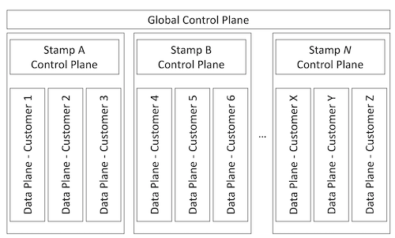
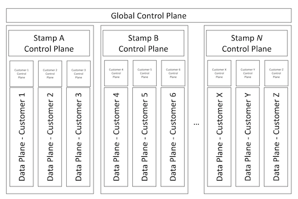

You can think about a multitenant solution as having multiple *planes*, each with separate responsibilities. The *data plane* is how end users and clients interact with the system for its intended purpose. The *control plane* is the component that manages higher level aspects across all tenants such as access control, provisioning, and system maintenance: 

For example, consider a bookkeeping system for managing financial records. Multiple tenants each store their financial records in the system. When end users access the system to view and enter their financial records, they use the *data plane*. The data plane is likely the primary application component for your solution, and your tenants probably think of it as the way to use the system for its intended purpose. The *control plane* is the component that onboards new tenants, creates databases for each tenant, and performs other management and maintenance operations. If the system didn't include a control plane, the administrators would need to run many manual processes instead. Or, the data plane and control plane responsibilities would be mixed together, overcomplicating the solution.

Many complex solutions include control planes. For example, Azure's control plane, [Azure Resource Manager](/azure/azure-resource-manager/management/overview), is a set of APIs, tools, and backend components that are responsible for deploying and configuring Azure resources. The [Kubernetes control plane](https://kubernetes.io/docs/concepts/overview/components/#control-plane-components) manages many concerns, such as the placement of Kubernetes pods on worker nodes. Almost all SaaS (software as a service) solutions have a control plane to work with cross-tenant concerns.

Control planes are critical components to consider when you design your own multitenant solutions. In this article, we discuss the responsibilities of control planes, and how to scope and design a control plane to meet your needs.

## Responsibilities of a control plane

There's no single template for a control plane or its responsibilities. Your solution's requirements dictate what your control plane needs to do. In some multitenant solutions, the control plane has wide range of responsibilities and is a complex system in its own right. In other multitenant solutions, the control plane only has basic responsibilities.

In general, a control plane might have many of the following core responsibilities:

- Provision and manage the system resources that the system needs to serve the workload, including tenant-specific resources. Your control plane might [invoke and orchestrate a deployment pipeline](../approaches/deployment-configuration.yml#tenant-lists-as-configuration-or-data) that's responsible for deployments, or it might run the deployment operations itself.
- Reconfigure shared resources to be aware of new tenants. For example, configuring network routing to ensure that incoming traffic is [mapped to the correct tenant's resources](map-requests.yml).
- Manage the configuration of each tenant.
- Handle the [tenant lifecycle](tenant-lifecycle.md), including onboarding, moving, and offboarding tenants.
- Track the tenants who are using the system, and the resources that those tenants are allocated to.
- [Measure each tenant's consumption](measure-consumption.md) of your system's resources. Consumption metrics might inform your billing systems, or they might be used for resource governance.
- Providing observability over your tenants' state and performance.

If you're building a solution that uses the [fully multitenant tenancy model](tenancy-models.yml#fully-multitenant-deployments), a basic control plane might just track tenants and their associated metadata. For example, whenever a new tenant signs up to your service, the control plane could update the appropriate records in a database so that the rest of the system is able to serve the new tenant's requests.

In contrast, suppose your solution uses a deployment model that requires tenant-specific infrastructure, such as the [automated single-tenant deployments model](tenancy-models.yml#automated-single-tenant-deployments). In this scenario, your control plane might have further responsibilities to deploy or reconfigure Azure infrastructure whenever you onboard a new tenant. Your solution's control plane likely needs to interact with the control planes for the services that you use, such as Azure Resource Manager or the Kubernetes control plane.

More advanced control planes might also take on more responsibilities:

- Performing automated maintenance operations, such as deleting or archiving old data, creating and managing database indexes, and rotating secrets and cryptographic certificates.
- Allocating tenants to existing deployments or stamps, which is sometimes called *tenant placement*.
- Rebalancing existing tenants across deployment stamps.
- Integrating with external customer management solutions, such as Microsoft Dynamics 365, to track activity against your customers.

## Scope a control plane

It's important that you carefully consider how much effort you need to spend on building a control plane for your solution. Control planes by themselves don't provide immediate customer value, so it might not be easy to justify spending engineering effort designing and building a high-quality control plane. However, as your system grows and scales, you'll increasingly need automated management and operations to be able to keep up with your growth.

In certain situations, it might be reasonable not to build a full control plane. This situation might apply your system is only going to have fewer than five tenants. Instead, your team can take on a control plane's responsibilities and can use manual operations and processes to onboard and manage tenants. However, you should still have a process and central place to track your tenants and their configuration.

> [!NOTE]
> If you provide self-service tenant management, you'll need a control plane early in your journey. You might choose to creae a basic control plane and only automate some of the most commonly used functionality.

As you grow beyond a few tenants, you'll likely gain benefits from having a way to track each tenant and monitor across your fleet of resources and tenants. You might also notice that your team spends an increasing amount of time and effort on tenant management. Or, you might notice bugs or operational problems because of inconsistencies in the ways that team members perform management tasks. If these situations occur, it's worth considering building a more comprehensive control plane to take on these responsibilities.

> [!TIP]
> If you decide not to create a full control plane, it's still a good idea to be systematic about your management procedures. Document your processes thoroughly. Where possible, create and reuse scripts for your management operations. If you need to automate the processes in the future, your documentation and scripts will form the basis of your control plane.

## Design a control plane

After you've determined the requirements and the scope of your control plane, you need to design and architect it. A control plane is an important system in its own right, and just like the other elements of your system, it needs to be planned carefully. Two particular architectural concerns are resiliency and how the control plane orchestrates long-running operations.

### Resiliency

Control planes are often mission-critical components, and it's essential that you consider the resiliency and reliability of your control plane.

Consider what happens if your control plane is unavailable. In extreme cases, a control plane outage might result in your entire solution being unavailable. Even if your control plane isn't a single point of failure, an outage might include the following effects:

- Your system isn't able to onboard new tenants.
- Your system can't manage existing tenants.
- You can't measure the consumption of tenants, or bill them for their usage.
- Maintenance debt accumulates. For example, if your solution requires nightly cleanup of old data, will disks fill up or will your performance degrade?

Consider following the [Azure Well-Architected Framework guidance for building reliable solutions](/azure/architecture/framework/resiliency/overview) throughout your system, including your control plane.

### Long-running operations

The operations that a control plane performs are often long-running and involve coordination between multiple systems. The operations can also have complex failure modes. When you design your control plane, it's important that you use a suitable technology for coordinating long-running operations or workflows.

For example, suppose that when you onboard a new tenant, your control plane might need to do the following sequence of actions:

1. **Deploy a new database.** This action is an Azure deployment operation, and might take several minutes to complete.
1. **Update your tenant metadata catalog.** This action might involve executing a command against an Azure SQL database.
1. **Send a welcome email to the new tenant.** This action invokes a third-party API to send an email.
1. **Update your billing system to prepare to invoice the new tenant.** This action invokes a third-party API, and you've noticed in the past that it intermittently fails.
1. **Update your customer relationship management (CRM) system to track the new tenant.** This action invokes a third-party API.

If any step in the sequence fails, you need to consider whether you retry it, continue to the next step, or abandon the workflow and trigger a manual recovery process. You also need to consider what the tenant's experience is for each scenario.

## Use multiple control planes

Most solutions only need one control plane. However, in a complex environment, you might need to have multiple control planes, each with different areas of responsibility. Many multitenant solutions follow the [Deployment Stamps pattern](../../../patterns/deployment-stamp.yml) and shard tenants across multiple stamps. When you follow this pattern, you might create separate control planes for global and stamp concerns.

### Global control planes

A global control plane is typically responsible for overall management and tracking of tenants. A global control plane might have the following responsibilities:

- Tenant placement. The global control plane decides which stamp a tenant should use. It might decide based on factors like the tenant's region, each stamp's capacity utilization, and the tenant's service level requirements.
- Tenant onboarding and lifecycle management, including tracking all of the tenants across all deployments.

### Stamp control planes

A stamp control plane is deployed into each deployment stamp and has responsibilities for the tenants and resources allocated to that stamp. A stamp control plane might cover the following responsibilities:

- Creating and managing tenant-specific resources within the stamp, such as databases or storage containers.
- Monitoring the consumption of shared resources and deploying new instances when they're approaching their maximum capacity.
- Performing maintenance operations within the stamp, such as database index management and cleanup operations.

Each stamp's control plane coordinates with the global control plane. For example, suppose a new tenant signs up. The global control plane is initially responsible for selecting a stamp for the tenant's resources. Then, the global control plane can instruct the stamp control plane to create the necessary resources for the tenant.

The following diagram shows an example of how the two control planes might coexist in a single system:

### Tenant control planes

Tenants might use a tenant-level control plane to manage their own logical or physical resources. A tenant control plane might include the following responsibilities:

- Management of user access and other tenant-specific configuration.
- Tenants can perform maintenance operations, such as backing their data or downloading a previous backup.
- If you allow tenants to [control their own updates](updates.md), the tenant-level control plane could provide the necessary controls.

The following diagram shows a complex system with a global control plane, stamp control planes, and a control plane for each tenant:

## Contributors

*This article is maintained by Microsoft. It was originally written by the following contributors.*

Principal author:

 * [John Downs](http://linkedin.com/in/john-downs) | Principal Customer Engineer, FastTrack for Azure

Other contributors:

 * [Bohdan Cherchyk](http://linkedin.com/in/cherchyk) | Senior Customer Engineer, FastTrack for Azure
 * [Landon Pierce](https://www.linkedin.com/in/landon-pierce-a84b37b6) | Customer Engineer, FastTrack for Azure
 * [Daniel Scott-Raynsford](http://linkedin.com/in/dscottraynsford) | Partner Technology Strategist
 * [Arsen Vladimirskiy](http://linkedin.com/in/arsenv) | Principal Customer Engineer, FastTrack for Azure

*To see non-public LinkedIn profiles, sign in to LinkedIn.*

## Next steps

Return to the [architectural considerations overview](overview.yml). Or, review the [Microsoft Azure Well-Architected Framework](/azure/architecture/framework).
