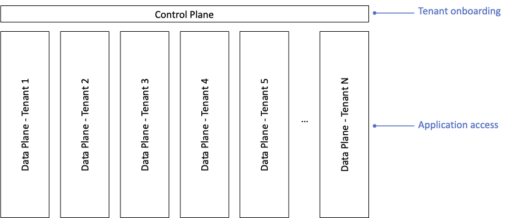
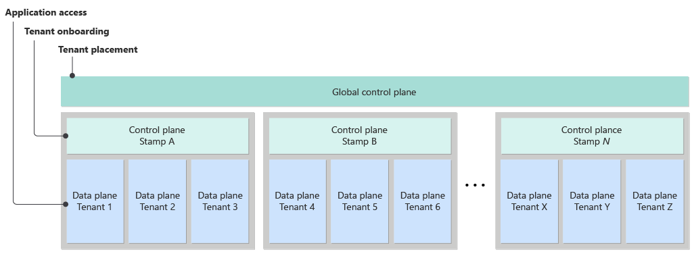
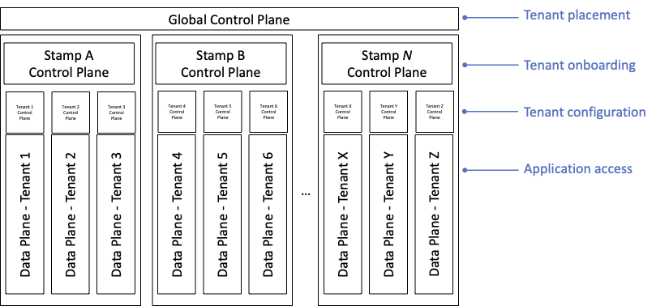

A multitenant solution has multiple *planes*, and each has its own responsibilities. The *data plane* enables end users and clients to interact with the system. The *control plane* is the component that manages higher-level tasks across all tenants, like access control, provisioning, and system maintenance to support your platform administrators' tasks.

This article provides information about the responsibilities of control planes and how to design a control plane that meets your needs.

For example, consider a bookkeeping system for managing financial records. Multiple tenants store their financial records in the system. When end users access the system to view and enter their financial records, they use the data plane. The data plane is likely the primary application component for your solution. Your tenants probably think of it as the way to use the system for its intended purpose. The control plane is the component that onboards new tenants, creates databases for each tenant, and performs other management and maintenance operations. If the system didn't have a control plane, administrators would need to run many manual processes. Or data plane and control plane tasks would be mixed together, overcomplicating the solution.

Many complex systems include control planes. For example, the Azure control plane, [Azure Resource Manager](/azure/azure-resource-manager/management/overview), is a set of APIs, tools, and back-end components that are responsible for deploying and configuring Azure resources. The [Kubernetes control plane](https://kubernetes.io/docs/concepts/overview/components/#control-plane-components) manages many tasks, like the placement of Kubernetes pods on worker nodes. Almost all software as a service (SaaS) solutions have a control plane to handle cross-tenant tasks.

 When you design multitenant solutions, you need to consider control planes. The following sections provide the details you need to scope and design a control plane.

## Responsibilities of a control plane

There's no single template for a control plane or its responsibilities. Your solution's requirements and architecture dictate what your control plane needs to do. In some multitenant solutions, the control plane has a wide range of responsibilities and is a complex system in its own right. In other multitenant solutions, the control plane has only basic responsibilities.

In general, a control plane might have many of the following core responsibilities:

- Provision and manage the system resources that the system needs to serve the workload, including tenant-specific resources. Your control plane might [invoke and orchestrate a deployment pipeline](../approaches/deployment-configuration.yml#tenant-lists-as-configuration-or-data) that's responsible for deployments, or it might run the deployment operations itself.
- Reconfigure shared resources to be aware of new tenants. For example, your control plane might configure network routing to ensure that incoming traffic is [mapped to the correct tenant's resources](map-requests.yml).
- Store and manage the configuration of each tenant.
- Handle [tenant lifecycle events](tenant-lifecycle.md), including onboarding, moving, and offboarding tenants.
- Track each tenant's use of your features and the performance of the system.
- [Measure each tenant's consumption](measure-consumption.md) of your system's resources. Consumption metrics might inform your billing systems, or they might be used for resource governance.

If you use the [fully multitenant tenancy model](tenancy-models.yml#fully-multitenant-deployments) and don't deploy any tenant-specific resources, a basic control plane might just track tenants and their associated metadata. For example, whenever a new tenant signs up to your service, the control plane could update the appropriate records in a database so that the rest of the system is able to serve the new tenant's requests.

In contrast, suppose your solution uses a deployment model that requires tenant-specific infrastructure, like the [automated single-tenant model](tenancy-models.yml#automated-single-tenant-deployments). In this scenario, your control plane might have additional responsibilities, like deploying or reconfiguring Azure infrastructure whenever you onboard a new tenant. Your solution's control plane probably needs to interact with the control planes for the services and technologies that you use, like Azure Resource Manager or the Kubernetes control plane.

More advanced control planes might also take on more responsibilities:

- Perform automated maintenance operations. Common maintenance operations include deleting or archiving old data, creating and managing database indexes, and rotating secrets and cryptographic certificates.
- Allocate tenants to existing deployments or stamps, which is sometimes called *tenant placement*.
- Rebalance existing tenants across deployment stamps.
- Integrate with external customer management solutions, like Microsoft Dynamics 365, to track customer activity. 

## Scope a control plane

You need to carefully consider how much effort to spend on building a control plane for your solution. Control planes by themselves don't provide immediate customer value, so it might not be easy to justify spending engineering effort on designing and building a high-quality control plane. However, as your system grows and scales, you'll increasingly need automated management and operations to be able to keep up with your growth.

In certain situations, you might not need a full control plane. This situation might apply if your system will have fewer than five tenants. Instead, your team can take on a control plane's responsibilities and can use manual operations and processes to onboard and manage tenants. However, you should still have a process and central place to track your tenants and their configurations.

> [!TIP]
> If you decide not to create a full control plane, it's still a good idea to be systematic about your management procedures:
> - Document your processes thoroughly.
> - Wherever possible, create and reuse scripts for your management operations.
> 
> If you need to automate the processes in the future, your documentation and scripts can form the basis of your control plane.

As you grow beyond a few tenants, you'll likely benefit from having a way to track each tenant and apply monitoring across your fleet of resources and tenants. You might also notice that your team spends an increasing amount of time and effort on tenant management. Or you might notice bugs or operational problems because of inconsistencies in the ways that team members perform management tasks. If these situations occur, it's worth considering building a more comprehensive control plane to take on these responsibilities.

> [!NOTE]
> If you provide self-service tenant management, you need a control plane early in your journey. You might choose to create a basic control plane and automate only some of the most commonly used functionality. You can progressively add more capabilities over time.

## Design a control plane

After you've determined the requirements and the scope of your control plane, you need to design and architect it. A control plane is an important component. You need to plan it carefully, just as you would plan the other elements of your system.

### Well-architected control planes

Because a control plane is its own system, it's important to consider all five pillars of the [Azure Well-Architected Framework](/azure/architecture/framework) when you design one. The following sections highlight some particular areas to focus on.

#### Reliability

Control planes are often mission-critical components. It's essential that you plan the level of resiliency and reliability that your control plane needs.

Consider what happens if your control plane is unavailable. In extreme cases, a control plane outage might result in your entire solution being unavailable. Even if your control plane isn't a single point of failure, an outage might have some of the following effects:

- Your system isn't able to onboard new tenants, which might affect your sales and business growth.
- Your system can't manage existing tenants, which results in more calls to your support team.
- You can't measure the consumption of tenants or bill them for their usage, which results in lost revenue.
- You can't respond to a security incident by disabling or reconfiguring a tenant.
- Maintenance debt accumulates, which results in long-term damage to the system. For example, if your solution requires nightly cleanup of old data, your disks could fill up or your performance could degrade.

Define [service-level objectives](/azure/architecture/framework/resiliency/design-requirements) for your control plane, including availability targets, the recovery time objective (RTO), and the recovery point objective (RPO). The objectives that you set for your control plane might be different from those that you offer your customers.

Follow the [Azure Well-Architected Framework guidance for building reliable solutions](/azure/architecture/framework/resiliency/overview) throughout your system, including your control plane.

#### Security

Control planes are often highly privileged systems. Security problems within a control plane can have catastrophic consequences. Depending on its design and functionality, a control plane might be vulnerable to many different types of attacks, including the following:

- A control plane might have access to keys and secrets for all tenants. An attacker who has access to your control plane might be able to gain access to a tenant's data or resources.
- A control plane can often deploy new resources to Azure. Attackers might be able to exploit your control plane to deploy their own resources into your subscriptions, potentially incurring extensive charges.
- If an attacker successfully brings your control plane offline, there can be immediate and long-term damage to your system and to your business. See [Reliability](#reliability) for example consequences of a control plane being unavailable.

When you design and implement a control plane, it's essential that you follow security best practices and create a comprehensive threat model to document and mitigate potential threats and security problems in your solution. For more information, see the [Azure Well-Architected Framework guidance for building secure solutions](/azure/architecture/framework/security/overview).

#### Operational excellence

Because a control plane is a critical component, you should carefully consider how you deploy and operate it in production.

Like other parts of your solution, you should deploy non-production instances of your control plane so that you can thoroughly test its functionality. If your control plane performs deployment operations, consider how your non-production control planes interact with your Azure environment, and which Azure subscription you deploy non-production resources to.

You should also plan how you govern your team's access to your control plane. Follow best practices for granting only the permissions that team members need to perform their duties. In addition to helping to avoid security incidents, this approach helps to reduce the effect of accidental misconfiguration.

### Components

There's no single template for a control plane, and the components that you design and build depend on your requirements. Commonly, a control plane consists of APIs and background worker components. In some solutions, a control plane might also include a user interface.

#### Isolate your control plane from tenant workloads

It's a good practice to separate your control plane's resources from those used to serve your tenants' data planes. For example, you should consider using separate database servers, application servers and Azure App Service plans, and other components. It's often a good idea to keep your control plane's resources in a separate Azure resource group from those that contain tenant-specific resources.

By isolating your control plane from tenants' workloads, you gain several advantages:

- You can configure scaling separately. For example, your control plane might have consistent resource requirements, and your tenants' resources might scale elastically depending on their needs.
- There's a [bulkhead](../../../patterns/bulkhead.yml) between your control and data planes, which helps to prevent [noisy neighbor problems](../../../antipatterns/noisy-neighbor/noisy-neighbor.yml) from spreading between the planes of your solution.
- Control planes are typically highly privileged systems that have high levels of access. By separating the control plane from data planes, you reduce the likelihood that a security vulnerability might allow attackers to elevate their permissions across your entire system.
- You can deploy separate networking and firewall configurations. Data planes and control planes usually require different types of network access.

#### Orchestrate sequences of long-running operations

The operations that a control plane performs are often long-running and involve coordination between multiple systems. The operations can also have complex failure modes. When you design your control plane, it's important to use a suitable technology for coordinating long-running operations or workflows.

For example, suppose that, when you onboard a new tenant, your control plane runs the following actions in sequence:

1. **Deploy a new database.** This action is an Azure deployment operation. It might take several minutes to complete.
1. **Update your tenant metadata catalog.** This action might involve running a command against an Azure SQL database.
1. **Send a welcome email to the new tenant.** This action invokes a third-party API to send the email.
1. **Update your billing system to prepare to invoice the new tenant.** This action invokes a third-party API. You've noticed that it intermittently fails.
1. **Update your customer relationship management (CRM) system to track the new tenant.** This action invokes a third-party API.

If any step in the sequence fails, you need to consider what to do, such as:

- Retry the failed operation. For example, if your Azure SQL command in step 2 fails with a transient error, you could retry it.
- Continue to the next step. For example, you might decide that it's acceptable if the update to your billing system fails, because your sales team will manually add the customer.
- Abandon the workflow and trigger a manual recovery process.

You also need to consider what the user experience is like for each failure scenario.

## Use multiple control planes

In a complex environment, you might need to use multiple control planes, each with different areas of responsibility. Many multitenant solutions follow the [Deployment Stamps pattern](../../../patterns/deployment-stamp.yml) and shard tenants across multiple stamps. When you use this pattern, you might create separate control planes for global and stamp responsibilities.

> [!TIP]
> Coordinating across multiple control planes is complex, so try to minimize the number of control planes that you build. Most solutions need only one control plane.

### Global control planes

A global control plane is typically responsible for the overall management and tracking of tenants. A global control plane might have the following responsibilities:

- **Tenant placement.** The global control plane determines which stamp a tenant should use. It might make this determination based on factors like the tenant's region, each stamp's capacity utilization, and the tenant's service level requirements.
- **Tenant onboarding and lifecycle management.** These responsibilities include tracking all tenants across all deployments.

### Stamp control planes

A stamp control plane is deployed into each deployment stamp and is responsible for the tenants and resources allocated to that stamp. A stamp control plane might have these responsibilities:

- **Creating and managing tenant-specific resources within the stamp**, like databases and storage containers
- **Managing shared resources**, including monitoring the consumption of shared resources and deploying new instances when they're approaching their maximum capacity
- **Performing maintenance operations within the stamp**, like database index management and cleanup operations

Each stamp's control plane coordinates with the global control plane. For example, suppose a new tenant signs up. The global control plane is initially responsible for selecting a stamp for the tenant's resources. Then, the global control plane prompts the stamp's control plane to create the necessary resources for the tenant.

The following diagram shows an example of how the two control planes might coexist in a single system:

### Tenant control planes

Tenants might use a tenant-level control plane to manage their own logical or physical resources. A tenant control plane might have the following responsibilities:

- **Management of tenant-specific configuration**, like user access
- **Tenant-initiated maintenance operations**, like backing up data or downloading a previous backup
- **Update management**, if you allow tenants to [control their own updates to their applications](updates.md)

The following diagram shows a complex system that has a global control plane, stamp control planes, and a control plane for each tenant:

## Contributors

*This article is maintained by Microsoft. It was originally written by the following contributors.*

Principal author:

 * [John Downs](http://linkedin.com/in/john-downs) | Principal Customer Engineer, FastTrack for Azure

Other contributors:

 * [Mick Alberts](https://www.linkedin.com/in/mick-alberts-a24a1414) | Technical Writer
 * [Bohdan Cherchyk](http://linkedin.com/in/cherchyk) | Senior Customer Engineer, FastTrack for Azure
 * [Landon Pierce](https://www.linkedin.com/in/landon-pierce-a84b37b6) | Customer Engineer, FastTrack for Azure
 * [Daniel Scott-Raynsford](http://linkedin.com/in/dscottraynsford) | Partner Technology Strategist
 * [Arsen Vladimirskiy](http://linkedin.com/in/arsenv) | Principal Customer Engineer, FastTrack for Azure

*To see non-public LinkedIn profiles, sign in to LinkedIn.*

## Next steps

- [Architectural considerations overview](overview.yml) 
- [Azure Well-Architected Framework](/azure/architecture/framework)
