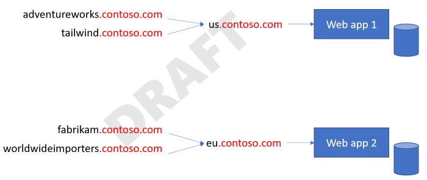
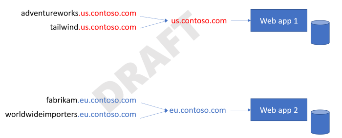

In many multitenant web applications, a domain name can be used as a way to identify a tenant, to help with routing requests to the correct infrastructure, and to provide a branded experience to your customers. Two common approaches are to use subdomains and custom domain names. On this page, we provide guidance for technical decision-makers about the approaches you can consider and their tradeoffs.

## Subdomains

Each tenant might get a unique subdomain under a common shared domain name, using a format like `tenant.provider.com`.

Let's consider an example multitenant solution built by Contoso. Customers purchase Contoso's product to help manage their invoice generation. All of Contoso's tenants might be assigned their own subdomain, under the `contoso.com` domain name. Or, if Contoso uses regional deployments, they might assign subdomains under the `us.contoso.com` and `eu.contoso.com` domains. In this article, we refer to these as _stem domains_. Each customer gets their own subdomain under your stem domain. For example, Tailwind Toys might be assigned `tailwind.contoso.com`, and Adventure Works might be assigned `adventureworks.contoso.com`.

> [!NOTE]
> Many Azure services use this approach. For example, when you create an Azure storage account, it is assigned a set of subdomains for you to use, such as `<your account name>.blob.core.windows.net`.

### Manage your domain namespace

When you create subdomains under your own domain name, you need to be mindful that you could have multiple customers with similar names. Because they share a single stem domain, the first customer to get a particular domain will get their preferred name. Then, subsequent customers have to use alternate subdomain names, because full domain names must be globally unique.

### Wildcard DNS

Consider using wildcard DNS entries to simplify the management of subdomains. Instead of creating DNS entries for `tailwind.contoso.com`, `adventureworks.contoso.com`, and so forth, you could instead create a wildcard entry for `*.contoso.com` and direct all subdomains to single IP address (A record) or canonical name (CNAME record).

> [!NOTE]
> Make sure that your web-tier services support wildcard DNS, if you plan to rely on this feature. Many Azure services, including Azure Front Door and Azure App Service, support wildcard DNS entries.

### Subdomains with multipart stem domains

Many multitenant solutions are spread across multiple physical deployments. This is a common approach when you need to comply with data residency requirements, or when you want to provide better performance by deploying resources geographically closer to the users.

Even within a single region, you might also need to spread your tenants across independent deployments, to support your scaling strategy. If you plan to use subdomains for each tenant, you might consider a multipart subdomain structure.

Here's an example: Contoso publishes a multitenant application for its four customers. Adventure Works and Tailwind Traders are in the United States, and their data is stored on a shared US instance of the Contoso platform. Fabrikam and Worldwide Importers are in Europe, and their data is stored on a European instance.

If Contoso chose to use a single stem domain, **contoso.com**, for all their customers, here's what this might look like:

The DNS entries (that are required to support this configuration) might look like this:

| Subdomain | CNAME to |
|-|-|
| `adventureworks.contoso.com` | `us.contoso.com` |
| `tailwind.contoso.com` | `us.contoso.com` |
| `fabrikam.contoso.com` | `eu.contoso.com` |
| `worldwideimporters.contoso.com` | `eu.contoso.com` |

Each new customer that is onboarded requires a new subdomain, and the number of subdomains grows with each customer.

Alternatively, Contoso could use deployment- or region-specific stem domains, like this:

Then, by using wildcard DNS, the DNS entries for this deployment might look like this:

| Subdomain | CNAME to |
|-|-|
| `*.us.contoso.com` | `us.contoso.com` |
| `*.eu.contoso.com` | `eu.contoso.com` |

Contoso doesn't need to create subdomain records for every customer. Instead, they have a single wildcard DNS record for each geography's deployment, and any new customers who are added underneath that stem automatically inherit the CNAME record.

There are benefits and drawbacks to each approach. When using a single stem domain, each tenant you onboard requires a new DNS record to be created, which introduces more operational overhead. However, you have more flexibility to move tenants between deployments, because you can change the CNAME record to direct their traffic to another deployment. This change won't affect any other tenants. When using multiple stem domains, there's a lower management overhead. Also, you can reuse customer names across multiple regional stem domains, because each stem domain effectively represents its own namespace.

## Custom domain names

You might want to enable your customers to bring their own domain names. Some customers see this as an important aspect of their branding. Custom domain names might also be required to meet customers' security requirements, especially if they need to supply their own TLS certificates. While it might seem trivial to enable customers to bring their own domain names, there are some hidden complexities to this approach, and it requires thoughtful consideration.

### Name resolution

Ultimately, each domain name needs to be resolved to an IP address. As you've seen, the approach by which name resolution happens can depend on whether you deploy a single instance or multiple instances of your solution.

Let's return to our example. One of Contoso's customers, Fabrikam, has asked to use `invoices.fabrikam.com`, as their custom domain name to access Contoso's service. Because Contoso has multiple deployments of their platform, they decide to use subdomains and CNAME records to achieve their routing requirements. Contoso and Fabrikam configure the following DNS records:

| Name | Record type | Value | Configured by |
|-|-|-|-|
| `invoices.fabrikam.com` | CNAME | `fabrikam.eu.contoso.com` | Fabrikam |
| `*.eu.contoso.com` | CNAME | `eu.contoso.com` | Contoso |
| `eu.contoso.com` | A | (Contoso's IP address) | Contoso |

From a name resolution perspective, this chain of records accurately resolves requests for `invoices.fabrikam.com` to the IP address of Contoso's European deployment.

### Host header resolution

Name resolution is only half of the problem. All of the web components within Contoso's European deployment need to be aware of how to handle requests that arrive with Fabrikam's domain name in their `Host` request header. Depending on the specific web technologies that Contoso uses, this might require further configuration for each tenant's domain name, which adds extra operational overhead to the onboarding of tenants.

You can also consider rewriting host headers, so that regardless of the incoming request's `Host` header, your web server sees a consistent header value. For example, Azure Front Door enables you to rewrite `Host` headers, so that regardless of the request, your application server receives a single `Host` header. Azure Front Door propagates the original host header in the `X-Forwarded-Host` header, so that your application can inspect it and then look up the tenant. However, rewriting a `Host` header can cause other problems. For more information, see [Host name preservation](../../../best-practices/host-name-preservation.yml).

### Domain validation

It's important to validate the ownership of custom domains before onboarding them. Otherwise, you risk a customer accidentally or maliciously _parking_ a domain name.

Let's consider Contoso's onboarding process for Adventure Works, who have asked to use `invoices.adventureworks.com` as their custom domain name. Unfortunately, somebody made a typo when they tried to onboard the custom domain name, and they missed the _s_. So, they set it up as `invoices.adventurework.com`. Not only does the traffic not flow correctly for Adventure Works, but when another company named _Adventure Work_ tries to add their custom domain to Contoso's platform, they're told the domain name is already in use.

When working with custom domains, especially within a self-service or automated process, it's common to require a domain verification step. This might require that the CNAME records be set up before the domain can be added. Alternatively, Contoso might generate a random string and ask Adventure Works to add a DNS TXT record with the string value. That would prevent the domain name from being added, until the verification is completed.

### Dangling DNS and subdomain takeover attacks

When you work with custom domain names, you are potentially vulnerable to a class of attack called [_dangling DNS_ or _subdomain takeover_](/azure/security/fundamentals/subdomain-takeover). This attack happens when customers disassociate their custom domain name from your service, but they don't delete the record from their DNS server. This DNS entry then points to a non-existent resource and is vulnerable to a takeover.

Let's consider how Fabrikam's relationship with Contoso might change:

1. Fabrikam has decided to no longer work with Contoso, and so they have terminated their business relationship.
1. Contoso has offboarded the Fabrikam tenant, and they requested for `fabrikam.contoso.com` to no longer work. However, Fabrikam forgot to delete the CNAME record for `invoices.fabrikam.com`.
1. A malicious actor creates a new Contoso account and gives it the name `fabrikam`.
1. The attacker onboards the custom domain name `invoices.fabrikam.com` to their new tenant. Since Contoso performs CNAME-based domain validation, they check Fabrikam's DNS server. They see that the DNS server returns a CNAME record for `invoices.fabrikam.com`, which points to `fabrikam.contoso.com`. Contoso considers the custom domain validation to be successful.
1. If any Fabrikam employees tried to access the site, requests would appear to work. If the attacker sets up their Contoso tenant with Fabrikam's branding, employees might be fooled into accessing the site and providing sensitive data, which the attacker can then access.

Common strategies to protect against dangling DNS attacks are:

* Require that the CNAME record is deleted *before* the domain name can be removed from the tenant's account.
* Prohibit the reuse of tenant identifiers, and also require that the tenant create a TXT record with a name matching the domain name and a randomly generated value, which changes for each onboarding attempt.

## TLS/SSL certificates

Transport Layer Security (TLS) is an essential component when working with modern applications. It provides trust and security to your web applications. The ownership and management of TLS certificates is something that needs careful consideration for multitenant applications.

Typically, the owner of a domain name will be responsible for issuing and renewing its certificates. For example, Contoso is responsible for issuing and renewing TLS certificates for `us.contoso.com`, as well as a wildcard certificate for `*.contoso.com`. Similarly, Fabrikam would generally be responsible for managing any records for the `fabrikam.com` domain, including `invoices.fabrikam.com`. The CAA (Certificate Authority Authorization) DNS record type can be used by a domain owner. CAA records ensure that only specific authorities can create certificates for the domain.

If you plan to allow customers to bring their own domains, consider whether you plan to issue the certificate on the customer's behalf, or whether the customers must bring their own certificates. Each option has benefits and drawbacks.

- If you issue a certificate for a customer, you can handle the renewal of the certificate, so the customer doesn't have to remember to keep it updated. However, if the customers have CAA records on their domain names, they might need to authorize you to issue certificates on their behalf.
- If you expect customers should issue and provide you with their own certificates, you are responsible for receiving and managing the private keys in a secure manner, and you might have to remind your customers to renew the certificate before it expires, to avoid an interruption in their service.

Several Azure services support automatic management of certificates for custom domains. For example, Azure Front Door and App Service provide certificates for custom domains, and they automatically handle the renewal process. This removes the burden of managing certificates, from your operations team. However, you still need to consider the question of ownership and authority, such as whether CAA records are in effect and configured correctly. Also, you need to ensure your customers' domains are configured to allow the certificates that are managed by the platform.

## Contributors

*This article is maintained by Microsoft. It was originally written by the following contributors.*

Principal author:

 * [John Downs](http://linkedin.com/in/john-downs) | Principal Customer Engineer, FastTrack for Azure

Other contributors:

 * [Daniel Scott-Raynsford](http://linkedin.com/in/dscottraynsford) | Partner Technology Strategist
 * [Arsen Vladimirskiy](http://linkedin.com/in/arsenv) | Principal Customer Engineer, FastTrack for Azure

*To see non-public LinkedIn profiles, sign in to LinkedIn.*

## Next steps

> [!TIP]
> Many services use Azure Front Door to manage domain names. For information about how to use Azure Front Door in a multitenant solution, see [Use Azure Front Door in a multitenant solution](../service/front-door.md).

Return to the [architectural considerations overview](overview.yml). Or, review the [Microsoft Azure Well-Architected Framework](/azure/architecture/framework).
