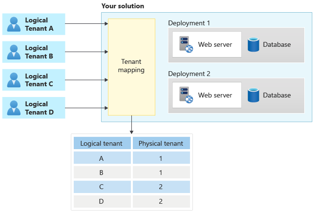

Whenever a request arrives into your application, you need to determine the *tenant context*, which is the tenant that is making the request. When you have tenant-specific infrastructure that might be hosted in different geographic regions, you need to match the incoming request to a tenant. Then, you must forward the request to the physical infrastructure that hosts that tenant's resources, as illustrated below:

Many multitenant applications also have user-based permissions. Tenant mapping is a separate activity. You need to know both the user who is making the request and the tenant they're working within.

This article provides guidance for technical decision-makers about the approaches you can consider to map requests to the appropriate tenant, and the tradeoffs involved in the approaches.

> [!NOTE]
> This page mostly discusses HTTP-based applications, like websites and APIs. However, many of the same underlying principles apply to multitenant applications that use other communication protocols.

## Approaches to identify tenants

There are multiple ways you can identify the tenant for an incoming request. Each approach requires inspecting some aspect of the incoming request.

### Domain names

If you use [tenant-specific domain or subdomain names](./domain-names.md), it's likely that requests can be easily mapped to tenants by using the `Host` header, the `X-Forwarded-Host` header, or another HTTP header that includes the original hostname for each request.

However, consider the following questions:

- How will users know which domain name to use to access the service?
- Do you have a central entry point, like a landing page or login page, that all the tenants use? If you do, how will users select the tenant that they're working with?
- What other information are you using to verify access to the tenant's resources, such as authorization tokens? Do the authorization tokens include the tenant-specific domain names?

### HTTP request properties

If you don't use tenant-specific domain names, you might still be able to use aspects of the HTTP request to identify the tenant that a particular request is for. For example, consider an HTTP request that identifies the tenant name as `tailwindtraders`. This might be communicated using one the following approaches:

- **The URL path structure**, such as `https://app.contoso.com/tailwindtraders/`.
- **A query string** in the URL, such as `https://contoso.com/app?tenant=tailwindtraders`.
- **A custom HTTP request header**, such as `Tenant-Id: tailwindtraders`.

> [!IMPORTANT]
> Custom HTTP request headers aren't useful where HTTP GET requests are issued from a web browser, or where the requests are handled by some types of web proxy. You should only use custom HTTP headers for GET operations when you're building an API, or if you control the client that issues the request and there's no web proxy included in the request processing chain that might modify or strip the headers.

When using this approach, you should consider the following questions:

- Will users know how to access the service? For example, if you use a query string to identify tenants, will a central landing page need to direct users to the correct tenant's page by adding the query string?
- Do you have a central entry point, like a landing page or login page, that all tenants use? If you do, how will users select the tenant that they need to access?
- Does your application provide APIs? For example, is your web application a single-page application (SPA) or a mobile application with an API backend? If it is, you might be able to use an [API gateway](../../../microservices/design/gateway.yml) or [reverse proxy](#reverse-proxies) to perform tenant mapping.

### Token claims

Many applications use claims-based authentication and authorization protocols, such as OAuth 2.0 or SAML. These protocols provide authorization tokens to the client. A token contains a set of *claims*, which are pieces of information about the client application or user. Claims can be used to communicate information like a user's email address. Your system can then include the user's email address, look up the user-to-tenant mapping, and then forward the request to the appropriate deployment. Or, you might even include the tenant mapping in your identity system, and add a tenant ID claim to the token.

If you are using claims to map requests to tenants, you should consider the following questions:

- Will you use a claim to identify a tenant? Which claim will you use?
- Can a user be a member of multiple tenants? If this is possible, then how will users select the tenant they'd like to work with for a specific request?
- Is there a central authentication and authorization system for all tenants? If not, how will you ensure that all token authorities issue consistent tokens and claims?

### API keys

Many applications expose APIs. These might be for internal use within your organization, or for external use by partners or customers. A common method of authentication for APIs is to use an *API key*. API keys are provided with each request. If you record the tenant ID that a key was issued for, you can then look up the tenant ID when the key used.

> [!NOTE]
> API keys don't provide a high level of security because they need to be manually created and managed, they're long-lived and frequently reused, and because they don't contain claims. A more modern and secure approach is to use a claims-based authorization mechanism with short-lived tokens, such as OAuth 2.0 or OpenID Connect.

API keys can be generated in several ways. Here are two common approaches:

- Generate a cryptographically random value and store it in a lookup table, alongside the tenant ID. When a request is received, your system finds the API key in the lookup table, and it then matches it to a tenant ID.
- Create a meaningful string with a tenant ID included inside it. Digitally sign the key by using an approach like [HMAC](https://en.wikipedia.org/wiki/HMAC). When you process each request, you verify the signature and then extract the tenant ID.

Consider the following questions:

- How will you generate and issue API keys?
- How will your API clients securely receive and store the API key?
- Do you need your API keys to expire after a period of time? How will you rotate your clients' API keys, without causing downtime?
- Do customer-generated API keys provide an adequate level of security for your APIs?

> [!NOTE]
> API keys are not the same as passwords. API keys must be generated by the system, and they must be unique across all the tenants, so that each API key can be uniquely mapped to a single tenant. API gateways, such as [Azure API Management](/azure/api-management/api-management-subscriptions), can generate and manage API keys, validate keys on incoming requests, and map keys to individual API subscribers.

### Client certificates

Client certificate authentication, sometimes called mutual TLS (mTLS), is commonly used for service-to-service communication, and for unattended devices or kiosks used by unauthenticated users. Client certificates provide a secure way to authenticate clients. Similarly to tokens and claims, client certificates provide *attributes* that can be used to determine the tenant. For example, the *subject* of the certificate might contain the email address of the user, which can be used to look up the tenant.

When planning to use client certificates for tenant mapping, consider the following factors:

- How will you safely issue and renew the client certificates that are trusted by your service? Client certificates can be complex to work with, since they require special infrastructure to manage and issue certificates. If handled improperly, these complexities can *reduce* your security instead of increasing it.
- Will client certificates be used only for initial login requests, or attached to all requests to your service?
- Will the process of issuing and managing certificates become unmanageable when you have a large number of clients?
- How will you implement the mapping between the client certificate and the tenant?

## Reverse proxies

A reverse proxy, also referred to as an application proxy, can be used to route HTTP requests. A reverse proxy accepts a request from an ingress endpoint, and it can forward the request to one of many backend endpoints. Reverse proxies are useful for multitenant applications since they can perform the mapping between some piece of request information, offloading the task from your application infrastructure.

Many reverse proxies can use the properties of a request to make a decision about tenant routing. They can inspect the destination domain name, URL path, query string, HTTP headers, and even claims within tokens or parts of the request body.

The following common reverse proxies are used in Azure:

- [Azure Front Door](/azure/frontdoor/front-door-overview) is a global load balancer and web application firewall. It uses the Microsoft global edge network to create fast, secure, and highly scalable web applications. You can use [rule sets](/azure/frontdoor/front-door-rules-engine) to extract tenant identifiers and put them into another part of the request.
- [Azure Application Gateway](/azure/application-gateway/overview) is a managed web traffic load balancer that you deploy into the same physical region as your backend service.
- [Azure API Management](/azure/api-management/api-management-key-concepts) is optimized for API traffic. Azure API Management provides a comprehensive [policy engine](/azure/api-management/api-management-howto-policies) that provides a great deal of flexibility for extracting tenant information from requests.
- Commercial and open-source technologies (that you host yourself) include nginx, Traefik, and HAProxy.

## Request validation

It is important that your application validates that any requests that it receives are authorized for the tenant. For example, if your application uses a custom domain name to map requests to the tenant, then your application must still check that each request received by the application is authorized for that tenant. Even though the request includes a domain name or other tenant identifier, it doesn't mean you should automatically grant access. When you use OAuth 2.0, you perform the validation by inspecting the *audience* and *scope* claims.

> [!NOTE]
> This is part of the *assume breach* security design principle in the [Microsoft Azure Well-Architected Framework](/azure/architecture/framework/security/security-principles).

When implementing request validation, consider the following factors:

- How will you authorize all the requests to your application? You need to authorize requests, regardless of the approach you use to map them to physical infrastructure.
- Use trusted, widely used and well maintained authentication and authorization frameworks and middleware, instead of implementing all of the validation logic yourself. For example, don't build token signature validation logic or client certificate cryptography libraries. Instead, use features of your application platform (or known trusted packages) that have been validated and tested.

## Performance

Tenant mapping logic likely runs on every request to your application. Consider how well the tenant mapping process will scale, as your solution grows. For example, if you query a database table as part of your tenant mapping, will the database support a large amount of load? If your tenant mapping requires decrypting a token, will the computation requirements become too high over time? If your traffic is fairly modest, then this isn't likely to affect your overall performance. When you have a high-scale application, though, the overhead involved in this mapping can become significant.

### Session cookies

One approach to reducing the performance overhead of tenant mapping logic is to use *session cookies*. Rather than perform the mapping on every request, consider computing the information only on the first request for each session. Your application then provides a session cookie to the client. The client passes the session cookie back to your service with all subsequent client requests within that session.

> [!NOTE]
> Many networking and application services in Azure can issue session cookies.

Consider the following questions:

- Can you use session cookies to reduce the overhead of mapping requests to tenants?
- What services do you use to route requests to the physical deployments for each tenant? Do these services support cookie-based sessions?

## Tenant migration

Tenants often need to be moved to new infrastructure as part of the [tenant lifecycle](tenant-life-cycle.md). When a tenant is moved to a new deployment, the HTTP endpoints they access might change. When this happens, consider that your tenant mapping process needs to change. You might need to consider the following factors:

- If your application uses domain names for mapping requests, then it might also require a DNS change at the time of the migration. The DNS change might take time to propagate to clients, depending on the time-to-live (TTL) of the DNS entries in your DNS service.
- If your migration changes the addresses of any endpoints during the migration process, then consider temporarily redirecting requests for the tenant to a maintenance page that automatically refreshes.

## Contributors

*This article is maintained by Microsoft. It was originally written by the following contributors.*

Principal author:

- [Daniel Scott-Raynsford](https://www.linkedin.com/in/dscottraynsford) | Partner Technology Strategist

Other contributors:

- [John Downs](https://www.linkedin.com/in/john-downs/) | Principal Software Engineer, Azure Patterns & Practices
- [Paolo Salvatori](https://www.linkedin.com/in/paolo-salvatori) | Principal Customer Engineer, FastTrack for Azure
- [Arsen Vladimirskiy](https://www.linkedin.com/in/arsenv) | Principal Customer Engineer, FastTrack for Azure

*To see non-public LinkedIn profiles, sign in to LinkedIn.*

## Next steps

Learn about [considerations when you work with domain names in a multitenant application](domain-names.md).
