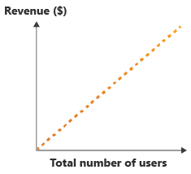
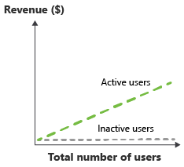
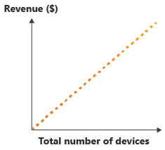
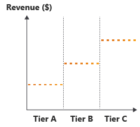
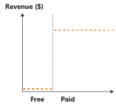
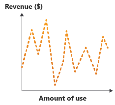
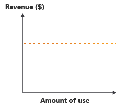
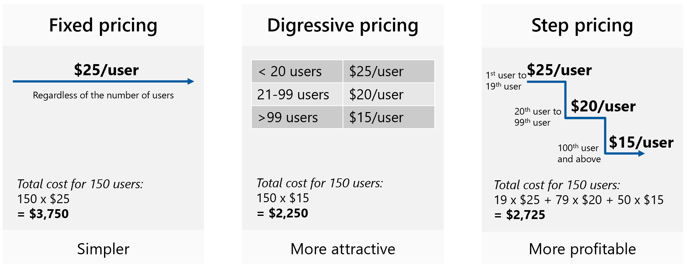

# Pricing models for a multitenant solution

A good pricing model ensures that you remain profitable as the number of tenants grows and as you add new features. An important consideration when developing a commercial multitenant solution is how to design pricing models for your product. In this article, we provide guidance for technical decision-makers about the pricing models you can consider and the tradeoffs involved.

## Understand profitability

When you determine the pricing model for your product, you need to balance the *return on value (ROV)* for your customers with the *cost of goods sold (COGS)* to deliver the service. Offering more flexible commercial models might increase the ROV for customers, but it might also increase the architectural and commercial complexity of the solution, and therefore also increase your COGS.

When you're developing pricing models for your solution, consider the following questions:

- **Will the COGS be higher than the profit you earn from the solution?** An [unprofitable pricing model](#unprofitable-pricing-models) approach might work for a time but it's unsustainable in the long term.
- **Can the COGS change over time, based on growth in users or changes in usage patterns?** Model your COGS and growth to understand whether your COGS makes your solution unprofitable as you grow.
- **How difficult is it to [measure and record the information required to operate the pricing model](measure-consumption.md)?** For example, if you plan to bill your customers based on the number of API calls they make, it's important to identify how you measure the API calls made by each customer.
- **Does your pricing model discourage use of your product?** Avoid situations where your pricing model reduces the potential value a customer can achieve from the product, such as by making common activities very costly. This structure creates mismatched incentives and can lead to mixed signaling to customers.
- **If a customer overuses the solution, does that mean you're no longer profitable?** If you're concerned about misuse, put guard rails in place like rate limits.

There are some key factors that influence your profitability:

- **Azure service pricing models.** The pricing models of the Azure or third-party services that make up your solution might affect which models are profitable.
- **Service usage patterns.** Users might only need to access your solution during their working hours or might only have a small percentage of high-volume users. Can you reduce your COGS by reducing the unused capacity when your usage is low?
- **Storage growth.** Most solutions accumulate data over time. More data means a higher cost to store and protect it, reducing your profitability per tenant. Can you set storage quotas or enforce a data retention period?
- **Tenant isolation.** The [tenancy model](tenancy-models.md) you use affects the level of isolation you have between your tenants. If you share your resources, do you need to consider how tenants might over-utilize or abuse the service? How will the level of tenant isolation affect your COGS and performance for everyone?

   Some pricing models aren't profitable without additional controls around resource allocation. For example, you might need to implement service throttling to make a flat-rate pricing model sustainable.
- **Tenant lifecycle.** For example, solutions with high customer churn rates, or services that require a greater on-boarding effort might suffer lower profitability, especially if they're priced using a consumption-based model.
- **Service level requirements.** Tenants that require higher levels of service might mean your solution isn't profitable anymore. It's critical that you're clear about your customers' service level expectations and any obligations you have, so that you can plan your pricing models accordingly. Consider using different pricing tiers for customers with different service level requirements.

## Common pricing models

There are many common pricing models that are often used with multitenant solutions. Each of these pricing models has associated commercial benefits and risks, and requires additional architectural considerations. It's important to understand the differences between these pricing models, so that you can ensure your solution remains profitable as it evolves.

> [!NOTE]
> You can offer multiple models for a solution or combine models together. For example, you could provide a per-user model for your customers that have fairly stable user numbers, and you can also offer a consumption model for customers who have fluctuating usage patterns.

When selecting a pricing model, consider what makes sense from your customers' perspective. If your pricing model is too complex or abstract, they might struggle to estimate their costs. Aim to tie your pricing to your tenants' business constructs.

### Consumption-based pricing

A consumption model is sometimes referred to as *pay-as-you-go*, or *PAYG*. As the use of your service increases, your revenue increases:

When you measure consumption, you can consider simple factors, such as the amount of data being added to the solution. Alternatively, you might consider a combination of usage attributes together. Consumption models offer many benefits, but they can be difficult to implement in a multitenant solution.

**Benefits:** From your customers' perspective, there's minimal upfront investment that's required to use your solution, so that this model has a low barrier to entry. From your perspective as the service operator, your hosting and management costs increase as your customers' usage and your revenue increases. This increase can make it a highly scalable pricing model. Consumption pricing models work especially well when the Azure services that are used in the solution are consumption-based too.

**Complexity and operational cost:** Consumption models rely on accurate measurements of usage and on splitting this usage by tenant. This can be challenging, especially in a solution with many distributed components. You need to keep detailed consumption records for billing and auditing as well as providing methods for customers to get access to their consumption data.

**Risks:** Consumption pricing can motivate your customers to reduce their usage of your system, in order to reduce their costs. Additionally, consumption models result in unpredictable revenue streams. You can mitigate this by offering *capacity reservations*, where customers pay for some level of consumption upfront. You, as the service provider, can use this revenue to invest in improvements in the solution, to reduce the operational cost or to increase the return on value by adding features.

> [!NOTE]
> Implementing and supporting capacity reservations might increase the complexity of the billing processes within your application. You might also need to consider how customers get refunds or exchange their capacity reservations, and these processes can also add commercial and operational challenges.

### Per-user pricing

A per-user pricing model involves charging your customers based on the number of people using your service:

Per-user pricing models are very common, due to their simplicity to implement in a multitenant solution. However, they're associated with several commercial risks.

**Benefits:** When you bill your customers for each user, it's easy to calculate and forecast your revenue stream. Additionally, assuming that you have fairly consistent usage patterns for each user, then revenue increases at the same rate as service adoption, which makes this model scalable as you grow.

**Complexity and operational cost:** Per-user models tend to be easy to implement. However, in some situations, you need to measure per-user consumption, which can help you to ensure that the COGS for a single user remains profitable. By measuring the consumption and associating it with a particular user, you can increase the operational complexity of your solution.

**Risks:** Different user consumption patterns might result in a reduced profitability. For example, heavy users of the solution might cost more to serve than light users. Additionally, the actual return on value (ROV) for the solution isn't reflected by the actual number of user licenses purchased. If your solution includes capabilities that aren't directly related to users, like sending emails to large numbers of recipients, your revenue might not increase as your COGS increase.

### Per-active user pricing

This model is similar to [per-user pricing](#per-user-pricing), but rather than requiring an upfront commitment from the customer on the number of expected users, the customer is only charged for users that actually sign into and use the solution over a period:

You can measure this in whatever period makes sense. Monthly periods are common, and then this metric is often recorded as *monthly active users* or *MAU*.

**Benefits:** From your customers' perspective, this model requires a low investment and risk, because there's minimal waste; unused licenses aren't billable. This makes it particularly attractive when marketing the solution or growing the solution for larger enterprise customers. From your perspective as the service owner, your ROV is more accurately reflected to the customer by the number of monthly active users.

**Complexity and operational cost:** Per-active user models require you to record actual usage, and to make it available to a customer as part of the invoice. Measuring per-user consumption helps to ensure profitability is maintained with the COGS for a single user, but again it requires additional work to measure the consumption for each user.

**Risks:** Like per-user pricing, there's a risk that the different consumption patterns of individual users might affect your profitability. Compared to per-user pricing, per-active user models have a less predictable revenue stream. Additionally, [discount pricing](#discount-pricing) doesn't provide a useful way of stimulating growth.

### Per-unit pricing

In many systems, the number of users isn't the element that has the greatest effect on the overall COGS. For example, in device-oriented solutions, also referred to as the *internet of things* or *IoT*, the number of devices often has the greatest impact on COGS. In these systems, a per-unit pricing model can be used, where you define what a *unit* is, such as a device. See the following diagram.

Also, some solutions have highly variable usage patterns, where a few users disproportionately affect the COGS. For example, in a solution sold to brick-and-mortar retailers, a per-store pricing model might be appropriate regardless of how many users are in each store.

**Benefits:** In systems where individual users don't have a significant effect on COGS, per-unit pricing is a better way to represent the reality of how the system scales and the resulting impact to COGS. It also can improve the alignment to the actual patterns of usage for a customer. For many IoT solutions, where each device generates a predictable and constant amount of consumption, this can be an effective model to scale your solution's growth.

**Complexity and operational cost:** Generally, per-unit pricing is easy to implement and has a fairly low operational cost. However, the operational cost can become higher if you need to differentiate and track usage by individual units, such as devices or retail stores. Measuring per-unit consumption helps you ensure your profitability is maintained, since you can determine the COGS for a single unit.

**Risks:** The risks of a per-unit pricing model are similar to per-user pricing. Different consumption patterns by some units might mean that you have reduced profitability, such as if some devices or stores are much heavier users of the solution than others.

### Feature- and service-level based pricing

You might choose to offer your solution with different tiers of functionality at different price points. For example, you might provide three monthly flat-rate or per-unit prices, two providing basic offerings with a subset of features available, and the third presenting the comprehensive set of your solution's features:

This model might also offer different service-level agreements for different tiers. For example, your basic tier might offer 99.9% uptime, whereas a premium tier might offer 99.99%. The higher service-level agreement (SLA) could be implemented by using services and features that enable higher [availability targets](/azure/architecture/framework/resiliency/business-metrics#workload-availability-targets).

Although this model can be commercially beneficial, it does require mature engineering practices to do well. With careful consideration, this model can be very effective.

**Benefits:** Feature-based pricing is often attractive to customers, since they can select a tier based on the feature set or service level they need. It also provides you with a clear path to upsell your customers with additional features or higher resiliency for those who require it.

**Complexity and operational cost:** Feature-based pricing models can be complex to implement, since they require your solution to be aware of the features that are available at each price tier. Feature toggles can be an effective way to provide access to certain subsets of functionality, but this requires ongoing maintenance. Also, feature toggles increase the overhead to ensure high quality, because there are more code paths to test. Enabling higher service availability targets in some tiers might require additional architectural complexity, to ensure the right set of infrastructure is used for each tier, and this process might increase the operational cost of the solution.

**Risks:** Feature-based pricing models can become complicated and confusing, if there are too many tiers or options. Additionally, the overhead involved in dynamically toggling features can slow down the rate at which you deliver additional features.

### Freemium pricing

You might choose to offer a free tier of your service, with basic functionality and no service-level guarantees. You then might offer a separate paid tier, with additional features and a formal service-level agreement (as shown in the following diagram).

The free tier might also be offered as a time-limited trial, and during the trial your customers might have full or limited functionality available. This is referred to as a freemium model, which is effectively an extension of the [feature-based pricing model](#feature--and-service-level-based-pricing).

**Benefits:** It's very easy to market a solution when it's free.

**Complexity and operational cost:** All of the complexity and operational cost concerns apply from the feature-based pricing model. You also have to consider the operational cost involved in managing free tenants. You might need to ensure that stale tenants are offboarded or removed, and you must have a clear retention policy, especially for free tenants. When you move a tenant to a paid tier, you might need to migrate the tenant's data or workload between Azure services to obtain higher SLAs. It's also important to retain the tenant's data and configuration when you move to a paid tier.

**Risks:** You need to ensure that you provide a high enough ROV for tenants to consider switching to a paid tier. Additionally, the cost of providing your solution to customers on the free tier needs to be covered by the profit margin from those who are on paid tiers.

### Cost of goods sold pricing

You might choose to price your solution so that each tenant only pays the cost of operating their share of the components that make up your solution, with no added profit margin. This model - also called *passthrough pricing* or *chargeback* - is sometimes used for multitenant solutions that aren't intended to be a profit center.

The cost of goods sold model is a good fit for internally facing multitenant solutions. Each organizational unit corresponds to a tenant, and the costs of your Azure resources need to be spread between them. It might also be appropriate where revenue is derived from sales of other products and services that consume or augment the multitenant solution.

**Benefits:** Because this model doesn't include any added margin for profit, the cost to tenants is lower.

**Complexity and operational cost:** Similar to the consumption model, cost of goods sold pricing relies on [accurate measurements of usage](measure-consumption.md) and on splitting this usage by tenant. Tracking consumption can be challenging, especially in a solution with many distributed components. You need to keep detailed consumption records for billing and auditing as well as providing methods for customers to get access to their consumption data.

For internally facing multitenant solutions, tenants might accept approximate cost estimates and have more relaxed billing audit requirements. These relaxed requirements reduce the complexity and cost of operating your solution.

**Risks:** Cost of goods sold pricing can motivate your tenants to reduce their usage of your system, in order to reduce their costs. However, because this model is used for applications that aren't profit centers, this might not be a concern.

### Flat-rate pricing

In this model, you charge a flat rate to a tenant for access to your solution, for a given period of time. The same pricing applies regardless of how much they use the service, the number of users, the number of devices they connect, or any other metric.

This is the simplest model to implement and for customers to understand, and it's often requested by enterprise customers. However, it can easily become unprofitable if you need to continue to add new features or if tenant consumption increases without any additional revenue.

**Benefits:** Flat-rate pricing is easy to sell, and it's easy for your customers to understand and budget for.

**Complexity and operational cost:** Flat-rate pricing models can be easy to implement because billing customers doesn't require any metering or tracking consumption. However, while not essential, it's advisable to measure per-tenant consumption to ensure that you're measuring COGS accurately and to ensure that your profitability is maintained.

**Risks:** If you have tenants who make heavy use of your solution, then it's easy for this pricing model to become unprofitable.

## Discount pricing

Once you've defined your pricing model, you might choose to implement commercial strategies to incentivize growth through discount pricing. *Discount pricing* can be used with consumption, per-user, and per-unit pricing models.

> [!NOTE]
> Discount pricing doesn't typically require architectural considerations, beyond adding support for a more complex billing structure. A complete discussion into the commercial benefits of discounting is beyond the scope of this article.

Common discount pricing patterns include:

- **Fixed pricing.** You have the same cost for each user, unit, or amount of consumption, no matter how much is purchased or consumed. This is the simplest approach. However, customers who make heavy use of your solution might feel like they should benefit from economies of scale by getting a discount.
- **Digressive pricing.** As customers purchase or consume more units, you reduce the cost per unit. This is more commercially attractive to customers.
- **Step pricing.** As customers purchase more, you reduce the cost per unit. However, you do so in step changes, based on predefined ranges of quantity. For example, you might charge a higher price for the first 100 users, then a lower price for the 101st to 200th user, then a lower price again after that. This approach can be more profitable than digressive pricing.

The following diagram illustrates these pricing patterns.

## Non-production environment discounts

In many cases, customers require access to a non-production environment that they can use for testing, training, or for creating their own internal documentation. Non-production environments usually have lower consumption requirements and costs to operate. For example, non-production environments often aren't subject to service-level agreements (SLAs), and [rate limits](#rate-limits) might be set at lower values. You might also consider more aggressive [autoscaling](/azure/architecture/framework/cost/optimize-autoscale) on Azure services that support non-production workloads.

Equally, customers often expect non-production environments to be significantly cheaper than their production environments. There are several alternatives that might be appropriate, when you provide non-production environments:

- Offer a [freemium tier](#freemium-pricing), like you might already do for paid customers. This should be carefully monitored, as some organizations might create many testing and training environments, which will consume additional resources to operate.
  > [!NOTE]
  > Time-limited trials using freemium tiers aren't usually suitable for testing and training environments. Customers usually need their non-production environments to be available for the lifetime of the production service.
- Offer a testing or training tier of your service, with [lower usage limits](#usage-limits). You can choose to restrict the availability of this tier to customers who have an existing paid tenant.
- Offer a discounted [per-user](#per-user-pricing), [per-active user](#per-active-user-pricing), or [per-unit](#per-unit-pricing) pricing for non-production tenants, with a lower or no service level agreement.
- For tenants using [flat-rate pricing](#flat-rate-pricing), non-production environments might be negotiated as part of the agreement.

> [!NOTE]
> Feature-based pricing isn't usually a good option for non-production environments, unless the features offered are the same as what the production environment offers. This is because tenants will usually want to test and provide training on all the same features that are available to them in production.

## Unprofitable pricing models

An unprofitable pricing model costs you more to deliver the service than the revenue you earn. For example, you might charge a flat rate per tenant without any limits for your service, but then you would build your service with consumption-based Azure resources and without per-tenant [usage limits](#usage-limits). In this situation, you might be at risk of your tenants overusing your service and, thus, making it unprofitable to serve them.

Generally, you want to avoid unprofitable pricing models. However, there are situations where you might choose to adopt an unprofitable pricing model, including:

- A free service is being offered to enable growth.
- Additional revenue streams are provided by services or add-on features.
- Hosting a specific tenant provides another commercial value, such as using them as an anchor tenant in a new market.

In the case that you inadvertently create an unprofitable pricing model, there are some ways to mitigate the risks associated with them, including:

- Limit the use of the service through [usage limits](#usage-limits).
- Require the use of capacity reservations.
- Request the tenant move to a higher feature or service tier. Consider making new capabilities exclusively available on a profitable service tier to encourage tenants to move.

### Risky pricing models

When implementing a pricing model for a solution, you usually have to make assumptions about how it is used. If these assumptions turn out to be incorrect or the usage patterns change over time, then your pricing model might become unprofitable. Pricing models that are at risk of becoming unprofitable are known as *risky pricing* models. For example, if you adopt a pricing model that expects users to self-limit the amount that they use your solution, then you might have implemented a risky pricing model.

Most SaaS solutions will add new features regularly. This increases the ROV to users, which might also lead to increases in the amount the solution is used. This could result in a solution that becomes unprofitable, if the use of new features drives usage, but the pricing model doesn't factor this in.

For example, if you introduce a new video upload feature to your solution, which uses a consumption-based resource, and user uptake of the feature is higher than expected, then consider whether you can mitigate the pricing risk by using a combination of [usage limits](#usage-limits) and [feature and service level pricing](#feature--and-service-level-based-pricing).

## Usage limits

*Usage limits* enable you to restrict the usage of your service in order to prevent your pricing models from becoming unprofitable, or to prevent a single tenant from consuming a disproportionate amount of the capacity of your service. This can be especially important in multitenant services, where a single tenant can affect the experience of other tenants by over-consuming resources.

> [!NOTE]
> It's important to make your customers aware that you apply usage limits. If you implement usage limits without making your customers aware of the limit, then it will result in customer dissatisfaction. This means that it's important to identify and plan usage limits ahead of time. The goal should be to plan for the limit, and to then communicate the limits to customers before they become necessary.

Usage limits are often used in combination with [feature and service-level pricing](#feature--and-service-level-based-pricing), to provide a higher amount of usage at higher tiers. Limits are also commonly used to protect core components that will cause system bottlenecks or performance issues, if they're over-consumed.

### Rate limits

A common way to apply a usage limit is to add rate limits to APIs or to specific application functions. This is also referred to as [throttling](../../../patterns/throttling.yml). Rate limits prevent continuous overuse. They're often used to limit the number of calls to an API, over a defined time period. For example, an API can only be called 20 times per minute, and it will return an HTTP 429 error, if it's called more frequently than this.

The following scenarios often include rate limits:

- REST APIs.
- Asynchronous tasks.
- Tasks that aren't time sensitive.
- Actions that incur a high cost to execute.
- Report generation.

Implementing rate limiting can increase the solution complexity, but services like Azure API Management can make this simpler by applying [rate limit policies](/azure/api-management/api-management-access-restriction-policies).

## Pricing model lifecycle

Like any other part of your solution, pricing models have a lifecycle. As your application evolves over time, you might need to change your pricing models. This might be driven by changing customer needs, commercial requirements, or changes to functionality within your application. Consider the following common pricing lifecycle changes:

- Adding a completely new pricing model. For example, adding a [consumption pricing model](#consumption-based-pricing) to a solution that currently offers a [flat rate model](#flat-rate-pricing).
- Retiring an existing pricing model.
- Adding a tier to an existing pricing model.
- Retiring a tier in an existing pricing model.
- Changing usage limits on a feature in a pricing model.
- Adding or removing features from a [feature and service-level pricing model](#feature--and-service-level-based-pricing).
- Changing from a business-to-consumer (B2C) commercial model to a business-to-business (B2B) commercial model. This change then necessitates new pricing structures for your business customers.

It is usually complex to implement and manage many different pricing models at once. It's also confusing to your customers. So, it's better to implement only one or two models, with a few tiers. This makes your solution more accessible and easier to manage.

> [!NOTE]
> Pricing models and billing functions should be tested, ideally using automated testing, just like any other part of your system. The more complex the pricing models, the more testing is required, and so the cost of development and operational complexity will increase.

When changing pricing models, consider the following factors:

- **Contractual implications.** If tenants have signed contracts based on a specific pricing model, ensure you don't accidentally violate those agreements.
- **Desirability.** Clearly communicate the ROV for new pricing models to your existing tenants. Ensure you make the new model attractive enough so that tenants want to migrate to the new model. Decide how to discourage tenants from using older pricing models that you plan to retire.
- **Timeline.** Give tenants plenty of notice for any changes, to allow them to prepare.
- **Migration process.** Make it easy for tenants to migrate to the new model.
- **Reduce pricing risks.** Evaluate each new pricing model to understand whether it's [risky](#risky-pricing-models). For example, be cautious when removing rate limits that are currently protecting critical resources from overuse. Throughout the change, monitor the performance and utilization of your services so that you can ensure continued satisfaction and profitability.
- **Reduce bill shock risks.** Changes in pricing model can result in *bill shock*, which is a negative reaction to an unexpected bill. Communicate pricing model changes clearly and proactively. Calculate or simulate each tenant's bill before and after the change so you can detect situations where a tenant will pay significantly more after the change.

## Contributors

*This article is maintained by Microsoft. It was originally written by the following contributors.*

Principal author:

- [Daniel Scott-Raynsford](https://www.linkedin.com/in/dscottraynsford/) | Partner Technology Strategist

Other contributors:

- [Bohdan Cherchyk](https://www.linkedin.com/in/cherchyk/) | Senior Customer Engineer, FastTrack for Azure
- [John Downs](https://www.linkedin.com/in/john-downs/) | Principal Software Engineer, Azure Patterns & Practices
- [Chad Kittel](https://www.linkedin.com/in/chadkittel/) | Principal Software Engineer, Azure Patterns & Practices
- [Paolo Salvatori](https://www.linkedin.com/in/paolo-salvatori/) | Principal Customer Engineer, FastTrack for Azure
- [Arsen Vladimirskiy](https://www.linkedin.com/in/arsenv/) | Principal Customer Engineer, FastTrack for Azure

*To see non-public LinkedIn profiles, sign in to LinkedIn.*

## Next step

Learn about how to [design a control plane](./control-planes.md) for a multitenant solution.
