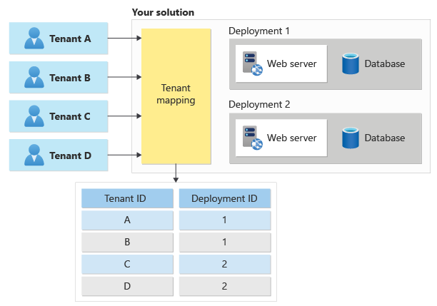
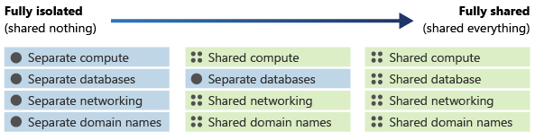
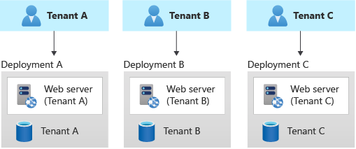
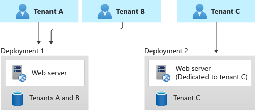
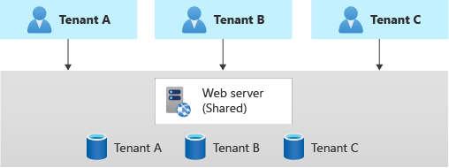

There are many ways to consider how to work with tenants in your solution. Your choice of approach depends importantly on whether and how you share resources among your tenants. Intuitively, you might want to avoid sharing *any* resources, but that approach quickly becomes expensive as your business scales and you onboard more tenants.

When you consider the various models of multitenancy, it's helpful to first take into account how you define tenants for your organization, what your business drivers are, and how you plan to scale your solution. This article provides guidance to help technical decision makers evaluate the tenancy models and their tradeoffs.

## Define a tenant

First, you need to define a *tenant* for your organization. Consider who your customer is. In other words, who are you providing your services to? There are two common models:

- **Business to business (B2B)**. If your customers are other organizations, you're likely to map your tenants to those customers. However, consider whether your customers have divisions (teams or departments) and whether they have a presence in multiple countries/regions. You might need to map a single customer to multiple tenants if there are different requirements for these subgroups. Similarly, a customer might want to maintain two instances of your service so they can keep their development and production environments separated from each other. Generally, a single tenant has multiple users. For example, all of your customer's employees will be users within a single tenant.
- **Business to consumer (B2C)**. If your customers are consumers, it's often more complicated to relate customers, tenants, and users. In some scenarios, each consumer might be a separate tenant. However, consider whether your solution might be used by families, groups of friends, clubs, associations, or other groups that might need to access and manage their data together. For example, a music streaming service might support both individual users and families, and it might treat each of these account types differently when it separates them into tenants.

Your definition of _tenant_ will affect some of the things that you need to consider or emphasize when you architect your solution. For example, consider these types of tenants:

- If your tenants are individual people or families, you might need to be particularly concerned about how you handle personal data, and the about data sovereignty laws within each jurisdiction that you serve.
- If your tenants are businesses, you might need to be mindful of your customers' requirements for regulatory compliance, the isolation of their data, and ensuring that you meet a specified service-level objective (SLO), like uptime or service availability.

## How do you decide which model to use?

Selecting a tenancy model isn't just a technical decision. It's also a commercial decision. You need to consider questions like these:

- What are your business objectives?
- Will your customers accept all forms of multitenancy? How does each multitenancy model affect your compliance requirements, or your customer's compliance requirements?
- Will a single-tenant solution scale to your future growth aspirations?
- How large is your operations team, and how much of your infrastructure management can you automate?
- Do your customers expect you to meet service-level agreements (SLAs), or do you have SLOs that you're aiming for?

If you expect your business to scale to a large number of customers, it's important to deploy shared infrastructure. Otherwise, you'll have to maintain a large and growing fleet of instances. Deploying individual Azure resources for each customer is likely to be unsustainable, unless you provision and use a dedicated subscription for each tenant. When you share the same Azure subscription across multiple tenants, [Azure resource quotas and limits](/azure/azure-resource-manager/management/azure-subscription-service-limits) might start to apply, and the operational costs to deploy and reconfigure these resources increase with each new customer.

Conversely, if you expect that your business will have only a few customers, you might want to consider using single-tenant resources that are dedicated to each customer. Also, if your customers' isolation requirements are high, a single-tenant infrastructure might be appropriate.

## Tenants and deployments

Next, you need to determine what *tenant* means for your particular solution, and whether you should distinguish between logical tenants and deployments.

For example, consider a music streaming service. Initially, you might build a solution that can easily handle thousands (or even tens of thousands) of users. As you continue to grow, however, you might find that you need to duplicate your solution or some of its components in order to scale to new customer demand. This means that you need to determine how to assign specific customers to specific instances of your solution. You might assign customers randomly, or geographically, or by filling up a single instance and then starting another. However, you probably need to maintain a record of your customers and which infrastructure their data and applications are available on so that you can route their traffic to the correct infrastructure. In this example, you might represent each customer as a separate tenant, and then map the users to the deployment that contains their data. You have a one-to-many mapping between tenants and deployments, and you can move tenants among deployments at your own discretion.

In contrast, consider a company that creates cloud software for legal firms. Your customers might insist on having their own dedicated infrastructure to maintain their compliance standards. Therefore, you need to be prepared to deploy and manage many different instances of your solution from the start. In this example, a deployment always contains a single tenant, and a tenant is mapped to its own dedicated deployment.

A key difference between tenants and deployments is how isolation is enforced. When multiple tenants share a single deployment (a set of infrastructure), you typically rely on your application code and a tenant identifier that's in a database to keep each tenant's data separate. When you have tenants with their own dedicated deployments, they have their own infrastructure, so it might be less important for your code to be aware that it's operating in a multitenant environment.

Deployments are sometimes referred to as _supertenants_ or _stamps_.

When you receive a request for a specific tenant, you need to map it to the deployment that holds that tenant's data, as shown here:

## Tenant isolation

One of the biggest considerations in the design of a multitenant architecture is the level of isolation that each tenant needs. Isolation can mean different things:

- Having a single shared infrastructure, with separate instances of your application and separate databases for each tenant.
- Sharing some common resources, but keeping other resources separate for each tenant.
- Keeping data on a separate physical infrastructure. In the cloud, this configuration might require separate Azure resources for each tenant. It could even mean deploying a separate physical infrastructure by using [dedicated hosts](/azure/virtual-machines/dedicated-hosts).

Rather than thinking of isolation as a discrete property, you should think about it as being on a continuum. You can deploy components of your architecture that are more or less isolated than other components in the same architecture, depending on your requirements. The following diagram demonstrates a continuum of isolation:

The level of isolation affects many aspects of your architecture, including the following:

- **Security.** If you share infrastructure among multiple tenants, you need to be especially careful not to access data from one tenant when you return responses to another. You need a strong foundation for your identity strategy, and you need to consider both tenant and user identity in your authorization process.
- **Cost.** Shared infrastructure can be used by multiple tenants, so it's less expensive.
- **Performance.** If you share infrastructure, your system's performance might suffer as more customers use it, because the resources might be consumed faster.
- **Reliability.** If you use a single set of shared infrastructure, a problem with one tenant's components can result in an outage for everyone.
- **Responsiveness to individual tenant needs.** When you deploy infrastructure that's dedicated to one tenant, you might be able to adapt the configuration for the resources to that specific tenant's requirements. You might even consider this capability in your pricing model, allowing customers to pay more for isolated deployments.

Your solution architecture can influence your available options for isolation. For example, consider a three-tier solution architecture:

- Your user interface tier might be a shared multitenant web app, with all your tenants accessing a single host name.
- Your middle tier could be a shared application layer, with shared message queues.
- Your data tier could be isolated databases, tables, or blob containers.

You can consider using different levels of isolation on each tier. You should base your decision about what's shared and what's isolated on many considerations, including cost, complexity, your customers' requirements, and the number of resources that you can deploy before reaching Azure quotas and limits.

## Common tenancy models

After you establish your requirements, evaluate them against some common tenancy models and corresponding deployment patterns.

### Automated single-tenant deployments

In an automated single-tenant deployment model, you deploy a dedicated set of infrastructure for each tenant, as shown in this example:

Your application is responsible for initiating and coordinating the deployment of each tenant's resources. Typically, solutions that use this model use infrastructure as code (IaC) or the Azure Resource Manager APIs extensively. You might use this approach when you need to provision entirely separate infrastructures for each of your customers. Consider the [Deployment Stamps pattern](../../../patterns/deployment-stamp.yml) when you plan your deployment.

**Benefits:** A key benefit of this approach is that data for each tenant is isolated, which reduces the risk of accidental leakage. This safeguard can be important to some customers that have high regulatory compliance overhead. Additionally, tenants are unlikely to affect each other's system performance, an issue that's sometimes called the _noisy neighbor_ problem. Updates and changes can be rolled out progressively across tenants, which reduces the likelihood of a system-wide outage.

**Risks:** If you use this approach, cost efficiency is low, because you don't share infrastructure among your tenants. If a single tenant requires a certain infrastructure cost, 100 tenants probably require 100 times that cost. Additionally, ongoing maintenance (like applying new configuration or software updates) will probably be time-consuming. Consider automating your operational processes, and consider applying changes progressively through your environments. You should also consider other cross-deployment operations, like reporting and analytics across your whole estate. Likewise, be sure to plan for how you can query and manipulate data across multiple deployments.

### Fully multitenant deployments

At the opposite extreme, you can consider a fully multitenant deployment, where all components are shared. You have only one set of infrastructure to deploy and maintain, and all tenants use it, as shown in the following diagram:

**Benefits:** This model is attractive because operating a solution that has shared components is less expensive. Even if you need to deploy higher tiers or SKUs of resources, the overall deployment cost is often still lower than the cost of a set of single-tenant resources. Additionally, if a user or tenant needs to move their data to another tenant, you might be able to update tenant identifiers and keys, and you might not have to migrate data between two separate deployments.

**Risks:**

- Be sure to separate data for each tenant, and don't leak data among tenants. You might need to manage sharding data. Additionally, you might need to be concerned about the effects that individual tenants can have on the overall system. For example, if a large tenant tries to perform a heavy query or operation, it might affect other tenants.

- Determine how to [track and associate your Azure costs to tenants](measure-consumption.md), if doing so is important to you.

- Maintenance can be simpler with a single deployment, because you only have to update one set of resources. However, it's also often riskier, because changes might affect your entire customer base.

- You might also need to consider scale. You're more likely to reach [Azure resource scale limits](/azure/azure-resource-manager/management/azure-subscription-service-limits) when you have a shared set of infrastructure. For example, if you use a storage account as part of your solution, as your scale increases, the number of requests to that storage account might reach the limit of what the storage account can handle. To avoid reaching a resource quota limit, you can consider deploying multiple instances of your resources (for example, multiple AKS clusters or storage accounts). You can even consider distributing your tenants across resources that you deploy into multiple Azure subscriptions.

- There's probably a limit to how far you can scale a single deployment, and the costs of doing so might increase non-linearly. For example, if you have a single shared database, when you run at very high scale you might exhaust its throughput and need to pay increasingly more for increased throughput to keep up with your demand.

### Vertically partitioned deployments

You don't have to choose one of the extremes of these scales. Instead, you can consider vertically partitioning your tenants by taking this approach:

- Use a combination of single-tenant and multitenant deployments. For example, you might have most of your customers' data and application tiers on multitenant infrastructures, but deploy single-tenant infrastructures for customers who require higher performance or data isolation.
- Deploy multiple instances of your solution geographically, and map each tenant to a specific deployment. This approach is particularly effective when you have tenants in different geographies.

Here's an example that illustrates a shared deployment for some tenants and a single-tenant deployment for another:

**Benefits:** Because you're still sharing infrastructure, you can gain some of the cost benefits of using shared multitenant deployments. You can deploy cheaper shared resources for certain customers, like customers who are evaluating your service with a trial. You can even bill customers a higher rate to use a single-tenant deployment, thereby recouping some of your costs.

**Risks:** Your codebase will probably need to be designed to support both multitenant and single-tenant deployments. If you plan to allow migration between infrastructures, you need to consider how to migrate customers from a multitenant deployment to their own single-tenant deployment. You also need to know which of your tenants are on each deployment, so that you can communicate information about system issues or upgrades to the relevant customers.

### Horizontally partitioned deployments

You can also consider horizontally partitioning your deployments. In a horizontal deployment, you have some shared components but maintain other components with single-tenant deployments. For example, you could build a single application tier and then deploy individual databases for each tenant, as shown in this diagram:

**Benefits:** Horizontally partitioned deployments can help you mitigate a noisy neighbor problem, if you identify that most of the load on your system is caused by specific components that you can deploy separately for each tenant. For example, your databases might absorb most of your system's load, because the query load is high. If a single tenant sends a large number of requests to your solution, the performance of a database might be negatively affected, but other tenants' databases (and shared components, like the application tier) remain unaffected.

**Risks:** With a horizontally partitioned deployment, you still need to consider the automated deployment and management of your components, especially the components used by a single tenant.

## Test your isolation model

Whichever isolation model you choose, be sure to test your solution to verify that one tenant's data isn't accidentally leaked to another and that any [noisy neighbor](../../../antipatterns/noisy-neighbor/noisy-neighbor.yml) effects are acceptable. Consider using [Azure Chaos Studio](/azure/chaos-studio/chaos-studio-overview) to deliberately introduce faults that simulate real-world outages and verify the resiliency of your solution even when components are malfunctioning.

## Contributors

*This article is maintained by Microsoft. It was originally written by the following contributors.*

Principal author:

 * [John Downs](http://linkedin.com/in/john-downs) | Principal Customer Engineer, FastTrack for Azure

Other contributors:

 * [Chad Kittel](https://www.linkedin.com/in/chadkittel) | Principal Software Engineer
 * [Paolo Salvatori](http://linkedin.com/in/paolo-salvatori) | Principal Customer Engineer, FastTrack for Azure
 * [Arsen Vladimirskiy](http://linkedin.com/in/arsenv) | Principal Customer Engineer, FastTrack for Azure

*To see non-public LinkedIn profiles, sign in to LinkedIn.*

## Next steps

Consider the [lifecycle of your tenants](tenant-lifecycle.md)
