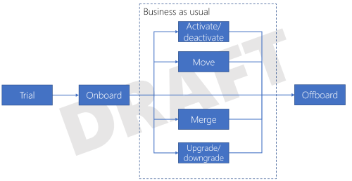

# Tenant lifecycle considerations in a multitenant solution

When you're considering a multitenant architecture, it's important to consider all of the different stages in a tenant's lifecycle. This can be more complex and nuanced than it appears at first. The following diagram illustrates some of the key stages for a typical multitenant solution:

## Trials

For SaaS solutions, consider that many customers request or require trials before they commit to purchase. Trials bring along some unique considerations include:

- Should trial data be subject to the same data security, performance, and service level requirements as the data for full customers?
- Should you use the same infrastructure for trial tenants as for full customers, or should you have dedicated infrastructure for trials?
- If a customer purchases your service after a trial, how will they migrate the data from their trial into their ultimate application deployment?
- Are there limits around who can request a trial? How can you prevent abuse of your solution?
- What limits do you want or need to place on trial customers, such as time limits, feature restrictions, or limitations around performance?

## Onboard new tenants

When onboarding a new tenant, consider the following:

- Will onboarding be a self-service, automated, or manual process?
- Does the customer have any specific requirements for data residency (e.g. are there data sovereignty regulations in effect)?
- Does the customer have to meet any compliance standards (e.g. PCI DSS, HIPAA)?
- Does the customer have any specific disaster recovery requirements, such as a recovery time objective (RTO) or a recovery point objective (RPO)? Are these different from the guarantees you provide to other customers?
- What information do you require to be able to fully onboard the customer?
- Does the platform provides different pricing options and billing models?

Once a tenant has been onboarded, they move into a 'business as usual' mode. However, there are still several important lifecycle events that can occur even when they are in this mode.

## Update tenants' infrastructure

You will need to consider how you apply updates to your tenants' infrastructure. Different tenants may have updates applied at different times. See [Updates] for other considerations about updating tenants.

## Activation and deactivation

There are situations where a customer's account might need to be deactivated or reactivated. For example:

- The customer has requested deactivation. In a consumer system, a customer might opt to unsubscribe.
- The customer can't be billed, and you need to deactivate their subscription.

Deactivation is separate to offboarding in that it's intended to be a temporary state. However, after a period of time, you might choose to offboard a deactivated tenant.

## Move tenants between infrastructure

You might need to move tenants between infrastructure for a number of reasons, including:

- You are vertically partitioning customers and choose to rebalance your tenants across your deployments.
- A customer has upgraded their SKU or pricing tier, and they need to be moved to a single-tenant, dedicated deployment with higher isolation from other tenants.
- A customer requested their data to be moved to a dedicated data store.
- The customer requires their data be moved to a new geographic region. This might occur during company acquisitions, or when laws or geopolitical situations change.

Consider how you will move your tenants' data as well as redirect requests to the new set of infrastructure that hosts their instance. You should also consider whether moving a tenant will result in downtime, and make sure tenants are fully aware of this.

## Merge and split tenants

It's tempting to think of tenants or customers as static, unchanging entities. However, in reality, this often isn't true. For example:

- In consumer scenarios, individual users may join or leave families.
- In business scenarios, companies may be acquired or merge, including by companies located in different geographic regions.
- Similarly, in business scenarios, companies may split or divest.

Consider whether you need to provide capabilities to manage the merging and separation of data, user identities, and resources.

## Offboard tenants

It's also inevitable that tenants will occasionally need be removed from your solution. In a multitenant solution this brings along some important considerations, including:

- How long should you maintain the customer data? Are there legal requirements to destroy data after a certain period of time?
- Should you provide the ability for customers to be re-onboarded?
- If you run shared infrastructure, do you need to rebalance the allocation of tenants to infrastructure?

## Next steps

Consider the [pricing models](pricing-models.md) you will use for your solution.
