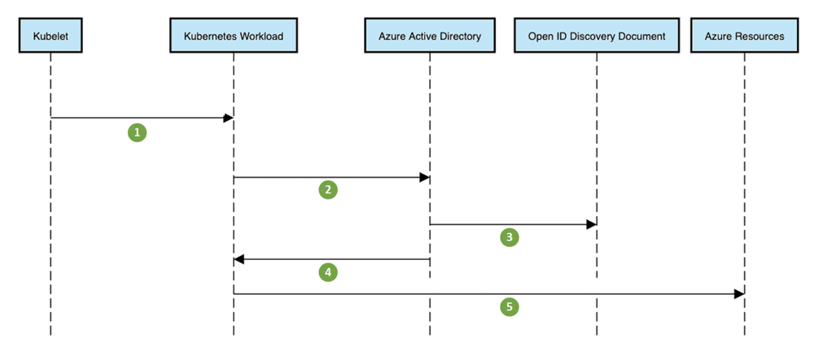

[Azure Kubernetes Service](/azure/aks/intro-kubernetes) (AKS) simplifies deploying a managed Kubernetes cluster in Azure by offloading the operational overhead to the Azure cloud platform. As a hosted Kubernetes service, Azure handles critical tasks, like health monitoring and maintenance. The Azure platform manages the AKS control plane, and you only pay for the AKS nodes that run your applications. In this article, we describe some of the features of AKS that are useful when building multitenant systems.

## Features of Azure Kubernetes Service (AKS) that support multitenancy

AKS clusters can be shared across multiple tenants in different scenarios and ways. In some cases, diverse applications can run in the same cluster, while in other cases, multiple instances of the same application can run in the same shared cluster, one for each tenant. All these types of sharing are frequently described using the umbrella term multitenancy. Kubernetes does not have a first-class concept of end-users or tenants. Still, it provides several features to help you manage different tenancy requirements.

## Multitenancy types

The first step to determining how to share an AKS cluster across multiple tenants is understanding your scenario to evaluate the patterns and tools at your disposal. In general, multitenancy in Kubernetes clusters falls into two main categories, though many variations are still possible.

### Multiple teams

A common form of multitenancy is to share a cluster between multiple teams within an organization, each of whom can deploy, monitor, and operate one or more solutions. These workloads frequently need to communicate with each other and with other internal or external applications located on the same cluster or other hosting platforms.
In addition, these workloads need to communicate with services such as a relational database, a NoSQL repository, or a messaging system hosted in the same cluster or running as PaaS services on Azure.
In this scenario, members of the teams often have direct access to Kubernetes resources via tools such as [kubectl](https://kubernetes.io/docs/reference/kubectl/), or indirect access through GitOps controllers, such as [Flux](https://fluxcd.io/) and [Argo CD](https://argo-cd.readthedocs.io/en/stable/), or other types of release automation tools. There is often some level of trust between members of different teams, but Kubernetes policies such as RBAC, [resource quotas](https://kubernetes.io/docs/concepts/policy/resource-quotas/), and [network policies](https://kubernetes.io/docs/concepts/services-networking/network-policies/) are essential to safely and fairly share clusters.

### Multiple customers

Another common form of multitenancy frequently involves a Software-as-a-Service (SaaS) vendor or a service provider running multiple instances of a workload for their customers. In this scenario, the customers do not have direct access to the AKS cluster but only to their application. More, they don't even know that their application runs on Kubernetes. Cost optimization is frequently a critical concern, and service providers use Kubernetes policies such as [resource quotas](https://kubernetes.io/docs/concepts/policy/resource-quotas/) and [network policies](https://kubernetes.io/docs/concepts/services-networking/network-policies/) to ensure that the workloads are strongly isolated from each other.

## Azure Kubernetes Architecture

A [Kubernetes](/azure/aks/intro-kubernetes) cluster consists of a [control plane](https://kubernetes.io/docs/concepts/overview/components/#control-plane-components) that runs Kubernetes system services and a [data plane](https://kubernetes.io/docs/concepts/overview/components/#node-components) consisting of worker nodes where tenant workloads are executed as pods.

When you create an AKS cluster, a control plane is automatically created and configured. This control plane is provided at no cost as a managed Azure resource abstracted from the user. You only pay for the nodes attached to the AKS cluster. The control plane and its resources reside only on the region where you created the cluster. Likewise, an [Azure Kubernetes Service](/azure/aks/intro-kubernetes) cluster is composed of two components:

- [Control plane](/azure/aks/concepts-clusters-workloads#control-plane): provides the core Kubernetes services and orchestration of application workloads.
- [Agent nodes](/azure/aks/concepts-clusters-workloads#nodes-and-node-pools): agent nodes are Linux or Windows Azure virtual machines that run tenant workloads and Kubernetes node components such as [kubelet](https://kubernetes.io/docs/concepts/overview/components/#kubelet), [kube-proxy](https://kubernetes.io/docs/concepts/overview/components/#kube-proxy), and [container runtime](https://kubernetes.io/docs/concepts/overview/components/#container-runtime).

### Control plane

The control plane layer is automatically provisioned and configured whenever you deploy an AKS cluster. If you opt for the free tier, this is provided at no cost. Alternatively, you can create an AKS cluster with the Uptime SLA that enables a financially backed, higher SLA for the control plane. [Uptime SLA](/azure/aks/uptime-sla) is a paid feature and is enabled per cluster. Uptime SLA pricing is determined by the number of discrete clusters, and not by the size of the individual clusters. Clusters with Uptime SLA, also regarded as paid tier in AKS REST APIs, come with greater amount of control plane resources and automatically scale to meet the load of your cluster. Uptime SLA guarantees 99.95% availability of the Kubernetes. 

AKS provides a single-tenant control plane, with a dedicated API server that is shared by all the workloads running on the AKS cluster. For architectural best practices, see [Azure Well-Architected Framework review - Azure Kubernetes Service (AKS)](/azure/architecture/framework/services/compute/azure-kubernetes-service/azure-kubernetes-service).

### Nodes and node pools

To run your applications and supporting services, you need one or more Kubernetes *agent nodes*. An AKS cluster is composed of at least one node, an Azure virtual machine (VM) that runs the following [Kubernetes node components](https://kubernetes.io/docs/concepts/overview/components/#node-components).

The Azure VM size for agent nodes defines the storage CPUs, memory, size, and type available (such as high-performance SSD or regular HDD). Plan the node size around whether tenant applications may require large amounts of CPU and memory or high-performance storage. You can manually or automatically scale out the number of nodes in your AKS cluster to meet current demand.

In AKS, the VM image for your cluster's nodes is based on Ubuntu Linux or Windows Server. When you create an AKS cluster or scale out the number of nodes, the Azure platform automatically creates and configures the requested number of VMs. Agent nodes are billed as standard VMs, so any VM size discounts (including [Azure reservations](/azure/cost-management-billing/reservations/save-compute-costs-reservations)) are automatically applied.

In Azure Kubernetes Service (AKS), nodes of the same configuration are grouped into [node pools](/azure/aks/use-multiple-node-pools). In an AKS cluster, you can create multiple node pools with different VM sizes for various purposes, tenants, and workloads and use [taints](https://kubernetes.io/docs/concepts/scheduling-eviction/taint-and-toleration/), [tolerations](https://kubernetes.io/docs/concepts/scheduling-eviction/taint-and-toleration/), [node labels](https://kubernetes.io/docs/concepts/scheduling-eviction/assign-pod-node/), [node selectors](https://kubernetes.io/docs/concepts/scheduling-eviction/assign-pod-node/), and [node affinity](https://kubernetes.io/docs/concepts/scheduling-eviction/assign-pod-node/) to place applications on a specific node pool to avoid the [noisy neighbor issue](/azure/architecture/antipatterns/noisy-neighbor/noisy-neighbor). Using different VM sizes for different node pools allows you to optimize costs. For more information, see [Create and manage multiple node pools for a cluster in Azure Kubernetes Service (AKS)](/azure/aks/use-multiple-node-pools).

In a shared AKS cluster, you can dedicate a set of nodes or a node pool to running pods from a particular tenant. For more information, see [Node isolation](#node-isolation) and [Tenancy models](#tenancy-models).

## Isolation models

A multitenant Kubernetes cluster is shared by multiple users and workloads that are commonly referred to as "tenants." This definition includes Kubernetes clusters that different teams or divisions share within an organization. It also contains clusters that are shared by per-customer instances of a software-as-a-service (SaaS) application. Cluster multitenancy is an alternative to managing many single-tenant dedicated clusters. The operators of a multitenant Kubernetes cluster must isolate tenants from each other. This isolation minimizes the damage that a compromised or malicious tenant can do to the cluster and to other tenants. When several users or teams share the same cluster with a fixed number of nodes, there is a concern that one team could use more than its fair share of resources. [Resource Quotas](https://kubernetes.io/docs/concepts/policy/resource-quotas) is a tool for administrators to address this concern.

Based on the security level provided by isolation, we can distinguish between soft and hard multitenancy. 

- Soft multitenancy is suitable within a single enterprise where tenants are different teams or departments that trust each other. In this scenario, isolation aims to guarantee workloads integrity, orchestrate cluster resources across different internal user groups, and defend against possible security attacks.
- Hard multi tenancy is used to describe scenarios where heterogeneous tenants do not trust each other, often from security and resource-sharing perspectives.

When you plan to build a multitenant [Azure Kubernetes Service](/azure/aks/intro-kubernetes) (AKS) cluster, you should consider the layers of resource isolation and multitenancy provided by [Kubernetes](https://kubernetes.io/docs/concepts/security/multi-tenancy/): cluster, namespace, node, pod, and container. In addition, you should consider the security implications of sharing different resources among multiple tenants. For example, scheduling pods from different tenants on the same node could reduce the number of machines needed in the cluster. On the other hand, you might need to prevent specific workloads from being colocated. For example, you might not allow untrusted code from outside your organization to run on the same node as containers that process sensitive information.

Although Kubernetes cannot guarantee perfectly secure isolation between tenants, it does offer features that may be sufficient for specific use cases. As a best practice, you should separate each tenant and its Kubernetes resources into their namespaces. You can then use [Kubernetes role-based access control](https://kubernetes.io/docs/reference/access-authn-authz/rbac) (RBAC) and [Network Policies](https://kubernetes.io/docs/concepts/services-networking/network-policies/) to enforce tenant isolation. For example, the following picture shows the typical SaaS Provider Model that hosts multiple instances of the same application on the same cluster, one for each tenant. Each application lives in a separate namespace.

There are several ways to design and build multitenant solutions with [Azure Kubernetes Service](/azure/aks/intro-kubernetes) (AKS). Each of these methods comes with its own set of tradeoffs in terms of infrastructure deployment, network topology, and security that impact the isolation level, implementation effort, operational complexity, and cost. You can apply tenant isolation in the control and data planes based on your requirements.

## Control plane isolation

Isolation at the control plane level guarantees that different tenants cannot access or affect each others' resources, such as pods and services, and cannot impact the performance of other tenants' applications.

### Namespaces

In Kubernetes, a [namespace](https://kubernetes.io/docs/reference/glossary/?fundamental=true#term-namespace) is an abstraction used to support isolation of groups of resources within a single cluster. This isolation has two key dimensions:

1. Object names within a namespace can overlap with names in other namespaces, similar to files in folders. This feature allows tenants to name their resources without worrying about any name collisions with other tenants sharing the same cluster. This happens for example when multiple instances of the same application, one for each tenant, are deployed on the same cluster.
2. Many Kubernetes security policies are scoped to namespaces. For example, [RBAC Roles](https://kubernetes.io/docs/reference/access-authn-authz/rbac/) and [Network Policies](https://kubernetes.io/docs/concepts/services-networking/network-policies/) are namespace-scoped resources. Using RBAC, Users and Service Accounts can be restricted to a namespace.

In a multi-tenant environment, a namespace helps segment a tenant's workload into a logical and distinct management unit. A common practice is to isolate every workload in its namespace, even if the same tenant operates multiple workloads. This approach ensures the following advantages:

- Each workload only has access to its own resources, such as Config Maps and Secrets, and allows you to tailor dedicated security policies for each workload.
- Better isolation at the security level, as each workload can use a separate identity to access resources in the same cluster or downstream PaaS services.
- Flexibility to switch between dedicated and shared clusters in the future or to use multi-cluster tooling such as service meshes.

When hosting multiple workloads in a single namespace for the same tenant, it could be problematic to create and handle distinct policies for each application. In this scenario, you can use Kubernetes [Hierarchical Namespace Controller (HNC)](https://github.com/kubernetes-sigs/hierarchical-namespaces) to organize tenant workloads namespaces into hierarchies and share specific policies and resources between them. It also helps you manage namespace labels, namespace lifecycles, and delegated management, and share resource quotas across related namespaces. These capabilities can be helpful in both [multi-team](#multiple-teams) and [multi-customer](#multiple-customers) scenarios.

Other projects that provide similar capabilities and aid in managing namespaced resources are listed below:

- Multi-team tenancy

  - [Capsule](https://github.com/clastix/capsule)
  - [Kiosk](https://github.com/loft-sh/kiosk)

- Multi-customer tenancy

  - [Kubeplus](https://github.com/cloud-ark/kubeplus)

### Access controls

Another type of isolation at the control plane level is Kubernetes role-based access control. Suppose teams or their workloads could access or modify each other's API resources. In that case, they could change, tamper, or even delete resources of other tenants. They could also read sensitive data such as credentials and connection strings to access data from downstream data repositories. Hence, it is critical to guarantee that each tenant has the appropriate access only to the resources in their namespaces. This approach is known as [Principle of Least Privilege](https://en.wikipedia.org/wiki/Principle_of_least_privilege). It consists in granting user principals, managed identities, and service accounts precisely the permissions they need to do their job and no more.

Role-based access control (RBAC) is commonly used to enforce authorization in the Kubernetes control plane, for both users and workloads (service accounts). [Roles](https://kubernetes.io/docs/reference/access-authn-authz/rbac/#role-and-clusterrole) and [role bindings](https://kubernetes.io/docs/reference/access-authn-authz/rbac/#rolebinding-and-clusterrolebinding) are Kubernetes objects that are used at a namespace level to enforce access control in your application. [Cluster roles](https://kubernetes.io/docs/reference/access-authn-authz/rbac/#role-and-clusterrole) and [cluster role bindings](https://kubernetes.io/docs/reference/access-authn-authz/rbac/#rolebinding-and-clusterrolebinding) can be used to authorize access to cluster-level objects, though these are less useful for multi-tenant clusters.

When you enable [AKS-managed Azure Active Directory integration](/azure/aks/managed-aad) you can use Azure AD users, groups, or service principals as subjects in [Kubernetes RBAC](https://kubernetes.io/docs/reference/access-authn-authz/rbac/). In addition, you can use Azure RBAC, built-in roles, or custom roles to authorize Azure AD users and identities to access Kubernetes API resources at the namespace and cluster level. For more information, see [Use Azure RBAC for Kubernetes Authorization](/azure/aks/manage-azure-rbac).

In a multi-team environment, you can use RBAC to restrict tenants' access to the appropriate namespaces and ensure that cluster-wide resources can only be accessed or modified by privileged users such as cluster administrators. 

If you end up granting users or service accounts more permissions than necessary, you can solve this issue by refactoring and splitting namespaces into finer-grained namespaces.

### Quotas

Kubernetes workloads consume node resources, like CPU and memory. In a multitenant environment, you can use [Resource Quotas](/docs/concepts/policy/resource-quotas/) to manage resource usage of tenant workloads and avoid the [noisy neighbor issue](/azure/architecture/antipatterns/noisy-neighbor/noisy-neighbor). For the multiple teams use case, where tenants have access to the Kubernetes API, you can use resource quotas
to limit the number of API resources (for example, the number of Pods or the number of ConfigMaps) that a tenant can create. Limits on object count ensure fairness and aim to avoid [noisy neighbor issues](/azure/architecture/antipatterns/noisy-neighbor/noisy-neighbor) from affecting other tenants that share a control plane.

Resource quotas are namespaced objects. By mapping tenants to distinct namespaces, cluster administrators can use resource quotas to ensure that a tenant cannot monopolize a cluster's resources, such as agent nodes' CPU, memory, and network bandwidth, or overwhelm its control plane. In addition, while Kubernetes resource quotas only apply within a single namespace, some namespace management tools allow groups of namespaces to share the same quotas, giving administrators far more flexibility with less effort than built-in quotas.

Quotas prevent a single tenant from consuming more than their allocated share of resources, minimizing the [noisy neighbor issue](/azure/architecture/antipatterns/noisy-neighbor/noisy-neighbor), where one tenant negatively impacts the performance of other tenants' workloads.

When you apply a resource quota to a namespace, Kubernetes requires you to specify resource requests and limits for each container. Limits represent the upper bound for the number of resources a container can consume. Containers that attempt to consume resources that exceed the configured limits will either be throttled or killed based on the resource type. When resource requests are set lower than limits, each container is guaranteed the requested amount, but there may still be some potential for impact across workloads.

Resource quotas cannot protect against all kinds of resource sharing, such as network traffic. Node isolation may be a better solution for this problem.

## Data plane isolation

Data plane isolation ensures that pods and workloads for different tenants are sufficiently isolated from one another.

### Network isolation

When you run modern, microservices-based applications in Kubernetes, you often want to control which components can communicate with each other. You should apply the [Principle of Least Privilege](https://en.wikipedia.org/wiki/Principle_of_least_privilege) to how traffic can flow between pods in an Azure Kubernetes Service (AKS) cluster. 

By default, all pods in a Kubernetes cluster are allowed to communicate with each other, and all network traffic is unencrypted. This approach can quickly lead to security vulnerabilities where traffic is accidentally or maliciously sent to an unintended destination or gets intercepted by a workload on a compromised agent node.

You can control service-to-service communications using [Network Policies](/docs/concepts/services-networking/network-policies/), which restrict communication between pods using namespace labels or IP address ranges. In a multitenant environment where strict network isolation between tenants is required,  we recommend starting with a default policy that denies communication between pods and creating another rule that allows all pods to query the DNS server for name resolution. With such a default policy in place, you can begin adding more permissive rules that allow for communication within a namespace. 

Network policies require a [CNI plugin](https://kubernetes.io/docs/concepts/extend-kubernetes/compute-storage-net/network-plugins/#cni) that supports the implementation of network policies. Azure Kubernetes Service (AKS) provides two ways to implement network policies. You can choose a network policy option when you create a new AKS cluster. You can't change a policy option after provisioning the cluster:
Azure has its implementation for network policies, called Azure Network Policies.
[Calico Network Policies](https://projectcalico.docs.tigera.io/security/calico-network-policy) is an open-source network and network security solution founded by [Tigera](https://www.tigera.io/).
Both implementations use Linux IPTables to enforce the specified policies. Network policies are translated into sets of allowed and disallowed IP pairs. These pairs are then programmed as IPTable filter rules. You can use Azure Network Policies only with AKS clusters configured the [Azure CNI](/azure/aks/configure-azure-cni) network plugin, while Calico Network Policies support both [Azure CNI](/azure/aks/configure-azure-cni) and [kubenet](/azure/aks/use-network-policies). For more information, see [/azure/aks/use-network-policies](/azure/aks/use-network-policies).

You can implement more advanced network isolation by using a service mesh like [Istio](https://istio.io/), [Linkerd](https://linkerd.io/), or [Open Service Mesh](https://openservicemesh.io/), which provides Layer 7 network policies based on workload identity. These higher-level policies can make it easier to manage namespace-based multi-tenancy, primarily when multiple namespaces are dedicated to a single tenant. They frequently also offer encryption using mutual TLS, protecting your data even in the presence of a compromised node, and work across dedicated or virtual clusters. However, they can be significantly more complex to manage and may not be appropriate for all users.

### Storage isolation

Azure provides a rich set of managed, platform-as-a-service (PaaS) data repositories such as [Azure SQL Database](/azure/azure-sql/database/sql-database-paas-overview) and [Azure Cosmos DB](/azure/cosmos-db/introduction) that you can use as [persistent volumes](/azure/aks/concepts-storage#volumes) for your workloads. In a multitenant scenario, different tenant applications running on AKS can [share a database or file store](/azure/architecture/guide/multitenant/approaches/storage-data#shared-multitenant-databases-and-file-stores), or they can use [a dedicated data repository and storage resource](/azure/architecture/guide/multitenant/approaches/storage-data#multitenant-app-with-dedicated-databases-for-each-tenant). For more information on different strategies and approaches to manage data in a multitenant scenario, see [Architectural approaches for storage and data in multitenant solutions](/azure/architecture/guide/multitenant/approaches/storage-data).

Workloads running on [Azure Kubernetes Service](/azure/aks/intro-kubernetes) (AKS) can also use persistent volumes to store data. On Azure, you can create [persistent volumes](/azure/aks/concepts-storage#volumes) as Kubernetes resources backed by Azure Storage. You can manually create data volumes and assign them to pods directly or have AKS automatically create them using [persistent volume claims](/azure/aks/concepts-storage#persistent-volume-claims). AKS provides built-in storage classes to create persistent volumes backed by [Azure Disks](/azure/virtual-machines/disks-types), [Azure Files](/azure/storage/files/storage-files-planning), [Azure NetApp Files](/azure/azure-netapp-files/azure-netapp-files-service-levels). For more information, see [Storage options for applications in Azure Kubernetes Service (AKS)](/azure/aks/concepts-storage). For security and resiliency reasons, you should avoid using local storage on agent nodes via [emptyDir](https://kubernetes.io/docs/concepts/storage/volumes/#emptydir) and [hostPath](https://kubernetes.io/docs/concepts/storage/volumes/#emptydir).

[Storage classes](https://kubernetes.io/docs/concepts/storage/storage-classes/) allow you to describe custom storage classes to meet different tenants needs in terms of service level agreement (SLA), backup policies, pricing tier. For more information on built-in AKS storage classes and custom classes, see [Storage classes](/azure/aks/concepts-storage#storage-classes).

Pods can request storage using a [persistent volume claim](https://kubernetes.io/docs/concepts/storage/persistent-volumes/). A persistent volume claim is a namespaced resource, which enables isolating portions of the storage system and dedicating it to tenants within the shared Kubernetes cluster. However, it is important to note that a PersistentVolume is a cluster-wide resource and has a lifecycle independent of workloads and namespaces.

For example, you can configure a separate storage class for each tenant and use this to strengthen isolation. If a storage class is shared, you should set a [reclaim policy of `Delete`](https://kubernetes.io/docs/concepts/storage/storage-classes/#reclaim-policy) to ensure that a persistent volume cannot be reused across different namespaces.

### Node Isolation

Node isolation is another technique that you can use to isolate tenant workloads from each other. With node isolation, a set of agent nodes is dedicated to running only the pods of a particular tenant. This configuration reduces the  [noisy neighbor issue](/azure/architecture/antipatterns/noisy-neighbor/noisy-neighbor), as all the pods running on a set of nodes will belong to a single tenant. The risk of information disclosure and data tampering is lower with node isolation because an attacker that manages to get control of a container will only have access to the containers and volumes mounted that belong to a single tenant. In AKS, you can create a dedicated node pool for those tenants that have strict requirements in terms of isolation, security, and performance. You can use [taints](https://kubernetes.io/docs/concepts/scheduling-eviction/taint-and-toleration/), [tolerations](https://kubernetes.io/docs/concepts/scheduling-eviction/taint-and-toleration/), [node labels](https://kubernetes.io/docs/concepts/scheduling-eviction/assign-pod-node/), [node selectors](https://kubernetes.io/docs/concepts/scheduling-eviction/assign-pod-node/), and [node affinity](https://kubernetes.io/docs/concepts/scheduling-eviction/assign-pod-node/) to constrain tenants pods to run only on a particular set of nodes or node pools.

Although workloads from different tenants are running on different nodes, it is important to be aware that the kubelet and (unless using virtual control planes) the Kubernetes API service are still shared services. A skilled attacker could use the permissions assigned to the kubelet or other pods running on the node to move laterally within the cluster and gain access to tenant workloads running on other nodes. If this is a major concern, consider segregating tenants into separate AKS clusters.

Node isolation allows you to  easily associate and charge back the cost of a set of nodes or node pool to a single tenant. Node isolation is strictly related ot the tenancy model adopted by your solution.

## Tenancy models

Azure Kubernetes Service (AKS) provides more types of node isolation and tenancy models.

### Automated single-tenant deployments

In an automated single-tenant deployment model, you deploy a dedicated set of resources for each tenant, as illustrated in this example:

Each tenant workload runs in a dedicated AKS cluster and accesses a distinct set of Azure resources. Typically, multitenant solutions built using this model make extensive use of [infrastructure as code](/devops/deliver/what-is-infrastructure-as-code) (IaC) such as [Bicep](/azure/azure-resource-manager/bicep/overview?tabs=bicep), [ARM](/azure/azure-resource-manager/management/overview), [Terraform](/azure/developer/terraform/overview) or the [Azure Resource Manager REST APIs](/rest/api/resources/) to initiate and coordinate the on-demand deployment of tenant-dedicated resources. You might use this approach when you need to provision an entirely separate infrastructure for each of your customers. Consider the [Deployment Stamps pattern](../../../patterns/deployment-stamp.yml) when planning your deployment.

**Benefits:**

- A key benefit of this approach is that the API Server of each tenant AKS cluster is separate. This approach guarantees full isolation across tenants from a security, networking, and resource consumption level. An attacker that manages to get control of a container will only have access to the containers and volumes mounted that belong to a single tenant. A full-isolation tenancy model is critical to some customers with a high regulatory compliance overhead.
- Tenants are unlikely to affect each other's system performance, which allows for avoiding [noisy neighbor problem](/azure/architecture/antipatterns/noisy-neighbor/noisy-neighbor). This consideration includes the traffic against the API Server. The API server is a shared, critical component in any Kubernetes cluster. Custom controllers that generate unregulated, high-volume traffic against the API server can cause cluster instability, leading to request failures, timeouts and API retry storms. The [Uptime SLA](/azure/aks/uptime-sla) feature allows to scale out the control plane of an AKS cluster to meet traffic demand. Still, provisioning a dedicated cluster may be a better solution for those customers with strong requirements in terms of workload isolation.
- Updates and changes can be rolled out progressively across tenants, which reduces the likelihood of a system-wide outage. Azure costs can be easily charged back to tenants as every resource is used by a single tenant.

**Risks:**

- Cost efficiency is low because every tenant uses a dedicated set of resources.
- Ongoing maintenance is likely to be time-consuming as it needs to be replicated across multiple AKS clusters, one for each tenant. Consider automating your operational processes and applying changes progressively through your environments. It would help if you also considered other cross-deployment operations, like reporting and analytics across your whole estate. Likewise, ensure you plan how to query and manipulate data across multiple deployments.

### Fully multitenant deployments

In a fully multitenant deployment, a single application serves the requests of all the tenants, and all Azure resources are shared, including the AKS cluster. In this context, you only have one set of infrastructure to deploy, monitor, and maintain, and all tenants use it, as illustrated in the following diagram:

**Benefits**:

- This model is attractive because of the lower cost of operating a solution with shared components. When using this tenancy model, you may need to deploy a larger AKS cluster and adopt a higher SKU for any shared data repository to sustain the traffic generated by all tenants' resources, such as data repositories.

**Risks**:

- In this context, a single application handles all tenants' requests. You should design and implement security measures to prevent tenants from flooding the application with calls, which could slow down the entire system and impact all tenants.
- If the traffic profile is highly variable, you should configure the AKS cluster autoscaler to vary the number of pods and agent nodes based on the system resource usage, such as CPU and Memory. Alternatively, you could scale out and scale in the number of pods and cluster nodes based on custom metrics such as the number of pending requests or the metrics of an external messaging system using [Kubernetes Event-driven Autoscaling](https://keda.sh/) (KEDA).
- Ensure to separate data for each tenant and implement safeguards to avoid data leakage between different tenants. 
- Make sure to [track and associate Azure costs](/azure/architecture/guide/multitenant/considerations/measure-consumption) to individual tenants based on their actual usage. Third-party solutions such as [kubecost](https://www.kubecost.com/) can help you to calculate and break down costs across different teams and tenants.
- Maintenance can be more straightforward with a single deployment since you only have to update one set of Azure resources and maintain a single application. However, it's also often riskier since any changes to the infrastructure or application components may affect the entire customer base.
- Scale can be a factor to consider as well. You are more likely to hit Azure resource scale limits when you have a shared set of resources. To avoid hitting a resource quota limit, you might consider distributing your tenants across multiple Azure subscriptions.

### Horizontally partitioned deployments

Alternatively, you can consider horizontally partitioning your multitenant Kubernetes application. This approach consists in sharing some solution components across all the tenants and deploying dedicated resources for individual tenants. For example, you could build a single multitenant Kubernetes application and then create individual databases, one for each tenant, as shown in this illustration:

**Benefits:**

- Horizontally partitioned deployments can help you mitigate the [noisy neighbor issue](/azure/architecture/antipatterns/noisy-neighbor/noisy-neighbor), if you've identified that most of the traffic load on your Kubernetes application is due to specific components that you can deploy separately for each tenant. For example, your databases might absorb most of your system's load, because the query load is high. If a single tenant sends a large number of requests to your solution, the performance of a database might be negatively affected, but other tenants' databases (and shared components, like the application tier) remain unaffected.

**Risks:**

- With a horizontally partitioned deployment, you still need to consider the automated deployment and management of your components, especially the components used by a single tenant.
- This model may not provide the required level of isolation for those customers that cannot afford to share resources with other tenants for internal policies or compliance reasons.

### Vertically partitioned deployments

You can get the advantage of the benefits of the single-tenant and fully multitenant models using a hybrid model by vertically partitioning tenants across multiple AKS clusters or node pools. This approach provides the following advantages over the previous two tenancy models:

- You can use a combination of single-tenant and multitenant deployments. For example, you may have most of your customers share an AKS cluster and database on a multitenant infrastructure. Still, you may also deploy single-tenant infrastructures for those customers who require higher performance and isolation.
- You can deploy tenants to multiple regional AKS clusters, potentially with different configurations. This technique is particularly effective when you have tenants spread across different geographies.

You can implement different variations of this tenancy model. Fro example, you may choose to offer your multitenant solution with different tiers of functionality at a different cost. Your pricing model could provide multiple SKUs each providing an incremental level of performance and isolation in terms of resource sharing, performance, network and data segregation:

- Basic tier: tenant requests are served by a single, multitenant Kubernetes application shared with other tenants. Data are stored to one more relational or NoSQL databases shared by all Basic-tier tenants.
- Standard tier: tenants requests are served by a dedicated Kubernetes application running in separate namespace which provides isolation boundaries in terms of security, networking, resource consumption. All tenants applications, one for each tenant, share the same AKS cluster and node pool with other standard-tier customers.
- Premium tier: tenant application runs in a dedicated node pool or AKS cluster to guarantee a higher service level agreement, performance, and isolation degree. This tier could provide a flexible cost model based on the number and SKU of the agent nodes used to host the tenant application.

The following diagram shows a scenario where tenant 1 and 2 run on a shared AKS cluster, whereas tenant 3 runs on a separate AKS cluster.

Likewise, the following diagram shows scenario where tenant 1 and 2 run on the same node pool, whereas tenant 3 runs on a dedicated node pool.

This model may also offer different service-level agreements for different tiers. For example, the basic tier may offer 99.9% uptime, the standard tier may offer 99.95% uptime, whereas the premium tier may offer 99.99%. The higher service-level agreement (SLA) could be implemented by using services and features that enable higher availability targets.

**Benefits:**

- Since you are still sharing infrastructure, you can still gain some of the cost benefits of having shared multitenant deployments. You can deploy clusters and node pools shared across multiple basic-tier and standard-tier tenant applications using a cheaper VM size for agent nodes. This approach guarantees better density and cost savings. For premium-tier customers, you can deploy AKS clusters and node pools with a higher VM size and a maximum number of pod replicas and nodes at a higher price.
- You can run system services like [CoreDNS](https://kubernetes.io/docs/tasks/administer-cluster/coredns/), [Konnectivity](https://kubernetes.io/docs/tasks/extend-kubernetes/setup-konnectivity/), or [Application Gateway Ingress Controller](/azure/application-gateway/ingress-controller-overview) in a dedicated system-mode node pool and use [taints](https://kubernetes.io/docs/concepts/scheduling-eviction/taint-and-toleration/), [tolerations](https://kubernetes.io/docs/concepts/scheduling-eviction/taint-and-toleration/), [node labels](https://kubernetes.io/docs/concepts/scheduling-eviction/assign-pod-node/), [node selectors](https://kubernetes.io/docs/concepts/scheduling-eviction/assign-pod-node/), and [node affinity](https://kubernetes.io/docs/concepts/scheduling-eviction/assign-pod-node/) to run tenant application on one or more user-mode node pools.
- You can use [taints](https://kubernetes.io/docs/concepts/scheduling-eviction/taint-and-toleration/), [tolerations](https://kubernetes.io/docs/concepts/scheduling-eviction/taint-and-toleration/), [node labels](https://kubernetes.io/docs/concepts/scheduling-eviction/assign-pod-node/), [node selectors](https://kubernetes.io/docs/concepts/scheduling-eviction/assign-pod-node/), and [node affinity](https://kubernetes.io/docs/concepts/scheduling-eviction/assign-pod-node/) to run shared resources like an ingress controller or messaging system on a dedicated node pool with a specific VM size, autoscaler settings, and availability zones support.

**Risks:**

- You need to design your Kubernetes application to support both multitenant and single-tenant deployments.
- If you plan to allow migration between infrastructures, you need to consider how you migrate customers from a multitenant deployment to their own single-tenant deployment.
- You need a consistent strategy and a single pane of glass to monitor and manage more AKS clusters.

## Autoscaling

To keep up with the traffic demand generated by tenant applications, you can enable the [cluster autoscaler](/azure/aks/cluster-autoscaler)  to scale the agent nodes of your Azure Kubernetes Service (AKS). Autoscaling helps systems remain responsive in the following circumstances:

- The traffic load increase during specific work hours or periods of the year.
- Tenant or shared heavy loads are deployed to a cluster.
- Agent nodes become unavailable due to zonal outages.

When you enable autoscaling for a node pool, you specify a minimum and a maximum number of nodes based on the expected workload sizes. By configuring a maximum number of nodes, you can ensure enough space for all tenant pods in the cluster, regardless of the namespace they run in.

When the traffic augments, cluster autoscaling increases the number of agent nodes to avoid pods going into a pending state due to a shortage of resources in terms of CPU and memory.
Likewise, when the load diminishes, cluster autoscaling decreases the number of agent nodes in a node pool based on the specified boundaries, helping to reduce operational costs.

You can use pod autoscaling to scale pods based on resource demands automatically. [Horizontal Pod Autoscaler (HPA)](https://kubernetes.io/docs/tasks/run-application/horizontal-pod-autoscale/) automatically scales the number of pod replicas based on CPU/memory utilization or custom metrics. With [Kubernetes Event-driven Autoscaling (KEDA)] you can drive the scaling of any container in Kubernetes based on the number of events of external systems, such as [Azure Event Hubs](https://keda.sh/docs/2.7/scalers/azure-event-hub/) or [Azure Service Bus](https://keda.sh/docs/2.7/scalers/azure-service-bus/), used by tenant applications.

## Maintenance

To reduce the risk of downtimes that may affect tenant applications during cluster or node pool upgrades, schedule [Planned Maintenance](/azure/aks/planned-maintenance) to occur during off-peak hours. Planned Maintenance allows you to schedule weekly maintenance windows to update the control plane of the AKS clusters running tenant applications and node pools, minimizing workload impact. You can schedule one or more weekly windows on your cluster by specifying a day or time range on a specific day. All maintenance operations will occur during the scheduled windows.

## Security

### Cluster access

When you share an AKS cluster between multiple teams within an organization, you need to implement the [principle of least privilege](https://en.wikipedia.org/wiki/Principle_of_least_privilege) to isolate different tenants from one another. In particular, you need to make sure that users have access only to their Kubernetes namespaces and resources when using tools such as [kubectl](https://kubernetes.io/docs/reference/kubectl/), [Helm](https://helm.sh/), [Flux](https://fluxcd.io/), [Argo CD](https://argo-cd.readthedocs.io/en/stable/), or other types of tools.

If your AKS cluster [integrates with Azure Active Directory (Azure AD)](/azure/aks/managed-aad), you should use [Kubernetes role bindings](https://kubernetes.io/docs/reference/access-authn-authz/rbac/#rolebinding-and-clusterrolebinding) to grant permissions to Azure AD users to perform actions within the cluster. When enabled, this integration allows customers to use Azure AD users, groups, or service principals as subjects in Kubernetes RBAC. For more information, see [Control access to cluster resources using Kubernetes role-based access control and Azure Active Directory identities in Azure Kubernetes Service](/azure/aks/azure-ad-rbac). This feature frees you from having to manage user identities and credentials for Kubernetes separately. However, you still have to set up and manage Azure RBAC and Kubernetes RBAC separately. For more details on authentication and authorization with RBAC on AKS, see [Access and identity options for Azure Kubernetes Service (AKS)](/azure/aks/concepts-identity).

You can configure an AKS cluster to leverage Azure RBAC for Kubernetes Authorization. The ability to manage RBAC for Kubernetes resources from Azure gives you a choice to manage RBAC for the cluster resources using Azure or native Kubernetes RBAC. With the Azure RBAC integration, AKS will use a Kubernetes Authorization webhook server to authorize calls to the Kubernetes API server. When enabled, Azure AD principals will be validated exclusively by Azure RBAC, while regular Kubernetes users and service accounts are validated solely by Kubernetes RBAC, as shown in the following picture.

You can use Azure AD-integrated security and Azure RBAC to grant permissions to team users only on a subset of namespaces and resources just using Azure built-in or custom role definitions and role assignments. For more information, see [Azure RBAC for Kubernetes Authorization](/azure/aks/concepts-identity#azure-rbac-for-kubernetes-authorization).

### Workload Identity

When hosting multiple tenant applications on a single AKS cluster, each in a separate namespace, each workload should use a different [Kubernetes service account](https://kubernetes.io/docs/tasks/configure-pod-container/configure-service-account/) and credentials to access downstream Azure services. *Service accounts* are one of the primary user types in Kubernetes. The Kubernetes API holds and manages service accounts. Service account credentials are stored as Kubernetes secrets, allowing them to be used by authorized pods to communicate with the API Server. Most API requests provide an authentication token for a service account or a normal user account.

Tenant workloads deployed to AKS clusters can use Azure AD application credentials to access Azure AD-protected resources, such as Azure Key Vault and Microsoft Graph. [Azure AD Workload Identity for Kubernetes](https://azure.github.io/azure-workload-identity/docs/introduction.html) integrates with the Kubernetes native capabilities to federate with any external identity providers. As shown in the following diagram, the Kubernetes cluster becomes a security token issuer, issuing tokens to tenant service accounts. These security tokens, one for each tenant, can be configured to be trusted by Azure AD applications and exchanged with an Azure AD access token that tenant applications can use to access Azure services.

Message Flow:

1. Kubelet projects service account token to the workload at a configurable file path.
2. Kubernetes workload sends projected, signed service account token to the Azure Active Directory and requests an access token to it.
3. Azure Active Directory checks trust on the registered application and validates incoming token.
4. Azure Active Directory issues a security access token.
5. The Kubernetes workload accesses Azure resources using Azure AD access token.

For more information, see the following resources:

- [Azure Workload Identity open-source project](https://azure.github.io/azure-workload-identity).
- [Workload identity federation](https://docs.microsoft.com/azure/active-directory/develop/workload-identity-federation)
- [Azure AD workload identity federation with Kubernetes](https://blog.identitydigest.com/azuread-federate-k8s/)
- [Use Azure AD workload identity for Kubernetes in a .NET Standard application](https://techcommunity.microsoft.com/t5/fasttrack-for-azure/use-azure-ad-workload-identity-for-kubernetes-in-a-net-standard/ba-p/3576218)

## Networking

## Restrict network access to the API server

In Kubernetes, the API server receives requests to perform actions in the cluster, such as creating resources or scaling the number of nodes. When sharing an AKS cluster across multiple teams within an organization, protect access to the control plane using a [private Azure Kubernetes Service (AKS) cluster](/azure/aks/private-clusters) or [authorized IP ranges](/azure/aks/api-server-authorized-ip-ranges):

- By using a private AKS cluster, you can ensure that the network traffic between your API server and your node pools remains within your virtual network. In a private AKS cluster, the control plane or API server has an internal IP address only accessible via an [Azure Private Endpoint](/azure/private-link/private-endpoint-overview) located in the same virtual network of the AKS cluster. Likewise, any virtual machine in the same virtual network can privately communicate with the control plane via the private endpoint. For more information, see [Create a private Azure Kubernetes Service cluster](/azure/aks/private-clusters).
- The second option to improve cluster security and minimize attacks is using [Authorized IPs](/azure/aks/api-server-authorized-ip-ranges) to restrict the access to the control plane of an AKS cluster to a well-known list of IP addresses and CIDRs. When using this is still publicly exposed, but access is limited to a set of IP ranges. For more information, see [Secure access to the API server using authorized IP address ranges in Azure Kubernetes Service (AKS)](/azure/aks/api-server-authorized-ip-ranges).

## Private Link Integration

[Azure Private Link Service (PLS)](/azure/private-link/private-link-service-overview) is an infrastructure component that allows applications to privately connect to a service via an [Azure Private Endpoint (PE)]/azure/private-link/private-endpoint-overview) defined in a virtual network and connected to the frontend IP configuration of an [Azure Load Balancer (ALB)](/azure/load-balancer/load-balancer-overview). With [Azure Private Link](/azure/private-link/private-link-overview), service providers can securely provide their services to their tenants that can connect from within Azure or on-premises without data exfiltration risks.
You can use [Azure Private Link Service Integration](https://cloud-provider-azure.sigs.k8s.io/development/design-docs/pls-integration/) to provide tenants with private connectivity to their AKS-hosted workloads in a secure way without the need to expose any public endpoint on the public internet.

## Reverse Proxy

A [reverse proxy](https://en.wikipedia.org/wiki/Reverse_proxy) is a load balancer, and API Gateway is typically used in front of tenant applications to secure, filter, and dispatch incoming requests. Popular reverse proxies support features such as load balancing, SSL termination, and layer 7 routing. Reverse proxies are typically implemented to help increase security, performance, and reliability. Popular reverse proxies for Kubernetes include the following implementations:

- [NGINX Ingress Controller](https://kubernetes.github.io/ingress-nginx/) is a popular reverse proxy server that supports advanced features such as load balancing, SSL termination, and layer 7 routing.
- [Traefik Kubernetes Ingress provider](https://doc.traefik.io/traefik/providers/kubernetes-ingress/) is a Kubernetes Ingress controller that can be used to manage access to cluster services by supporting the Ingress specification.
- [HAProxy Kubernetes Ingress Controller](https://www.haproxy.com/documentation/kubernetes/latest/) is yet another reverse proxy for Kubernetes, which supports standard features such as TLS termination, URL-path-based routing, and more.
- [Application Gateway Ingress Controller (AGIC)](/azure/application-gateway/ingress-controller-overview) is a Kubernetes application, which makes it possible for [Azure Kubernetes Service (AKS)](https://kubernetes.io/docs/concepts/overview/what-is-kubernetes/) customers to leverage Azure's native [Application Gateway](/azure/application-gateway/overview) L7 load-balancer to expose tenant applications to the public internet or internally to other systems running in a virtual network.

When using an AKS-hosted reverse proxy to secure and handle incoming requests to multiple tenant applications, consider the following recommendations:

- Host the reverse proxy on a dedicated node pool configured to use VM size with a high-network bandwidth and [accelerated networking](/azure/virtual-network/accelerated-networking-overview) enabled.
- Configure the node pool hosting your reverse proxy for autoscaling.
- To avoid increased latency and timeouts for tenant applications, define an autoscaling policy so that the number of ingress controller pods can instantly expand and contract to match traffic fluctuations.
- Consider sharding the incoming traffic to tenant applications across multiple instances of your ingress controller to increase the scalability and segregation level.

When using the [Application Gateway Ingress Controller (AGIC)](/azure/application-gateway/ingress-controller-overview) consider implementing the following best practices:

- Configure the [Application Gateway](/azure/application-gateway/overview) used by the ingress controller for [Autoscaling](/azure/application-gateway/application-gateway-autoscaling-zone-redundant). With autoscaling enabled, the Application Gateway and WAF v2 SKUs scale out or in based on application traffic requirements. This mode offers better elasticity to your application and eliminates the need to guess the application gateway size or instance count. This mode also allows you to save cost by not requiring the gateway to run at peak-provisioned capacity for the expected maximum traffic load. You must specify a minimum and optionally maximum instance count.
- Consider deploying multiple instances of the [Application Gateway Ingress Controller (AGIC)](/azure/application-gateway/ingress-controller-overview), each associated to a separate [Application Gateway](/azure/application-gateway/overview), when the number of tenant applications exceeds the [maximum amount of sites](/azure/azure-resource-manager/management/azure-subscription-service-limits#application-gateway-limits). Assuming that each tenant application runs in a dedicated namespace, use [multiple namespace support](/azure/application-gateway/ingress-controller-multiple-namespace-support) to spread tenant applications across more instances of the [Application Gateway Ingress Controller (AGIC)](/azure/application-gateway/ingress-controller-overview).

### Integration with Azure Front Door

[Azure Front Door](/azure/frontdoor/front-door-overview) is Microsoft's modern cloud Content Delivery Network (CDN) that provides fast, reliable, and secure access between users and web applications across the globe. Azure Front Door supports features such as request acceleration, SSL termination, response caching, WAF at the edge, URL-based routing, rewrite, and redirections.

You can use [Azure Front Door](/azure/frontdoor/front-door-overview) global Azure Kubernetes Service (AKS) to expose AKS-hosted tenant applications to the public internet and implement geo-disaster recovery across multiple regions.

Front Door delivers static content using Microsoft's global edge network with hundreds of [points-of-presence (POPs)](/azure/frontdoor/edge-locations-by-region) distributed around the world close to tenants' customers. This feature allows fast delivery of static (e.g., client-side scripts, images, CSS files) and dynamic (e.g., previously cached response messages) artifacts used by AKS-hosted tenant applications, including single-page applications (SPA).

[Azure Web Application Firewall (WAF)](/azure/web-application-firewall/afds/afds-overview) on Azure Front Door provides centralized protection for web applications. You can use Azure WAF to defend AKS-hosted tenant applications that expose a public endpoint on the internet from malicious attacks.

You can use Azure Front Door to manage custom domain names and SSL termination for one or more tenant applications running on a shared AKS cluster. 

You can configure Azure Front Door Premium to privately connect to one or more tenant applications running on an AKS cluster via an internal load balancer origin using the [Azure Private Link Service](/azure/private-link/private-link-service-overview). For more information, see [Connect Azure Front Door Premium to an internal load balancer origin with Private Link](/azure/frontdoor/standard-premium/how-to-enable-private-link-internal-load-balancer).

## Integration with Azure Firewall

In a multitenant environment, communications with a Kubernetes cluster should be protected by a firewall that monitors and controls the incoming and outgoing network traffic based on a set of security rules. A firewall typically establishes a barrier between a trusted network and an untrusted network, such as the internet.

[Azure Firewall](/azure/firewall/overview) or a 3rd party firewall can be deployed to a hub virtual network and used to inspect traffic to and from AKS-hosted tenant applications, while AKS clusters can be deployed to spoke virtual networks peered to the hub virtual network and configured to route egress traffic to the firewall. By default, AKS clusters have unrestricted outbound internet access. This level of network access allows nodes and services that run in the AKS cluster to access external resources as needed. If you want to restrict egress traffic, a limited number of ports and addresses must remain accessible to maintain healthy cluster maintenance tasks. The easiest way to provide security for the outbound traffic from a Kubernetes cluster like AKS is to use a software firewall that can control outbound traffic based on domain names. Azure Firewall can restrict outbound HTTP and HTTPS traffic based on the fully qualified domain name (FQDN) of the destination. You can also configure your firewall and security rules to allow these required ports and addresses. For more information, see [Control egress traffic for cluster nodes in AKS](https://docs.microsoft.com/en-us/azure/aks/limit-egress-traffic).

Likewise, you can control ingress traffic and improve security by enabling [threat intelligence-based filtering](https://docs.microsoft.com/en-us/azure/firewall/threat-intel) on an Azure firewall deployed to a shared perimeter network. This filtering can provide alerts and deny traffic to and from known malicious IP addresses and domains.

For more information, see [Use Azure Firewall to help protect an Azure Kubernetes Service (AKS) cluster](/azure/architecture/example-scenario/aks-firewall/aks-firewall).

## Outbound connections

When AKS-hosted applications connect to a large number of databases or external services, the cluster may be at risk of SNAT port exhaustion. [SNAT Ports](/azure/load-balancer/load-balancer-outbound-connections#what-are-snat-ports) are used to generate unique identifiers used to maintain distinct flows initiated by applications running on the same set of compute resources. Running several tenant applications on a shared Azure Kubernetes Service cluster which make a high number of outbound calls can lead to a SNAT port exhaustion. An AKS cluster can handle outbound connections in 3 different ways:

- [Azure Public Load Balancer](/azure/load-balancer/load-balancer-overview): by default, AKS provisions a Standard SKU Load Balancer to be set up and used for egress connections. However, the default setup may not meet the requirements of all scenarios if public IPs are disallowed or additional hops are required for egress. By default, the public Load Balancer gets created with a default public IP address that is used by the [outbound rules](/azure/load-balancer/outbound-rules). Outbound rules allow you to explicitly define SNAT(source network address translation) for a public standard load balancer. This configuration allows you to use the public IP(s) of your load balancer to provide outbound internet connectivity for your backend instances. When necessary, to avoid the [SNAT Port Exhaustion](/azure/load-balancer/troubleshoot-outbound-connection) you can configure the outbound rules of the public load balancer to use additional public IP addresses. For more information, see [Use the frontend IP address of a load balancer for outbound via outbound rules](/azure/load-balancer/load-balancer-outbound-connections#outboundrules).
- [Azure NAT Gateway](/azure/virtual-network/nat-gateway/nat-overview): you can configure an AKS cluster to use [Azure NAT Gateway](/azure/aks/nat-gateway) to route egress traffic from tenant applications. Azure NAT Gateway allows up to 64,512 outbound UDP and TCP traffic flows per public IP address with a maximum of 16 IP addresses. To avoid the risk of SNAT Port exhaustion when using a NAT Gateway to handle outbound connections from an AKS cluster, you can associate more public IP addresses or a [public IP address prefix](/azure/virtual-network/ip-services/public-ip-address-prefix) to the gateway. For more information, see [Associate a NAT gateway to the subnet](/azure/load-balancer/load-balancer-outbound-connections#2-associate-a-nat-gateway-to-the-subnet).
- [User-Defined Route](/azure/aks/egress-outboundtype): you can customize an AKS cluster's egress route to support custom network scenarios, such as those which disallows public IPs and requires the cluster to sit behind a network virtual appliance (NVA). When configuring a cluster for [user-defined routing](/azure/aks/egress-outboundtype#outbound-type-of-userdefinedrouting), AKS won't automatically configure egress paths. The egress setup must be done by you, for example routing egress traffic though an [Azure Firewall](/azure/aks/limit-egress-traffic#restrict-egress-traffic-using-azure-firewall). The AKS cluster must be deployed into an existing virtual network with a subnet that has been previously configured because when not using standard load balancer (SLB) architecture, you must establish explicit egress. As such, this architecture requires explicitly sending egress traffic to an appliance like a firewall, gateway, proxy or to allow the Network Address Translation (NAT) to be done by a public IP assigned to the standard load balancer or appliance.

## Monitoring

You can enable use [Azure Monitor](/azure/aks/monitor-aks) and [Container Insights](/azure/azure-monitor/containers/container-insights-overview) to monitor tenant applications running on a shared SAKS cluster and calculate cost breakdowns on individual namespaces. Azure Monitor allows monitoring the health and performance of Azure Kubernetes Service (AKS). It includes the collection of [logs and metrics](/azure/aks/monitor-aks-reference), telemetry analysis, and visualization of collected data to identify trends and how to configure alerting to be proactively notified of critical issues. You can enable [Container insights](/azure/azure-monitor/containers/container-insights-overview) to expand on this monitoring. 

Container insights is a feature in Azure Monitor that monitors the health and performance of AKS clusters and workloads. Container insights provides interactive views and workbooks that analyze collected data for a variety of monitoring scenarios.

You can also adopt open source tools such as [Prometheus](https://prometheus.io/) and [Grafana](https://www.prometheus.io/docs/visualization/grafana/), that are widely used by the community for Kubernetes monitoring, or adopt other 3rd party tools for monitoring and observability.

## Costs

By using the Microsoft cloud, you can significantly improve the technical performance of your business workloads. It can also reduce your costs and the overhead required to manage organizational assets. However, the business opportunity creates risk because of the potential for waste and inefficiencies introduced into your cloud deployments. [Azure Cost Management + Billing](/azure/cost-management-billing/cost-management-billing-overview) is a suite of tools provided by Microsoft that help you analyze, manage, and optimize the costs of your workloads. Using the suite helps ensure that your organization is taking advantage of the benefits provided by the cloud.

Review the [Cloud Adoption Framework](/azure/architecture/framework/cost/design-governance) governance best practices and specially the [Cost Management Discipline](/azure/cloud-adoption-framework/govern/cost-management/) to understand how to better manage and govern costs.

When calculating per-tenant costs, you should consider the costs associated with any resource used by a tenant application. The approach you follow to charge fees back to the tenants depends on the tenancy model adopted by your solution:

- Fully multitenant: when a single, multitenant application serves all tenant requests, it's your responsibility to keep track resource consumption and requests number generated by each tenant and charge customers accordingly.
- Dedicated cluster: when a cluster is dedicated to a single tenant, it's easy to charge costs of Azure resources back to the customer. The total cost of ownership depends on many factors, which include the number and size of virtual machines, networking costs due to network traffic, public IP addresses, and load balancers, storage services such as managed disks or Azure files used by the tenant solution, and so forth. You can tag an AKS cluster and its resources in the node resource group to facilitate cost charging operations. For more information, see [Add tags to the cluster](/azure/aks/use-tags#add-tags-to-the-cluster).
- Dedicated node pool: you can apply an Azure tag to a new or existing node pool dedicated to a single tenant. Tags applied to a node pool are applied to each node within the node pool and are persisted through upgrades. Tags are also applied to new nodes that are added to a node pool during scale-out operations. Adding a tag can help with tasks such as policy tracking or cost charging. For more information, see [Adding tags to node pools](/azure/aks/use-tags).
- Other resources: you can use tags to associate costs of dedicated resources to a given tenant. In particular, you can tag Public IPs, files, and disks using a Kubernetes manifest. Tags set in this way will maintain the Kubernetes values, even if you update them later by using another method. When public IPs, files, or disks are removed through Kubernetes, any tags that are set by Kubernetes are removed. Tags on those resources that aren't tracked by Kubernetes remain unaffected. For more information, see [Add tags by using Kubernetes](/azure/aks/use-tags#add-tags-by-using-kubernetes).

You can use open-source tools such as [KubeCost](https://www.kubecost.com/) to monitor and govern an AKS cluster cost. Cost allocation can be scoped to a deployment, service, label, pod, and namespace, which will give you flexibility in how you chargeback or showback users of the cluster.

## Next steps

Review [Resources for architects and developers of multitenant solutions](../related-resources.md).