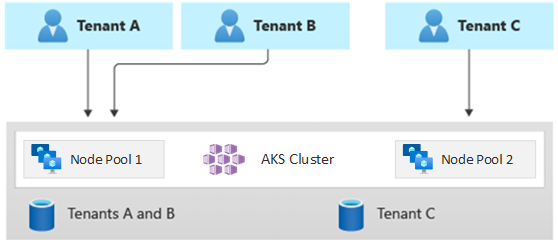

[Azure Kubernetes Service (AKS)][aks] simplifies deploying a managed Kubernetes cluster in Azure by offloading the operational overhead to the Azure cloud platform. Because AKS is a hosted Kubernetes service, Azure handles critical tasks like health monitoring and maintenance and the control plane.

AKS clusters can be shared across multiple tenants in different scenarios and ways. In some cases, diverse applications can run in the same cluster. In other cases, multiple instances of the same application can run in the same shared cluster, one for each tenant. The term *multitenancy* frequently describes all these types of sharing. Kubernetes doesn't have a first-class concept of end-users or tenants. Still, it provides several features to help you manage different tenancy requirements.

This article describes some of the features of AKS that you can use when you build multitenant systems. For general guidance and best practices for Kubernetes multitenancy, see [Multi-tenancy](https://kubernetes.io/docs/concepts/security/multi-tenancy) in the Kubernetes documentation.

## Multitenancy types

The first step to determine how to share an AKS cluster across multiple tenants is to evaluate the patterns and tools that are available to use. In general, multitenancy in Kubernetes clusters falls into two main categories, but many variations are still possible. The Kubernetes [documentation](https://kubernetes.io/docs/concepts/security/multi-tenancy/#use-cases) describes two common use cases for multitenancy: multiple teams and multiple customers.

### Multiple teams

A common form of multitenancy is to share a cluster between multiple teams within an organization. Each team can deploy, monitor, and operate one or more solutions. These workloads frequently need to communicate with each other and with other internal or external applications that are located on the same cluster or other hosting platforms.

In addition, these workloads need to communicate with services, such as a relational database, a NoSQL repository, or a messaging system, which are hosted in the same cluster or are running as platform as a service (PaaS) services on Azure.

In this scenario, members of the teams often have direct access to Kubernetes resources via tools, such as [kubectl][kubectl]. Or, members have indirect access through GitOps controllers, such as [Flux][flux] and [Argo CD][argo-cd], or through other types of release automation tools.

For more information on this scenario, see [Multiple teams](https://kubernetes.io/docs/concepts/security/multi-tenancy/#multiple-teams) in the Kubernetes documentation.

### Multiple customers

Another common form of multitenancy frequently involves a software as a service (SaaS) vendor. Or, a service provider runs multiple instances of a workload, which are considered separate tenants, for their customers. In this scenario, the customers don't have direct access to the AKS cluster, but they only have access to their application. Moreover, they don't even know that their application runs on Kubernetes. Cost optimization is frequently a critical concern. Service providers use Kubernetes policies, such as [resource quotas][resource-quotas] and [network policies][network-policies], to ensure that the workloads are strongly isolated from each other.

For more information on this scenario, see [Multiple customers](https://kubernetes.io/docs/concepts/security/multi-tenancy/#multiple-customers) in the Kubernetes documentation.

## Isolation models

According to the [Kubernetes documentation](https://kubernetes.io/docs/concepts/security/multi-tenancy/#isolation), a multitenant Kubernetes cluster is shared by multiple users and workloads that are commonly referred to as *tenants*. This definition includes Kubernetes clusters that different teams or divisions share within an organization. It also contains clusters that per-customer instances of a SaaS application share.

Cluster multitenancy is an alternative to managing many single-tenant dedicated clusters. The operators of a multitenant Kubernetes cluster must isolate tenants from each other. This isolation minimizes the damage that a compromised or malicious tenant can do to the cluster and to other tenants.

When several users or teams share the same cluster with a fixed number of nodes, one team might use more than its fair share of resources. Administrators can use [resource quotas][resource-quotas] to address this concern.

Based on the security level that isolation provides, you can distinguish between soft and hard multitenancy.

- Soft multitenancy is suitable within a single enterprise where tenants are different teams or departments that trust each other. In this scenario, isolation aims to guarantee workload integrity, orchestrate cluster resources across different internal user groups, and defend against possible security attacks.
- Hard multitenancy describes scenarios where heterogeneous tenants don't trust each other, often from security and resource-sharing perspectives.

When you plan to build a multitenant AKS cluster, you should consider the layers of resource isolation and multitenancy that [Kubernetes](https://kubernetes.io/docs/concepts/security/multi-tenancy) provides, including:

- Cluster
- Namespace
- Node pool or node
- Pod
- Container

In addition, you should consider the security implications of sharing different resources among multiple tenants. For example, you can reduce the number of machines needed in the cluster by scheduling pods from different tenants on the same node. On the other hand, you might need to prevent specific workloads from being collocated. For example, you might not allow untrusted code from outside your organization to run on the same node as containers that process sensitive information.

Although Kubernetes can't guarantee perfectly secure isolation between tenants, it does offer features that might be sufficient for specific use cases. As a best practice, you should separate each tenant and its Kubernetes resources into their namespaces. You can then use [Kubernetes role-based access control (RBAC)](https://kubernetes.io/docs/reference/access-authn-authz/rbac) and [network policies][network-policies] to enforce tenant isolation. For example, the following diagram shows the typical SaaS provider model that hosts multiple instances of the same application on the same cluster, one for each tenant. Each application lives in a separate namespace.

There are several ways to design and build multitenant solutions with AKS. Each of these methods comes with its own set of tradeoffs, in terms of infrastructure deployment, network topology, and security. These methods affect the isolation level, implementation effort, operational complexity, and cost. You can apply tenant isolation in the control and data planes, based on your requirements.

## Control plane isolation

If you have isolation at the control plane level, you guarantee that different tenants can't access or affect each others' resources, such as pods and services. Also, they can't affect the performance of other tenants' applications. For more information, see [Control plane isolation](https://kubernetes.io/docs/concepts/security/multi-tenancy/#control-plane-isolation) in the Kubernetes documentation. The best way to implement isolation at the control plane level is to segregate each tenant's workload and its Kubernetes resources into a separate namespace.

According to the [Kubernetes documentation](https://kubernetes.io/docs/concepts/security/multi-tenancy/#namespaces), a [namespace](https://kubernetes.io/docs/reference/glossary/?fundamental=true#term-namespace) is an abstraction that you use to support the isolation of groups of resources within a single cluster. You can use namespaces to isolate tenant workloads that share a Kubernetes cluster.

- Namespaces allow distinct tenant workloads to exist in their own virtual workspace, without the risk of affecting each other's work. Separate teams within an organization can use namespaces to isolate their projects from each other because they can use the same resource names in different namespaces without the risk of names overlapping.
- [RBAC roles and role bindings](https://kubernetes.io/docs/reference/access-authn-authz/rbac) are namespace-scoped resources that teams can use to limit tenant users and processes to access resources and services only in their namespaces. Different teams can define roles to group lists of permissions or abilities under a single name. They then assign these roles to user accounts and service accounts to ensure that only the authorized identities have access to the resources in a given namespace.
- [Resource quotas][resource-quotas] for CPU and memory are namespaced objects. Teams can use them to ensure that workloads that share the same cluster are strongly isolated from system resource consumption. This method can ensure that every tenant application that runs in a separate namespace has the resources it needs to run and avoid [noisy neighbor problems][noisy-neighbor], which can affect other tenant applications that share the same cluster.
- [Network policies][network-policies] are namespaced objects that teams can adopt to enforce which network traffic is allowed for a given tenant application. You can use network policies to segregate distinct workloads that share the same cluster from a networking perspective.
- Team applications that run in distinct namespaces can use different [service accounts](https://kubernetes.io/docs/tasks/configure-pod-container/configure-service-account) to access resources within the same cluster, external applications, or managed services.
- Use namespaces to improve performance at the control plane level. If workloads in a shared cluster are organized into multiple namespaces, the Kubernetes API has fewer items to search when running operations. This organization can reduce the latency of calls against the API server and increase the throughput of the control plane.

For more information about isolation at the namespace level, see the following resources in the Kubernetes documentation:

- [Namespaces](https://kubernetes.io/docs/concepts/security/multi-tenancy/#namespaces)
- [Access controls](https://kubernetes.io/docs/concepts/security/multi-tenancy/#access-controls)
- [Quotas](https://kubernetes.io/docs/concepts/security/multi-tenancy/#quotas)

## Data plane isolation

Data plane isolation guarantees that pods and workloads of distinct tenants are sufficiently isolated from one another. For more information, see [Data plane isolation](https://kubernetes.io/docs/concepts/security/multi-tenancy/#data-plane-isolation) in the Kubernetes documentation.

### Network isolation

When you run modern, microservices-based applications in Kubernetes, you often want to control which components can communicate with each other. By default, all pods in an AKS cluster can send and receive traffic without restrictions, including other applications that share the same cluster. To improve security, you can define network rules to control the flow of traffic. Network policy is a Kubernetes specification that defines access policies for communication between pods. You can use [network policies][network-policies] to segregate communications between tenant applications that share the same cluster.

AKS provides three ways to implement network policies:

- Azure has its implementation for network policies, called Azure network policies.
- [Calico network policies](https://projectcalico.docs.tigera.io/security/calico-network-policy) is an open-source network and network security solution founded by [Tigera](https://www.tigera.io).
- [Azure CNI Powered by Cilium](/azure/aks/azure-cni-powered-by-cilium) is an eBPF-based networking solution that provides enhanced network policy performance and advanced capabilities including Layer 7 filtering (requires Kubernetes 1.29 or later).

Azure network policies and Calico network policies both use Linux iptables to enforce the specified policies. Network policies are translated into sets of allowed and disallowed IP pairs, which are then programmed as iptables filter rules. In contrast, Azure CNI Powered by Cilium uses eBPF programs loaded into the Linux kernel for policy enforcement, providing improved performance and eliminating the overhead of iptables and kube-proxy. All three network policy options support both the [Azure CNI](/azure/aks/configure-azure-cni) network plugin and [Azure CNI Overlay](/azure/aks/azure-cni-overlay) mode. For more information, see [Secure traffic between pods using network policies in Azure Kubernetes Service](/azure/aks/use-network-policies).

For more information, see [Network isolation](https://kubernetes.io/docs/concepts/security/multi-tenancy/#network-isolation) in the Kubernetes documentation.

### Service mesh

A service mesh provides advanced traffic management, security, and observability capabilities for microservices communication in multitenant AKS clusters. Service meshes operate at Layer 7, enabling fine-grained control over service-to-service communication beyond what network policies provide at Layers 3 and 4.

AKS offers an [Istio-based service mesh add-on](/azure/aks/istio-about) that provides managed lifecycle, scaling, and configuration of the Istio control plane. For multitenant scenarios, service mesh capabilities include:

**Identity and authentication**: Service mesh provides mutual TLS (mTLS) for automatic encryption of communication between tenant workloads. Each service receives a cryptographic identity, ensuring that only authenticated services can communicate. This prevents tenant workloads from impersonating services in other tenant namespaces.

**Authorization policies**: You can define fine-grained authorization policies that control which services can communicate with each other based on service identity, namespace, or custom attributes. For example, you can enforce that tenant A's frontend can only call tenant A's backend services, preventing cross-tenant service access.

**Traffic management**: Service mesh enables advanced traffic routing capabilities that can support multitenant deployments when combined with proper tenant isolation patterns:

- Canary deployments and A/B testing
- Traffic splitting to gradually roll out updates to specific tenant namespaces
- Request routing based on headers or other attributes to direct tenant traffic appropriately
- Circuit breaking and retry policies to prevent cascading failures across tenant workloads

Service mesh provides the traffic management primitives (routing, splitting, circuit breaking), but does not enforce tenant isolation by itself. To use these capabilities for multi-tenancy, you must implement tenant separation patterns such as:

- Namespace-based tenant isolation
- Consistent labeling strategies
- Path-based or host-based routing rules
- Separate ingress gateways per tenant (where appropriate)
- Explicit routing policies that target specific tenant namespaces/labels

**Observability**: Service mesh automatically generates metrics, logs, and distributed traces for all service-to-service communication, providing visibility into how tenant applications interact. This observability is essential for troubleshooting issues in multitenant environments and identifying noisy neighbor problems.

**Security policies at Layer 7**: Unlike network policies that operate on IP addresses and ports, service mesh can enforce policies based on HTTP methods, paths, and headers. For example, you can restrict tenant services to only perform GET requests to specific API endpoints.

**Important considerations for multitenancy**:

- Service mesh adds additional resource overhead per pod due to sidecar proxies. Plan node sizing and resource quotas accordingly for tenant namespaces.
- Apply Istio authorization policies at the namespace level to enforce tenant isolation boundaries.
- Service mesh requires explicit default-deny authorization policies to enforce tenant isolation; by default, all traffic is allowed.
- Use separate Istio ingress gateways per tenant tier (basic, standard, premium) to provide different levels of traffic management and security.

For more information about deploying and configuring the Istio service mesh add-on, see [Deploy Istio-based service mesh add-on for AKS](/azure/aks/istio-deploy-addon).

### Storage isolation

Azure provides a rich set of managed, PaaS data repositories, such as [Azure SQL Database](/azure/azure-sql/database/sql-database-paas-overview) and [Azure Cosmos DB](/azure/cosmos-db/introduction), and other storage services that you can use as [persistent volumes](/azure/aks/concepts-storage#volumes) for your workloads. Tenant applications that run on a shared AKS cluster can [share a database or file store](/azure/architecture/guide/multitenant/approaches/storage-data#shared-multitenant-databases-and-file-stores), or they can use [a dedicated data repository and storage resource](/azure/architecture/guide/multitenant/approaches/storage-data#multitenant-app-with-dedicated-databases-for-each-tenant). For more information on different strategies and approaches to manage data in a multitenant scenario, see [Architectural approaches for storage and data in multitenant solutions](/azure/architecture/guide/multitenant/approaches/storage-data).

Workloads that run on AKS can also use persistent volumes to store data. On Azure, you can create [persistent volumes](/azure/aks/concepts-storage#volumes) as Kubernetes resources that Azure Storage supports. You can manually create data volumes and assign them to pods directly, or you can have AKS automatically create them using [persistent volume claims](/azure/aks/concepts-storage#persistent-volume-claims). AKS provides built-in storage classes to create persistent volumes that [Azure Disks](/azure/virtual-machines/disks-types), [Azure Files](/azure/storage/files/storage-files-planning), and [Azure NetApp Files](/azure/azure-netapp-files/azure-netapp-files-service-levels) support. For more information, see [Storage options for applications in AKS](/azure/aks/concepts-storage). For security and resiliency reasons, you should avoid using local storage on agent nodes via [emptyDir](https://kubernetes.io/docs/concepts/storage/volumes/#emptydir) and [hostPath](https://kubernetes.io/docs/concepts/storage/volumes/#hostpath).

When AKS [built-in storage classes](/azure/aks/azure-disk-csi#dynamically-create-azure-disks-pvs-by-using-the-built-in-storage-classes) aren't a good fit for one or more tenants, you can build custom [storage classes](https://kubernetes.io/docs/concepts/storage/storage-classes) to address different tenants' requirements. These requirements include volume size, storage SKU, a service-level agreement (SLA), backup policies, and the pricing tier.

For example, you can configure a custom storage class for each tenant. You can then use it to apply tags to any persistent volume that's created in their namespace to charge back their costs to them. For more information, see [Use Azure tags in AKS](https://techcommunity.microsoft.com/t5/fasttrack-for-azure/use-azure-tags-in-azure-kubernetes-service-aks/ba-p/3611583).

For more information, see [Storage isolation](https://kubernetes.io/docs/concepts/security/multi-tenancy/#storage-isolation) in the Kubernetes documentation.

### Node isolation

You can configure tenant workloads to run on separate agent nodes to avoid [noisy neighbor problems][noisy-neighbor] and reduce the risk of information disclosure. In AKS, you can create a separate cluster, or just a dedicated node pool, for tenants that have strict requirements for isolation, security, regulatory compliance, and performance.

You can use [taints](https://kubernetes.io/docs/concepts/scheduling-eviction/taint-and-toleration), [tolerations](https://kubernetes.io/docs/concepts/scheduling-eviction/taint-and-toleration), [node labels](https://kubernetes.io/docs/concepts/scheduling-eviction/assign-pod-node), [node selectors](https://kubernetes.io/docs/concepts/scheduling-eviction/assign-pod-node), and [node affinity](https://kubernetes.io/docs/concepts/scheduling-eviction/assign-pod-node) to constrain tenants' pods to run only on a particular set of nodes or node pools.

In general, AKS provides workload isolation at various levels, including:

- At the kernel level, by running tenant workloads in lightweight virtual machines (VMs) on shared agent nodes and by using [Pod Sandboxing](#pod-sandboxing) based on [Kata Containers](https://katacontainers.io/).
- At the physical level, by hosting tenant applications on dedicated clusters or node pools.
- At the hardware level, by running tenant workloads on [Azure dedicated hosts](#azure-dedicated-host) that guarantee that agent node VMs run dedicated physical machines. Hardware isolation ensures that no other VMs are placed on the dedicated hosts, which provides an extra layer of isolation for tenant workloads.

You can combine these techniques. For example, you can run per-tenant clusters and node pools in an [Azure Dedicated Host group](#azure-dedicated-host) to achieve workload segregation and physical isolation at the hardware level. You can also create shared or per-tenant node pools that support [Federal Information Process Standard (FIPS)](#federal-information-process-standards-fips), [confidential VMs](#confidential-vms), or [host-based encryption](#host-based-encryption).

Use node isolation to easily associate and charge back the cost of a set of nodes or node pool to a single tenant. It's strictly related to the tenancy model that's adopted by your solution.

For more information, see [Node isolation](https://kubernetes.io/docs/concepts/security/multi-tenancy/#node-isolation) in the Kubernetes documentation.

## Tenancy models

AKS provides more types of node isolation and tenancy models.

### Automated single-tenant deployments

In an automated single-tenant deployment model, you deploy a dedicated set of resources for each tenant, as illustrated in this example:

Each tenant workload runs in a dedicated AKS cluster and accesses a distinct set of Azure resources. Typically, multitenant solutions that you build by using this model make extensive use of [infrastructure as code (IaC)](/devops/deliver/what-is-infrastructure-as-code). For example, [Bicep](/azure/azure-resource-manager/bicep/overview?tabs=bicep), [Azure Resource Manager](/azure/azure-resource-manager/management/overview), [Terraform](/azure/developer/terraform/overview), or the [Azure Resource Manager REST APIs](/rest/api/resources) help initiate and coordinate the on-demand deployment of tenant-dedicated resources. You might use this approach when you need to provision an entirely separate infrastructure for each of your customers. When planning your deployment, consider using the [Deployment stamps pattern](../../../patterns/deployment-stamp.yml).

**Benefits:**

- A key benefit of this approach is that the API Server of each tenant AKS cluster is separate. This approach guarantees full isolation across tenants from a security, networking, and resource consumption level. An attacker that manages to get control of a container only has access to the containers and mounted volumes that belong to a single tenant. A full-isolation tenancy model is critical to some customers with a high regulatory compliance overhead.
- Tenants are unlikely to affect each other's system performance, so you avoid [noisy neighbor problems][noisy-neighbor]. This consideration includes the traffic against the API Server. The API server is a shared, critical component in any Kubernetes cluster. Custom controllers, which generate unregulated, high-volume traffic against the API server, can cause cluster instability. This instability leads to request failures, timeouts, and API retry storms. Use the [uptime SLA](/azure/aks/uptime-sla) feature to scale out the control plane of an AKS cluster to meet traffic demand. Still, provisioning a dedicated cluster might be a better solution for those customers with strong requirements in terms of workload isolation.
- You can roll out updates and changes progressively across tenants, which reduces the likelihood of a system-wide outage. Azure costs can be easily charged back to tenants because every resource is used by a single tenant.
- Using Azure CNI Overlay across all tenant clusters simplifies IP address planning and allows you to reuse the same pod CIDR space across multiple isolated clusters.

**Risks:**

- Cost efficiency is low because every tenant uses a dedicated set of resources.
- Ongoing maintenance is likely to be time-consuming because you need to repeat maintenance activities across multiple AKS clusters, one for each tenant. Consider automating your operational processes and applying changes progressively through your environments. Other cross-deployment operations, like reporting and analytics across your whole estate, might also be helpful. Ensure that you plan how to query and manipulate data across multiple deployments.

### Fully multitenant deployments

In a fully multitenant deployment, a single application serves the requests of all the tenants, and all of the Azure resources are shared, including the AKS cluster. In this context, you only have one infrastructure to deploy, monitor, and maintain. All of the tenants use the resource, as illustrated in the following diagram:

**Benefits**:

- This model is attractive because of the lower cost of operating a solution with shared components. When you use this tenancy model, you might need to deploy a larger AKS cluster and adopt a higher SKU for any shared data repository. These changes help sustain the traffic that all tenants' resources, such as data repositories, generate.

**Risks**:

- In this context, a single application handles all the tenants' requests. You should design and implement security measures to prevent tenants from flooding the application with calls. These calls can slow down the entire system and affect all the tenants.
- If the traffic profile is highly variable, you should configure the AKS cluster autoscaler to vary the number of pods and agent nodes. Base your configuration on the system resource usage, such as CPU and memory. Alternatively, you can scale out and scale in the number of pods and cluster nodes based on custom metrics. For example, you can use the number of pending requests or the metrics of an external messaging system that uses [Kubernetes-based Event Driven Autoscaler (KEDA)](https://keda.sh).
- Make sure that you separate the data for each tenant and implement safeguards to avoid data leakage between different tenants.
- Make sure to [track and associate Azure costs](/azure/architecture/guide/multitenant/considerations/measure-consumption) to individual tenants, based on their actual usage. Non-Microsoft solutions, such as [kubecost](https://www.kubecost.com), can help you calculate and break down costs across different teams and tenants.
- Maintenance can be more straightforward with a single deployment because you only have to update one set of Azure resources and maintain a single application. However, it can also be riskier because any changes to the infrastructure or application components can affect the entire customer base.
- You should also consider scale limitations. You're more likely to reach Azure resource scale limits when you have a shared set of resources. To avoid reaching a resource quota limit, you can distribute your tenants across multiple Azure subscriptions.

### Horizontally partitioned deployments

Alternatively, you can consider horizontally partitioning your multitenant Kubernetes application. This approach shares some solution components across all the tenants and deploys dedicated resources for individual tenants. For example, you can build a single multitenant Kubernetes application and then create individual databases, one for each tenant, as shown in this illustration:

**Benefits:**

- Horizontally partitioned deployments can help you mitigate [noisy neighbor problems][noisy-neighbor]. Consider this approach if you identify that most of the traffic load on your Kubernetes application is because of specific components, which you can deploy separately, for each tenant. For example, your databases might absorb most of your system's load because the query load is high. If a single tenant sends a large number of requests to your solution, the performance of a database might be negatively affected, but other tenants' databases and shared components, like the application tier, remain unaffected.

**Risks:**

- With a horizontally partitioned deployment, you still need to consider the automated deployment and management of your components, especially the components that a single tenant uses.
- This model might not provide the required level of isolation for customers that can't share resources with other tenants for internal policy or compliance reasons.

### Vertically partitioned deployments

You can take advantage of the benefits of the single-tenant and fully multitenant models by using a hybrid model that vertically partitions tenants across multiple AKS clusters or node pools. This approach provides the following advantages over the previous two tenancy models:

- You can use a combination of single-tenant and multitenant deployments. For example, you can have most of your customers share an AKS cluster and database on a multitenant infrastructure. You might also deploy single-tenant infrastructures for those customers who require higher performance and isolation.
- You can deploy tenants to multiple regional AKS clusters, potentially with different configurations. This technique is most effective when you have tenants spread across different geographies.

You can implement different variations of this tenancy model. For example, you can choose to offer your multitenant solution with different tiers of functionality at a different cost. Your pricing model can provide multiple SKUs that each provides an incremental level of performance and isolation in terms of resource sharing, performance, network, and data segregation. Consider the following tiers:

- Basic tier: The tenant requests are served by a single, multitenant Kubernetes application that's shared with other tenants. Data is stored in one or more databases that all Basic-tier tenants share.
- Standard tier: Tenant requests are served by a dedicated Kubernetes application that runs in a separate namespace, which provides isolation boundaries in terms of security, networking, and resource consumption. All the tenants' applications, one for each tenant, share the same AKS cluster and node pool with other standard-tier customers.
- Premium tier: The tenant application runs in a dedicated node pool or AKS cluster to guarantee a higher SLA, better performance, and a higher degree of isolation. This tier can provide a flexible cost model based on the number and SKU of the agent nodes that host the tenant application. You can use [Pod Sandboxing](#pod-sandboxing) as an alternative solution to dedicated clusters or node pools to isolate distinct tenant workloads.

The following diagram shows a scenario where tenants A and B run on a shared AKS cluster, whereas tenant C runs on a separate AKS cluster.

The following diagram shows a scenario where tenants A and B run on the same node pool, whereas tenant C runs on a dedicated node pool.

This model can also offer different SLAs for different tiers. For example, the basic tier can offer 99.9% uptime, the standard tier can offer 99.95% uptime, and the premium tier can offer 99.99% uptime. You can implement the higher SLA by using services and features that enable higher availability targets.

**Benefits:**

- Because you're still sharing infrastructure, you can still gain some of the cost benefits of having shared multitenant deployments. You can deploy clusters and node pools that are shared across multiple basic-tier and standard-tier tenant applications, which use a less expensive VM size for agent nodes. This approach guarantees better density and cost savings. For premium-tier customers, you can deploy AKS clusters and node pools with a higher VM size and a maximum number of pod replicas and nodes at a higher price.
- You can run system services, such as [CoreDNS](https://kubernetes.io/docs/tasks/administer-cluster/coredns), [Konnectivity](https://kubernetes.io/docs/tasks/extend-kubernetes/setup-konnectivity), or [Azure Application Gateway Ingress Controller](/azure/application-gateway/ingress-controller-overview), in a dedicated system-mode node pool. You can use [taints](https://kubernetes.io/docs/concepts/scheduling-eviction/taint-and-toleration), [tolerations](https://kubernetes.io/docs/concepts/scheduling-eviction/taint-and-toleration), [node labels](https://kubernetes.io/docs/concepts/scheduling-eviction/assign-pod-node), [node selectors](https://kubernetes.io/docs/concepts/scheduling-eviction/assign-pod-node), and [node affinity](https://kubernetes.io/docs/concepts/scheduling-eviction/assign-pod-node) to run a tenant application on one or more user-mode node pools.
- You can use [taints](https://kubernetes.io/docs/concepts/scheduling-eviction/taint-and-toleration), [tolerations](https://kubernetes.io/docs/concepts/scheduling-eviction/taint-and-toleration), [node labels](https://kubernetes.io/docs/concepts/scheduling-eviction/assign-pod-node), [node selectors](https://kubernetes.io/docs/concepts/scheduling-eviction/assign-pod-node), and [node affinity](https://kubernetes.io/docs/concepts/scheduling-eviction/assign-pod-node) to run shared resources. For example, you can have an ingress controller or messaging system on a dedicated node pool that has a specific VM size, autoscaler settings, and availability-zones support.

**Risks:**

- You need to design your Kubernetes application to support both multitenant and single-tenant deployments.
- If you plan to allow migration between infrastructures, you need to consider how you migrate customers from a multitenant deployment to their own single-tenant deployment.
- You need a consistent strategy and a single pane of glass, or one viewpoint, to monitor and manage more AKS clusters.

## Autoscaling

To keep up with the traffic demand that tenant applications generate, you can enable the [cluster autoscaler](/azure/aks/cluster-autoscaler) to scale the agent nodes of AKS. Autoscaling helps systems remain responsive in the following circumstances:

- The traffic load increases during specific work hours or periods of the year.
- Tenant or shared heavy loads are deployed to a cluster.
- Agent nodes become unavailable because of outages of an availability zone.

When you enable autoscaling for a node pool, you specify a minimum and a maximum number of nodes based on the expected workload sizes. By configuring a maximum number of nodes, you can ensure enough space for all the tenant pods in the cluster, regardless of the namespace they run in.

When the traffic increases, cluster autoscaling adds new agent nodes to prevent pods from going into a pending state because of resource shortages like CPU and memory.

When the load diminishes, cluster autoscaling decreases the number of agent nodes in a node pool based on the specified boundaries, which helps reduce your operational costs.

You can use pod autoscaling to scale pods automatically based on resource demands. [HorizontalPodAutoscaler](https://kubernetes.io/docs/tasks/run-application/horizontal-pod-autoscale) automatically scales the number of pod replicas based on CPU or memory utilization or custom metrics. By using [KEDA](https://keda.sh), you can drive the scaling of any container in Kubernetes based on the number of events from external systems, such as [Azure Event Hubs](https://keda.sh/docs/2.7/scalers/azure-event-hub) or [Azure Service Bus](https://keda.sh/docs/2.7/scalers/azure-service-bus), that tenant applications use.

[Vertical Pod Autoscaler (VPA)](/azure/aks/vertical-pod-autoscaler) enables efficient resource management for pods. By adjusting the CPU and memory allocated to pods, VPA helps you reduce the number of nodes required to run tenant applications. Having fewer nodes reduces the total cost of ownership and helps you avoid [noisy neighbor problems][noisy-neighbor].

Assign [Capacity reservation groups](/azure/aks/manage-node-pools#associate-capacity-reservation-groups-to-node-pools) to node pools to provide better resource allocation and isolation for different tenants.

## Maintenance

To reduce the risk of downtime that might affect tenant applications during cluster or node pool upgrades, schedule AKS [planned maintenance](/azure/aks/planned-maintenance) during off-peak hours. Schedule weekly maintenance windows to update the control plane of the AKS clusters that run tenant applications and node pools to minimize workload impact. You can schedule one or more weekly maintenance windows on your cluster by specifying a day or time range on a specific day. All maintenance operations occur during the scheduled windows.

## Security

The following sections describe security best practices for multitenant solutions with AKS.

### Cluster access

When you share an AKS cluster between multiple teams within an organization, you need to implement the [principle of least privilege](https://en.wikipedia.org/wiki/Principle_of_least_privilege) to isolate different tenants from one another. In particular, you need to make sure that users have access only to their Kubernetes namespaces and resources when you use tools such as [kubectl][kubectl], [Helm][helm], [Flux][flux], or [Argo CD][argo-cd].

For more information about authentication and authorization with AKS, see the following articles:

- [Access and identity options for AKS](/azure/aks/concepts-identity)
- [AKS-managed Microsoft Entra integration](/azure/aks/managed-aad)
- [Kubernetes role-based access control with Microsoft Entra ID in AKS](/azure/aks/azure-ad-rbac)

### Workload identity

Workload identity is a **critical security requirement** for multitenant AKS clusters. When multiple tenant applications share an AKS cluster, each tenant's workloads must authenticate to Azure resources using separate, isolated identities to prevent cross-tenant access and credential sharing.

In a multitenant cluster, workload identity prevents several critical security risks:

- **Credential sharing**: Without workload identity, tenant applications might share service principals or store credentials in secrets, creating opportunities for cross-tenant access.
- **Privilege escalation**: A compromised tenant workload with access to shared credentials could access other tenants' Azure resources.
- **Credential exposure**: Kubernetes secrets containing service principal credentials are vulnerable to accidental exposure or unauthorized access.

Workload identity integrates with Kubernetes-native service accounts. When you create a namespace for a tenant, you create a dedicated Kubernetes service account and annotate it with the client ID of that tenant's Azure managed identity. The AKS cluster uses its OIDC issuer endpoint to federate with Microsoft Entra ID, establishing a trust relationship. When a pod runs using the annotated service account, it automatically receives a short-lived token that can be exchanged for a Microsoft Entra access token, allowing secure access to Azure resources.

For detailed implementation steps and code examples, see [Use a Microsoft Entra Workload ID on AKS](/azure/aks/workload-identity-overview) and [Deploy and configure workload identity on AKS](/azure/aks/workload-identity-deploy-cluster).

**Replacing legacy pod-managed identity:**

Microsoft Entra pod-managed identity (preview) was deprecated in October 2022 and supportin AKS ended in September 2025. Workload identity is the recommended replacement and offers significant advantages:

- No additional components or agents required (pod-managed identity required MIC and NMI daemonsets)
- Better scalability and performance
- Works with standard Kubernetes service accounts
- Simpler configuration and troubleshooting

If you're currently using pod-managed identity, plan to migrate to workload identity. Both can coexist during migration, but workload identity should be the target architecture for all new deployments.

### Pod Sandboxing

AKS includes a mechanism called [Pod Sandboxing](/azure/aks/use-pod-sandboxing) that provides an isolation boundary between the container application and the shared kernel and compute resources of the container host, like CPU, memory, and networking. Pod Sandboxing complements other security measures or data protection controls to help tenant workloads secure sensitive information and meet regulatory, industry, or governance compliance requirements, like Payment Card Industry Data Security Standard (PCI DSS), International Organization for Standardization (ISO) 27001, and Health Insurance Portability and Accountability Act (HIPAA).

By deploying applications on separate clusters or node pools, you can strongly isolate the tenant workloads of different teams or customers. Using multiple clusters and node pools might be suitable for the isolation requirements of many organizations and SaaS solutions, but there are scenarios in which a single cluster with shared VM node pools is more efficient. For example, you might use a single cluster when you run untrusted and trusted pods on the same node or colocate DaemonSets and privileged containers on the same node for faster local communication and functional grouping. [Pod Sandboxing](/azure/aks/use-pod-sandboxing) can help you strongly isolate tenant applications on the same cluster nodes without needing to run these workloads in separate clusters or node pools. Other methods require that you recompile your code or cause other compatibility problems, but Pod Sandboxing in AKS can run any container unmodified inside an enhanced security VM boundary.

Pod Sandboxing on AKS is based on [Kata Containers](https://katacontainers.io/) that run on the [Azure Linux container host for AKS](/azure/aks/use-azure-linux) stack to provide hardware-enforced isolation. Kata Containers on AKS are built on a security-hardened Azure hypervisor. It achieves isolation per pod via a nested, lightweight Kata VM that utilizes resources from a parent VM node. In this model, each Kata pod gets its own kernel in a nested Kata guest VM. Use this model to place many Kata containers in a single guest VM while continuing to run containers in the parent VM. This model provides a strong isolation boundary in a shared AKS cluster.

Pod Sandboxing on AKS has several constraints to consider. It's only supported on Linux node pools using Azure Linux 3.0 or later with Generation 2 VMs that support nested virtualization. Azure Linux 2.0 support ended on November 30, 2025, with node images to be removed March 31, 2026. Kata containers might not reach the same IOPS performance limits as traditional containers on Azure Files and high-performance local SSDs. Additionally, Microsoft Defender for Containers doesn't support security assessments of Kata runtime pods, and host-network access isn't supported.

For more information, see:

- [Pod Sandboxing with AKS](/azure/aks/use-pod-sandboxing)
- [Support for Kata VM Isolated Containers on AKS for Pod Sandboxing](https://techcommunity.microsoft.com/t5/apps-on-azure-blog/preview-support-for-kata-vm-isolated-containers-on-aks-for-pod/ba-p/3751557)

### Azure Dedicated Host

[Azure Dedicated Host](/azure/virtual-machines/dedicated-hosts) is a service that provides physical servers that are dedicated to a single Azure subscription and provide hardware isolation at the physical-server level. You can provision these dedicated hosts within a region, availability zone, and fault domain, and you can place VMs directly into the provisioned hosts.

There are several benefits to using Azure Dedicated Host with AKS, including:  

- Hardware isolation ensures that no other VMs are placed on the dedicated hosts, which provides an extra layer of isolation for tenant workloads. Dedicated hosts are deployed in the same datacenters and share the same network and underlying storage infrastructure as other non-isolated hosts.

- Azure Dedicated Host provides control over maintenance events that the Azure platform initiates. You can choose a maintenance window to reduce the impact on services and help ensure the availability and privacy of tenant workloads.

Azure Dedicated Host can help SaaS providers ensure tenant applications meet regulatory, industry, and governance compliance requirements for securing sensitive information. For more information, see [Add Azure Dedicated Host to an AKS cluster](/azure/aks/use-azure-dedicated-hosts).

### Node Auto-provisioning

Node Auto-provisioning (NAP) is a managed AKS feature that dynamically provisions and manages nodes based on pending pod requirements. NAP is a fully managed implementation built on top of the open-source Karpenter project. NAP watches for pods that the Kubernetes scheduler marks as unschedulable and automatically creates appropriately configured nodes to run those workloads. This capability is particularly valuable for multitenant deployments where different tenants have diverse infrastructure requirements.

**Benefits for multitenancy**: Node Auto-provisioning improves multitenant cluster operations by:

- **Dynamic tenant-specific node types**: Automatically provision the right VM size for each tenant's workload requirements. For example, if Tenant A deploys GPU-intensive workloads while Tenant B runs memory-intensive applications, NAP automatically creates GPU-optimized nodes for Tenant A and memory-optimized nodes for Tenant B without manual intervention.

- **Cost optimization**: Tenants only consume compute resources when they have active workloads. NAP scales down or removes nodes when tenant pods are deleted, ensuring you don't pay for idle capacity dedicated to specific tenant requirements.

- **Availability zone placement**: Ensure tenant workloads run in specific availability zones to meet latency requirements or data residency needs. NAP can provision nodes in the appropriate zone based on pod topology constraints.

- **Simplified node pool management**: Instead of pre-provisioning multiple node pools for different tenant tiers (basic, standard, premium) with different VM sizes, NAP provisions nodes on-demand based on actual tenant workload requirements.

- **Better resource utilization**: NAP's intelligent bin-packing across dynamically created nodes reduces wasted capacity compared to static node pools, which is especially beneficial when running many small tenant workloads with varying resource profiles.

**Implementation for multitenant clusters**: Enable Node Auto-provisioning on your AKS cluster and define workload requirements using Kubernetes-native mechanisms:

- Use pod resource requests and limits to specify CPU and memory requirements for tenant workloads
- Apply node selectors or node affinity rules to tenant pods when specific VM families are required
- Use topology spread constraints to control how tenant pods are distributed across availability zones
- Apply taints and tolerations to ensure tenant workloads only run on appropriately provisioned nodes

Node Auto-provisioning on AKS is built on the open-source [Karpenter][karpenter] project, providing a managed experience with lifecycle management, upgrades, and Azure-specific optimizations handled by Microsoft. Most users should use Node Auto-provisioning as a managed add-on. For more information, see [Node autoprovisioning](/azure/aks/node-autoprovision).

**Advanced scenarios**: If you require advanced customization beyond what Node Auto-provisioning provides, you can self-host Karpenter directly on AKS. This approach provides full control over Karpenter's configuration but requires you to manage the lifecycle and upgrades yourself. For more information, see the [AKS Karpenter provider](https://github.com/Azure/karpenter-provider-azure).

[karpenter]: https://karpenter.sh/

### Confidential VMs

You can use [confidential VMs](/azure/aks/use-cvm) to add one or more node pools to your AKS cluster to address tenants' strict isolation, privacy, and security requirements. [Confidential VMs](https://techcommunity.microsoft.com/t5/azure-confidential-computing/azure-confidential-vms-using-sev-snp-dcasv5-ecasv5-are-now/ba-p/3573747) use a hardware-based [trusted execution environment](https://en.wikipedia.org/wiki/Trusted_execution_environment). [AMD Secure Encrypted Virtualization - Secure Nested Paging (SEV-SNP)](https://www.amd.com/system/files/TechDocs/SEV-SNP-strengthening-vm-isolation-with-integrity-protection-and-more.pdf) confidential VMs deny the hypervisor and other host-management code access to VM memory and state, which adds a layer of defense and in-depth protection against operator access. For more information, see [Use confidential VMs in an AKS cluster](/azure/aks/use-cvm).

### Federal Information Process Standards (FIPS)

[FIPS 140-3](https://csrc.nist.gov/publications/detail/fips/140/3/final) is a US government standard that defines minimum security requirements for cryptographic modules in information technology products and systems. By enabling [FIPS compliance for AKS node pools](/azure/aks/enable-fips-nodes), you can enhance the isolation, privacy, and security of your tenant workloads. [FIPS](/azure/compliance/offerings/offering-fips-140-2) compliance ensures the use of validated cryptographic modules for encryption, hashing, and other security-related operations. With FIPS-enabled AKS node pools, you can meet regulatory and industry compliance requirements by employing robust cryptographic algorithms and mechanisms. Azure provides documentation on how to enable FIPS for AKS node pools, which enables you to strengthen the security posture of your multitenant AKS environments. For more information, see [Enable FIPS for AKS node pools](/azure/aks/enable-fips-nodes).

### Bring your own keys (BYOK) with Azure disks

Azure Storage encrypts all data in a storage account at rest, including the OS and data disks of an AKS cluster. By default, data is encrypted with Microsoft-managed keys. For more control over encryption keys, you can supply customer-managed keys to use for encryption at rest of the OS and data disks of your AKS clusters. For more information, see:

- [BYOK with Azure disks in AKS](/azure/aks/azure-disk-customer-managed-keys).
- [Server-side encryption of Azure Disk Storage](/azure/virtual-machines/disk-encryption).

### Host-based encryption

[Host-based encryption](/azure/aks/enable-host-encryption) on AKS further strengthens tenant workload isolation, privacy, and security. When you enable host-based encryption, AKS encrypts data at rest on the underlying host machines, which helps ensure that sensitive tenant information is protected from unauthorized access. Temporary disks and ephemeral OS disks are encrypted at rest with platform-managed keys when you enable end-to-end encryption.

In AKS, OS and data disks use server-side encryption with platform-managed keys by default. The caches for these disks are encrypted at rest with platform-managed keys. You can specify your own [key encryption key](/azure/security/fundamentals/encryption-atrest) to encrypt the [data protection key](/azure/security/fundamentals/encryption-atrest) by using envelope encryption, also known as *wrapping*. The cache for the OS and data disks are also encrypted via the [BYOK](/azure/aks/azure-disk-customer-managed-keys) that you specify.

Host-based encryption adds a layer of security for multitenant environments. Each tenant's data in the OS and data disk caches is encrypted at rest with either customer-managed or platform-managed keys, depending on the selected disk encryption type. For more information, see:

- [Host-based encryption on AKS](/azure/aks/enable-host-encryption)
- [BYOK with Azure disks in AKS](/azure/aks/azure-disk-customer-managed-keys)
- [Server-side encryption of Azure Disk Storage](/azure/virtual-machines/disk-encryption)

## Networking

The following sections describe networking best practices for multitenant solutions with AKS.

### Network topology for multitenant clusters

When designing network topology for multitenant AKS deployments, the choice between Azure CNI standard mode and Azure CNI Overlay significantly impacts your ability to scale tenant workloads and manage IP address space efficiently.

**IP address planning for multitenancy**: Traditional Azure CNI assigns VNet IP addresses to both nodes and pods, which can quickly exhaust available IP space in large multitenant deployments. If you're deploying:

- Multiple dedicated clusters (one per tenant or per tenant tier)
- Shared clusters with high pod density across many tenant namespaces
- Multiple environments per tenant (dev, staging, production)

You should strongly consider Azure CNI Overlay to avoid IP address exhaustion. Azure CNI Overlay assigns VNet IPs only to nodes while pods use a separate overlay CIDR, allowing you to deploy significantly more tenant workloads within the same VNet address space.

**Pod CIDR reusability across tenant clusters**: When implementing an automated single-tenant deployment model (dedicated cluster per tenant), Azure CNI Overlay allows you to use the same pod CIDR (e.g., 10.244.0.0/16) across all tenant clusters without conflict. This dramatically simplifies infrastructure-as-code templates and removes the need to manage unique, non-overlapping pod CIDRs for each tenant's cluster.

**When to use standard Azure CNI**: Use standard Azure CNI for multitenant scenarios when:

- External systems need direct routable access to pod IPs (uncommon for most SaaS multitenancy patterns)
- You're using advanced AKS features that don't yet support Overlay mode
- Your VNet has sufficient IP address space and you have few tenant clusters

**When to use Azure CNI Overlay**: Use Azure CNI Overlay for multitenant scenarios when:

- Deploying multiple AKS clusters in the same VNet (common for per-tenant or per-tier cluster models)
- Running high pod density in shared clusters with many tenant namespaces
- IP address space is constrained or you need to reserve VNet IPs for other Azure resources
- You need to standardize infrastructure templates across many tenant deployments

**Tenant isolation considerations**: Azure CNI Overlay maintains the same tenant isolation capabilities as standard Azure CNI. All three network policy engines (Azure Network Policies, Calico, and Azure CNI Powered by Cilium) work with Azure CNI Overlay, allowing you to enforce namespace-level network isolation between tenants regardless of which topology you choose.

**Outbound traffic patterns**: With Azure CNI Overlay, tenant pod traffic is SNAT'd to the node IP when leaving the cluster. If you need to identify traffic by tenant for external systems or firewall rules, implement tenant-specific egress controls using:

- Dedicated node pools per tenant with specific node labels
- Azure NAT Gateway with multiple public IPs assigned to different node pools
- Azure Firewall with user-defined routes directing tenant traffic through specific rules

For detailed configuration steps, see [Configure Azure CNI Overlay networking in AKS](/azure/aks/azure-cni-overlay).

### Restrict network access to the API server

In Kubernetes, the API server receives requests to perform actions in the cluster, such as creating resources or scaling the number of nodes. When you share an AKS cluster across multiple teams within an organization, protect access to the control plane by using one of the following solutions.

### Private AKS clusters

By using a private AKS cluster, you can make sure the network traffic between your API server and your node pools remains within your virtual network. AKS provides two approaches for implementing private API server access:

**API Server VNet Integration** projects the API server endpoint directly into a delegated subnet within your cluster's virtual network. The API server sits behind an Internal Load Balancer, and nodes communicate directly with its private IP address. You can enable or disable public network access without redeploying the cluster.

**Private clusters with Private Link** use Azure Private Link to create a private endpoint with no public IP address. The API server is accessible only through the private endpoint, requiring DNS configuration through Private DNS zones.

In a private AKS cluster, the control plane or API server is only accessible from resources that are either in the same virtual network or through vNet peering, virtual private network or ExpressRoute. For more information, see [Create a private AKS cluster](/azure/aks/private-clusters).

### Authorized IP address ranges

The second option to improve cluster security and minimize attacks is by using [authorized IP address ranges](/azure/aks/api-server-authorized-ip-ranges). This approach restricts the access to the control plane of a public AKS cluster to a well-known list of IP addresses and Classless Inter-Domain Routing (CIDR) ranges. When you use authorized IP addresses, they're still publicly exposed, but access is limited to a set of ranges. For more information, see [Secure access to the API server using authorized IP address ranges in AKS](/azure/aks/api-server-authorized-ip-ranges).

### Private Link integration

[Azure Private Link service](/azure/private-link/private-link-service-overview) is an infrastructure component that allows applications to privately connect to a service via an [Azure private endpoint](/azure/private-link/private-endpoint-overview) that's defined in a virtual network and connected to the front-end IP configuration of an [Azure Load Balancer](/azure/load-balancer/load-balancer-overview) instance. With [Private Link](/azure/private-link/private-link-overview), service providers can securely provide their services to their tenants that can connect from within Azure or on-premises, without data exfiltration risks.

You can use [Private Link service integration](https://cloud-provider-azure.sigs.k8s.io/topics/pls-integration) to provide tenants with private connectivity to their AKS-hosted workloads in a secure way, without the need to expose any public endpoint on the public internet.

For more information about how you can configure Private Link for an Azure-hosted multitenant solution, see [Multitenancy and Private Link](/azure/architecture/guide/multitenant/service/private-link).

### Reverse proxies

A [reverse proxy](https://en.wikipedia.org/wiki/Reverse_proxy) is a load balancer and an [API gateway](/azure/architecture/microservices/design/gateway) that is typically used in front of tenant applications to secure, filter, and dispatch incoming requests. Popular reverse proxies support features such as load balancing, SSL termination, and layer 7 routing. Reverse proxies are typically implemented to help increase security, performance, and reliability. Popular reverse proxies for Kubernetes include the following implementations:

- [NGINX Ingress Controller](https://kubernetes.github.io/ingress-nginx) is a popular reverse proxy server that supports advanced features, such as load balancing, SSL termination, and layer 7 routing. Note that the Ingres NGINX project is due to retire in March 2026.
- [Traefik Kubernetes Ingress provider](https://doc.traefik.io/traefik/providers/kubernetes-ingress) is a Kubernetes Ingress controller that can be used to manage access to cluster services by supporting the ingress specification.
- [HAProxy Kubernetes Ingress Controller](https://www.haproxy.com/documentation/kubernetes/latest) is yet another reverse proxy for Kubernetes, which supports standard features such as TLS termination, URL-path-based routing, and more.
- [Azure Application Gateway for Containers](/azure/application-gateway/for-containers/overview) is a managed application delivery controller (ADC) as a service that provides Layer 7 load balancing for AKS-hosted applications. It offers advanced routing capabilities, SSL termination, and web application firewall (WAF) features to protect tenant applications from common web vulnerabilities and attacks.
- [Azure Application Gateway Ingress Controller (AGIC)](/azure/application-gateway/ingress-controller-overview) has been superseded by the [Azure Application Gateway for Containers](/azure/application-gateway/for-containers/overview). New deployments should use Azure Application Gateway for Containers instead of AGIC. Existing AGIC deployments can continue to be used, but you should plan to migrate to Azure Application Gateway for Containers.

When you use an AKS-hosted reverse proxy to help secure and handle incoming requests to multiple tenant applications, consider the following recommendations:

- Host the reverse proxy on a dedicated node pool that's configured to use a VM size with a high-network bandwidth and [accelerated networking](/azure/virtual-network/accelerated-networking-overview) enabled.
- Configure the node pool that's hosting your reverse proxy for autoscaling.
- To avoid increased latency and timeouts for tenant applications, define an autoscaling policy so that the number of ingress controller pods can instantly expand and contract to match traffic fluctuations.
- Consider sharding the incoming traffic to tenant applications, across multiple instances of your ingress controller, to increase the scalability and segregation level.

When you use the [Azure Application Gateway for Containers](/azure/application-gateway/for-containers/overview), consider implementing the following best practices:

- Deploy separate Application Gateway for Containers instances for different tenant tiers to provide isolation and different service levels. Use the Gateway API's role-oriented model where infrastructure operators manage Gateway resources and tenants manage their HTTPRoute resources in their own namespaces.
- Enable cross-namespace routing to allow a shared Gateway to route traffic to backend services across multiple tenant namespaces while maintaining namespace isolation.
- The solution supports elastic autoscaling automatically, eliminating the need to manually configure capacity planning.

### Integration with Azure Front Door

[Azure Front Door](/azure/frontdoor/front-door-overview) is a global layer-7 load balancer and a modern cloud content delivery network (CDN) from Microsoft that provides fast, reliable, and secure access between users and web applications across the globe. Azure Front Door supports features such as request acceleration, SSL termination, response caching, WAF at the edge, URL-based routing, rewrite, and redirections that you can use when you expose AKS-hosted multitenant applications to the public internet.

For example, you might want to use an AKS-hosted multitenant application to serve all the customers' requests. In this context, you can use Azure Front Door to manage multiple custom domains, one for each tenant. You can terminate SSL connections on the edge and route all the traffic to the AKS-hosted multitenant application that's configured with a single hostname.

You can configure Azure Front Door to modify the [request origin host header](/azure/frontdoor/front-door-backend-pool#origin-host-header) to match the domain name of the backend application. The original `Host` header sent by the client is propagated through the `X-Forwarded-Host` header, and the code of the multitenant application can use this information to [map the incoming request to the correct tenant](../considerations/map-requests.yml).

[Azure Web Application Firewall](/azure/web-application-firewall/afds/afds-overview), on Azure Front Door, provides centralized protection for web applications. Azure Web Application Firewall can help you defend AKS-hosted tenant applications that expose a public endpoint on the internet from malicious attacks.

You can configure Azure Front Door Premium to privately connect to one or more tenant applications that run on an AKS cluster, via an internal load balancer origin, by using [Private Link](/azure/private-link/private-link-service-overview). For more information, see [Connect Azure Front Door Premium to an internal load balancer origin with Private Link](/azure/frontdoor/standard-premium/how-to-enable-private-link-internal-load-balancer).

### Outbound connections

When AKS-hosted applications connect to a large number of databases or external services, the cluster might be at risk of source network address translation (SNAT) port exhaustion. [SNAT ports](/azure/load-balancer/load-balancer-outbound-connections#what-are-snat-ports) generate unique identifiers that are used to maintain distinct flows that applications that run on the same set of compute resources initiate. By running several tenant applications on a shared AKS cluster, you might make a high number of outbound calls, which can lead to a SNAT port exhaustion. An AKS cluster can handle outbound connections in three different ways:

- [Azure Load Balancer](/azure/load-balancer/load-balancer-overview): By default, AKS provisions a Standard SKU Load Balancer to be set up and used for egress connections. However, the default setup might not meet the requirements of all scenarios if public IP addresses are disallowed or if extra hops are required for egress. By default, the public load balancer is created with a default public IP address that the [outbound rules](/azure/load-balancer/outbound-rules) use. Outbound rules allow you to explicitly define SNAT for a public standard load balancer. This configuration allows you to use the public IP addresses of your load balancer to provide outbound internet connectivity for your backend instances. When necessary, to avoid [SNAT port exhaustion](/azure/load-balancer/troubleshoot-outbound-connection), you can configure the outbound rules of the public load balancer to use more public IP addresses. For more information, see [Use the front-end IP address of a load balancer for outbound via outbound rules](/azure/load-balancer/load-balancer-outbound-connections#outboundrules).
- [Azure NAT Gateway](/azure/virtual-network/nat-gateway/nat-overview): You can configure an AKS cluster to use Azure NAT Gateway to route egress traffic from tenant applications. NAT Gateway allows up to 64,512 outbound UDP and TCP traffic flows per public IP address, with a maximum of 16 IP addresses. To avoid the risk of SNAT port exhaustion when you use a NAT Gateway to handle outbound connections from an AKS cluster, you can associate more public IP addresses or a [public IP address prefix](/azure/virtual-network/ip-services/public-ip-address-prefix) to the gateway. For more information, see [Azure NAT Gateway considerations for multitenancy](/azure/architecture/guide/multitenant/service/nat-gateway).
- [User-defined route (UDR)](/azure/aks/egress-outboundtype): You can customize an AKS cluster's egress route to support custom network scenarios, such as those that disallow public IP addresses and require the cluster to sit behind a network virtual appliance (NVA). When you configure a cluster for [user-defined routing](/azure/aks/egress-outboundtype#outbound-type-of-userdefinedrouting), AKS doesn't automatically configure egress paths. You must complete the egress setup. For example, you route egress traffic through an [Azure Firewall](/azure/aks/limit-egress-traffic#restrict-egress-traffic-using-azure-firewall). You must deploy the AKS cluster into an existing virtual network with a subnet that you previously configured. When you aren't using a standard load balancer architecture, you must establish explicit egress. As such, this architecture requires explicitly sending egress traffic to an appliance, like a firewall, gateway, or proxy. Or, the architecture allows the network address translation (NAT) to be done by a public IP that's assigned to the standard load balancer or appliance.

## Monitoring

You can use [Azure Monitor](/azure/aks/monitor-aks) and [container insights](/azure/azure-monitor/containers/container-insights-overview) to monitor tenant applications that run on a shared AKS cluster and to calculate cost breakdowns on individual namespaces. Use Azure Monitor to monitor the health and performance of AKS. It includes the collection of [logs and metrics](/azure/aks/monitor-aks-reference), telemetry analysis, and visualizations of collected data to identify trends and to configure alerting that proactively notifies you of critical problems. You can enable [container insights](/azure/azure-monitor/containers/container-insights-overview) to expand on this monitoring.

You can also adopt open-source tools, such as [Prometheus](https://prometheus.io) and [Grafana](https://www.prometheus.io/docs/visualization/grafana), which are widely used for Kubernetes monitoring. Or, you can adopt other non-Microsoft tools for monitoring and observability.

## Costs

Cost governance is the continuous process of implementing policies to control costs. In the Kubernetes context, there are several methods that organizations can use to control and optimize costs. These methods include using native Kubernetes tooling to manage and govern resource usage and consumption and to proactively monitor and optimize the underlying infrastructure. When you calculate per-tenant costs, you should consider the costs associated with any resource that a tenant application uses. The approach you follow to charge fees back to the tenants depends on the tenancy model that your solution adopts. The following list describes tenancy models in more detail:

- Fully multitenant: When a single multitenant application serves all the tenant requests, it's your responsibility to keep track of resource consumption and the number of requests that each tenant generates. You then charge your customers accordingly.
- Dedicated cluster: When a cluster is dedicated to a single tenant, it's easy to charge the costs of Azure resources back to the customer. The total cost of ownership depends on many factors, including the number and size of VMs, the networking costs of network traffic, public IP addresses, load balancers, and the storage services, such as managed disks or Azure files that the tenant solution uses. You can tag an AKS cluster and its resources in the node resource group to facilitate cost charging operations. For more information, see [Add tags to the cluster](/azure/aks/use-tags#add-tags-to-the-cluster).
- Dedicated node pool: You can apply an Azure tag to a new or existing node pool that's dedicated to a single tenant. Tags are applied to each node within the node pool and are persisted through upgrades. Tags are also applied to new nodes that are added to a node pool during scale-out operations. Adding a tag can help with tasks like policy tracking or cost charging. For more information, see [Adding tags to node pools](/azure/aks/use-tags).
- Other resources: You can use tags to associate costs of dedicated resources to a given tenant. In particular, you can tag public IP addresses, files, and disks by using a Kubernetes manifest. Tags set in this way maintain the Kubernetes values, even if you update them later by using another method. When public IP addresses, files, or disks are removed through Kubernetes, any tags that Kubernetes sets are removed. Tags on resources that Kubernetes doesn't track remain unaffected. For more information, see [Add tags by using Kubernetes](/azure/aks/use-tags#add-tags-by-using-kubernetes).

The [AKS Cost Analysis addon](/azure/aks/cost-analysis) provides a simple way to deploy a cost allocation tool based on top of the open-source OpenCost project. This addon allows you to view detailed cost allocation scoped to Kubernetes constructs, such as clusters and namespaces, and Azure Compute, Network, and Storage resources.

You can also use open-source tools, such as [KubeCost](https://www.kubecost.com), to monitor and govern the cost of an AKS cluster. You can scope cost allocation to a deployment, service, label, pod, and namespace, which gives you flexibility in how you charge back or show back users of the cluster. For more information, see [Cost governance with Kubecost](/azure/cloud-adoption-framework/scenarios/app-platform/aks/cost-governance-with-kubecost).

For more information on the measurement, allocation, and optimization of costs for a multitenant application, see [Architectural approaches for cost management and allocation in a multitenant solution](/azure/architecture/guide/multitenant/approaches/cost-management-allocation). For general guidance on cost optimization, see the Azure Well-Architected Framework article, [Overview of the Cost Optimization pillar](/azure/architecture/framework/cost/overview).

## Governance

When multiple tenants share the same infrastructure, managing data privacy, compliance, and regulatory requirements can become complicated. You need to implement strong security measures and data governance policies. Shared AKS clusters present a higher risk of data breaches, unauthorized access, and noncompliance with data protection regulations. Each tenant might have unique data governance requirements and compliance policies, which make it difficult to ensure the security and privacy of the data.

[Microsoft Defender for Containers][defender-for-containers] is a cloud-native container security solution that provides threat detection and protection capabilities for Kubernetes environments. By using Defender for Containers, you can enhance your data governance and compliance posture when you host multiple tenants in a Kubernetes cluster. Use Defender for Containers to help protect sensitive data, detect and respond to threats by analyzing container behavior and network traffic, and meet regulatory requirements. It provides auditing capabilities, log management, and report generation to demonstrate compliance to regulators and auditors.

## Contributors

*This article is maintained by Microsoft. It was originally written by the following contributors.*

Principal author:

- [Paolo Salvatori](https://www.linkedin.com/in/paolo-salvatori/) | Principal Customer Engineer

Other contributors:

- [Bohdan Cherchyk](https://www.linkedin.com/in/cherchyk/) | Senior Customer Engineer
- [John Downs](https://www.linkedin.com/in/john-downs/) | Principal Software Engineer - Azure Patterns & Practices
- [Chad Kittel](https://www.linkedin.com/in/chadkittel/)  | Principal Software Engineer - Azure Patterns & Practices
- [Arsen Vladimirskiy](https://www.linkedin.com/in/arsenv/) | Principal Customer Engineer

## Related resource

- [Resources for architects and developers of multitenant solutions](../related-resources.md)

<!-- LINKS -->
[aks]: /azure/aks/what-is-aks
[kubectl]: https://kubernetes.io/docs/reference/kubectl
[helm]: https://helm.sh
[flux]: https://fluxcd.io
[argo-cd]: https://argo-cd.readthedocs.io/en/stable
[noisy-neighbor]: /azure/architecture/antipatterns/noisy-neighbor/noisy-neighbor
[resource-quotas]: https://kubernetes.io/docs/concepts/policy/resource-quotas
[network-policies]: https://kubernetes.io/docs/concepts/services-networking/network-policies
[defender-for-containers]: /azure/defender-for-cloud/defender-for-containers-introduction
[karpenter]: https://karpenter.sh/
