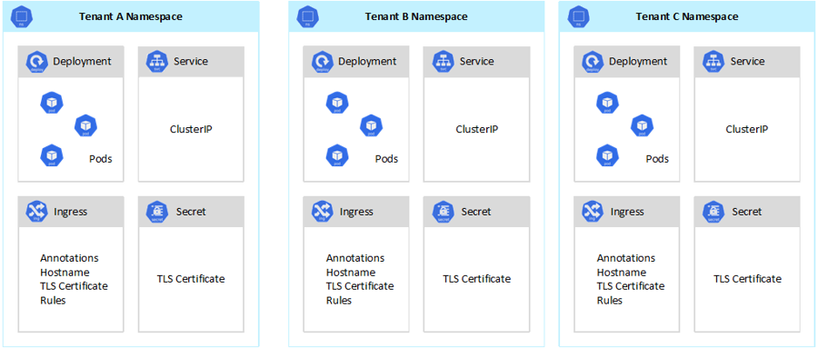
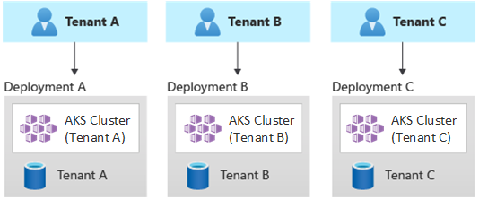
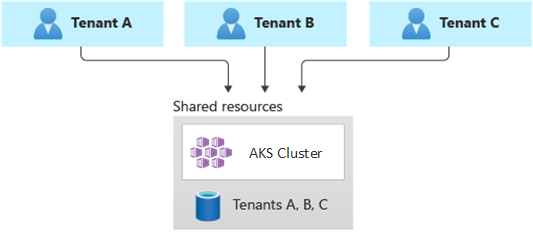
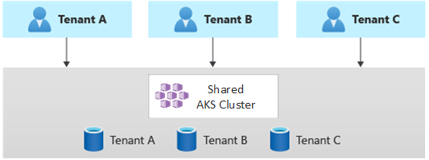
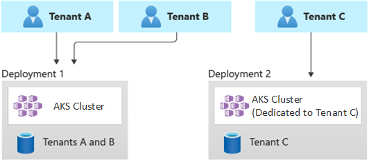
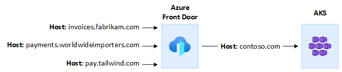

[Azure Kubernetes Service](/azure/aks/intro-kubernetes) (AKS) simplifies deploying a managed Kubernetes cluster in Azure by offloading the operational overhead to the Azure cloud platform. As a hosted Kubernetes service, Azure handles critical tasks, like health monitoring and maintenance. The Azure platform manages the AKS control plane, and you only pay for the AKS nodes that run your applications. 

AKS clusters can be shared across multiple tenants in different scenarios and ways. In some cases, diverse applications can run in the same cluster. In other cases, multiple instances of the same application can run in the same shared cluster, one for each tenant. All these types of sharing are frequently described using the umbrella term *multitenancy*. Kubernetes doesn't have a first-class concept of end-users or tenants. Still, it provides several features to help you manage different tenancy requirements.

In this article, we describe some of the features of AKS that are useful when building multitenant systems. For general guidance and best practices for Kubernetes multitenancy, see [Multi-tenancy](https://kubernetes.io/docs/concepts/security/multi-tenancy) in the Kubernetes documentation.

## Multitenancy types

The first step to determining how to share an AKS cluster across multiple tenants is to evaluate the patterns and tools at your disposal. In general, multitenancy in Kubernetes clusters falls into two main categories, though many variations are still possible. The Kubernetes [documentation](https://kubernetes.io/docs/concepts/security/multi-tenancy/#use-cases) describes two common use cases for multitenancy: multiple teams and multiple customers.

### Multiple teams

A common form of multitenancy is to share a cluster between multiple teams within an organization. Each team can deploy, monitor, and operate one or more solutions. These workloads frequently need to communicate with each other and with other internal or external applications that are located on the same cluster or other hosting platforms.

In addition, these workloads need to communicate with services, such as a relational database, a NoSQL repository, or a messaging system, which is hosted in the same cluster or is running as PaaS services on Azure.

In this scenario, members of the teams often have direct access to Kubernetes resources via tools, such as [kubectl](https://kubernetes.io/docs/reference/kubectl). Or, members have indirect access through GitOps controllers, such as [Flux](https://fluxcd.io) and [Argo CD](https://argo-cd.readthedocs.io/en/stable), or through other types of release automation tools.

For more information on this scenario, see [Multiple teams](https://kubernetes.io/docs/concepts/security/multi-tenancy/#multiple-teams) in the Kubernetes documentation.

### Multiple customers

Another common form of multitenancy frequently involves a software-as-a-service (SaaS) vendor. Or, a service provider runs multiple instances of a workload for their customers, which are considered separate tenants. In this scenario, the customers don't have direct access to the AKS cluster, but they only have access to their application. Moreover, they don't even know that their application runs on Kubernetes. Cost optimization is frequently a critical concern. Service providers use Kubernetes policies, such as [resource quotas](https://kubernetes.io/docs/concepts/policy/resource-quotas) and [network policies](https://kubernetes.io/docs/concepts/services-networking/network-policies), to ensure that the workloads are strongly isolated from each other. 

For more information on this scenario, see [Multiple customers](https://kubernetes.io/docs/concepts/security/multi-tenancy/#multiple-customers) in the Kubernetes documentation.

## Isolation models

According to the [Kubernetes documentation](https://kubernetes.io/docs/concepts/security/multi-tenancy/#isolation), a multitenant Kubernetes cluster is shared by multiple users and workloads that are commonly referred to as *tenants*. This definition includes Kubernetes clusters that different teams or divisions share within an organization. It also contains clusters that are shared by per-customer instances of a software-as-a-service (SaaS) application.

Cluster multitenancy is an alternative to managing many single-tenant dedicated clusters. The operators of a multitenant Kubernetes cluster must isolate tenants from each other. This isolation minimizes the damage that a compromised or malicious tenant can do to the cluster and to other tenants.

When several users or teams share the same cluster with a fixed number of nodes, there's a concern that one team could use more than its fair share of resources. [Resource Quotas](https://kubernetes.io/docs/concepts/policy/resource-quotas) is a tool for administrators to address this concern.

Based on the security level provided by isolation, we can distinguish between soft and hard multitenancy. 

- Soft multitenancy is suitable within a single enterprise where tenants are different teams or departments that trust each other. In this scenario, isolation aims to guarantee workloads integrity, orchestrate cluster resources across different internal user groups, and defend against possible security attacks.
- Hard multi tenancy is used to describe scenarios where heterogeneous tenants don't trust each other, often from security and resource-sharing perspectives.

When you plan to build a multitenant [Azure Kubernetes Service](/azure/aks/intro-kubernetes) (AKS) cluster, you should consider the layers of resource isolation and multitenancy that are provided by [Kubernetes](https://kubernetes.io/docs/concepts/security/multi-tenancy):

- Cluster
- Namespace
- Node pool or node
- Pod
- Container

In addition, you should consider the security implications of sharing different resources among multiple tenants. For example, scheduling pods from different tenants on the same node could reduce the number of machines needed in the cluster. On the other hand, you might need to prevent specific workloads from being collocated. For example, you might not allow untrusted code from outside your organization to run on the same node as containers that process sensitive information.

Although Kubernetes can't guarantee perfectly secure isolation between tenants, it does offer features that may be sufficient for specific use cases. As a best practice, you should separate each tenant and its Kubernetes resources into their namespaces. You can then use [Kubernetes role-based access control](https://kubernetes.io/docs/reference/access-authn-authz/rbac) (RBAC) and [Network Policies](https://kubernetes.io/docs/concepts/services-networking/network-policies) to enforce tenant isolation. For example, the following picture shows the typical SaaS provider model that hosts multiple instances of the same application on the same cluster, one for each tenant. Each application lives in a separate namespace.

There are several ways to design and build multitenant solutions with [Azure Kubernetes Service](/azure/aks/intro-kubernetes) (AKS). Each of these methods comes with its own set of tradeoffs, in terms of infrastructure deployment, network topology, and security. These methods impact the isolation level, implementation effort, operational complexity, and cost. You can apply tenant isolation in the control and data planes, based on your requirements.

## Control plane isolation

If you have isolation at the control plane level, you guarantee that different tenants can't access or affect each others' resources, such as pods and services. Also, they can't impact the performance of other tenants' applications. For more information, see [Control plane isolation](https://kubernetes.io/docs/concepts/security/multi-tenancy/#control-plane-isolation) in the Kubernetes documentation. The best way to implement isolation at the control plane level is to segregate each tenant's workload and its Kubernetes resources into a separate namespace.

According to the [Kubernetes documentation](https://kubernetes.io/docs/concepts/security/multi-tenancy/#namespaces), a [namespace](https://kubernetes.io/docs/reference/glossary/?fundamental=true#term-namespace) is an abstraction that's used to support the isolation of groups of resources within a single cluster. Namespaces can be used to isolate tenant workloads that are sharing a Kubernetes cluster:

- Namespaces allow distinct tenant workloads to exist in their own virtual workspace, without the risk of affecting each other's work. Separate teams within an organization can use namespaces to isolate their projects from each other, because they can use the same resource names in different namespaces without the risk of name overlapping.
- [RBAC roles and role bindings](https://kubernetes.io/docs/reference/access-authn-authz/rbac) are namespace-scoped resources that teams can use to limit tenant users and processes to access resources and services only in their namespaces. Different teams can define roles to group lists of permissions or abilities under a single name. They then assign these roles to user accounts and service accounts, to ensure that only the authorized identities have access to the resources in a given namespace.
- [Resource quotas](https://kubernetes.io/docs/concepts/policy/resource-quotas) for CPU and memory are namespaced objects. Teams can use them to ensure that workloads sharing the same cluster are strongly isolated from a system resource consumption. This method can ensure that every tenant application that runs in a separate namespace, has the resources it needs to run and avoid [noisy neighbor issues](/azure/architecture/antipatterns/noisy-neighbor/noisy-neighbor), which could affect other tenant applications that share the same cluster.
- [Network policies](https://kubernetes.io/docs/concepts/services-networking/network-policies) are namespaced objects that teams can adopt to enforce which network traffic is allowed for a given tenant application. You can use network policies to segregate distinct workloads that share the same cluster from a networking perspective.
- Team applications that run in distinct namespaces can use different [service accounts](https://kubernetes.io/docs/tasks/configure-pod-container/configure-service-account), to access resources within the same cluster, external applications, or managed services.
- Use namespaces to improve performance at the control plane level. If workloads in a shared cluster are organized into multiple namespaces, the Kubernetes API has fewer items to search when running operations. This organization can reduce the latency of calls against the API server and increase the throughput of the control plane.

For more information on the isolation at the namespace level, see the following resources in the Kubernetes documentation: 

- [Namespaces](https://kubernetes.io/docs/concepts/security/multi-tenancy/#namespaces)
- [Access Controls](https://kubernetes.io/docs/concepts/security/multi-tenancy/#access-controls)
- [Quotas](https://kubernetes.io/docs/concepts/security/multi-tenancy/#quotas)

## Data plane isolation

Data plane isolation guarantees that pods and workloads of distinct tenants are sufficiently isolated from one another. For more information, see [Data Plane Isolation](https://kubernetes.io/docs/concepts/security/multi-tenancy/#data-plane-isolation) in the Kubernetes documentation.

### Network isolation

When you run modern, microservices-based applications in Kubernetes, you often want to control which components can communicate with each other. By default, all pods in an AKS cluster can send and receive traffic without restrictions, including other applications that share the same cluster. To improve security, you can define network rules to control the flow of traffic. Network policy is a Kubernetes specification that defines access policies for communication between Pods. You can use [network policies](https://kubernetes.io/docs/concepts/services-networking/network-policies) to segregate communications between tenant applications that share the same cluster.

Azure Kubernetes Service (AKS) provides two ways to implement network policies:

1. Azure has its implementation for network policies, called Azure network policies.
2. [Calico network policies](https://projectcalico.docs.tigera.io/security/calico-network-policy) is an open-source network and network security solution founded by [Tigera](https://www.tigera.io).

Both implementations use Linux IPTables to enforce the specified policies. Network policies are translated into sets of allowed and disallowed IP pairs. These pairs are then programmed as IPTable filter rules. You can only use Azure network policies with AKS clusters that are configured with the [Azure CNI](/azure/aks/configure-azure-cni) network plugin. However, Calico network policies support both [Azure CNI](/azure/aks/configure-azure-cni) and [kubenet](/azure/aks/use-network-policies). For more information, see [Secure traffic between pods using network policies in Azure Kubernetes Service](/azure/aks/use-network-policies).

For more information, see [Network isolation](https://kubernetes.io/docs/concepts/security/multi-tenancy/#network-isolation) in the Kubernetes documentation.

### Storage isolation

Azure provides a rich set of managed, platform-as-a-service (PaaS) data repositories, such as [Azure SQL Database](/azure/azure-sql/database/sql-database-paas-overview) and [Azure Cosmos DB](/azure/cosmos-db/introduction), and other storage services that you can use as [persistent volumes](/azure/aks/concepts-storage#volumes) for your workloads. Tenant applications running on a shared AKS cluster can [share a database or file store](/azure/architecture/guide/multitenant/approaches/storage-data#shared-multitenant-databases-and-file-stores), or they can use [a dedicated data repository and storage resource](/azure/architecture/guide/multitenant/approaches/storage-data#multitenant-app-with-dedicated-databases-for-each-tenant). For more information on different strategies and approaches to manage data in a multitenant scenario, see [Architectural approaches for storage and data in multitenant solutions](/azure/architecture/guide/multitenant/approaches/storage-data).

Workloads running on [Azure Kubernetes Service](/azure/aks/intro-kubernetes) (AKS) can also use persistent volumes to store data. On Azure, you can create [persistent volumes](/azure/aks/concepts-storage#volumes) as Kubernetes resources that are backed by Azure Storage. You can manually create data volumes and assign them to pods directly, or you can have AKS automatically create them using [persistent volume claims](/azure/aks/concepts-storage#persistent-volume-claims). AKS provides built-in storage classes to create persistent volumes that are backed by [Azure Disks](/azure/virtual-machines/disks-types), [Azure Files](/azure/storage/files/storage-files-planning), and [Azure NetApp Files](/azure/azure-netapp-files/azure-netapp-files-service-levels). For more information, see [Storage options for applications in Azure Kubernetes Service (AKS)](/azure/aks/concepts-storage). For security and resiliency reasons, you should avoid using local storage on agent nodes via [emptyDir](https://kubernetes.io/docs/concepts/storage/volumes/#emptydir) and [hostPath](https://kubernetes.io/docs/concepts/storage/volumes/#hostpath).

When AKS [built-in storage classes](/azure/aks/azure-disk-csi#dynamically-create-azure-disks-pvs-by-using-the-built-in-storage-classes) aren't a good fit for one or more tenants, you can build custom [storage classes](https://kubernetes.io/docs/concepts/storage/storage-classes) to address different tenants requirements. These requirements include volume size, storage SKU, a service-level agreement (SLA), backup policies, and the pricing tier.

For example, you can configure a custom storage class for each tenant. You can then use it to apply tags to any persistent volume that's created in their namespace to charge back their costs to them. For more information on this scenario, see [Use Azure tags in Azure Kubernetes Service (AKS)](https://techcommunity.microsoft.com/t5/fasttrack-for-azure/use-azure-tags-in-azure-kubernetes-service-aks/ba-p/3611583).

For more information, see [Storage isolation](https://kubernetes.io/docs/concepts/security/multi-tenancy/#storage-isolation) in the Kubernetes documentation.

### Node isolation

Tenant workloads can be configured to run on separate agent nodes to avoid the [Noisy Neighbor issue](/azure/architecture/antipatterns/noisy-neighbor/noisy-neighbor) and the risk of information disclosure. In AKS, you can create a separate cluster, or just a dedicated node pool, for those tenants that have strict requirements in terms of isolation, security, regulatory compliance, and performance. 

You can use [taints](https://kubernetes.io/docs/concepts/scheduling-eviction/taint-and-toleration), [tolerations](https://kubernetes.io/docs/concepts/scheduling-eviction/taint-and-toleration), [node labels](https://kubernetes.io/docs/concepts/scheduling-eviction/assign-pod-node), [node selectors](https://kubernetes.io/docs/concepts/scheduling-eviction/assign-pod-node), and [node affinity](https://kubernetes.io/docs/concepts/scheduling-eviction/assign-pod-node) to constrain tenants pods to run only on a particular set of nodes or node pools.

In general, Azure Kubernetes Service (AKS) provides workload isolation at different levels:

- At the kernel level by running tenant workloads in lightweight virtual machines on shared agent nodes using [Pod Sandboxing](#pod-sandboxing) based on [Kata Containers](https://katacontainers.io/)
- At the physical level by hosting tenant applications on dedicated clusters or node pools.
- At the hardware level by running tenant workloads on [Azure Dedicated Hosts](#azure-dedicated-hosts) that guarantee that agent node VMs run dedicated physical machines. Hardware isolation ensures that no other virtual machines are placed on the dedicated hosts, providing an additional layer of isolation for tenant workloads.

These techniques can be combined. For example, you can run per-tenant clusters and node pools on an [Azure Dedicated Host Group](#azure-dedicated-hosts) to achieve workload segregation and physical isolation at the hardware level. You can also create shared or per-tenant node pools that support Enable [Federal Information Process Standard (FIPS)](#federal-information-process-standard-fips), [Confidential Virtual Machines (CVM)](#confidential-virtual-machines-cvm), or [Host-based encryption](#host-based-encryption).

Node isolation allows you to  easily associate and charge back the cost of a set of nodes or node pool to a single tenant. It's strictly related to the tenancy model that's adopted by your solution.

For more information, see [Node Isolation](https://kubernetes.io/docs/concepts/security/multi-tenancy/#node-isolation) in the Kubernetes documentation.

## Tenancy models

Azure Kubernetes Service (AKS) provides more types of node isolation and tenancy models.

### Automated single-tenant deployments

In an automated single-tenant deployment model, you deploy a dedicated set of resources for each tenant, as illustrated in this example:

Each tenant workload runs in a dedicated AKS cluster and accesses a distinct set of Azure resources. Typically, multitenant solutions that are built using this model make extensive use of [infrastructure as code](/devops/deliver/what-is-infrastructure-as-code) (IaC). For example, [Bicep](/azure/azure-resource-manager/bicep/overview?tabs=bicep), [Azure  Resource Manager (ARM)](/azure/azure-resource-manager/management/overview), [Terraform](/azure/developer/terraform/overview), or the [Azure Resource Manager REST APIs](/rest/api/resources) help initiate and coordinate the on-demand deployment of tenant-dedicated resources. You might use this approach when you need to provision an entirely separate infrastructure for each of your customers. When planning your deployment, consider using the [Deployment Stamps pattern](../../../patterns/deployment-stamp.yml).

**Benefits:**

- A key benefit of this approach is that the API Server of each tenant AKS cluster is separate. This approach guarantees full isolation across tenants from a security, networking, and resource consumption level. An attacker that manages to get control of a container will only have access to the containers and volumes mounted that belong to a single tenant. A full-isolation tenancy model is critical to some customers with a high regulatory compliance overhead.
- Tenants are unlikely to affect each other's system performance, which allows you to avoid the [Noisy Neighbor problem](/azure/architecture/antipatterns/noisy-neighbor/noisy-neighbor). This consideration includes the traffic against the API Server. The API server is a shared, critical component in any Kubernetes cluster. Custom controllers, which generate unregulated, high-volume traffic against the API server, can cause cluster instability. This instability leads to request failures, timeouts, and API retry storms. The [Uptime SLA](/azure/aks/uptime-sla) (service-level agreement) feature allows you to scale out the control plane of an AKS cluster to meet traffic demand. Still, provisioning a dedicated cluster may be a better solution for those customers with strong requirements in terms of workload isolation.
- Updates and changes can be rolled out progressively across tenants, which reduce the likelihood of a system-wide outage. Azure costs can be easily charged back to tenants, as every resource is used by a single tenant.

**Risks:**

- Cost efficiency is low because every tenant uses a dedicated set of resources.
- Ongoing maintenance is likely to be time-consuming, as it needs to be replicated across multiple AKS clusters, one for each tenant. Consider automating your operational processes and applying changes progressively through your environments. It would help if you also considered other cross-deployment operations, like reporting and analytics across your whole estate. Likewise, ensure you plan how to query and manipulate data across multiple deployments.

### Fully multitenant deployments

In a fully multitenant deployment, a single application serves the requests of all the tenants, and all the Azure resources are shared, including the AKS cluster. In this context, you only have one set of infrastructure to deploy, monitor, and maintain. All the tenants use the resource, as illustrated in the following diagram:

**Benefits**:

- This model is attractive because of the lower cost of operating a solution with shared components. When using this tenancy model, you may need to deploy a larger AKS cluster and adopt a higher SKU for any shared data repository to sustain the traffic generated by all tenants' resources, such as data repositories.

**Risks**:

- In this context, a single application handles all the tenants' requests. You should design and implement security measures to prevent tenants from flooding the application with calls. These calls could slow down the entire system and impact all the tenants.
- If the traffic profile is highly variable, you should configure the AKS cluster autoscaler to vary the number of pods and agent nodes. Base your configuration on the system resource usage, such as CPU and Memory. Alternatively, you could scale out and scale in the number of pods and cluster nodes, based on custom metrics. For example, you can explore the number of pending requests or the metrics of an external messaging system that uses [Kubernetes Event-driven Autoscaling](https://keda.sh) (KEDA).
- Make sure you separate the data for each tenant and implement safeguards to avoid data leakage between different tenants.
- Make sure to [track and associate Azure costs](/azure/architecture/guide/multitenant/considerations/measure-consumption) to individual tenants, based on their actual usage. Third-party solutions, such as [kubecost](https://www.kubecost.com), can help you calculate and break down costs across different teams and tenants.
- Maintenance can be more straightforward with a single deployment, since you only have to update one set of Azure resources and maintain a single application. However, it's also often riskier since any changes to the infrastructure or application components can affect the entire customer base.
- You should also consider scale limitations. You're more likely to hit Azure resource scale limits when you have a shared set of resources. To avoid hitting a resource quota limit, you might consider distributing your tenants across multiple Azure subscriptions.

### Horizontally partitioned deployments

Alternatively, you can consider horizontally partitioning your multitenant Kubernetes application. This approach consists in sharing some solution components across all the tenants and deploying dedicated resources for individual tenants. For example, you could build a single multitenant Kubernetes application and then create individual databases, one for each tenant, as shown in this illustration:

**Benefits:**

- Horizontally partitioned deployments can help you mitigate the [Noisy Neighbor issue](/azure/architecture/antipatterns/noisy-neighbor/noisy-neighbor). Consider this approach, if you've identified that most of the traffic load on your Kubernetes application is due to specific components, which you can deploy separately, for each tenant. For example, your databases might absorb most of your system's load, because the query load is high. If a single tenant sends a large number of requests to your solution, the performance of a database might be negatively affected, but other tenants' databases (and shared components, like the application tier) remain unaffected.

**Risks:**

- With a horizontally partitioned deployment, you still need to consider the automated deployment and management of your components, especially the components used by a single tenant.
- This model may not provide the required level of isolation for those customers that can't afford to share resources with other tenants, for internal policies or compliance reasons.

### Vertically partitioned deployments

You can take advantage of the benefits of the single-tenant and fully multitenant models by using a hybrid model that vertically partitions tenants across multiple AKS clusters or node pools. This approach provides the following advantages over the previous two tenancy models:

- You can use a combination of single-tenant and multitenant deployments. For example, you can have most of your customers share an AKS cluster and database on a multitenant infrastructure. Still, you might also deploy single-tenant infrastructures for those customers who require higher performance and isolation.
- You can deploy tenants to multiple regional AKS clusters, potentially with different configurations. This technique is most effective when you have tenants spread across different geographies.

You can implement different variations of this tenancy model. For example, you can choose to offer your multitenant solution with different tiers of functionality at a different cost. Your pricing model could provide multiple SKUs, each providing an incremental level of performance and isolation, in terms of resource sharing, performance, network, and data segregation. Consider the following tiers:

- Basic tier: The tenant requests are served by a single, multitenant Kubernetes application that's shared with other tenants. Data is stored in one or more databases that are shared by all Basic-tier tenants.
- Standard tier: Tenants requests are served by a dedicated Kubernetes application that runs in a separate namespace, which provides isolation boundaries in terms of security, networking, resource consumption. All the tenants' applications, one for each tenant, share the same AKS cluster and node pool with other standard-tier customers.
- Premium tier: The tenant application runs in a dedicated node pool or AKS cluster, to guarantee a higher service level agreement, performance, and isolation degree. This tier could provide a flexible cost model based on the number and SKU of the agent nodes that are used to host the tenant application. You can use [Pod Sandboxing](#pod-sandboxing) as an alternative solution to using dedicated clusters or node pools to isolate distinct tenant workloads.

The following diagram shows a scenario where tenants A and B run on a shared AKS cluster, whereas tenant C runs on a separate AKS cluster.

Likewise, the following diagram shows a scenario where tenants A and B run on the same node pool, whereas tenant C runs on a dedicated node pool.

This model can also offer different service-level agreements for different tiers. For example, the basic tier can offer 99.9% uptime, the standard tier can offer 99.95% uptime, and the premium tier can offer 99.99%. The higher service-level agreement (SLA) could be implemented by using services and features that enable higher availability targets.

**Benefits:**

- Since you're still sharing infrastructure, you can still gain some of the cost benefits of having shared multitenant deployments. You can deploy clusters and node pools that are shared across multiple basic-tier and standard-tier tenant applications, which use a cheaper VM size for agent nodes. This approach guarantees better density and cost savings. For premium-tier customers, you can deploy AKS clusters and node pools with a higher VM size and a maximum number of pod replicas and nodes at a higher price.
- You can run system services, such as [CoreDNS](https://kubernetes.io/docs/tasks/administer-cluster/coredns), [Konnectivity](https://kubernetes.io/docs/tasks/extend-kubernetes/setup-konnectivity), or [Azure Application Gateway Ingress Controller](/azure/application-gateway/ingress-controller-overview), in a dedicated system-mode node pool. You can use [taints](https://kubernetes.io/docs/concepts/scheduling-eviction/taint-and-toleration), [tolerations](https://kubernetes.io/docs/concepts/scheduling-eviction/taint-and-toleration), [node labels](https://kubernetes.io/docs/concepts/scheduling-eviction/assign-pod-node), [node selectors](https://kubernetes.io/docs/concepts/scheduling-eviction/assign-pod-node), and [node affinity](https://kubernetes.io/docs/concepts/scheduling-eviction/assign-pod-node) to run a tenant application on one or more user-mode node pools.
- You can use [taints](https://kubernetes.io/docs/concepts/scheduling-eviction/taint-and-toleration), [tolerations](https://kubernetes.io/docs/concepts/scheduling-eviction/taint-and-toleration), [node labels](https://kubernetes.io/docs/concepts/scheduling-eviction/assign-pod-node), [node selectors](https://kubernetes.io/docs/concepts/scheduling-eviction/assign-pod-node), and [node affinity](https://kubernetes.io/docs/concepts/scheduling-eviction/assign-pod-node) to run shared resources. For example, you can have an ingress controller or messaging system on a dedicated node pool, with a specific VM size, autoscaler settings, and availability-zones support.

**Risks:**

- You need to design your Kubernetes application to support both multitenant and single-tenant deployments.
- If you plan to allow migration between infrastructures, you need to consider how you migrate customers from a multitenant deployment to their own single-tenant deployment.
- You need a consistent strategy and a single pane of glass (one viewpoint) to monitor and manage more AKS clusters.

## Autoscaling

To keep up with the traffic demand that's generated by tenant applications, you can enable the [cluster autoscaler](/azure/aks/cluster-autoscaler) to scale the agent nodes of your Azure Kubernetes Service (AKS). Autoscaling helps systems remain responsive in the following circumstances:

- The traffic load increases during specific work hours or periods of the year.
- Tenant or shared heavy loads are deployed to a cluster.
- Agent nodes become unavailable due to zonal outages.

When you enable autoscaling for a node pool, you specify a minimum and a maximum number of nodes based on the expected workload sizes. By configuring a maximum number of nodes, you can ensure enough space for all the tenant pods in the cluster, regardless of the namespace they run in.

When the traffic increases, cluster autoscaling adds new agent nodes to avoid pods going into a pending state, due to a shortage of resources in terms of CPU and memory.

Likewise, when the load diminishes, cluster autoscaling decreases the number of agent nodes in a node pool, based on the specified boundaries, which helps reduce your operational costs.

You can use pod autoscaling to scale pods automatically, based on resource demands. [Horizontal Pod Autoscaler (HPA)](https://kubernetes.io/docs/tasks/run-application/horizontal-pod-autoscale) automatically scales the number of pod replicas, based on CPU/memory utilization or custom metrics. With [Kubernetes Event-driven Autoscaling](https://keda.sh) (KEDA), you can drive the scaling of any container in Kubernetes, based on the number of events of external systems, such as [Azure Event Hubs](https://keda.sh/docs/2.7/scalers/azure-event-hub) or [Azure Service Bus](https://keda.sh/docs/2.7/scalers/azure-service-bus), which are used by tenant applications.

## Maintenance

To reduce the risk of downtimes that may affect tenant applications during cluster or node pool upgrades, schedule AKS [Planned Maintenance](/azure/aks/planned-maintenance) to occur during off-peak hours. Planned Maintenance allows you to schedule weekly maintenance windows to update the control plane of the AKS clusters that run tenant applications and node pools, which minimizing workload impact. You can schedule one or more weekly maintenance windows on your cluster by specifying a day or time range on a specific day. All maintenance operations will occur during the scheduled windows.

## Security

### Cluster access

When you share an AKS cluster between multiple teams within an organization, you need to implement the [principle of least privilege](https://en.wikipedia.org/wiki/Principle_of_least_privilege) to isolate different tenants from one another. In particular, you need to make sure that users have access only to their Kubernetes namespaces and resources when using tools, such as [kubectl](https://kubernetes.io/docs/reference/kubectl), [Helm](https://helm.sh), [Flux](https://fluxcd.io), [Argo CD](https://argo-cd.readthedocs.io/en/stable), or other types of tools.

For more information about authentication and authorization with AKS, see the following articles:

- [Access and identity options for Azure Kubernetes Service (AKS)](/azure/aks/concepts-identity)
- [AKS-managed Azure Active Directory integration](/azure/aks/managed-aad)
- [Control access to cluster resources using Kubernetes role-based access control and Azure Active Directory identities in Azure Kubernetes Service](/azure/aks/azure-ad-rbac)

### Workload identity

If you host multiple tenant applications on a single AKS cluster, and each is in a separate namespace, then each workload should use a different [Kubernetes service account](https://kubernetes.io/docs/tasks/configure-pod-container/configure-service-account) and credentials to access the downstream Azure services. *Service accounts* are one of the primary user types in Kubernetes. The Kubernetes API holds and manages service accounts. Service account credentials are stored as Kubernetes secrets, which allows them to be used by authorized pods to communicate with the API Server. Most API requests provide an authentication token for a service account or a normal user account.

Tenant workloads deployed to AKS clusters can use Azure AD application credentials to access Azure AD-protected resources, such as Azure Key Vault and Microsoft Graph. [Azure AD Workload Identity for Kubernetes](https://azure.github.io/azure-workload-identity/docs/introduction.html) integrates with the Kubernetes native capabilities to federate with any external identity providers.

### Pod Sandboxing

AKS includes a mechanism called [Pod Sandboxing](/azure/aks/use-pod-sandboxing) that provides an isolation boundary between the container application and the shared kernel and compute resources of the container host, such as CPU, memory, and networking. Pod Sandboxing complements other security measures or data protection controls to help tenant workloads secure sensitive information and meet regulatory, industry, or governance compliance requirements like Payment Card Industry Data Security Standard (PCI DSS), International Organization for Standardization (ISO) 27001, and Health Insurance Portability and Accountability Act (HIPAA).

Deploying applications on separate clusters or node pools allows you to isolate tenant workloads of different teams or customers strongly. While using multiple clusters and node pools may be suitable for the isolation requirements of many organizations and SaaS solutions, there are cases in which a single cluster with shared VM node pools can be more efficient, for example, when running untrusted and trusted pods in the same node or co-locating daemonsets and privileged containers on the same node for faster local communication and functional grouping. [Pod Sandboxing](/azure/aks/use-pod-sandboxing) can help you to strongly isolate tenant applications on the same cluster nodes without the need to run these workloads in separate clusters or node pools. While other methods require that you recompile your code or run into other compatibility requirements, Pod Sandboxing in AKS can run any container unmodified inside a secure VM boundary.

Pod Sandboxing on AKS is based on [Kata Containers](https://katacontainers.io/) running on the Azure Linux container host for AKS stack delivers hardware-enforced isolation. Kata Containers on AKS are built on top of a security-hardened Azure hypervisor using [Azure Linux container host for AKS](/azure/aks/use-azure-linux). The isolation per pod is achieved by using a nested lightweight Kata VM that carves out resources from a parent VM node. In this model, each Kata pod gets its own kernel per nested Kata guest VM. This allows users to pack many Kata containers in a single guest VM, while continuing to run containers in the parent VM, providing strong Isolation boundary within a shared AKS Cluster.

For more information, see:

- [Pod Sandboxing with Azure Kubernetes Service (AKS)](/azure/aks/use-pod-sandboxing)
- [Support for Kata VM Isolated Containers on AKS for Pod Sandboxing](https://techcommunity.microsoft.com/t5/apps-on-azure-blog/preview-support-for-kata-vm-isolated-containers-on-aks-for-pod/ba-p/3751557)

### Azure Dedicated Hosts

[Azure Dedicated Hosts](/azure/virtual-machines/dedicated-hosts) are physical servers dedicated to a single Azure subscription, which provide hardware isolation at the physical server level. These dedicated hosts can be provisioned within a region, availability zone, and fault domain, allowing users to place virtual machines (VMs) directly into the provisioned hosts.

By utilizing Azure Dedicated Hosts with AKS, several benefits can be achieved. Firstly, hardware isolation ensures that no other virtual machines are placed on the dedicated hosts, providing an additional layer of isolation for tenant workloads. These dedicated hosts are deployed in the same data centers and share the same network and underlying storage infrastructure as other non-isolated hosts. Secondly, Azure Dedicated Hosts offer control over maintenance events initiated by the Azure platform. Users can opt for a maintenance window, reducing the impact on services and ensuring the availability and privacy of tenant workloads.

Azure Dedicated Hosts can help SaaS providers ensure tenant applications meet regulatory, industry, and governance compliance requirements for securing sensitive information. For more information, see [Add Azure Dedicated Host to an Azure Kubernetes Service (AKS) cluster](/azure/aks/use-azure-dedicated-hosts).

### Confidential Virtual Machines (CVM)

You can use [Confidential Virtual Machines (CVM)](/azure/aks/use-cvm) to add one or more node pools to your AKS cluster to address tenants' strict isolation, privacy, and security requirements. [Confidential Virtual Machines (CVM)](https://techcommunity.microsoft.com/t5/azure-confidential-computing/azure-confidential-vms-using-sev-snp-dcasv5-ecasv5-are-now/ba-p/3573747) adopt VMs with a hardware-based [Trusted Execution Environment (TEE)](https://en.wikipedia.org/wiki/Trusted_execution_environment). [AMD Secure Encrypted Virtualization-Secure Nested Paging (SEV-SNP)](https://www.amd.com/system/files/TechDocs/SEV-SNP-strengthening-vm-isolation-with-integrity-protection-and-more.pdf) confidential VMs deny the hypervisor and other host management code access to VM memory and state, adding defense in-depth protections against operator access. For more information, see [Use Confidential Virtual Machines (CVM) in Azure Kubernetes Service (AKS) cluster](/azure/aks/use-cvm).

### Federal Information Process Standard (FIPS)

The [Federal Information Processing Standard (FIPS) 140-2](https://csrc.nist.gov/publications/detail/fips/140/3/final) is a US government standard that defines minimum security requirements for cryptographic modules in information technology products and systems. By enabling [Federal Information Process Standard (FIPS) compliance for AKS node pools](/azure/aks/enable-fips-nodes), organizations can enhance the isolation, privacy, and security of their tenant workloads. [FIPS](/azure/compliance/offerings/offering-fips-140-2) compliance ensures the use of validated cryptographic modules for encryption, hashing, and other security-related operations. With FIPS-enabled AKS node pools, customers can meet regulatory and industry compliance requirements by employing robust cryptographic algorithms and mechanisms. Microsoft Azure provides documentation on how to enable FIPS for AKS node pools, allowing customers to strengthen the security posture of their multitenant AKS environments. For more information, see [Enable Federal Information Process Standard (FIPS) for Azure Kubernetes Service (AKS) node pools](/azure/aks/enable-fips-nodes).

### Bring your own keys (BYOK) with Azure disks

Azure Storage encrypts all data in a storage account at rest, including the OS and data disks of an Azure Kubernetes Service (AKS) cluster. By default, data is encrypted with Microsoft-managed keys. For more control over encryption keys, you can supply customer-managed keys to use for encryption at rest for both the OS and data disks for your AKS clusters. For more information, see:

- [Bring your own keys (BYOK) with Azure disks in Azure Kubernetes Service (AKS)](/azure/aks/azure-disk-customer-managed-keys)
- [Server-side encryption of Azure Disk Storage](/azure/virtual-machines/disk-encryption)

### Host-based encryption

[Host-based encryption](/azure/aks/enable-host-encryption) on Azure Kubernetes Service (AKS) further strengthens tenant workloads' isolation, privacy, and security. By enabling host-based encryption, AKS encrypts data at rest on the underlying host machines, ensuring that sensitive tenant information is protected from unauthorized access. Temporary disks and ephemeral OS disks are encrypted at rest with platform-managed keys when you enable end-to-end encryption.

In AKS, OS and data disks use server-side encryption with platform-managed keys by default. The caches for these disks are encrypted at rest with platform-managed keys. You can specify your own [key encryption key (KEK)](/azure/security/fundamentals/encryption-atrest) to encrypt the [data protection key (DEK)](/azure/security/fundamentals/encryption-atrest) using envelope encryption, also referred to as wrapping. The cache for the OS and data disks are also encrypted using the [bring your own key (BYOK)](/azure/aks/azure-disk-customer-managed-keys) you specify.

Host-based encryption adds an extra layer of security for multitenant environments, where each tenant's data in the OS and data disk caches is encrypted at rest with either customer-managed or platform-managed keys, depending on the selected disk encryption type. For more information, see:

- [Host-based encryption on Azure Kubernetes Service (AKS)](/azure/aks/enable-host-encryption)
- [Bring your own keys (BYOK) with Azure disks in Azure Kubernetes Service (AKS)](/azure/aks/azure-disk-customer-managed-keys)
- [Server-side encryption of Azure Disk Storage](/azure/virtual-machines/disk-encryption)

## Networking

### Restrict network access to the API server

In Kubernetes, the API server receives requests to perform actions in the cluster, such as creating resources or scaling the number of nodes. When sharing an AKS cluster across multiple teams within an organization, protect access to the control plane by using one of the following solutions.

### Private AKS clusters

By using a private AKS cluster, you can make sure the network traffic between your API server and your node pools remains within your virtual network. In a private AKS cluster, the control plane or API server has an internal IP address that's only accessible via an [Azure private endpoint](/azure/private-link/private-endpoint-overview), which is located in the same virtual network of the AKS cluster. Likewise, any virtual machine in the same virtual network can privately communicate with the control plane via the private endpoint. For more information, see [Create a private Azure Kubernetes Service cluster](/azure/aks/private-clusters).

### Authorized IPs

The second option to improve cluster security and minimize attacks is using [authorized IPs](/azure/aks/api-server-authorized-ip-ranges). This approach restricts the access to the control plane of a public AKS cluster to a well-known list of Internet Protocol (IP) addresses and Classless Inter-Domain Routing (CIDR). When you use authorized IPs, they're still publicly exposed, but access is limited to a set of IP ranges. For more information, see [Secure access to the API server using authorized IP address ranges in Azure Kubernetes Service (AKS)](/azure/aks/api-server-authorized-ip-ranges).

### Private Link integration

[Azure Private Link Service (PLS)](/azure/private-link/private-link-service-overview) is an infrastructure component that allows applications to privately connect to a service via an [Azure private endpoint (PE)](/azure/private-link/private-endpoint-overview) that's defined in a virtual network and connected to the frontend IP configuration of an [Azure Load Balancer (ALB)](/azure/load-balancer/load-balancer-overview) instance. With [Azure Private Link](/azure/private-link/private-link-overview), service providers can securely provide their services to their tenants that can connect from within Azure or on-premises, without data exfiltration risks.

You can use [Azure Private Link Service Integration](https://cloud-provider-azure.sigs.k8s.io/topics/pls-integration) to provide tenants with private connectivity to their AKS-hosted workloads in a secure way, without the need to expose any public endpoint on the public internet.

For general guidance on how you can configure Private Link for an Azure-hosted multitenant solution, see [Multitenancy and Azure Private Link](/azure/architecture/guide/multitenant/service/private-link).

### Reverse proxies

A [reverse proxy](https://en.wikipedia.org/wiki/Reverse_proxy) is a load balancer and an [API gateway](/azure/architecture/microservices/design/gateway) that is typically used in front of tenant applications to secure, filter, and dispatch incoming requests. Popular reverse proxies support features such as load balancing, SSL termination, and layer 7 routing. Reverse proxies are typically implemented to help increase security, performance, and reliability. Popular reverse proxies for Kubernetes include the following implementations:

- [NGINX Ingress Controller](https://kubernetes.github.io/ingress-nginx) is a popular reverse proxy server that supports advanced features, such as load balancing, SSL termination, and layer 7 routing.
- [Traefik Kubernetes Ingress provider](https://doc.traefik.io/traefik/providers/kubernetes-ingress) is a Kubernetes Ingress controller that can be used to manage access to cluster services by supporting the ingress specification.
- [HAProxy Kubernetes Ingress Controller](https://www.haproxy.com/documentation/kubernetes/latest) is yet another reverse proxy for Kubernetes, which supports standard features such as TLS termination, URL-path-based routing, and more.
- [Azure Application Gateway Ingress Controller (AGIC)](/azure/application-gateway/ingress-controller-overview) is a [Kubernetes](https://kubernetes.io/docs/concepts/overview/what-is-kubernetes) application, which makes it possible for Azure Kubernetes Service (AKS) customers to leverage Azure's native [Application Gateway](/azure/application-gateway/overview) L7 load-balancer, to expose tenant applications to the public internet or internally to other systems that run in a virtual network.

When using an AKS-hosted reverse proxy to secure and handle incoming requests to multiple tenant applications, consider the following recommendations:

- Host the reverse proxy on a dedicated node pool that's configured to use a VM size with a high-network bandwidth and [accelerated networking](/azure/virtual-network/accelerated-networking-overview) enabled.
- Configure the node pool that's hosting your reverse proxy for autoscaling.
- To avoid increased latency and timeouts for tenant applications, define an autoscaling policy so that the number of ingress controller pods can instantly expand and contract to match traffic fluctuations.
- Consider sharding the incoming traffic to tenant applications, across multiple instances of your ingress controller, to increase the scalability and segregation level.

When using the [Azure Application Gateway Ingress Controller (AGIC)](/azure/application-gateway/ingress-controller-overview), consider implementing the following best practices:

- Configure the [Application Gateway](/azure/application-gateway/overview) that's used by the ingress controller for [Autoscaling](/azure/application-gateway/application-gateway-autoscaling-zone-redundant). With autoscaling enabled, the Application Gateway and WAF v2 SKUs scale out or in, based on application traffic requirements. This mode offers better elasticity to your application and eliminates the need to guess the application gateway size or instance count. This mode also allows you to save cost, by not requiring the gateway to run at peak-provisioned capacity for the expected maximum traffic load. You must specify a minimum (and optionally maximum) instance count.
- Consider deploying multiple instances of the [Application Gateway Ingress Controller (AGIC)](/azure/application-gateway/ingress-controller-overview), each associated to a separate [Application Gateway](/azure/application-gateway/overview), when the number of tenant applications exceeds the [maximum amount of sites](/azure/azure-resource-manager/management/azure-subscription-service-limits#application-gateway-limits). Assuming that each tenant application runs in a dedicated namespace, use [multiple namespace support](/azure/application-gateway/ingress-controller-multiple-namespace-support) to spread tenant applications across more instances of the [Application Gateway Ingress Controller (AGIC)](/azure/application-gateway/ingress-controller-overview).

### Integration with Azure Front Door

[Azure Front Door](/azure/frontdoor/front-door-overview) is a global layer-7 load balancer and Microsoft's modern cloud content delivery network (CDN) that provides fast, reliable, and secure access between users and web applications across the globe. Azure Front Door supports features such as request acceleration, SSL termination, response caching, WAF at the edge, URL-based routing, rewrite, and redirections that you can exploit when exposing AKS-hosted multitenant applications to the public internet.

For example, you might want to use an AKS-hosted multitenant application to serve all the customers' requests. In this context, you can use Azure Front Door to manage multiple custom domains, one for each tenant. You can terminate SSL connections on the edge and route all the traffic to the AKS-hosted multitenant application that's configured with a single hostname.

You can configure Azure Front Door to modify the [request origin host header](/azure/frontdoor/front-door-backend-pool#origin-host-header) to match the domain name of the backend application. The original `Host` header sent by the client is propagated through the `X-Forwarded-Host` header, and the code of the multitenant application can use this information to [map the incoming request to the correct tenant](../considerations/map-requests.yml).

[Azure Web Application Firewall (WAF)](/azure/web-application-firewall/afds/afds-overview), on Azure Front Door, provides centralized protection for web applications. You can use Azure WAF to defend AKS-hosted tenant applications that expose a public endpoint on the internet from malicious attacks.

You can configure Azure Front Door Premium to privately connect to one or more tenant applications that run on an AKS cluster, via an internal load balancer origin, by using [Azure Private Link Service](/azure/private-link/private-link-service-overview). For more information, see [Connect Azure Front Door Premium to an internal load balancer origin with Private Link](/azure/frontdoor/standard-premium/how-to-enable-private-link-internal-load-balancer).

### Outbound connections

When AKS-hosted applications connect to a large number of databases or external services, the cluster might be at risk of SNAT port exhaustion. [SNAT Ports](/azure/load-balancer/load-balancer-outbound-connections#what-are-snat-ports) generate unique identifiers that are used to maintain distinct flows that are initiated by applications that run on the same set of compute resources. By running several tenant applications on a shared Azure Kubernetes Service cluster, you might make a high number of outbound calls, which can lead to a SNAT port exhaustion. An AKS cluster can handle outbound connections in three different ways:

- [Azure Public Load Balancer](/azure/load-balancer/load-balancer-overview): By default, AKS provisions a Standard SKU Load Balancer to be set up and used for egress connections. However, the default setup may not meet the requirements of all scenarios, if public IPs are disallowed or if additional hops are required for egress. By default, the public Load Balancer gets created with a default public IP address that is used by the [outbound rules](/azure/load-balancer/outbound-rules). Outbound rules allow you to explicitly define source network address translation (SNAT) for a public standard load balancer. This configuration allows you to use the public IP(s) of your load balancer to provide outbound internet connectivity for your backend instances. When necessary, to avoid [SNAT port exhaustion](/azure/load-balancer/troubleshoot-outbound-connection), you can configure the outbound rules of the public load balancer to use additional public IP addresses. For more information, see [Use the frontend IP address of a load balancer for outbound via outbound rules](/azure/load-balancer/load-balancer-outbound-connections#outboundrules).
- [Azure NAT Gateway](/azure/virtual-network/nat-gateway/nat-overview): You can configure an AKS cluster to use Azure NAT Gateway to route egress traffic from tenant applications. NAT Gateway allows up to 64,512 outbound UDP and TCP traffic flows per public IP address, with a maximum of 16 IP addresses. To avoid the risk of SNAT port exhaustion when using a NAT Gateway to handle outbound connections from an AKS cluster, you can associate more public IP addresses or a [public IP address prefix](/azure/virtual-network/ip-services/public-ip-address-prefix) to the gateway. For more information, see [Azure NAT Gateway considerations for multitenancy](/azure/architecture/guide/multitenant/service/nat-gateway).
- [User-defined route (UDR)](/azure/aks/egress-outboundtype): You can customize an AKS cluster's egress route to support custom network scenarios, such as those that disallow public IPs and require the cluster to sit behind a network virtual appliance (NVA). When you configure a cluster for [user-defined routing](/azure/aks/egress-outboundtype#outbound-type-of-userdefinedrouting), AKS won't automatically configure egress paths. The egress setup must be done by you. For example, you'd route egress traffic through an [Azure Firewall](/azure/aks/limit-egress-traffic#restrict-egress-traffic-using-azure-firewall). The AKS cluster must be deployed into an existing virtual network, with a subnet that has been previously configured. When you aren't using a standard load balancer (SLB) architecture, you must establish explicit egress. As such, this architecture requires explicitly sending egress traffic to an appliance, like a firewall, gateway, or proxy. Or, the architecture allows the network address translation (NAT) to be done by a public IP that's assigned to the standard load balancer or appliance.

## Monitoring

You can use [Azure Monitor](/azure/aks/monitor-aks) and [Container Insights](/azure/azure-monitor/containers/container-insights-overview) to monitor tenant applications that run on a shared AKS cluster, and to calculate cost breakdowns on individual namespaces. Azure Monitor allows you to monitor the health and performance of Azure Kubernetes Service (AKS). It includes the collection of [logs and metrics](/azure/aks/monitor-aks-reference), telemetry analysis, and visualizations of collected data, to identify trends and to configure alerting to proactively notify you of critical issues. You can enable [Container insights](/azure/azure-monitor/containers/container-insights-overview) to expand on this monitoring. 

You can also adopt open-source tools, such as [Prometheus](https://prometheus.io) and [Grafana](https://www.prometheus.io/docs/visualization/grafana), which are widely used by the community for Kubernetes monitoring. Or, you can adopt other third-party tools for monitoring and observability.

## Costs

Cost governance is the continuous process of implementing policies to control costs. In the Kubernetes context, there are several ways organizations can control and optimize costs. These include native Kubernetes tooling to manage and govern resource usage and consumption and to proactively monitor and optimize the underlying infrastructure. When calculating per-tenant costs, you should consider the costs associated with any resource that's used by a tenant application. The approach you follow to charge fees back to the tenants depends on the tenancy model adopted by your solution. Further details are explained with the following tenancy models:

- Fully multitenant: When a single, multitenant application serves all the tenant requests, it's your responsibility to keep track of resource consumption and the requests number generated by each tenant. You then charge your customers accordingly.
- Dedicated cluster: When a cluster is dedicated to a single tenant, it's easy to charge costs of Azure resources back to the customer. The total cost of ownership depends on many factors, which include the number and size of virtual machines, the networking costs due to network traffic, public IP addresses, load balancers, the storage services, such as managed disks or Azure files used by the tenant solution, and so on. You can tag an AKS cluster and its resources in the node resource group to facilitate cost charging operations. For more information, see [Add tags to the cluster](/azure/aks/use-tags#add-tags-to-the-cluster).
- Dedicated node pool: You can apply an Azure tag to a new or existing node pool that's dedicated to a single tenant. Tags applied to a node pool are applied to each node within the node pool and are persisted through upgrades. Tags are also applied to new nodes that are added to a node pool during scale-out operations. Adding a tag can help with tasks like policy tracking or cost charging. For more information, see [Adding tags to node pools](/azure/aks/use-tags).
- Other resources: you can use tags to associate costs of dedicated resources to a given tenant. In particular, you can tag Public IPs, files, and disks using a Kubernetes manifest. Tags set in this way will maintain the Kubernetes values, even if you update them later by using another method. When public IPs, files, or disks are removed through Kubernetes, any tags that are set by Kubernetes are removed. Tags on those resources that aren't tracked by Kubernetes remain unaffected. For more information, see [Add tags by using Kubernetes](/azure/aks/use-tags#add-tags-by-using-kubernetes).

You can use open-source tools, such as [KubeCost](https://www.kubecost.com), to monitor and govern an AKS cluster cost. Cost allocation can be scoped to a deployment, service, label, pod, and namespace, which will give you flexibility in how you chargeback or showback users of the cluster. For more information, see [Cost governance with Kubecost](/azure/cloud-adoption-framework/scenarios/app-platform/aks/cost-governance-with-kubecost).

For more information on the measurement, allocation, and optimization of costs for a multitenant application, see [Architectural approaches for cost management and allocation in a multitenant solution](/azure/architecture/guide/multitenant/approaches/cost-management-allocation). For general guidance on cost optimization, see the Azure Well-Architected Framework article, [Overview of the cost optimization pillar](/azure/architecture/framework/cost/overview)

## Contributors

*This article is maintained by Microsoft. It was originally written by the following contributors.*

Principal author:

 * [Paolo Salvatori](http://linkedin.com/in/paolo-salvatori) | Principal Customer Engineer, FastTrack for Azure
 
Other contributors:

 * [John Downs](http://linkedin.com/in/john-downs) | Principal Customer Engineer, FastTrack for Azure
 * [Ed Price](https://www.linkedin.com/in/priceed) | Senior Content Program Manager
 * [Arsen Vladimirskiy](http://linkedin.com/in/arsenv) | Principal Customer Engineer, FastTrack for Azure
 * [Bohdan Cherchyk](https://www.linkedin.com/in/cherchyk) | Senior Customer Engineer, FastTrack for Azure

## Next steps

Review [Resources for architects and developers of multitenant solutions](../related-resources.md).
