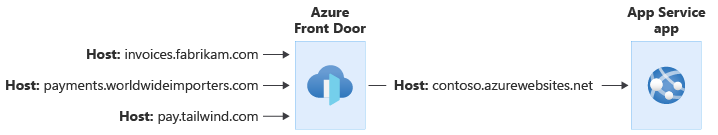

Azure App Service is a powerful web application hosting platform. Azure Functions, built on top of the App Service infrastructure, enables you to easily build serverless and event-driven compute workloads. Both services are frequently used in multitenant solutions.

## Features of Azure App Service and Azure Functions that support multitenancy

Azure App Service and Azure Functions include many features that support multitenancy.

### Custom domain names

Azure App Service enables you to use [wildcard DNS](/azure/app-service/app-service-web-tutorial-custom-domain?tabs=wildcard) and to add your own [wildcard TLS certificates](/azure/app-service/configure-ssl-certificate). When you use [tenant-specific subdomains](../considerations/domain-names.yml#subdomains), wildcard DNS and TLS certificates enable you to easily scale your solution to a large number of tenants, without requiring a manual reconfiguration for each new tenant.

When you use [tenant-specific custom domain names](../considerations/domain-names.yml#custom-domain-names), you might have a large number of custom domain names that need to be added to your app. It can become cumbersome to manage a lot of custom domain names, especially when they require individual TLS certificates. App Service provides [managed TLS certificates](/azure/app-service/configure-ssl-certificate), which reduces the work required when you work with custom domains. However, there are [limits to consider](/azure/azure-resource-manager/management/azure-subscription-service-limits#app-service-limits), such as how many custom domains can be applied to a single app.

### Integration with Azure Front Door

App Service and Azure Functions integrate with [Azure Front Door](/azure/frontdoor/front-door-overview), to act as the internet-facing component of your solution. Azure Front Door enables you to add a web application firewall (WAF) and edge caching, and it provides other performance optimizations. You can easily reconfigure your traffic flows to direct traffic to different backends, based on changing business or technical requirements.

When you use Azure Front Door with a multitenant app, you can use it to manage your custom domain names and to terminate your TLS connections. Your App Service application is then configured with a single hostname, and all traffic flows through to that application, which helps you avoid managing custom domain names in multiple places.

As in the above example, [Azure Front Door can be configured to modify the request's `Host` header](/azure/frontdoor/front-door-backend-pool#backend-host-header). The original `Host` header sent by the client is propagated through the `X-Forwarded-Host` header, and your application code can use this header to [map the request to the correct tenant](../considerations/map-requests.yml).

> [!WARNING]
> If your application sends cookies or redirection responses, you need to take special care. Changes in the request's `Host` headers might invalidate these responses. For more information, see the [host name preservation best practice](../../../best-practices/host-name-preservation.yml).

You can use [private endpoints](/azure/time-series-insights/concepts-private-links) or App Service [access restrictions](https://techcommunity.microsoft.com/t5/azure-architecture-blog/permit-access-only-from-azure-front-door-to-azure-app-service-as/ba-p/2000173) to ensure that traffic has flowed through Front Door before reaching your app.

For more information about using Azure Front Door in a multitenant solution, see [Use Azure Front Door in a multitenant solution](./front-door.md)

### Authentication and authorization

Azure App Service can [validate authentication tokens on behalf of your app](/azure/app-service/overview-authentication-authorization). When App Service receives a request, it checks to see whether each of the following conditions are met:

- The request contains a token.
- The token is valid.
- The request is authorized.

If any of the conditions aren't met, App Service can block the request, or it can redirect the user to your identity provider so that they can sign in.

If your tenants use Azure Active Directory (Azure AD) as their identity system, you can configure Azure App Service to use [the /common endpoint](/azure/active-directory/develop/howto-convert-app-to-be-multi-tenant) to validate user tokens. This ensures that, regardless of the user's Azure AD tenant, their tokens are validated and accepted.

You can also integrate Azure App Service with Azure AD B2C for authentication of consumers.

More information:
- [App Service authorization](/azure/app-service/overview-authentication-authorization)
- [Configure authentication in a sample web app by using Azure AD B2C](/azure/active-directory-b2c/configure-authentication-sample-web-app)
- [Working with multitenant Azure AD identities](../../../multitenant-identity/index.yml)

### Access restrictions

You can restrict the traffic to your app by using [access restrictions](/azure/app-service/app-service-ip-restrictions). These can be used to specify the IP address ranges or the virtual networks that are allowed to connect to the app.

When you work with a multitenant solution, be aware of the maximum number of access restriction rules. For example, if you need to create an access restriction rule for every tenant, you might exceed the maximum number of rules that are allowed. If you need a larger number of rules, consider deploying a reverse proxy like [Azure Front Door](/azure/frontdoor/front-door-overview).

## Isolation models

When working with a multitenant system using Azure App Service or Azure Functions, you need to make a decision about the level of isolation that you want to use. Refer to the [tenancy models to consider for a multitenant solution](../considerations/tenancy-models.yml) and to the guidance provided in the [architectural approaches for compute in multitenant solutions](../approaches/compute.md), to help you select the best isolation model for your scenario.

When you work with Azure App Service and Azure Functions, you should be aware of the following key concepts:

- In Azure App Service, a [plan](/azure/app-service/overview-hosting-plans) represents your hosting infrastructure. An app represents a single application running on that infrastructure. You can deploy multiple apps to a single plan.
- In Azure Functions, your hosting and application are also separated, but you have [additional hosting options available](/azure/azure-functions/functions-scale) for *elastic hosting*, where Azure Functions manages scaling for you. For simplicity, we refer to the hosting infrastructure as a *plan* throughout this article, because the principles described here apply to both App Service and Azure Functions, regardless of the hosting model you use.

The following table summarizes the differences between the main tenancy isolation models for Azure App Service and Azure Functions:

| Consideration | Shared apps | Apps per tenant with shared plans | Plans per tenant |
|---|---|---|---|
| **Configuration isolation** | Low | Medium. App-level settings are dedicated to the tenant, plan-level settings are shared | High. Each tenant can have their own configuration |
| **Performance isolation** | Low | Low-medium. Potentially subject to noisy neighbor issues | High |
| **Deployment complexity** | Low | Medium | High |
| **Operational complexity** | Low | High | High |
| **Resource cost** | Low | Low-high depending on application | High |
| **Example scenario** | Large multitenant solution with a shared application tier | Migrate applications that aren't aware of tenancy into Azure while gaining some cost efficiency | Single-tenant application tier |

### Shared apps

You might deploy a shared application on a single plan, and use the shared application for all your tenants.

This tends to be the most cost-efficient option, and it requires the least operational overhead because there are fewer resources to manage. You can scale the overall plan based on load or demand, and all tenants sharing the plan will benefit from the increased capacity.

It's important to be aware of the [App Service quotas and limits](/azure/azure-resource-manager/management/azure-subscription-service-limits#app-service-limits), such as the maximum number of custom domains that can be added to a single app, and the maximum number of instances of a plan that can be provisioned.

To be able to use this model, your application code must be multitenancy-aware.

### Apps per tenant with shared plans

You can also choose to share your plan between multiple tenants, but deploy separate apps for each tenant. This provides you with logical isolation between each tenant, and this approach gives you the following advantages:

- **Cost efficiency:** By sharing your hosting infrastructure, you can generally reduce your overall costs per tenant.
- **Separation of configuration:** Each tenant's app can have its own domain name, TLS certificate, access restrictions, and token authorization policies applied.
- **Separation of upgrades:** Each tenant's application binaries can be upgraded independently of other apps on the same plan.

However, because the plan's compute resources are shared, the apps might be subject to the [Noisy Neighbor problem](../../../antipatterns/noisy-neighbor/noisy-neighbor.yml). Additionally, there are [limits to how many apps can be deployed to a single plan](/azure/azure-resource-manager/management/azure-subscription-service-limits#app-service-limits).

> [!NOTE]
> Don't use [deployment slots](/azure/app-service/deploy-staging-slots) for different tenants. Slots don't provide resource isolation. They are designed for deployment scenarios when you need to have multiple versions of your app running for a short time, such as blue-green deployments and a canary rollout strategy.

### Plans per tenant

The strongest level of isolation is to deploy a dedicated plan for a tenant. This dedicated plan ensures that the tenant has full use of all of the server resources that are allocated to that plan.

This approach enables you to scale your solution to provide performance isolation for each tenant, and to avoid the [Noisy Neighbor problem](../../../antipatterns/noisy-neighbor/noisy-neighbor.yml). However, it also has a higher cost because the resources aren't shared with multiple tenants. Also, you need to consider the [maximum number of plans](/azure/azure-resource-manager/management/azure-subscription-service-limits#app-service-limits) that can be deployed into a single Azure resource group.

## Host APIs

You can host APIs on both Azure App Service and Azure Functions. Your choice of platform will depend on the specific feature set and scaling options you need.

Whichever platform you use to host your API, consider using [Azure API Management](/azure/api-management) in front of your API application. API Management provides many features that can be helpful for multitenant solutions, including the following:

- A centralized point for all [authentication](/azure/api-management/api-management-access-restriction-policies). This might include determining the tenant identifier from a token claim or other request metadata.
- [Routing requests to different API backends](/azure/api-management/api-management-transformation-policies#SetBackendService), which might be based on the request's tenant identifier. This can be helpful when you host multiple [deployment stamps](../../../patterns/deployment-stamp.yml), with their own independent API applications, but you need to have a single API URL for all requests.

## Networking and multitenancy

### IP addresses

Many multitenant applications need to connect to tenants' on-premises networks to send data.

If you need to send outbound traffic from a known static IP address or from a set of known static IP addresses, consider using a NAT Gateway. For more information about how to use NAT Gateway in multitenant solutions, see [Azure NAT Gateway considerations for multitenancy](./nat-gateway.md). App Service provides [guidance on how to integrate with a NAT Gateway](/azure/app-service/networking/nat-gateway-integration).

If you don't need a static outbound IP address, but instead you need to occasionally check the IP address that your application uses for outbound traffic, you can [query the current IP addresses of the App Service deployment](/azure/app-service/troubleshoot-intermittent-outbound-connection-errors).

### Quotas

Because App Service is itself a multitenant service, you need to take care about how you use shared resources. Networking is an area that you need to pay particular attention to, because there are [limits](/azure/azure-resource-manager/management/azure-subscription-service-limits#app-service-limits) that affect how your application can work with both inbound and outbound network connections, including source network address translation (SNAT) and TCP port limits.

If your application connects to a large number of databases or external services, then your app might be at risk of [SNAT port exhaustion](/azure/app-service/troubleshoot-intermittent-outbound-connection-errors). In general, SNAT port exhaustion indicates that your code isn't correctly reusing TCP connections, and even in a multitenant solution, you should ensure you follow the recommended practices for reusing connections.

However, in some multitenant solutions, the number of outbound connections to distinct IP addresses can result in SNAT port exhaustion, even when you follow good coding practices. In these scenarios, consider one of the following options:

- Deploy NAT Gateway to increase the number of SNAT ports that are available for your application to use. For more information about how to use NAT Gateway in multitenant solutions, see [Azure NAT Gateway considerations for multitenancy](./nat-gateway.md).
- Use [service endpoints](/azure/virtual-network/virtual-network-service-endpoints-overview) when you connect to Azure services, to bypass load balancer limits.

Even with these controls in place, you might approach limits with a large number of tenants, so you should plan to scale to additional App Service plans or [deployment stamps](../../../patterns/deployment-stamp.yml).

## Contributors

*This article is maintained by Microsoft. It was originally written by the following contributors.*

Principal author:

 * [John Downs](http://linkedin.com/in/john-downs) | Principal Customer Engineer, FastTrack for Azure

Other contributors:

 * [Thiago Almeida](https://www.linkedin.com/in/thiagoalmeidaprofile) | Principal Program Manager, Azure Functions
 * [Arsen Vladimirskiy](http://linkedin.com/in/arsenv) | Principal Customer Engineer, FastTrack for Azure

*To see non-public LinkedIn profiles, sign in to LinkedIn.*

## Next steps

Review [Resources for architects and developers of multitenant solutions](../related-resources.md).
