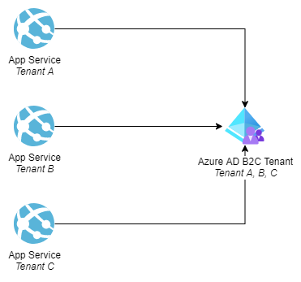
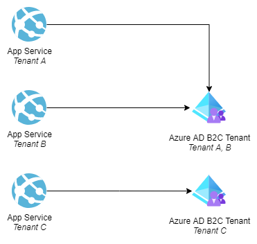
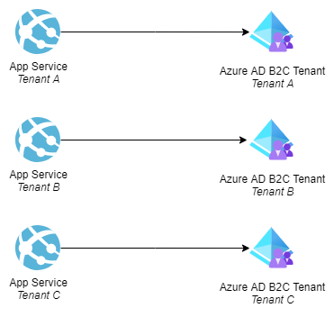

# Azure Active Directory B2C considerations for multitenancy

Azure Active Directory B2C (Azure AD B2C) provides business-to-consumer identity as a service. An identity solution for a multitenant application is typically one of the biggest considerations when designing your application. Your identity solution will serve as the gatekeeper to your application, ensuring your tenants stay within the boundaries that you define for them. In this article, we describe different considerations and approaches for using Azure AD B2C in a multitenant solution.

If you are brand new to this topic, please review the following recommended resources to assist in building some foundational knowledge required to understand the concept laid out in this document:

  - [What is Azure Active Directory B2C?](/azure/active-directory-b2c/overview)
  - [Identity Approaches](../approaches/identity#authorization)
  - [Identity Considerations](../considerations/identity)
  - [Tenancy Models](../considerations/tenancy-models)

> [!NOTE]
> In this article, we will be discussing two very closely named topics: application tenants and Azure AD B2C tenants.
>
> We use the term *application tenant* to refer to **your** tenants, which might be your customers or groups of users.
>
> Azure AD B2C (B2C) also includes the concept of a tenant to refer to individual directories, and it uses the term *multitenancy* to refer to interactions between multiple Azure AD B2C tenants. Although the terms are the same, the concepts are not. When we refer to an Azure AD B2C tenant in this article, we disambiguate it by using the full term *Azure AD B2C tenant*.

## Isolation Models

- When working with Azure AD B2C, you need to decide how you are going to isolate your user pools from different application tenants.
- You need to consider things like:
  - Is the user going to need to access more than one application tenant?
  - Do you need complex permissions and/or Role Based Access Control (RBAC?)
  - Do you need to federate logins to your customer's Identity Provider(s)? (SAML, Azure Active Directory, Social Logins, etc)
  - Do you have data residency requirements?
  - What are your user personas? (ie who is logging into your software?)

The following table summarizes the differences between the main tenancy models for Azure AD B2C:

| Consideration | Shared Azure AD B2C tenant | Azure AD B2C tenant per application tenant | Vertically partitioned Azure AD B2C tenant |
|-|-|-|-|
| **Data isolation** | Low | High | Medium |
| **Deployment complexity** | Low | Very High | Medium to High, depending on your partition strategy |
| [**Limits to consider**](/azure/active-directory-b2c/service-limits?pivots=b2c-user-flow#userconsumption-related-limits) | Requests per Azure AD B2C tenant and per IP | Number of Azure AD B2C tenants per subscription, Maximum number of directories for a single user | A combination of requests, number of Azure AD B2C tenants per subscription, and number of directories for a single user, depending on your partition strategy |
| **Operational complexity** | Low | Very High | Medium to high, depending on your partition strategy |
| **Number of Azure AD B2C Tenants required** | 1 | *n*, where n is equal to the number of application tenants | Between 1 and *n*, depending on your partition strategy |
| **Example scenario** | You are building a SaaS offering for consumers in one region such as a music or video streaming service | You are building a SaaS offering for businesses such as a government record keeping software. Your customers require a high degree of separation between other application tenant data | You are building a SaaS offering for businesses such as an accounting & record keeping software. You need to support data residency requirements or custom federated identity providers. |

### Shared Azure AD B2C tenant

>[!NOTE]
> Using a shared Azure AD B2C tenant is what we recommend for most scenarios.

Using a single, shared Azure AD B2C tenant is generally the easiest isolation model to manage if your requirements allow for it. There is only one tenant that you must maintain long term and comes with the lowest amount of overhead. A shared Azure AD B2C tenant should be considered if the following apply to your scenario:

- You do not have data residency or strict data isolation requirements
- Your application needs are within the Azure AD B2C service [limits](/azure/active-directory-b2c/service-limits?pivots=b2c-custom-policy#userconsumption-related-limits)
- You use local accounts or only have a small number of federated identity providers or social logins you'd like to support (ie you do not need to allow each of your customers to bring a custom identity provider)
- You have a unified sign-in experience for all application tenants
- Your end users need access to more than one application tenant under the same account

The diagram below illustrates the shared Azure AD B2C tenant model:

### Vertically partitioned Azure AD B2C tenants

Provisioning vertically partitioned Azure AD B2C tenants is a strategy designed to minimize the number of Azure AD B2C tenants needed where possible. It is a "middle ground" between the other tenancy models that offers greater flexibility in customization between tenants where required, while offering a decreased level of overhead from provisioning a tenant per customer. A key note here is that, while you are minimizing the number of tenants and, thus, the overhead required to maintain them, the maintenance requirements are still higher than a single Azure AD B2C tenant. As such, you will still need a strategy for deploying and maintaining multiple tenants across your environment.

If you are familiar with the [data sharding pattern](/azure/architecture/patterns/sharding), this strategy should appear familiar to you. To vertically partition your Azure AD B2C tenants, you will need to figure out how to organize your customers into logical groupings. This grouping can be many different things: region, size, custom requirements, etc. For example, if you are aiming to solve your data residency requirements, you could choose to have one Azure AD B2C tenant for each region you have customers in. Or, if you are grouping by size, you could choose to have most of your customers reside on a single Azure AD B2C tenant, while having your largest customers reside on their own dedicated Azure AD B2C tenant.
You should consider provisioning your Azure AD B2C tenants using a vertically partitioned strategy if the following apply to your scenario:

- You have data residency requirements and/or need to separate your users by geography
- You need to enable your customers to bring their own custom federated identity provider via SAML or OpenID Connect
- Your application is or can be "tenant aware" and knows which Azure AD B2C tenant your users will need to sign into
- You are concerned about your larger customers hitting one of the Azure AD B2C [limits](/azure/active-directory-b2c/service-limits?pivots=b2c-user-flow)
- You have a strategy planned for deploying and [maintaining](#maintenance-overhead) a medium to large number of Azure AD B2C tenants long term
- You have a strategy planned for sharding your customers between one or more Azure subscriptions to work within the 20 Azure AD B2C tenant limit per subscription if required

The diagram below illustrates the vertically partitioned Azure AD B2C tenant model:

### Azure AD B2C tenant per application tenant

> [!WARNING]
> Because of the complexity involved in this approach, we highly recommend customers consider the other isolation models first. This option is included in this article for the sake of completeness, but it is not the right approach for most use cases. A common misconception is to assume using something like the [deployment stamp pattern](../../../patterns/deployment-stamp) means you also need to include identity in the "stamp". This is not necessarily the case, and often another isolation model can be used instead. Please proceed with caution if you use this isolation model, as the maintenance overhead is *significant*.

Provisioning a Azure AD B2C tenant per customer allows for more customization per tenant to be done, but comes at the cost of significantly increased overhead. You must consider how you will plan for and manage this type of deployment and upkeep long term. You will need a strategy to manage things such as policy deployments, key and certificate rotation, and more across a large number of tenants. Additionally, there are several service limits that you must keep in mind. Azure subscriptions have a default [limit](/azure/active-directory-b2c/service-limits?pivots=b2c-user-flow#azure-ad-b2c-configuration-limits) of 20 Azure AD B2C tenants per subscription. If you have more than this, you will also need to consider an appropriate [subscription design pattern](/azure/cloud-adoption-framework/decision-guides/subscriptions/) to allow you to "load balance" your customers onto more than one subscription. Please also keep in mind that there are 2 important [Azure AD limits](/azure/active-directory/enterprise-users/directory-service-limits-restrictions) that apply as well: A single user can only create up to 200 directories, and can only belong to 500 directories.

Provisioning a Azure AD B2C tenant per customer should be considered if the following apply to your scenario:

- You have very high data isolation requirements between application tenants
- You have a strategy planned for deploying and [maintaining](#maintenance-overhead) a large number of Azure AD B2C tenants long term
- You have a strategy planned for sharding your customers between one or more Azure subscriptions to work within the 20 Azure AD B2C tenant limit per subscription
- Your application is or can be "tenant aware" and knows which Azure AD B2C tenant your users will need to sign into
- You need to perform custom configuration for *every* application tenant
- Your end users do not need access to more than one application tenant under the same account

The diagram below illustrates the Azure AD B2C tenant per application tenant model:

## Identity Federation

[Identity federation](/azure/active-directory-b2c/add-identity-provider) is the concept of establishing a trust between two identity providers for the purpose of allowing your users to sign in with a pre-existing account. In the case of Azure AD B2C, you would most often choose to do this to enable your users to login with their social or enterprise accounts instead of creating a separate [local account](/azure/active-directory-b2c/identity-provider-local) specific for your application. Each unique federated identity provider must be [configured](#user-journey-configuration) using either a user flow or a custom policy. When choosing an isolation model, keep in mind that there is a combined [limit](/azure/active-directory-b2c/service-limits?pivots=b2c-user-flow#azure-ad-b2c-configuration-limits) of either 200 user flows or custom policies allowed in a single Azure AD B2C tenant. Additionally, if you are wanting to set up a federated identity provider using SAML, you must create a dedicated policy for each one. You cannot combine it in a larger policy file in the same way you can with OpenID Connect identity providers.

Additionally, something else to keep in mind, is that you can also use identity federation as a tool for managing multiple Azure AD B2C tenants by federating the Azure AD B2C tenants with each other. This allows your application to trust a single Azure AD B2C tenant instead of it having to be aware that your customers are divided between *n* number of Azure AD B2C tenants. This is most commonly used in the vertically partitioned isolation model.  

**Example**: You have customers in 3 distinct regions (Regions A, B, and C). You are employing a vertically partitioned Azure AD B2C tenant strategy and are separating your customers into a Azure AD B2C tenant per region. In this scenario, you would need *4* Azure AD B2C tenants: one each for regions A, B, and C, and a fourth to act as a "funnel" tenant. The multitenant application would trust the funnel tenant as its identity provider, and the funnel tenant would establish a trust between each of the regional tenants as an identity provider. Upon a user being directed to the funnel tenant for login, the funnel tenant would be responsible for looking up which of the regional tenants the user belongs to, and directing them to it for login.

## Data Residency

When provisioning a Azure AD B2C tenant, you will be asked to select a region for your tenant to be deployed to. This selection is important as this is the region that your customer data will reside in. If you have any specific data residency requirements for a subset of your customers, this is when you should consider using the vertically partitioned strategy.

## Authorization

For a strong identity solution, you not only have to consider *authentication*, but *authorization* as well. There are several approaches in which you can build out an authorization strategy for your application. This [sample](https://github.com/azure-ad-b2c/api-connector-samples/tree/main/Authorization-AppRoles) demonstrates how to use Azure AD B2C's [application roles](/azure/active-directory/develop/howto-add-app-roles-in-azure-ad-apps) to implement authorization in your application, but also discusses other approaches you can take as well. There is no "one size fits all" approach to authorization, and you should consider the needs of your application and your customers when deciding on an approach.

## Maintenance

When planning for a multitenant deployment of Azure AD B2C, it is important to consider the long term maintenance of your Azure AD B2C tenant(s) as well. This list is not exhaustive, but you should think about things such as:  

1. [User journey configuration](/azure/active-directory-b2c/user-flow-overview) - How will you deploy changes to your Azure AD B2C tenant(s)? How will you test changes to your User Journeys before deploying them?
2. [Federated identity providers](#identity-federation) - Will you need to add or remove identity providers over time? If you are allowing each of your customers to bring their own identity provider, how will you manage that?
3. App registrations - Most App Registrations have a [client secret](/azure/active-directory/develop/quickstart-register-app#add-a-client-secret) or [certificate](azure/active-directory/develop/quickstart-register-app#add-a-certificate) for authentication. How will you rotate these when necessary?
4. [Policy keys](/azure/active-directory-b2c/policy-keys-overview?pivots=b2c-custom-policy) - If you are using custom policies, how will you rotate the policy keys when necessary?
5. User credentials - How will you manage user information and credentials? What if one of your users gets locked out or forgets their password and requires administrator intervention?

It is also important to keep in mind that these things must be considered for *every* Azure AD B2C tenant that you deploy. You should also consider how your processes change if or when you have more than one Azure AD B2C tenant to maintain. For example: Deploying custom policy changes to *one* Azure AD B2C tenant manually is easy, but deploying them to *five* manually is extremely difficult.

### Deployments & DevOps

> [!IMPORTANT]
> As of the writing of this article, some of the endpoints used to manage Azure AD B2C programmatically are in beta. APIs under the `/beta` version in Microsoft Graph are subject to change at any time. 

A well defined DevOps process can help minimize the amount of overhead involved in maintaining your Azure AD B2C tenant(s) and should be implemented as early as possible in your development process. Ideally, all or most of your maintenance tasks, including deploying changes to your custom policies or user flows, should be automated into a DevOps pipeline. You can use the Microsoft Graph API to [programmatically manage your Azure AD B2C tenant(s)](/azure/active-directory-b2c/microsoft-graph-operations).

Here are some additional resources to get you started:

- [Deploy custom policies with Azure Pipelines](/azure/active-directory-b2c/deploy-custom-policies-devops)
- [Deploy custom policies with GitHub Actions](/azure/active-directory-b2c/deploy-custom-policies-github-action)
- [Custom policy DevOps pipeline sample](https://github.com/azure-ad-b2c/samples/tree/master/policies/devops-pipeline)
- Graph API references:
  - [Custom policy reference](/graph/api/resources/trustframeworkpolicy?view=graph-rest-beta)
  - [User flow reference](/graph/api/resources/b2cidentityuserflow?view=graph-rest-beta)
  - [App registration reference](/graph/api/resources/application?view=graph-rest-beta)
  - [Policy keys reference](/graph/api/resources/trustframeworkkeyset?view=graph-rest-beta)

## Azure AD B2B vs Azure AD B2C

[Azure AD B2B collaboration](/azure/active-directory/external-identities/what-is-b2b) is a feature within Azure AD External Identities that allows you to invite guest users into your *organizational* Azure AD tenant for collaboration purposes. B2B collaboration is most often used when you need an external user, such as a vendor, to have access to resources within your Azure AD tenant.

Azure AD B2C is also grouped within Azure AD External Identities, but provides a different set of features. It is specifically intended for use by customers of your product. These users are managed inside a separate Azure AD B2C tenant.

In some scenarios, depending on your user personas, you could have a need for either Azure AD B2B, Azure AD B2C, or even both at the same time. For example, if you needed to authenticate staff users within your organization, users that work for a vendor, and customers all within the same app, you would need both Azure AD B2B and Azure AD B2C.

Here are some additional resources to review for more information on this subject:

- [Use Azure AD or Azure AD B2C](/architecture/guide/multitenant/approaches/identity#use-azure-ad-or-azure-ad-b2c)
- [Comparing External Identities feature sets](/azure/active-directory/external-identities/external-identities-overview#comparing-external-identities-feature-sets)
- [Woodgrove Demo](https://aka.ms/CIAMdemo) - An example application that uses Azure AD B2B and Azure AD B2C.

## Contributors

*This article is maintained by Microsoft. It was originally written by the following contributors.*

Principal author:

- [Landon Pierce](https://www.linkedin.com/in/landon-pierce/) | Customer Engineer

Other contributors:

- [Michael Bazarewsky](https://www.linkedin.com/in/mikebaz/) | Senior Customer Engineer
- [John Downs](https://www.linkedin.com/in/john-downs) | Principal Customer Engineer
- [Jelle Druyts](https://www.linkedin.com/in/jelle-druyts-0b76823/) | Principal Customer Engineer
- [Simran Kaur](https://www.linkedin.com/in/sjkaur/) | Customer Engineer
- [LaBrina Loving](https://www.linkedin.com/in/chixcancode/) | Principal SVC Engineering Manager
- [Arsen Vladimirsky](https://www.linkedin.com/in/arsenv/) | Principal Customer Engineer

## Next steps and other resources

- [Azure AD B2C custom policy samples](https://github.com/azure-ad-b2c/samples)
- [Microsoft Authentication Library (MSAL)](/azure/active-directory/develop/msal-overview)
- [Tutorial: Create an Azure AD B2C tenant](/azure/active-directory-b2c/tutorial-create-tenant)
- [Azure AD B2C Authentication protocols](/azure/active-directory-b2c/protocols-overview)
- [Azure AD B2C limitations](https://github.com/AzureAD/microsoft-identity-web/wiki/b2c-limitations)
