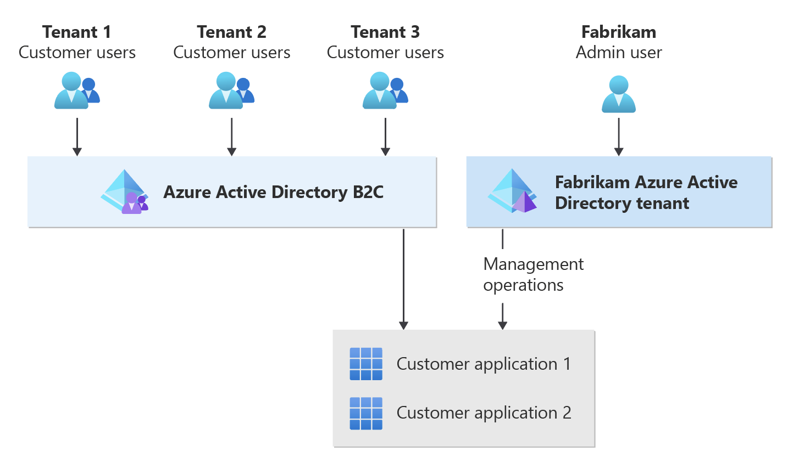
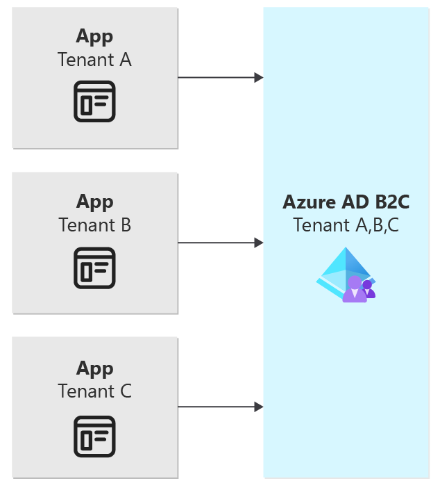
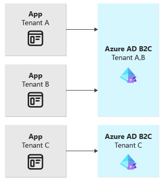
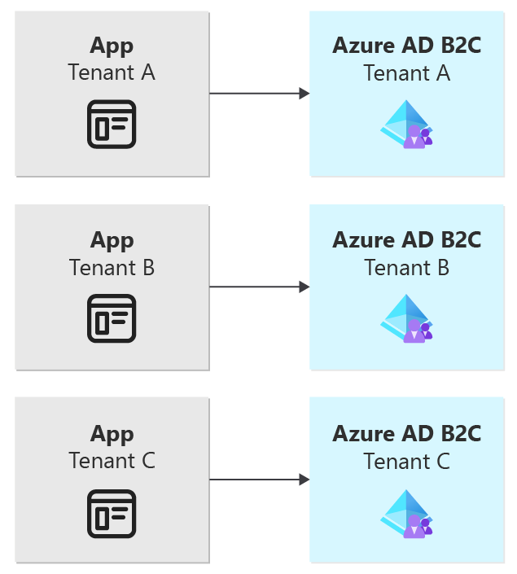

# Considerations for using Azure Active Directory B2C in a multitenant architecture

Azure Active Directory B2C (Azure AD B2C) provides business-to-consumer identity as a service. User identity is typically one of the main considerations when you design a multitenant application. Your identity solution serves as the gatekeeper to your application, ensuring that your tenants stay within the boundaries that you define for them. This article describes considerations and approaches for using Azure AD B2C in a multitenant solution.

One of the most common reasons for using Azure AD B2C is to enable [identity federation](/azure/active-directory-b2c/add-identity-provider) for an application. Identity federation is the process of establishing trust between two identity providers to allow your users to sign in with a pre-existing account. If you use Azure AD B2C, you might implement identity federation to enable your users to sign in by using their social or enterprise accounts. If you use federation, your users don't need to create a separate [local account](/azure/active-directory-b2c/identity-provider-local) specific that's to your application.

> [!NOTE]
> In this article, two similarly named topics are discussed: application tenants and Azure AD B2C tenants.
>
> The term *application tenant* is used to refer to *your* tenants, which might be your customers or groups of users.
>
> Azure AD B2C also uses the tenant concept in reference to individual directories, and the term *multitenancy* is used to refer to interactions between multiple Azure AD B2C tenants. Although the terms are the same, the concepts are not. When an Azure AD B2C tenant is referred to in this article, the full term *Azure AD B2C tenant* is used.

## Identity in multitenant solutions

In multitenant solutions, it's common to combine multiple identity services to achieve different sets of requirements. Many solutions have two distinct sets of identities:

- **Customer identities**, which are for end-user accounts. They control how your tenants' users get access to your applications.
- **Internal identities**, which handle how your own team manages your solution.

These different identity types also typically use distinct identity services. Azure AD B2C is a customer identity and access management (CIAM) service that your tenants' users use to access the solution. [Azure Active Directory](/azure/active-directory/fundamentals/active-directory-whatis) (Azure AD) is an identity and access management (IAM) service, which you and your team use to manage your Azure resources and to control your application.

Consider an example multitenant solution built by Fabrikam. The solution uses a combination of the two technologies to achieve Fabrikam's requirements:

- Fabrikam implements Azure AD B2C so that the company's customers (tenants) can sign in to applications.
- Employees of Fabrikam use their organization's Azure AD directory to gain access to their solution for management and administration purposes. They use the same identities that they use for accessing other Fabrikam resources, like Microsoft Office.

The following diagram illustrates this example:

## Isolation models

When you use Azure AD B2C, you need to decide how to isolate your user accounts among different application tenants.

You need to consider questions like:

- Do you need to federate sign-ins to your customer's identity providers? For example, do you need to enable federation to SAML, Azure AD, social sign-in providers, or other sources?
- Do you or your tenants have data residency requirements?
- Does the user need to access more than one application tenant?
- Do you need complex permissions and/or role-based access control (RBAC)?
- Who signs in to your application? These categories of users are often called your *user personas*.

The following table summarizes the differences between the main tenancy models for Azure AD B2C:

| Consideration | [Shared Azure AD B2C tenant](#shared-azure-ad-b2c-tenant) | [Vertically partitioned Azure AD B2C tenant](#vertically-partitioned-azure-ad-b2c-tenants) | [One Azure AD B2C tenant per application tenant](#one-azure-ad-b2c-tenant-per-application-tenant) |
|---|---|---|---|
| **Data isolation** | Data from each application tenant is stored in a single Azure AD B2C tenant but can be accessed only by administrators | Data from each application tenant is stored in several Azure AD B2C tenants but can be accessed only by administrators | Data from each application tenant is stored in a dedicated Azure AD B2C tenant but can be accessed only by administrators |
| **Deployment complexity** | Low | Medium to high, depending on your partitioning strategy | Very high |
| [**Limits to consider**](/azure/active-directory-b2c/service-limits?pivots=b2c-user-flow#userconsumption-related-limits) | Requests per Azure AD B2C tenant, requests per client IP address | A combination of requests, number of Azure AD B2C tenants per subscription, and number of directories for a single user, depending on your partitioning strategy | Number of Azure AD B2C tenants per subscription, maximum number of directories for a single user |
| **Operational complexity** | Low | Medium to high, depending on your partitioning strategy | Very high |
| **Number of Azure AD B2C tenants required** | 1 | Between 1 and *n*, depending on your partitioning strategy | *n*, where n is the number of application tenants |
| **Example scenario** | You're building a SaaS offering for consumers that has low or no data residency requirements, like a music or video streaming service. | You're building a SaaS offering for businesses, like accounting and record keeping software. You need to support data residency requirements or a large number of custom federated identity providers. | You're building a SaaS offering for businesses, like government record-keeping software. Your customers mandate a high degree of data isolation from other application tenants. |

### Shared Azure AD B2C tenant

The use of a single shared Azure AD B2C tenant is generally the easiest isolation model to manage if your requirements allow for it. You need to maintain only one tenant long term, and this option creates the lowest overhead.

>[!NOTE]
> We recommend the use of a shared Azure AD B2C tenant for most scenarios.

You should consider a shared Azure AD B2C tenant when:

- You don't have data residency requirements or strict data isolation requirements.
- Your application's needs are within the Azure AD B2C [service limits](/azure/active-directory-b2c/service-limits?pivots=b2c-custom-policy#userconsumption-related-limits).
- If you have federated identity providers, you can use [Home Realm Discovery](#home-realm-discovery) to automatically select a provider for a user to sign in with, or if it's acceptable for users to manually select one from a list.
- You have a unified sign-in experience for all application tenants.
- Your end users need access to more than one application tenant under a single account.

This diagram illustrates the shared Azure AD B2C tenant model:

### Vertically partitioned Azure AD B2C tenants

The provisioning of vertically partitioned Azure AD B2C tenants is a strategy that's designed to minimize, when possible, the number of Azure AD B2C tenants needed. It's a middle ground between the other tenancy models. Vertical partitioning offers greater flexibility in customization for specific tenants when that's required, but it doesn't create the operational overhead that's associated with provisioning an Azure AD B2C tenant for every application tenant.

The deployment and maintenance requirements for this tenancy model are still higher than those of a single Azure AD B2C tenant, but they're lower than they will be if you use one Azure AD B2C tenant per application tenant. You still need to design and implement a deployment and [maintenance](#maintenance) strategy for multiple tenants across your environment.

Vertical partitioning is similar to the [Data Sharding pattern](../../../patterns/sharding.yml). To vertically partition your Azure AD B2C tenants, you need to organize your application tenants into logical groupings. This grouping of tenants is often called a *partitioning strategy*. Your partitioning strategy should be based on a common, stable factor of the application tenant, like region, size, or an application tenant's custom requirements. For example, if your goal is to solve your data residency requirements, you might decide to deploy an Azure AD B2C tenant for each region that contains application tenants. Or, if you group by size, you might decide to locate most of your application tenants' identities on a single Azure AD B2C tenant, but locate your largest application tenants on their own dedicated Azure AD B2C tenants.

>[!IMPORTANT]
> Avoid basing your partitioning strategy on factors that are volatile or that could change over time. It's difficult to move users between Azure AD B2C tenants. For example, if you create a SaaS offering that has multiple SKUs or product tiers, you shouldn't partition your users based on the SKU they select, because the SKU might change if the customer upgrades their product.

You should consider provisioning your Azure AD B2C tenants by using a vertically partitioned strategy if:

- You have data residency requirements, or you need to separate your users by geography.
- You have a large number of federated identity providers and can't use [Home Realm Discovery](#home-realm-discovery) to automatically select one for a user to sign in with.
- Your application is, or can be, aware of multitenancy and knows which Azure AD B2C tenant your users need to sign in to.
- You think your larger application tenants might reach the [Azure AD B2C limits](/azure/active-directory-b2c/service-limits?pivots=b2c-user-flow).
- You have a long-term strategy for deploying and [maintaining](#maintenance) a medium to large number of Azure AD B2C tenants.
- You have a strategy for sharding your application tenants among one or more Azure subscriptions to work within the limit on the number of Azure AD B2C tenants that can be deployed in an Azure subscription.

The following diagram illustrates the vertically partitioned Azure AD B2C tenant model:

### One Azure AD B2C tenant per application tenant

If you provision an Azure AD B2C tenant for each application tenant, you can customize many factors for each tenant. However, this approach creates a significant increase in overhead. You need to develop a deployment and [maintenance](#maintenance) strategy for a potentially large number of Azure AD B2C tenants.

You also need to be aware of service limits. Azure subscriptions allow you to deploy only a [limited number](/azure/active-directory-b2c/service-limits?pivots=b2c-user-flow#azure-ad-b2c-configuration-limits) of Azure AD B2C tenants. If you need to deploy more than the limit allows, you need to consider an appropriate [subscription design pattern](../approaches/resource-organization.yml#bin-packing) so you can balance your Azure AD B2C tenants across multiple subscriptions. There are other [Azure AD limits](/azure/active-directory/enterprise-users/directory-service-limits-restrictions) that apply as well, like the number of directories a single user can create and the number of directories a user can belong to.

> [!WARNING]
> Because of the complexity of this approach, we strongly recommend that you consider the other isolation models first. This option is included here for the sake of completeness, but it's not the right approach for most use cases.
>
> A common misconception is to assume that, if you use the [Deployment Stamps pattern](../../../patterns/deployment-stamp.yml), you need to include identity services in each stamp. That's not necessarily true, and you can often use another isolation model instead. Exercise diligence and have a clear business justification if you use this isolation model. The deployment and maintenance overhead is significant.

You should consider provisioning an Azure AD B2C tenant for every application tenant only if:

- You have strict data isolation requirements for application tenants.
- You have a long-term strategy for deploying and [maintaining](#maintenance) a large number of Azure AD B2C tenants.
- You have a strategy for sharding your customers among one or more Azure subscriptions to comply with the Azure AD B2C per-subscription tenant limit.
- Your application is, or can be, aware of multitenancy and knows which Azure AD B2C tenant your users need to sign in to.
- You need to perform custom configuration for *every* application tenant.
- Your end users don't need to access more than one application tenant via the same sign-in account.

The following diagram illustrates the use of one Azure AD B2C tenant per application tenant:

## Identity federation

You need to [configure](/azure/active-directory-b2c/user-flow-overview) each federated identity provider, either via a user flow or in a custom policy. Typically, during sign-in, users select which identity provider they want to use to authenticate. If you're using a shared tenant isolation model or have a large number of federated identity providers, consider using [Home Realm Discovery](#home-realm-discovery) to automatically select an identity provider during sign-in.

Additionally, you can use identity federation as a tool for managing multiple Azure AD B2C tenants by federating the Azure AD B2C tenants with each other. Doing so allows your application to trust a single Azure AD B2C tenant. The application doesn't need to be aware that your customers are divided among a number of Azure AD B2C tenants. This approach is most commonly used in the vertically partitioned isolation model, when your users are partitioned by region. You need to take some considerations into account if you adopt this approach. For an overview of this approach, see [Global identity solutions](/azure/active-directory-b2c/azure-ad-b2c-global-identity-solutions).

### Home Realm Discovery

*Home Realm Discovery* is the process of automatically selecting a federated identity provider for a user's sign-in event. If you automatically select the user's identity provider, you don't need to prompt the user to select a provider.

Home Realm Discovery is important when you use a shared Azure AD B2C tenant and also enable your customers to bring their own federated identity provider. You might want to avoid a design in which a user needs to select from a list of identity providers. Doing so adds complexity to the sign-in process. Also, a user might accidentally select an incorrect provider, which causes the sign-in attempt to fail.

You can configure Home Realm Discovery by using many factors. The most common approach is to use the user's email address domain suffix to determine the identity provider. For example, say Northwind Traders is a customer of Fabrikam's multitenant solution. The email address `user@northwindtraders.com` includes a domain suffix of `northwindtraders.com`, which can be mapped to the Northwind Traders federated identity provider.

For more information, see [Home Realm Discovery](/azure/active-directory/manage-apps/home-realm-discovery-policy). For an example of how to implement this approach in Azure AD B2C, see the [Azure AD B2C samples GitHub repository](https://github.com/azure-ad-b2c/samples/tree/master/policies/default-home-realm-discovery).

## Data residency

When you provision an Azure AD B2C tenant, you select, for the purpose of [data residency](/azure/active-directory-b2c/data-residency), a region for the tenant to be deployed to. This selection is important because it specifies the region in which your customer data resides when it's at rest. If you have data residency requirements for a subset of your customers, consider using the vertically partitioned strategy.

## Authorization

For a strong identity solution, you need to consider *authorization* in addition to *authentication*. There are several approaches to using the Microsoft identity platform to create an authorization strategy for your application. The [AppRoles sample](https://github.com/azure-ad-b2c/api-connector-samples/tree/main/Authorization-AppRoles) demonstrates how to use Azure AD B2 [app roles](/azure/active-directory/develop/howto-add-app-roles-in-azure-ad-apps) to implement authorization in an application. It also describes alternative authorization approaches.

When you choose an approach to authorization, consider the needs of your application and your customers.

## Maintenance

When you plan a multitenant deployment of Azure AD B2C, you need to think about the long-term maintenance of your Azure AD B2C resources. An Azure AD B2C tenant, like your organizational Azure AD tenant, is a resource that you need to create, maintain, operate, and secure. Although following list isn't comprehensive, you should consider the maintenance incurred in areas like these:  

- **Tenant governance.** Who maintains the Azure AD B2C tenant? What elevated roles do these administrators need? How do you configure Conditional Access and MFA policies for the administrators? How do you monitor the Azure AD B2C tenant in the long term?
- [**User journey configuration**](/azure/active-directory-b2c/user-flow-overview). How do you deploy changes to your Azure AD B2C tenant or tenants? How do you test changes to your user flows or custom policies before you deploy them?
- [**Federated identity providers**](#identity-federation). Do you need to add or remove identity providers over time? If you allow each of your customers to bring their own identity provider, how do you manage that at scale?
- **App registrations.** Many Azure AD app registrations use a [client secret](/azure/active-directory/develop/quickstart-register-app#add-a-client-secret) or [certificate](/azure/active-directory/develop/quickstart-register-app#add-a-certificate) for authentication. How do you rotate secrets or certificates when you need to?
- [**Policy keys**](/azure/active-directory-b2c/policy-keys-overview?pivots=b2c-custom-policy). If you use custom policies, how do you rotate the policy keys when you need to?
- **User credentials.** How do you manage user information and credentials? What happens if one of your users is locked out or forgets a password and requires administrator or customer service intervention?

Remember that you need to consider these questions for every Azure AD B2C tenant that you deploy. You should also consider how your processes change when you have multiple Azure AD B2C tenants to maintain. For example, manually deploying custom policy changes to one Azure AD B2C tenant is easy, but manually deploying them to five tenants is time-consuming and risky.

### Deployments and DevOps

A well-defined DevOps process can help you minimize the overhead required for maintaining your Azure AD B2C tenants. You should implement DevOps practices early in your development process. Ideally, you should try to automate all or most of your maintenance tasks, including deploying changes to your custom policies or user flows. You should also plan to create multiple Azure AD B2C tenants to progressively test changes in lower environments before you deploy them to your production tenants. Your DevOps pipelines might perform these maintenance activities. You can use the Microsoft Graph API to [programmatically manage your Azure AD B2C tenants](/azure/active-directory-b2c/microsoft-graph-operations).

For more information about automated deployments and management of Azure AD B2C, see the following resources.

- [Azure AD B2C operational best practices](/azure/active-directory-b2c/best-practices#operations)
- [Deploy custom policies with Azure Pipelines](/azure/active-directory-b2c/deploy-custom-policies-devops)
- [Deploy custom policies with GitHub Actions](/azure/active-directory-b2c/deploy-custom-policies-github-action)
- [Custom policy DevOps pipeline sample](https://github.com/azure-ad-b2c/samples/tree/master/policies/devops-pipeline)
- Graph API references:
  - [Custom policy reference](/graph/api/resources/trustframeworkpolicy?view=graph-rest-beta&preserve-view=true)
  - [User flow reference](/graph/api/resources/b2cidentityuserflow?view=graph-rest-beta&preserve-view=true)
  - [App registration reference](/graph/api/resources/application?view=graph-rest-beta&preserve-view=true)
  - [Policy keys reference](/graph/api/resources/trustframeworkkeyset?view=graph-rest-beta&preserve-view=true)

> [!IMPORTANT]
> Some of the endpoints that are used to manage Azure AD B2C programmatically aren't generally available. APIs in the beta version of Microsoft Graph are subject to change at any time, and are subject to prerelease terms of service.

## Comparing Azure AD B2B to Azure AD B2C

[Azure AD B2B collaboration](/azure/active-directory/external-identities/what-is-b2b) is a feature in Azure AD External Identities that you can use to invite guest users into your *organizational* Azure AD tenant so that you can collaborate with them. Typically, you use B2B collaboration when you need to grant an external user, like a vendor, access to resources in your Azure AD tenant.

You can also use External Identities with Azure AD B2C, but External Identities provides a different set of features in that scenario. It's specifically intended for the use of the customers of your product. These users are managed inside a separate Azure AD B2C tenant, which is distinct from your organizational Azure AD tenant.

Depending on your user personas and scenarios, you might need to use Azure AD B2B, Azure AD B2C, or even both at the same time. For example, if your application needs to authenticate multiple types of users, like staff in your organization, users that work for a vendor, and customers, all within the same app, you can use Azure AD B2B and Azure AD B2C together to achieve this requirement.

See these resources for more information:

- [Use Azure AD or Azure AD B2C?](../approaches/identity.md#use-azure-ad-or-azure-ad-b2c)
- [Comparing External Identities feature sets](/azure/active-directory/external-identities/external-identities-overview#comparing-external-identities-feature-sets)
- [Woodgrove demo](https://aka.ms/CIAMdemo). An example application that uses Azure AD B2B and Azure AD B2C.

## Contributors

*This article is maintained by Microsoft. It was originally written by the following contributors.*

Principal author:

- [Landon Pierce](https://www.linkedin.com/in/landon-pierce) | Customer Engineer, FastTrack for Azure

Other contributors:

- [Mick Alberts](https://www.linkedin.com/in/mick-alberts-a24a1414) | Technical Writer
- [Michael Bazarewsky](https://www.linkedin.com/in/mikebaz) | Senior Customer Engineer, FastTrack for Azure
- [John Downs](https://www.linkedin.com/in/john-downs) | Principal Customer Engineer, FastTrack for Azure
- [Jelle Druyts](https://www.linkedin.com/in/jelle-druyts-0b76823) | Principal Customer Engineer, FastTrack for Azure
- [Simran Jeet Kaur](https://www.linkedin.com/in/sjkaur) | Customer Engineer, FastTrack for Azure
- [LaBrina Loving](https://www.linkedin.com/in/chixcancode) | Principal Customer Engineering Manager, FastTrack for Azure
- [Arsen Vladimirsky](https://www.linkedin.com/in/arsenv) | Principal Customer Engineer, FastTrack for Azure

*To see non-public LinkedIn profiles, sign in to LinkedIn.*

## Next steps 

If you're new to this topic, we recommend that you review the following resources:

- [What is Azure Active Directory B2C?](/azure/active-directory-b2c/overview)
- [Multitenant identity considerations](../considerations/identity.md)
- [Multitenant identity approaches](../approaches/identity.md)
- [Tenancy models](../considerations/tenancy-models.yml)

You might also find these resources useful:

- [Azure AD B2C custom policy samples](https://github.com/azure-ad-b2c/samples)
- [Microsoft Authentication Library (MSAL)](/azure/active-directory/develop/msal-overview)
- [Tutorial: Create an Azure AD B2C tenant](/azure/active-directory-b2c/tutorial-create-tenant)
- [Azure AD B2C authentication protocols](/azure/active-directory-b2c/protocols-overview)
- [Azure AD B2C limitations](https://github.com/AzureAD/microsoft-identity-web/wiki/b2c-limitations)

## Related resources

- [Service-specific guidance for a multitenant solution](overview.md)
- [Checklist for architecting and building multitenant solutions on Azure](/azure/architecture/guide/multitenant/checklist)
- [Architectural considerations for a multitenant solution](/azure/architecture/guide/multitenant/considerations/overview)