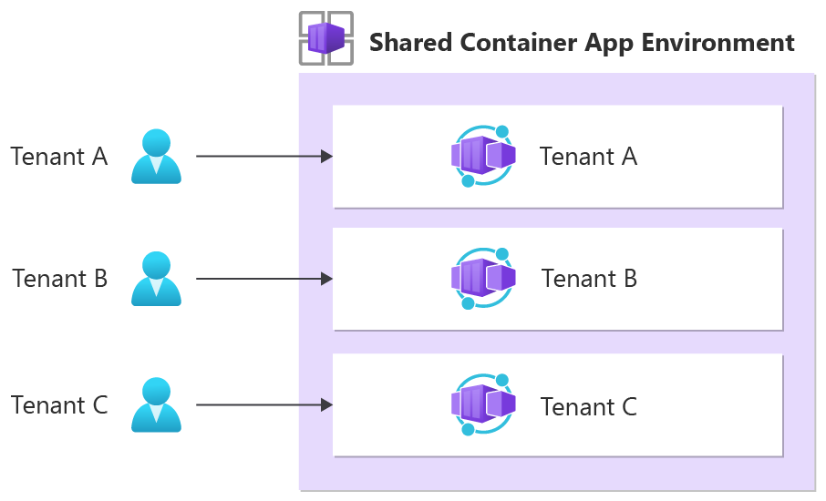
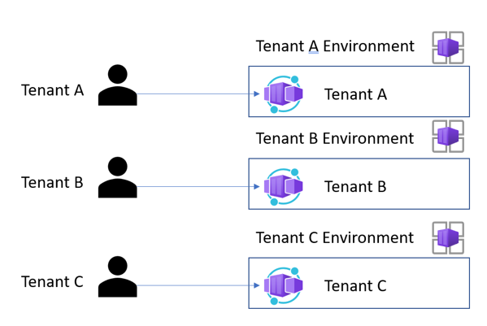

# Considerations for using Container Apps in a multitenant solution

You can use Azure Container Apps to run microservices and containerized applications on a serverless platform. This article describes some of the features of Container Apps that are useful for multitenant solutions. It also provides links to guidance that can help you during your planning phase.

## Isolation models

When you work with a multitenant system that uses Container Apps, you need to determine the required level of isolation. Container Apps supports different models of multitenancy:

- You can implement *trusted multitenancy* by using a shared environment. For example, this model might be appropriate when your tenants are all from within your organization.
- You can implement *hostile multitenancy* by deploying separate environments for each tenant. For example, this model might be appropriate when you don't trust the code that your tenants run.

The following table summarizes the differences between the main tenancy isolation models for Container Apps. The models are described later in this article.

| **Consideration** | **One environment per tenant** | **Tenant-specific container apps** | **Shared container apps** |
| --- | --- | --- | --- |
| **Data isolation** | High | Low | Low |
| **Performance isolation** | High | Medium. No network isolation. | Low |
| **Deployment complexity** | Medium | Low to medium | Low |
| **Operational complexity** | Medium | Low | Low |
| **Resource cost** | High | Low | Low |
| **Example scenario** | Running hostile multitenant workloads in isolated environments for security and compliance |  Optimizing cost, networking resources, and operations for trusted multitenant applications | Implementing a multitenant solution at the business-logic level |

### Shared container apps

You might want to consider deploying shared container apps in a single Container Apps environment that's used for all your tenants.

This approach is generally cost-efficient, and it requires the least operational overhead because there are fewer resources to manage.

However, if you want to use this isolation model, your application code must be multitenancy-aware. This isolation model doesn't guarantee isolation at the network, compute, monitoring, or data level. Your application code must handle tenant isolation. This model isn't appropriate for hostile multitenancy workloads in which you don't trust the code that's running.

Also, this model is potentially subject to [noisy neighbor concerns](../../../antipatterns/noisy-neighbor/noisy-neighbor.yml): one tenant's workload might affect the performance of another tenant's workload. If you need to provide dedicated throughput to mitigate this concern, the shared container apps model might not be appropriate.

> [!NOTE]
> The [Deployment Stamps pattern](../../../patterns/deployment-stamp.yml) is useful when tenants are on different costing models. For example, tenants might be assigned to shared or dedicated Container Apps environments depending on their pricing tier. This deployment strategy allows you to go beyond the limits of Container Apps for a single subscription per region and scale linearly as the number of tenants grows.

### Tenant-specific container apps

Another approach that you might consider is isolating your tenants by deploying tenant-specific container apps within a shared environment.

This isolation model provides logical isolation between each tenant. It provides these advantages:

- **Cost efficiency**. By sharing a Container Apps environment, virtual network, and other attached resources like a Log Analytics workspace, you can generally reduce your overall cost and management complexity per tenant.
- **Separation of upgrades and deployments**. Each tenant's application binaries can be deployed and upgraded independently from those of other container apps in the same environment. This approach can be helpful if you need to upgrade different tenants to specific versions of your code at different times.
- **Resource isolation**. Each container app within your environment is allocated its own CPU and memory resources. If a specific tenant requires more resources, you can allocate more CPU and memory to that tenant's specific container app. Keep in mind that there are [limits on total CPU and memory allocations](/azure/container-apps/containers#configuration) on container apps.

However, this approach provides no hardware or network isolation between tenants. All container apps in a single environment share the same virtual network. You need to be able to trust that the workloads deployed to the apps won't misuse the shared resources.

Container Apps has built-in support for Dapr, which uses a modular design to deliver functionality as [components](/azure/container-apps/dapr-overview). In Container Apps, Dapr components are environment-level resources. When you share a single environment across multiple tenants, ensure that you properly scope the Dapr components to the correct tenant-specific container app to guarantee isolation and avoid the risk of data leakage.

> [!NOTE]
> Don't use [revisions](/azure/container-apps/revisions) to create different versions of your app for different tenants. Revisions don't provide resource isolation. They're designed for deployment scenarios in which you need to have multiple versions of your app running as part of an update rollout process, as in blue/green deployments and A/B testing.

### One environment per tenant

You might consider deploying one Container Apps environment for each of your tenants. A [Container Apps environment](/azure/container-apps/environment) is the isolation boundary around a group of container apps. An environment provides compute and network isolation on the data plane. Each environment is deployed into its own virtual network, which is shared by all apps within the environment. Each environment has its own Dapr and monitoring configuration.

This approach provides the strongest level of data and performance isolation because each tenant's data and traffic are isolated to a specific environment. And when you use this model, your applications don't need to be multitenancy-aware. When you use this approach, you have more granular control over how you allocate resources to container apps within the environment. You can determine allocations based on your tenant's requirements. For example, some tenants might require more CPU and memory resources than others, so you can provide more resources to these tenants' applications while benefiting from the isolation that tenant-specific environments provide.

However, there are low [limits on how many environments you can deploy within a subscription per region](/azure/container-apps/quotas). In some situations, you can increase these quotas by creating an [Azure support ticket](https://azure.microsoft.com/support/create-ticket).

Be sure to know the expected growth in the number of tenants before you implement this isolation model. Keep in mind that this approach often incurs a higher total cost of ownership, and higher levels of deployment and operational complexity, because of the extra resources you need to deploy and manage.

## Container Apps features that support multitenancy

### Custom domain names

Container Apps enables you to use [wildcard DNS and to add your own wildcard TLS certificates](/azure/container-apps/custom-domains-certificates#add-a-custom-domain-and-certificate). When you use tenant-specific subdomains, wildcard DNS and TLS certificates enable you to easily scale your solution to a large number of tenants without needing to manually reconfigure each new tenant.

In Container Apps, you manage certificates at the environment level. [Ingress](/azure/container-apps/ingress) must also be enabled for the container app before you can bind a custom domain to it.

### Request authentication and authorization

Container Apps can [validate authentication tokens on behalf of your app](/azure/container-apps/authentication#feature-architecture). If a request doesn't contain a token, the token isn't valid, or the request isn't authorized, you can configure Container Apps to either block the request or redirect it to your identity provider so that the user can sign in.

If your tenants use Microsoft Entra ID as the identity provider, you can configure Container Apps to use the [/common endpoint](/azure/active-directory/develop/howto-convert-app-to-be-multi-tenant) to validate user tokens. Doing so ensures that, regardless of the user's Microsoft Entra tenant, their tokens are validated and accepted.

You can also integrate Container Apps with [Azure Active Directory B2C](/azure/active-directory-b2c/overview) for user authentication via partner identity providers.

For more information, see these resources:

- [Azure Container Apps authorization](/azure/container-apps/authentication)
- [Enable authentication and authorization in Azure Container Apps with Microsoft Entra ID](/azure/container-apps/authentication-azure-active-directory)

> [!NOTE]
> The authentication and authorization features in Container Apps are similar to those in Azure App Service. However, there are some differences. For more information, see [Considerations for using built-in authentication](/azure/container-apps/authentication#considerations-for-using-built-in-authentication).

### Managed identities

You can use managed identities from Microsoft Entra ID to enable your container app to access other resources that are authenticated by Microsoft Entra ID. When you use managed identities, your container app doesn't need to manage credentials for service-to-service communication. You can grant specific permissions to your container app's identity for role-based access control.

When you use managed identities, keep your choice of isolation model in mind. For example, suppose you share your container apps among all your tenants and deploy tenant-specific databases. You need to ensure that one tenant's application can't access a different tenant's database.

For more information, see [Managed identities in Azure Container Apps](/azure/container-apps/managed-identity).

### Workload profiles on dedicated compute

Container Apps provides a dedicated plan that allows you to reserve dedicated resources for a tenant. This plan is useful to provide a limited on the resources available to a tenant that can be shared across multiple container apps, or to meet a specific tenant's requirements like higher memory-to-CPU ratios or GPU availability.

For more information, see [Workload profiles](/azure/container-apps/workload-profiles-overview).

### Rule-based routing

Rule‑based routing lets you direct inbound traffic to specific container apps or container app revisions. Requests can be routed based on the HTTP request path, and you can rewrite the path in the URL. This feature is useful for multitenant systems that need to [map requests](../considerations/map-requests.yml) to tenant‑specific container apps or revisions using the path in the request. This capability is typically used with the [Tenant-specific container apps](#tenant-specific-container-apps) isolation model.

For more information, see [Rule‑based traffic splitting and routing in Azure Container Apps](/azure/container-apps/rule-based-routing)

## Contributors

*This article is maintained by Microsoft. It was originally written by the following contributors.*

Principal authors:

- [Daniel Larsen](https://www.linkedin.com/in/daniellarsennz/) | Principal Customer Engineer, FastTrack for Azure
- [Will Velida](https://www.linkedin.com/in/willvelida/) | Customer Engineer 2, FastTrack for Azure

Other contributors:

- [John Downs](https://www.linkedin.com/in/john-downs/) | Principal Software Engineer
- [Chad Kittel](https://www.linkedin.com/in/chadkittel/) | Principal Software Engineer, Microsoft
- [Xuhong Liu](https://www.linkedin.com/in/xuhong-l-5937159b/) | Senior Service Engineer, FastTrack for Azure
- [Aarthi Murugan](https://www.linkedin.com/in/aarthimurugan/) | Senior Program Manager, CS Tech Strategy App Innovation
- [Kendall Roden](https://www.linkedin.com/in/kendallroden/) | Senior Program Manager, Azure Container Apps
- [Paolo Salvatori](https://www.linkedin.com/in/paolo-salvatori/) | Principal Customer Engineer, FastTrack for Azure
- [Daniel Scott-Raynsford](https://linkedin.com/in/dscottraynsford) | Partner Solution Architect, Data & AI
- [Arsen Vladimirskiy](https://www.linkedin.com/in/arsenv/) | Principal Customer Engineer, FastTrack for Azure

*To see non-public LinkedIn profiles, sign in to LinkedIn.*

## Next steps

- [Container Apps product overview](https://azure.microsoft.com/products/container-apps)
- [Container Apps documentation](/azure/container-apps)

## Related resources

- [Resources for architects and developers of multitenant solutions](../related-resources.md)
- [Architect multitenant solutions on Azure](../overview.md)
- [Checklist for architecting and building multitenant solutions on Azure](../checklist.md)
