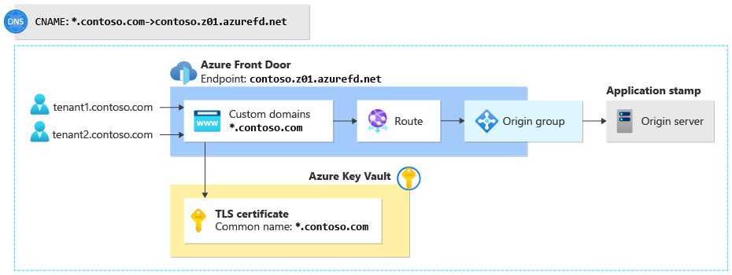
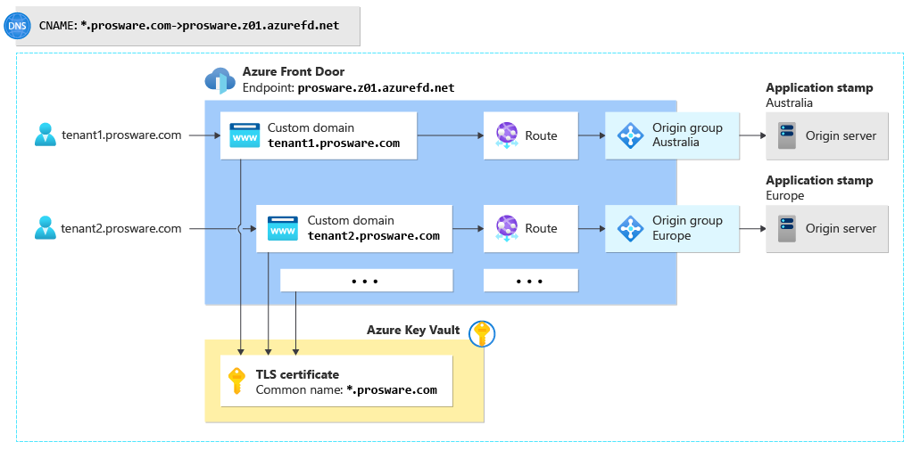
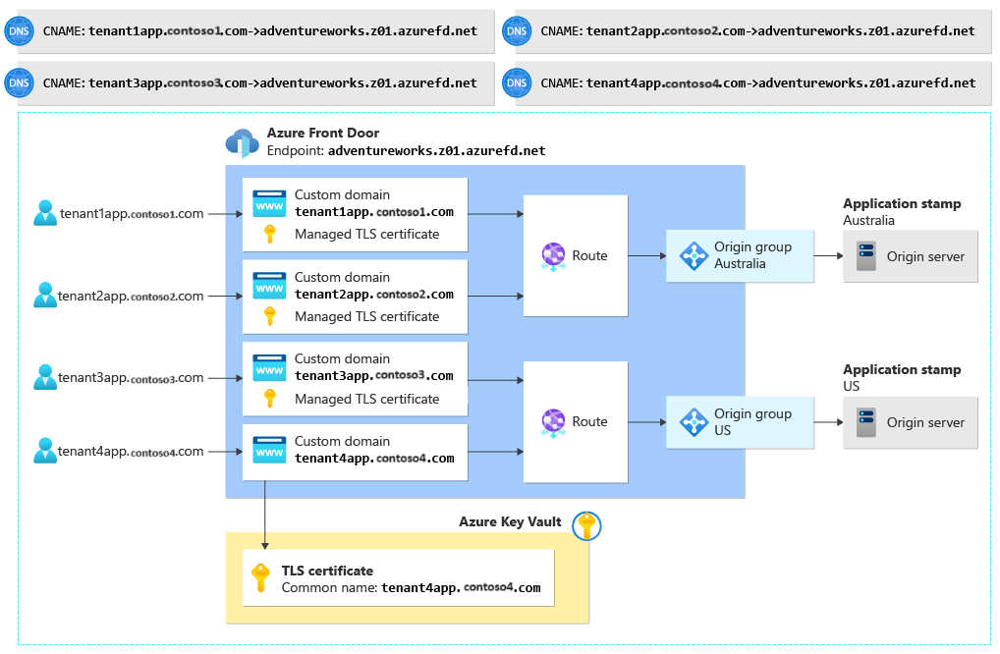

# Use Azure Front Door in a multitenant solution

Azure Front Door is a modern cloud content delivery network (CDN) that provides fast, reliable access between users and applications' static and dynamic web content across the globe. This article describes some of the features of Azure Front Door that are useful when you work in multitenant systems. It also provides links to additional guidance and examples.

When you use Azure Front Door as part of a multitenant solution, you need to make some decisions based on your solution's design and requirements. You need to consider the following factors:

- How many tenants do you have, and how many do you expect to have in the future?
- Do you share your application tier among multiple tenants, deploy many single-tenant application instances, or deploy separate deployment stamps that are shared by multiple tenants?
- Do your tenants want to bring their own domain names?
- Will you use wildcard domains?
- Do you need to use your own TLS certificates, or will Microsoft manage your TLS certificates?
- Have you considered the [quotas and limits](/azure/azure-resource-manager/management/azure-subscription-service-limits#azure-front-door-standard-and-premium-tier-service-limits) that apply to Azure Front Door? Do you know which limits you'll approach as you grow? If you suspect that you'll approach these limits, consider using multiple Azure Front Door profiles. Or consider whether you can change the way that you use Azure Front Door to avoid the limits. Note that the Premium SKU has higher limits than the Standard SKU.
- Do you or your tenants have requirements for IP address filtering, geo-blocking, or customizing WAF rules?
- Are all your tenants' application servers internet-facing?

## Features of Azure Front Door that support multitenancy

This section describes several key features of Azure Front Door that are useful for multitenant solutions. It describes how Azure Front Door can help you configure custom domains, including information about wildcard domains and TLS certificates. It also summarizes how you can use Azure Front Door routing capabilities to support multitenancy.

### Custom domains

Azure Front Door provides a default host name for each endpoint that you create, for example, `contoso.z01.azurefd.net`. For most solutions, you instead associate your own domain name with the Azure Front Door endpoint. Custom domain names enable you to use your own branding and configure routing based on the host name that's provided in a client's request.

In a multitenant solution, you might use tenant-specific domain names or subdomains, and configure Azure Front Door to route the tenant's traffic to the correct origin group for that tenant's workload. For example, you might configure a custom domain name like `tenant1.app.contoso.com`. With Azure Front Door, you can configure multiple custom domains on a single Azure Front Door profile.

For more information, see [Add a custom domain to your Front Door](/azure/frontdoor/front-door-custom-domain).

#### Wildcard domains

Wildcard domains simplify the configuration of DNS records and Azure Front Door traffic routing configuration when you use a shared stem domain and tenant-specific subdomains. For example, suppose your tenants access their applications by using subdomains like `tenant1.app.contoso.com` and `tenant2.app.contoso.com`. You can configure a wildcard domain, `*.app.contoso.com`, instead of configuring each tenant-specific domain individually.

Azure Front Door supports creating custom domains that use wildcards. You can then configure a route for requests that arrive on the wildcard domain. When you onboard a new tenant, you don't need to reconfigure your DNS servers, issue new TLS certificates, or update your Azure Front Door profile's configuration.

Wildcard domains work well if you send all your traffic to a single origin group. But if you have separate stamps of your solution, a single-level wildcard domain isn't sufficient. You either need to use multi-level stem domains or supply extra configuration by, for example, overriding the routes to use for each tenant's subdomain. For more information, see [Considerations when using domain names in a multitenant solution](../considerations/domain-names.yml).

Azure Front Door doesn't issue managed TLS certificates for wildcard domains, so you need to purchase and supply your own certificate.

For more information, see [Wildcard domains](/azure/frontdoor/front-door-wildcard-domain?pivots=front-door-standard-premium).

### Managed TLS certificates

Acquiring and installing TLS certificates can be complex and error prone. And TLS certificates expire after a period of time, usually one year, and need to be reissued and reinstalled to avoid disruption to application traffic. When you use Azure Front Door managed TLS certificates, Microsoft is responsible for issuing, installing, and renewing certificates for your custom domain.

Your origin application might be hosted on another Azure service that also provides managed TLS certificates, like Azure App Service. Azure Front Door transparently works with the other service to synchronize your TLS certificates.

If you allow your tenants to provide their own custom domains and you want Azure Front Door to issue certificates for these domain names, your tenants shouldn't configure CAA records on their DNS servers that might block Azure Front Door from issuing certificates on their behalf. For more information, see [TLS/SSL certificates](../considerations/domain-names.yml#tlsssl-certificates).

For more information about TLS certificates, see [End-to-end TLS with Azure Front Door](/azure/frontdoor/end-to-end-tls).

### Routing

A multitenant application might have one or more application stamps that serve the tenants. Stamps are frequently used to enable multi-region deployments and to support scaling a solution to a large number of tenants.

Azure Front Door has a powerful set of routing capabilities that can support a number of multitenant architectures. You can use routing to distribute traffic among origins within a stamp, or to send traffic to the correct stamp for a specific tenant. You can configure routing based on individual domain names, wildcard domain names, and URL paths. And you can use the rules engine to further customize routing behavior.

For more information, see [Routing architecture overview](/azure/frontdoor/front-door-routing-architecture).

### Rules engine

You can use the Azure Front Door rules engine to customize how Azure Front Door processes requests at the network edge. The rules engine enables you to run small blocks of logic within the Azure Front Door request-processing pipeline. You can use the rules engine to override the routing configuration for a request. You can also use the rules engine to modify elements of the request before it's sent to the origin, and to modify some parts of the response before it's returned to the client.

For example, suppose you deploy a multitenant application tier in which you also use tenant-specific wildcard subdomains, as described in the following example scenarios. You might use the rules engine to extract the tenant identifier from the request subdomain and add it to a request header. This rule could help the application tier determine which tenant the request came from.

For more information, see [What is the Azure Front Door rules engine?](/azure/frontdoor/front-door-rules-engine).

## Example scenarios

The following example scenarios illustrate how you can configure various multitenant architectures in Azure Front Door, and how the decisions you make can affect your DNS and TLS configuration.

Many multitenant solutions implement the [Deployment Stamps pattern](../approaches/overview.yml#deployment-stamps-pattern). When you use this deployment approach, you typically deploy a single shared Azure Front Door profile and use Azure Front Door to route incoming traffic to the appropriate stamp. This deployment model is the most common one, and scenarios 1 through 4 in this article show how you can use it to meet a range of requirements.

In some situations, however, you might deploy an Azure Front Door profile in each stamp of your solution. [Scenario 5](#scenario-5-azure-front-door-profile-per-stamp) describes this deployment model.

### Scenario 1: Provider-managed wildcard domain, single stamp

Contoso is building a small multitenant solution. The company deploys a single stamp in a single region, and that stamp serves all of its tenants. All requests are routed to the same application server. Contoso decided to use wildcard domains for all tenants, like `tenant1.contoso.com` and `tenant2.contoso.com`.

Contoso deploys Azure Front Door by using this configuration:

#### DNS configuration

**One-time configuration:** Contoso configures two DNS entries:

- A wildcard TXT record for `*.contoso.com`. It's set to the value that's specified by Azure Front Door during the custom domain onboarding process.
- A wildcard CNAME record, `*.contoso.com`, that's an alias for Contoso's Azure Front Door endpoint: `contoso.z01.azurefd.net`.

**When a new tenant is onboarded:** No additional configuration is required.

#### TLS configuration

**One-time configuration:** Contoso buys a wildcard TLS certificate, adds it to a key vault, and grants Azure Front Door access to the vault.

**When a new tenant is onboarded:** No additional configuration is required.

#### Azure Front Door configuration

**One-time configuration**: Contoso creates an Azure Front Door profile and a single endpoint. They add one custom domain with the name `*.contoso.com` and associate their wildcard TLS certificate with the custom domain resource. They then configure a single origin group that contains a single origin for their application server. Finally, they configure a route to connect the custom domain to the origin group.

**When a new tenant is onboarded:** No additional configuration is required.

#### Benefits

- This configuration is relatively easy to configure and provides customers with Contoso-branded URLs.
- The approach supports a large number of tenants.
- When a new tenant is onboarded, Contoso doesn't need to make changes to Azure Front Door, DNS, or TLS certificates.

#### Drawbacks

- This approach doesn't easily scale beyond a single application stamp or region.
- Contoso needs to buy a wildcard TLS certificate and renew and install the certificate when it expires.

### Scenario 2: Provider-managed wildcard domain, multiple stamps

Proseware is building a multitenant solution across multiple stamps that are deployed into both Australia and Europe. All requests within a single region are served by the stamp in that region. Like Contoso, Proseware decided to use wildcard domains for all tenants, like `tenant1.proseware.com` and `tenant2.proseware.com`.

Proseware deploys Azure Front Door by using this configuration:

#### DNS configuration

**One-time configuration:** Proseware configures two DNS entries:

- A wildcard TXT record for `*.proseware.com`. It's set to the value that's specified by Azure Front Door during the custom domain onboarding process.
- A wildcard CNAME record, `*.proseware.com`, that's an alias for Proseware's Azure Front Door endpoint: `proseware.z01.azurefd.net`.

**When a new tenant is onboarded:** No additional configuration is required.

#### TLS configuration

**One-time configuration:** Proseware buys a wildcard TLS certificate, adds it to a key vault, and grants Azure Front Door access to the vault.

**When a new tenant is onboarded:** No additional configuration is required.

#### Azure Front Door configuration

**One-time configuration**: Proseware creates an Azure Front Door profile and a single endpoint. The company configures multiple origin groups, one per application stamp/server in each region.

**When a new tenant is onboarded:** Proseware adds a custom domain resource to Azure Front Door. They use the name `*.proseware.com` and associate their wildcard TLS certificate with the custom domain resource. They then create a route to specify which origin group (stamp) that tenant's requests should be directed to. In the preceding diagram, `tenant1.proseware.com` routes to the origin group in the Australia region, and `tenant2.proseware.com` routes to the origin group in the Europe region.

#### Benefits

- When new tenants are onboarded, no DNS or TLS configuration changes are required.
- Proseware maintains a single instance of Azure Front Door to route traffic to multiple stamps across multiple regions.

#### Drawbacks

- Proseware needs to reconfigure Azure Front Door every time a new tenant is onboarded.
- Proseware needs to pay attention to [Azure Front Door quotas and limits](/azure/azure-resource-manager/management/azure-subscription-service-limits#azure-front-door-standard-and-premium-tier-service-limits), especially on the number of routes and custom domains, and the [composite routing limit](/azure/frontdoor/front-door-routing-limits).
- Proseware needs to buy a wildcard TLS certificate.
- Proseware is responsible for renewing and installing the certificate when it expires.

### Scenario 3: Provider-managed, stamp-based wildcard subdomains

Fabrikam is building a multitenant solution. The company deploys stamps in Australia and the United States. All requests within a single region will be served by the stamp in that region. Fabrikam will use stamp-based stem domains, like `tenant1.australia.fabrikam.com`, `tenant2.australia.fabrikam.com`, and `tenant3.us.fabrikam.com`.

The company deploys Azure Front Door by using this configuration:

#### DNS configuration

**One-time configuration:** Fabrikam configures the following two wildcard DNS entries for each stamp.

- A wildcard TXT record for each stamp: `*.australia.fabrikam.com` and `*.us.fabrikam.com`. They're set to the values specified by Azure Front Door during the custom domain onboarding process.
- A wildcard CNAME record for each stamp, `*.australia.fabrikam.com` and `*.us.fabrikam.com`, which are both aliases for the Azure Front Door endpoint: `fabrikam.z01.azurefd.net`.

**When a new tenant is onboarded:** No additional configuration is required.

#### TLS configuration

**One-time configuration:** Fabrikam buys a wildcard TLS certificate for each stamp, adds them to a key vault, and grants Azure Front Door access to the vault.

**When a new tenant is onboarded:** No additional configuration is required.

#### Azure Front Door configuration

**One-time configuration:** Fabrikam creates an Azure Front Door profile and a single endpoint. They configure an origin group for each stamp. They create custom domains, using a wildcard, for each stamp-based subdomain: `*.australia.fabrikam.com` and `*.us.fabrikam.com`. They create a route for each stamp's custom domain to send traffic to the appropriate origin group.

**When a new tenant is onboarded:** No additional configuration is required.

#### Benefits

- This approach enables Fabrikam to scale to large numbers of tenants across multiple stamps.
- When new tenants are onboarded, no DNS or TLS configuration changes are required.
- Fabrikam maintains a single instance of Azure Front Door to route traffic to multiple stamps across multiple regions.

#### Drawbacks

- Because URLs use a multipart stem domain structure, URLs can be more complex for users to work with.
- Fabrikam needs to buy multiple wildcard TLS certificates.
- Fabrikam is responsible for renewing and installing the TLS certificates when they expire.

### Scenario 4: Vanity domains

Adventure Works Cycles is building a multitenant solution. The company deploys stamps in multiple regions, like Australia and the United States. All requests within a single region will be served by the stamp in that region. Adventure Works will allow its tenants to bring their own domain names. For example, tenant 1 might configure a custom domain name like `tenant1app.tenant1.com`.

The company deploys Azure Front Door by using this configuration:

#### DNS configuration

**One-time configuration:** None.

**When a new tenant is onboarded:** The tenant needs to create two records on its own DNS server:

- A TXT record for domain validation. For example, tenant 1 needs to configure a TXT record named `tenant1app.tenant1.com` and set it to the value specified by Azure Front Door during the custom domain onboarding process.
- A CNAME record that's aliased to the Adventure Works Azure Front Door endpoint. For example, tenant 1 needs to configure a CNAME record named `tenant1app.tenant1.com` and map it to `adventureworks.z01.azurefd.net`.

#### TLS configuration

Adventure Works and its tenants need to decide who issues TLS certificates:

- The easiest option is to use Azure Front Door to issue and manage the certificates, but tenants shouldn't configure CCA records on their DNS servers. If they do, the records might prevent the Azure Front Door certification authority from issuing certificates.
- Alternatively, tenants can provide their own certificates. They need to work with Adventure Works to upload the certificate to a key vault and provide access to Azure Front Door.

#### Azure Front Door configuration

**One-time configuration:** Adventure Works creates an Azure Front Door profile and a single endpoint. They configure an origin group for each stamp. They don't create custom domain resources or routes.

**When a new tenant is onboarded:** Adventure Works adds a custom domain resource to Azure Front Door. They use the tenant-provided domain name and associate the appropriate TLS certificate with the custom domain resource. They then create a route to specify which origin group (stamp) that tenant's requests should be directed to. In the preceding diagram, `tenant1app.tenant1.com` is routed to the origin group in the Australia region, and `tenant2app.tenant3.com` is routed to the origin group in the US region.

#### Benefits

- Customers can provide their own domain names. Azure Front Door transparently routes requests to the multitenant solution.
- Adventure Works maintains a single instance of Azure Front Door to route traffic to multiple stamps across multiple regions.

#### Drawbacks

- Adventure Works needs to reconfigure Azure Front Door every time a new tenant is onboarded.
- Tenants need to be involved in the onboarding process. They need to make DNS changes and possibly issue TLS certificates.
- Tenants control their DNS records. Changes to DNS records might affect their ability to access the Adventure Works solution.
- Adventure Works needs to pay attention to [Azure Front Door quotas and limits](/azure/azure-resource-manager/management/azure-subscription-service-limits#azure-front-door-standard-and-premium-tier-service-limits), especially on the number of routes and custom domains, and the [composite routing limit](/azure/frontdoor/front-door-routing-limits).

### Scenario 5: Azure Front Door profile per stamp

You can deploy an Azure Front Door profile for each stamp. If you have 10 stamps, you deploy 10 instances of Azure Front Door. This approach can be useful if you need to restrict management access of each stamp's Azure Front Door configuration. It can also be useful if you need to use multiple Azure Front Door profiles to avoid exceeding resource quotas or limits. 

> [!TIP]
> Azure Front Door is a global resource. Even if you deploy regionally scoped stamps, each Azure Front Door profile is globally distributed. You should consider whether you really need to deploy multiple Azure Front Door profiles, and what advantages you gain by doing so.

If you have a stamp that serves multiple tenants, you need to consider how you route traffic to each tenant. Review the approaches described in the preceding scenarios, and consider combining approaches to suit your requirements.

#### Benefits

- If you extend your configuration across multiple profiles, you're less likely to reach the Azure Front Door resource limits. For example, if you need to support high numbers of custom domains, you can divide the domains among multiple Azure Front Door profiles and stay within the limits of each profile.
- This approach enables you to scope your Azure Front Door resource management permissions. You can use Azure role-based access control (RBAC) to grant administrators access to a single stamp's profile.

#### Drawbacks

- This approach typically incurs a high cost because you deploy more profiles. For more information, see [Understand Front Door billing](/azure/frontdoor/billing).
- There's a limit to the number of Azure Front Door profiles that you can deploy into a single Azure subscription. For more information, see [Front Door quotas and limits](/azure/azure-resource-manager/management/azure-subscription-service-limits#azure-front-door-standard-and-premium-tier-service-limits).
- You need to configure each stamp's Azure Front Door profile separately, and you need to manage DNS configuration, TLS certificates, and TLS configuration for each stamp.

## Contributors

*This article is maintained by Microsoft. It was originally written by the following contributors.*

Principal authors:

 * [Raj Nemani](http://linkedin.com/in/rajnemani) | Director, Partner Technology Strategist
 * [John Downs](http://linkedin.com/in/john-downs) | Principal Customer Engineer, FastTrack for Azure

Other contributors:

* [Mick Alberts](https://www.linkedin.com/in/mick-alberts-a24a1414) | Technical Writer
* [Fernando Antivero](http://linkedin.com/in/fernandoantivero) | Fullstack Developer & Cloud Platform Engineer
* [Duong Au](http://linkedin.com/in/duong-au-32427b46) | Senior Content Developer, C+E Skilling Content R&D
* [Harikrishnan M B (HARI)](http://linkedin.com/in/harikrishnanmb) | Product Manager 2, Azure Networking 
* [Arsen Vladimirskiy](http://linkedin.com/in/arsenv) | Principal Customer Engineer, FastTrack for Azure

*To see non-public LinkedIn profiles, sign in to LinkedIn.*

## Next steps

- [Training: Introduction to Azure Front Door](/training/modules/intro-to-azure-front-door)
- [Azure Front Door introduction](https://azure.microsoft.com/products/frontdoor)
- [What is Azure Front Door?](/azure/frontdoor/front-door-overview)

## Related resources

- [Architect multitenant solutions on Azure](overview.md)
- [Checklist for architecting and building multitenant solutions on Azure](/azure/architecture/guide/multitenant/checklist)
- [Tenancy models to consider for a multitenant solution](../considerations/tenancy-models.yml)
