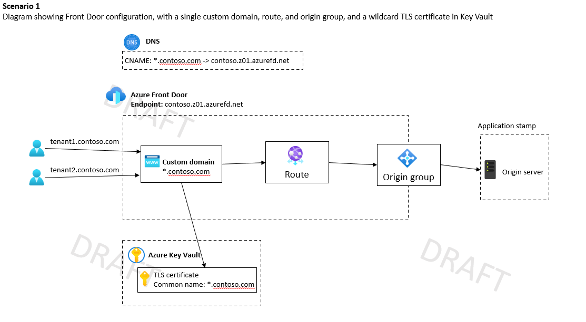
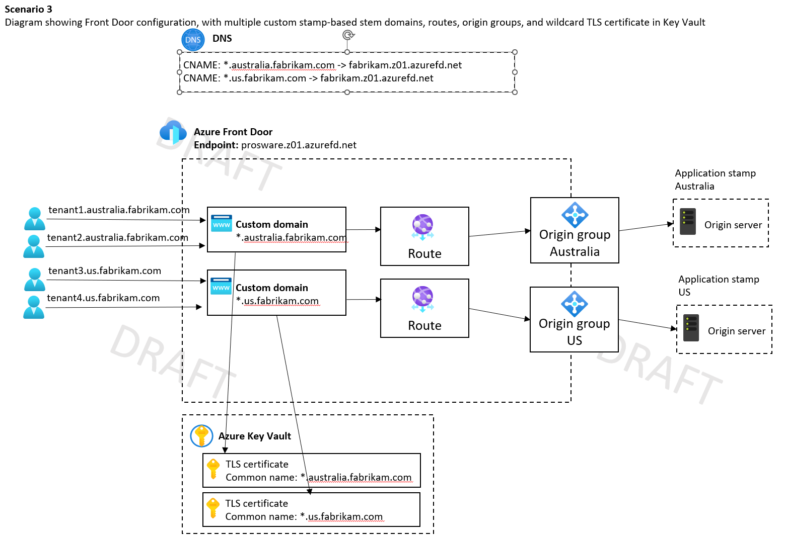
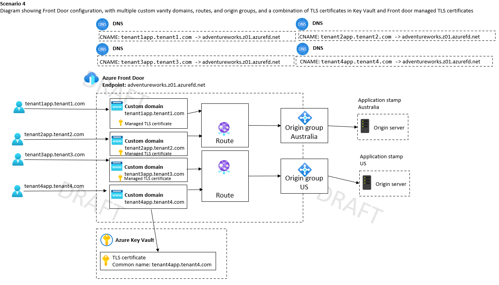

# Azure Front Door considerations for multitenancy

On this page, we describe some of the features of Azure Front Door that are useful when working with multitenanted systems, and we link to guidance and examples for how to use Front Door in a multitenant solution.

In a multitenant solution where you follow the [Deployment Stamps pattern](../../../patterns/deployment-stamp.yml), you might choose to deploy Front Door in two different ways:

- Deploy a single Front Door profile, and use Front Door to route traffic to the appropriate stamp.
- Deploy a Front Door profile in each stamp. If you have ten stamps, you deploy ten instances of Front Door.

In this article, we focus on the first scenario - deploying a single, global Front Door profile.

## Features of Front Door that support multitenancy

In this section, we consider several key features of Front Door that are useful for multitenant solutions. Specifically, we focus on several routing scenarios that Front Door enables. We also discuss how to configure customs domains, including both Front Door-managed and customer-provided TLS certificates. 

### Routing

A multitenant application can have one or more application stamps serving the tenants for scaling and other reasons.  The default URLs for these application stamps are not user friendly.  DNS records are the standard method to map these hard-to-remembers URLs to user friendly ones. While friendly URLs are a step in the right direction, challenges still exist  with routing traffic from a tenant user to the corresponding back-end stamp that is meant to serve the traffic for the tenant. Review [guidance on domain names](../considerations/domain-names.yml), and be aware of CAA restrictions on your tenants' domain names. Visit [Routing architecture](/azure/frontdoor/front-door-routing-architecture) to learn more.

### Rules engine

Rules engine is another feature that can help in using Front Door in shared multitenant models to achieve the desired functionality and isolation.  Rules engine is a rule set that groups a combination of rules into a single set and allows you to customize how requests get processed at the edge, and how Front Door handles those requests.  You can associate a Rule Set with multiple routes. The rules engine enables you to run small sections of logic within Front Door's request processing pipeline. You can use the rules engine to override the routing configuration for a request, or modify elements of a response.

### Custom domains

The default Front Door profile URL containing azurefd.net subdomain is not friendly for end users to remember, not convenient, and not useful for branding purposes.  Fortunately Front Door allows associating a custom domain with the default host.  This will allow you to deliver content using a customer domain in the URL such as https://tenant1.app.contoso.com/photo.png.  In a multitenant application with shared Front Door scenario we specifically need the ability to configure multiple custom domains served by a single Front Door profile. Visit [Custom Domains](/azure/frontdoor/front-door-custom-domain) to learn more.

### Wildcard domains

Front Door provides support for mapping wildcard domains to front end hosts.  Wildcard domains simplify the configuration of traffic routing for each shared tenant's subdomain. Same routing rule can be specified for routing for multiple subdomains tenant1.app.contoso.com, tenant2.app.contoso.com, and tenant2.app.contoso.com by adding the wildcard domain *.app.contoso.com.  There is no additional complexity associated with onboarding of each subdomain to enable HTTPS and bind a certificate or the need to change Front Door configuration whenever a new subdomain is added.  It is important to note that wildcards work well if you're sending all your traffic to a single origin group. But if you have separate stamps of your solution, then a single-level wildcard domain isn't sufficient. You need to either use multi-level stem domains, or supply extra config (e.g. override routes for each tenant, which minimises many of the advantages of wildcards).  Also, Front Door does not issue Wildcard TLS certificates and requires you to supply your own.  Visit [Wildcard Domains](/azure/frontdoor/front-door-wildcard-domain?pivots=front-door-standard-premium) to learn more.

### Managed TLS certificates

Front Door supports two types of domains, non-Azure validated domains and Azure pre-validated domains.  Front Door supports both Azure managed certificates and Bring Your Own Certificates.  For Non-Azure validated domain, the Azure managed certificate is issued and managed by the Front Door. For Azure pre-validated domain, the Azure managed certificate gets issued and is managed by the Azure service that validates the domain. Review [guidance on domain names](../considerations/domain-names.yml), and be aware of CAA restrictions on your tenants' domain names.  Visit [TLS on Frontdoor](/azure/frontdoor/end-to-end-tls) to learn more.  

## Example scenarios

When working with a multitenant system using Front Door, you need to make a decision about the level of isolation that you want to use. The choice of isolation models you use depends on the following factors

- How many tenants do you plan to have?
- Do you share your application tier between multiple tenants, do you deploy single-tenant application instances, or do you deploy separate deployment stamps for each tenant?
- Do your tenants want to use custom domains, want certificates issued or bring their own?
- How do you plan to deploy Front Door?  Note that It is possible to deploy a single shared Front Door following the [Deployment Stamps](../approaches/overview.yml#deployment-stamps-pattern) pattern as discussed below in detail. There are [limits](/azure/azure-resource-manager/management/azure-subscription-service-limits) with each Front Door profile and if you suspect that you are going to approach these limits, consider using a new Front Door profile associated with it or change the way you're using Front Door to avoid the limits, if that's possible.  Also watch for tenant-specific requirements e.g. IP filtering, WAF rule customization.

The following discussion through example scenarios is meant to provide answers to the above questions.

### Scenario 1: Provider-managed wildcard domains, single stamp

Contoso is building a small multitenant solution. They deploy a single stamp in a single region, and that stamp serves all of their tenants. All requests are routed to the same application server. They made a business decision to use wildcard domains for all of their tenants, such as `tenant1.contoso.com`, `tenant2.contoso.com`, and so forth.

They deploy Front Door by using a configuration similar to the diagram below:

**DNS configuration**: Contoso configures one DNS entry - a wildcard CNAME record, `*.contoso.com`, which aliases to their Front Door endpoint, `contoso.z01.azurefd.net`.

**TLS configuration**: Contoso purchases a wildcard TLS certificate, adds it to a key vault, and grants Front Door access to the vault.

**One-time Front Door configuration**: Contoso creates a Front Door profile and a single endpoint. They add one custom domain, with the name `*.contoso.com`, and they associate their wildcard TLS certificate with the custom domain resource. Then, they configure a single origin group, which contains a single origin for their application server. Finally, they configure a route to connect their custom domain to the origin group.

**Benefits**:
- This configuration is relatively simple to configure, and provides customers with Contoso-branded URLs.
- The approach supports a very high number of tenants.
- When a new tenant is onboarded, Contoso doesn't need to make any changes to Front Door, DNS, or TLS certificates.

**Drawbacks:**
- This approach doesn't easily scale beyond a single application stamp or region.
- Contoso has to purchase a wildcard TLS certificate.
- Contoso is responsible for renewing and installing the certificate when it expires.

### Scenario 2: Individual provider-managed domains, multiple stamps

Prosware is building a multitenant solution across multiple stamps, which are deployed into both Australia and Europe. All requests within a single region are served by the stamp in that region. They made a business decision to use wildcard domains for all of their tenants, such as `tenant1.prosware.com`, `tenant2.prosware.com`, and so forth.

They deploy Front Door by using a configuration similar to the diagram below:

**DNS configuration**: Prosware configures one DNS entry - a wildcard CNAME record, `*.prosware.com`, which aliases to their Front Door endpoint, `prosware.z01.azurefd.net`.

**TLS configuration**: Prosware purchases a wildcard TLS certificate, adds it to a key vault, and grants Front Door access to the vault.

**One-time Front Door configuration**: Prosware creates a Front Door profile and a single endpoint. They configure multiple origin groups one per application stamp/server in each region.

**Front Door configuration when they onboard a new tenant:** Whenever they onboard a new tenant, Prosware adds a custom domain resource to Front Door. They use the name `*.prosware.com`, and associate their wildcard TLS certificate with the custom domain resource. Then, they create a route to specify which origin group (stamp) that tenant's requests should be directed to. In the example diagram above, `tenant1.prosware.com` routes to the origin group in the Australia region, and `tenant2.prosware.com` routes to the origin group in Europe region.

**Benefits**: 
- When new tenants are onboarded, no DNS or TLS configuration changes are required.
- Prosware maintains single instance of Front Door to route traffic to multiple stamps across multiple regions.

**Drawbacks:**
- This approach requires reconfiguring Front Door each time a new tenant is onboarded, to add a custom domain and a route.
- Prosware has to pay attention to Front Door subscription limits, especially on the number of routes, custom domains, and the composite routing limit (TODO links).
- Prosware has to purchase a wildcard TLS certificate.
- Prosware is responsible for renewing and installing the certificate when it expires.

### Scenario 3: Customer and stamp-based, provider-managed subdomains

Fabrikam is building a multitenant solution. They deploy stamps in Australia and the United States. All requests within a single region will be served by the stamp in that region. They made a business decision to use stamp-based stem domains, such as `tenant1.australia.fabrikam.com`, `tenant2.australia.fabrikam.com`, `tenant3.us.fabrikam.com`, and so forth.

They deploy Front Door by using a configuration similar to the diagram below:

**DNS configuration**: Fabrikam configures one DNS entry per stamp by mapping *.australia.fabrikam.com with CNAME to AFD-Profile-Name.z01.azurefd.net, and mapping *.us.fabrikam.com with CNAME to AFD-Profile-Name.z01.azurefd.net etc.    

**TLS configuration**: Fabrikam purchases a wildcard TLS certificate for each stamp and add it to a key vault.

**Front Door configuration**: The final Front Door configuration will have one origin group per stamp.  Each stamp is configured with one custom domain with a matching wildcard certificate for the stamp/origin group, e.g. *.us.fabrikam.com custom domain will be mapped to the US origin group with one route per stamp.  As an example tenant2.us.fabrikam.com custom domain will be connected to the US origin group.  The configuration in this scenario scales very well as new tenants are on-boarded. 

**Benefits and drawbacks**: Same benefits and drawbacks discussed in scenario 2 also exist here.  There is an additional drawback of having to deal with slightly complex URLs.

### Scenario 4: Vanity domains

AdventureWorks is building a multitenant solution. They deploy stamps in multiple regions, such as Australia and the United States. All requests within a single region will be served by the stamp in that region. They made a business decision to allow their tenantsbring their own domain names. For example, Tenant 1 might configure a custom domain name like `tenant1app.tenant1.com`.

They deploy Front Door by using a configuration similar to the diagram below:

#### DNS configuration

**When a new tenant is onboarded:** The tenant needs to create a record in their own DNS server and alias it to the AdventureWorks Front Door endpoint. For example, Tenant 1 needs to configure a DNS record named `tenant1app.tenant1.com` and map it to `adventureworks.z01.azurefd.net`.

#### TLS configuration

AdventureWorks and their tenants need to decide who issues TLS certificates:
- The easiest option is for Front Door to issue and manage the certificates, but tenants must ensure not to configure a CCA record in their DNS server because this might Front Door's certification authority from issuing certificates.
- Alternately, tenants can provide their own certificate. They must work with AdventureWorks to upload the certificate to a key vault, and provide access to Front Door.

#### Front Door configuration

**One-time configuration:** TODO

**When a new tenant is onboarded:** AdventureWorks adds a custom domain resource to Front Door. They use the tenant-provided domain name, and they associate the appropiate TLS certificate with the custom domain resource. Then, they create a route to specify which origin group (stamp) that tenant's requests should be directed to. In the example diagram above, `tenant1app.tenant1.com` routes to the origin group in the Australia region, and `tenant2app.tenant2.com` routes to the origin group in the US region.

#### Benefits

TODO scenario 2

#### Drawbacks

TODO scenario 2

## Contributors

*This article is maintained by Microsoft. It was originally written by the following contributors.*

Principal author:

 * [Raj Nemani](http://linkedin.com/in/rajnemani) | Partner Technology Strategist

Other contributors:

 * [John Downs](http://linkedin.com/in/john-downs) | Principal Customer Engineer, FastTrack for Azure
 * [Arsen Vladimirskiy](http://linkedin.com/in/arsenv) | Principal Customer Engineer, FastTrack for Azure

*To see non-public LinkedIn profiles, sign in to LinkedIn.*

## Next steps

Links to other relevant pages within our section.
