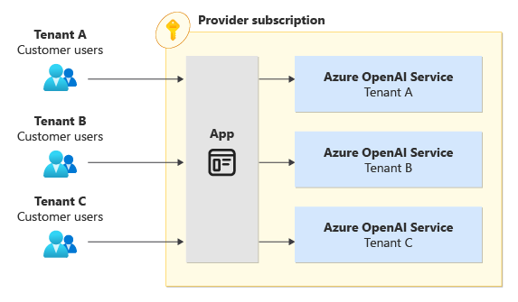
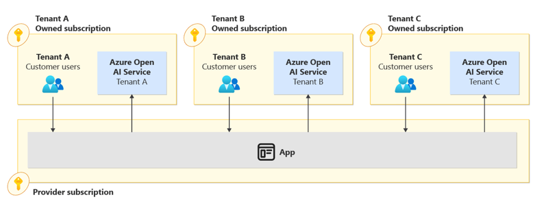
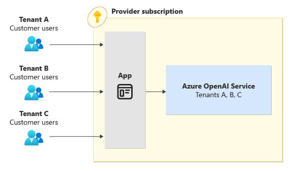

# Multitenancy and Azure OpenAI

[Azure OpenAI Service](/azure/ai-services/openai/overview) is a comprehensive offering that enables access to OpenAI's powerful language models. On this page, we highlight key features of the Azure OpenAI Service that are beneficial for multi-tenant solutions. Furthermore, we provide links to useful resources that can assist you in planning your approach to using this service.

## Isolation models

When working with a multitenant system using Azure OpenAI Service, you need to decide the level of isolation that you want to adopt. The choice of isolation models you use depends on the following factors:

- How many tenants do you plan to have?
- Do you share your application tier between multiple tenants? If yes, do you deploy single-tenant application instances, or do you create separate deployments for each tenant?
- Do your tenants have compliance requirements that require access to a separate instance from other tenants?

The following table summarizes the differences between the main tenancy models for Azure OpenAI:

| Consideration | Azure OpenAI per tenant, in the provider's subscription | Azure OpenAI per tenant, in the tenant's subscription | Shared Azure OpenAI |
|-|-|-|-|
| **Data isolation** | High | Very high | Low |
| **Performance isolation** | High | High | Low-medium, depending on the TPM usage per tenant |
| **Deployment complexity** | Low-medium, depending on the number of tenants | High. The tenant must correctly grant access to the provider | Low |
| **Operational complexity** | High | Low for the provider, higher for the tenant | Low |
| **Example scenario** | Individual application instances per tenant | Tenants with specific compliance requirements or custom models | Large multitenant solution with a shared application tier |

### Azure OpenAI per tenant, in the provider's subscription

If you are a service provider, you might consider deploying an Azure OpenAI Service instance for each of your tenants within your Azure subscription. This approach provides you with strong data isolation between each tenant's data, but it requires that you deploy and manage an increasing number of Azure OpenAI Service resources, as you increase the number of tenants.

This approach may make sense when you have separate application deployments for each tenant, or when you need to circumvent certain limitations, such us quota or Request Per Minute(RPM). This [article](/azure/ai-services/openai/quotas-limits#quota-and-limits-reference) contains a quick reference and a detailed description of the quotas and limits for Azure OpenAI.

The following diagram illustrates the Azure OpenAI per tenant, in the provider's subscription model.

### Azure OpenAI per tenant, in the tenant's subscription

In some situations, your tenants might create the Azure OpenAI Service instance in their own Azure subscriptions and grant your application access to it. This approach is appropriate when tenants have specific quotas and permissions from Microsoft, such as access to the latest models, less strict filtering, or the use of provisioned throughput. It may also be applicable in cases where the tenant has a fine-tuned model for their use case or requires a component running in their environment that processes and sends data through their customer-managed Azure OpenAI service for processing.

To access an Azure OpenAI Service instance in your tenant's subscription, the tenant must provide your application with access to this resource. This process requires that your application authenticates through their Azure AD instance. One approach is to publish a [multitenant Azure AD application](/azure/active-directory/develop/single-and-multi-tenant-apps). Your tenants must perform a one-time consent process. They first register the multitenant Azure AD application in their own Azure AD tenant. Then, they grant your multitenant Azure AD application the appropriate level of access to their Azure OpenAI resource, for example, assigning the application to the "Cognitive Services User" role via Azure RBAC. They also need to provide you with the resource ID of the Azure OpenAI  Service resource that they've created. Then, your application code can use a service principal that's associated with the multitenant Azure AD application in your own Azure AD to access each tenant's Azure OpenAI Service.

Alternatively, you might ask each tenant to create a service principal for your service to use, and to provide you with its credentials. However, this approach requires that you securely store and manage credentials for each tenant, which is a potential security liability.

If your tenants configure network access controls on their Azure OpenAI, make sure you are be able to access it.

The following diagram illustrates the Azure OpenAI per tenant, in the tenant's subscription model.

### Shared Azure OpenAI

You might choose to share an instance of Azure OpenAI Service between multiple tenants. The Azure OpenAI resource is deployed in your (the solution provider's) Azure subscription, and you're responsible for managing it. This approach is the simplest solution you can implement, but it provides the least data isolation and performance isolation. Sharing the Azure OpenAI service does not offer access security at the model deployment level, which may make it easier for other tenants to use unauthorized models. Therefore, sharing an Azure OpenAI instance when using fine-tuned models is strongly discouraged, as it may expose sensitive information and allow unauthorized access to tenant-specific resources.

Sharing an instance of Azure OpenAI Service between multiple tenants can also lead to the [noisy neighbor](/azure/architecture/antipatterns/noisy-neighbor/noisy-neighbor) problem, which might cause higher latency for some tenants. You also need to make your application code multitenancy-aware. For example, if you want to charge back your customers the consumption cost of a shared Azure OpenAI Service instance, you should keep track of the total number of tokens per tenant in your application.

You might also choose to deploy multiple shared Azure OpenAI. For example, if you follow the [Deployment Stamps pattern](../approaches/overview.yml#deployment-stamps-pattern), you are likely to deploy a shared Azure OpenAI within each stamp. Similarly, if you deploy a multi-region solution, you should deploy Azure OpenAI into each region for the following reasons:

- To avoid cross-region traffic latency.
- To support data residency requirements.
- To enable the use of regional Azure OpenAI within other services that require same-region deployments.

When you work with a shared Azure OpenAI, it's important to consider its [limits](azure/ai-services/openai/quotas-limits#quotas-and-limits-reference) and [manage your quota](azure/ai-services/openai/how-to/quota).

The following diagram illustrates the Shared Azure OpenAI model.

#### Azure OpenAI model per tenant

When using a shared Azure OpenAI Service, deploying individual instances of the same model for each tenant's exclusive use can offer significant benefits. This approach allows for enhanced parameter customization for each deployment and facilitates tenant-specific TPM allocation, which can help achieve more precise cost allocation and management. It clearly explains resource consumption and expenses associated with each tenant's usage. Furthermore, it can optimize resource utilization, ensuring that each tenant only pays for their required resources, leading to more cost-effective solutions. In addition, this method promotes scalability and adaptability, as tenants can adjust their resource allocation based on their evolving needs and usage patterns.

> [!NOTE]
> When customizing models for unique needs, it's essential to consider the different approaches available, keeping in mind that every tenant may have distinct requirements and use cases.. One aspect to keep in mind is that fine-tuning may not be the go-to choice for most use cases. Instead, it's worth exploring other options, such as grounding. Therefore, taking the time to evaluate these factors can help ensure you choose the best approach to meet your specific needs.

## Features of Azure OpenAI that support multitenancy

### Managed Identities

By using managed identities from Azure Active Directory (Azure AD), you can enable access to Azure OpenAI from other resources authenticated by Azure AD. When you use managed identities, you don't need to use an Azure OpenAI API key. You can grant specific permissions to your Azure OpenAI identity for role-based access control.

When you use managed identities, keep your choice of isolation model in mind. For more information, see [Azure OpenAI Service with managed identities](azure/ai-services/openai/how-to/managed-identity).

## Contributors

*This article is maintained by Microsoft. It was originally written by the following contributors.*

Principal author:

 * [Sofia Ferreira](http://linkedin.com/in/asofiamferreira) | Software Engineer, ISV & DN CoE

Other contributors:

 * [Arsen Vladimirskiy](http://linkedin.com/in/arsenv) | Principal Customer Engineer, FastTrack for Azure
 * [Daniel Scott-Raynsford](https://www.linkedin.com/in/dscottraynsford) | Partner Tech Strategist
 * [John Downs](http://linkedin.com/in/john-downs) | Principal Program Manager
 * [Landon Pierce](https://www.linkedin.com/in/landon-pierce) | Customer Engineer, FastTrack for Azure
 * [Paolo Salvatori](http://linkedin.com/in/paolo-salvatori) | Principal Customer Engineer, ISV & DN CoE

*To see non-public LinkedIn profiles, sign in to LinkedIn.*

## Next steps

Review [deployment and configuration approaches for multitenancy](../approaches/deployment-configuration.yml).
