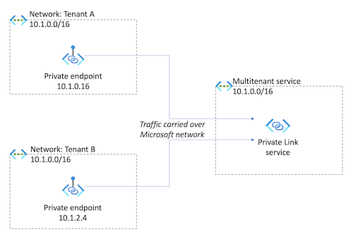
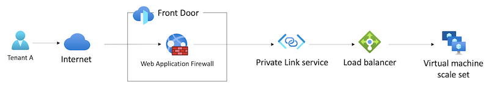
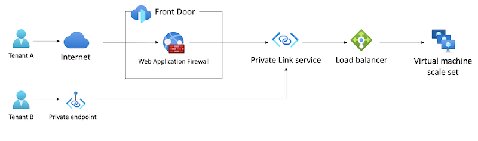

# Multitenancy and Azure Private Link

Azure Private Link provides private IP addressing for Azure platform services, and for your own applications hosted on Azure virtual machines. You can use Private Link to enable private connectivity from your tenants' Azure environments. Tenants can also use Private Link to access your solution from their on-premises environments when they're connected through virtual private network gateways (VPN Gateway) or ExpressRoute.

Azure Private Link service is used by many large SaaS providers, including [Snowflake](/shows/Azure-Videos/Azure-Private-Link--Snowflake), [Confluent Cloud](https://www.confluent.io/blog/how-to-set-up-secure-networking-in-confluent-with-azure-private-link/), and [MongoDB Atlas](https://www.mongodb.com/blog/post/announcing-azure-private-link-integration-for-mongo-db-atlas).

In this article, we review how you can configure Private Link for an Azure-hosted multitenant solution.

## Key considerations

### Overlapping IP address spaces

Private Link provides powerful capabilities for multitenant solutions where tenants can access the service through private address spaces.

Different tenants frequently use the same or overlapping private IP address spaces. For example, your multitenant solution might use the IP address space of `10.1.0.0/16`. Suppose tenant A uses their own on-premises network with the same IP address space, and coincidentally tenant B also uses the same IP address space. You can't directly connect or peer your networks together because the IP address ranges overlap.

When you use Private Link to enable connectivity from each tenant to the multitenant solution, each tenant's traffic automatically has network address translation (NAT) applied. Each tenant can use a private IP address within their own respective network, and the traffic flows to the multitenant solution transparently. Private Link performs NAT on traffic, even when tenants and the service provider all use overlapping IP address ranges:

When traffic arrives into the multitenant solution, it's already been translated. This means traffic appears to originate from within the multitenant service's own virtual network IP address space. Private Link provides the [TCP Proxy v2](#proxy-protocol-v2) feature, which enables a multitenant service to know the tenant that sent the request, and even the original IP address from the source network.

### Service selection

When you use Private Link, it's important to consider the service that you want to allow inbound connectivity to. In most solutions, the service is one of the following types:

- An application hosting platform, like Azure App Service.
- A network or API gateway, like Azure Application Gateway or Azure API Management.
- Virtual machines behind a standard load balancer.

The application platform you use determines many aspects of your Private Link configuration, and the limits that apply. Additionally, some services don't support Private Link for inbound traffic.

### Limits

Carefully consider the number of private endpoints that you can create based on your solution's architecture. If you use a platform as a service (PaaS) application platform, it's important be aware of the maximum number of private endpoints that a single resource can support. If you run virtual machines, you can attach a Private Link service instance to a standard load balancer (SLB). In this configuration, you can generally connect a higher number of private endpoints, but limits still apply. These limits might determine how many tenants you can connect to your resources by using Private Link. Review [Azure subscription and service limits, quotas, and constraints](/azure/azure-resource-manager/management/azure-subscription-service-limits) to understand the limits to the number of endpoints and connections.

Additionally, some services require specialized networking configuration to use Private Link. For example, if you use Private Link with Azure Application Gateway, you must [provision a dedicated subnet](/azure/application-gateway/private-link-configure) in addition to the standard subnet for the Application Gateway resource.

Carefully test your solution, including your deployment and diagnostic configuration, with your Private Link configuration enabled. Some Azure services block public internet traffic when a private endpoint is enabled, which can require that you change your deployment and management processes.

### Traffic paths

You might choose to deploy your solution to be both internet-facing and also exposed through private endpoints. Consider your overall network topology, and the paths that each tenant's traffic follows.

For example, suppose you build an internet-facing application that runs on a virtual machine scale set. You use Azure Front Door, including its web application firewall (WAF), for security and traffic acceleration, and you [configure Front Door to send its traffic through a private endpoint to your backend (origin) service](/azure/frontdoor/private-link).

Suppose tenant A uses this path to access your service:

If you provide tenant B with a private endpoint to access your solution, their traffic bypasses your Front Door profile and the WAF:

Consider whether you need your WAF to inspect private traffic, or if you need to use other Front Door features for traffic routing or caching. If you do, you'll need to consider how to replicate this functionality for your private traffic.

## Isolation models

Private Link is designed to support scenarios where a single application tier can be used by multiple separate clients, such as your tenants. When you consider isolation for Private Link, the main concern is around the number of resources you need to deploy to support your requirements.

The resources you deploy typically depend on whether your application tier resources are dedicated to a specific tenant or if they're shared between tenants.

If you deploy a dedicated set of application tier resources for each tenant, it's likely that you can deploy one private endpoint for that tenant to use to access their resources. It's unlikely that you'll exhaust any Private Link-related service limits, because each tenant has their own resources dedicated to them.

If you share your application tier resources between multiple tenants, then the number of Private Link resources you deploy depends on the underlying Azure service:

- For virtual machine-based workloads, you need to deploy one or more Private Link service instances. A single Private Link service instance supports a large number of private endpoints. If you do exhaust the limit, you can deploy more instances, although there are also limits to the number of Private Link services you can deploy on a single load balancer.
- For Azure platform services, you need to deploy one private endpoint for each of your tenants' virtual networks that connect to your service. There are limits on the number of private endpoints that can be attached to a single resource, and these limits are different for each service.

## Features of Azure Private Link that support multitenancy

Private Link has several features that are helpful in a multitenant environment. However, the specific features available to you depend on the service you use. The foundational Azure Private Link service, for virtual machines and load balancers, supports all of the features described below. Other services with Private Link support might provide only a subset of these features.

### Service aliases

When a tenant configures access to your service by using Private Link, they need to be able to identify your service so that Azure can establish the connection.

Private Link service, and certain other Private Link-compatible Azure services, enable you to [configure an alias](/azure/private-link/private-link-service-overview#alias) that you provide to your tenants. By using an alias, you avoid disclosing your Azure subscription IDs and resource group names.

### Service visibility

The Private Link service enables you to [control the visibility of your private endpoint](/azure/private-link/private-link-service-overview#control-service-exposure). You might allow all Azure customers to connect to your service if they know its alias or resource ID. Alternatively, you might restrict access to just a set of known Azure customers.

You can also specify a limited number of pre-approved Azure subscription IDs that can connect to your private endpoint. If you choose to use this approach, consider how you'll collect and authorize subscription IDs. For example, you might provide an administration user interface in your application to collect a tenant's subscription ID. Then, you can dynamically reconfigure your Private Link service instance to pre-approve that subscription ID for connections.

### Connection approvals

After a connection has been requested between a client (like a tenant) and a private endpoint, Private Link requires that the connection is *approved*. Until the connection is approved, traffic can't flow through the private endpoint connection.

The Private Link service supports several types of approval flows, including:

- **Manual approval**, where your team explicitly approves every connection. This approach is viable when you have only a few tenants who use your service through Private Link.
- **API-based approval**, where the Private Link service treats the connection as requiring a manual approval, and your application uses the [Update Private Endpoint Connection API](/rest/api/virtualnetwork/private-link-services/update-private-endpoint-connection), the Azure CLI, or Azure PowerShell to approve a connection. This approach can be useful when you have a list of tenants who have been authorized to use private endpoints.
- **Auto-approval**, where the Private Link service itself maintains the list of subscription IDs that should have their connections automatically approved.

For more information, see [Control service access](/azure/private-link/private-link-service-overview#control-service-access).

### Proxy Protocol v2

When you use Private Link service, by default your application only has visibility of an IP address that has been through network address translation (NAT). This behavior means that traffic appears to flow from within your own virtual network.

Private Link service enables you to get access to the original client IP address, in the tenant's virtual network. This feature uses the [TCP Proxy Protocol v2](/azure/private-link/private-link-service-overview#getting-connection-information-using-tcp-proxy-v2).

For example, suppose your tenants' administrators need to add IP address-based access restrictions, such as *host 10.0.010 can access the service, but host 10.0.0.20 can't*. When you use Proxy Protocol v2, you can enable your tenants to configure these types of access restrictions in your application. However, your application code needs to inspect the client's original IP address and enforce the restrictions.

## Related resources

[!include]

## Next steps

Review [networking approaches for multitenancy](../approaches/networking.md).
