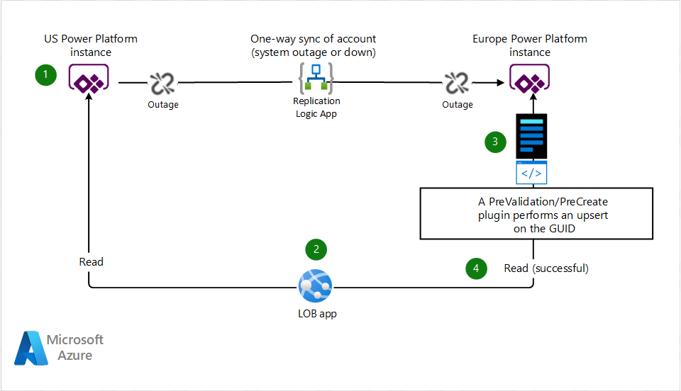
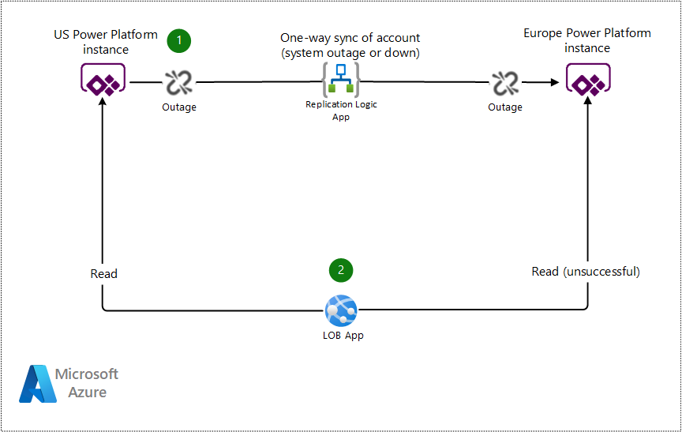

This article outlines a scenario in which a hypothetical US-based customer, Contoso, has recently acquired another company based in Europe and is in the process of CRM and ERP systems between the two companies.  As part of this integration, they must keep a portion of their Dynamics 365 Dataverse entities in sync until they can be fully integrated.  A Conotso proprietary line-of-business (LOB) app consumes data from both systems and must be able to accept requests when the data is awaiting synchronization or when it's missing. The following guide shows how to account for eventual consistency between Power Platform instances.

## Architecture

### Plugin/flow to always upsert based on the GUID or alternate key

*Download a [Visio file](https://arch-center.azureedge.net/solution.vsdx) of this architecture.*

### Workflow

This solution can be built with several [plugin](/power-apps/developer/data-platform/plug-ins) steps, within the plugin lifecycle. When the entity that you're creating is mandatory, use the [PreValidation step](/power-apps/developer/data-platform/event-framework#event-execution-pipeline). **PreValidation** happens before any database transactions are started. It's the preferred option, if the field is mandatory. However, in some scenarios, a **PreCreate** plugin step will suffice.

1. The **US Instance** attempts to synchronize a new account to the **Europe Instance** via a Logic App. The **Europe Instance** is unreachable, due to downtime or upgrade.
2. The Contoso LOB app reads the main account entities from the **US Instance**. It intends to submit an API call that references an account entity that wasn't replicated to the **Europe Instance**. As it stands, the API call would fail because the record doesn't exist, due to the sync not working.
3. However, a **PreValidation**/**PreCreate** plugin first performs an _upsert_ based on the provided entity GUID and provided reference data. If it exists already, then nothing is changed. If it doesn't exist, a new account is created, with most of the fields blank.
4. The API call succeeds because the account with the given ID exists in the system. The plugin intercepted the operation and handled the missing record gracefully. The report from the LOB application is generated successfully.

>[!NOTE]
> Microsoft recommends introducing a circuit breaker pattern in your custom code to back off and retry as part of this solution to handle platform outages when referencing either instance. For more information about using a circuit breaker, see [Circuit Breaker Pattern](/azure/architecture/patterns/circuit-breaker).

### Alternatives

The scenario described above uses a custom Logic App as the replication method. However, there are multiple ways to replicate data between Dataverse instances, which include, but aren't limited to:

- Logic Apps
- Function apps in Azure Functions
- Azure Data Factory
- Azure Synapse Analytics
- Power Automate

## Scenario details

Organizations occasionally find the need to keep two or more Power Platform instances in sync, more specifically, usually a subset of Dataverse entities. This requirement can happen when an organization has intentionally added new instances for geographic isolation but needs a common data set across all geos. Or it can happen when two organizations merge before Power Platform consolidation is complete.

When the syncing process works as designed, line of business applications that consume from both instances don't have issues. However, syncing mechanisms are never error proof, outages or unexpected issues will likely arise. In that case, your line of business application that consumes data from both instances must be built to handle incomplete data.

In order for Contoso's new European subsidiary to be integrated into Contoso's business structure, they must synchronize accounts and contacts from one instance of Power Platform to another. In this scenario, the US instance of Power Platform syncs a daily batch of reference data via a custom Logic App to the European instance. A proprietary Contoso LOB app generates reporting on problem tickets that users have created. To complete this task, the LOB app reads user data from both Dataverse instances to pull the relevant data, the primary reference keys from the US instance and the ticket data from the Europe instance. If the synchronization process hasn't been completed due to downtime, maintenance, or another communications issue, the request will produce an error due to entities missing from the Europe instance.

### Potential use cases

This pattern can be useful in the following situations:

- The system that sends reference data is down.
- The synchronization of data takes a long time or the process is delayed.
- Consuming systems have no logic on the creation of the entity being created.

#### When to use this approach

Use this approach in the following scenarios:

- You want to guarantee a record with a given key exists, and you don't care that the record isn't fully hydrated.
- You must accept creation, even if the data is still not synchronized.

This pattern may not be suitable in the following scenario:

- Logic is applied when the record is created. Because the data won't be hydrated, it's not safe to rely on certain properties being available.

### Examples

The following examples show the potential journeys and the result of synchronization delays.

**Example 1 - Successful path with no outage or transient errors**

*Download a [Visio file](https://arch-center.azureedge.net/data-dependent-example.vsdx) of this architecture.*

1. The **US Instance** synchronizes a new account to the **Europe Instance** via a Logic App. All are working because no transient faults or outages have occurred.
2. The Contoso LOB app reads the main account entities from the **US Instance** and intends to submit an API call that references an account entity that was replicated to the **Europe Instance**. It works because everything was up, and no outages or transient faults occurred. The report from the LOB application is generated successfully.

**Example 2 - Unsuccessful path where sync is down or delayed**

*Download a [Visio file](https://arch-center.azureedge.net/data-dependent-example-fails.vsdx) of this architecture.*

1. The **US Instance** attempts to synchronize a new account to the **Europe Instance** via a Logic App. The **Europe Instance** is unreachable, due to downtime, maintenance or another communications issue.
2. The Contoso LOB app reads the main account entities from the **US Instance** and intends to submit an API call that references an account entity that wasn't replicated to the **Europe Instance**. The API call fails because the account with the given identifier wasn't created in the **Europe Instance** and the report isn't generated.

## Considerations

Consider the impact of any business logic on an entity that isn't hydrated yet. Consider a scenario where the entity isn't fully hydrated and synchronized yet. Some of the properties will be null, so you need to ensure that any decisions on the data are factored in when using this approach.

## Next steps

- [Power Platform](/power-platform)
- [What is Power Apps?](/powerapps/powerapps-overview)
- [What is Azure Logic Apps?](/azure/logic-apps)
- [Get started with Power Automate](/power-automate/getting-started)

## Related resources

Related architectures:

- [CI/CD for Microsoft Power Platform](/azure/architecture/solution-ideas/articles/azure-devops-continuous-integration-for-power-platform)
- [Citizen AI with the Power Platform](/azure/architecture/example-scenario/ai/citizen-ai-power-platform)
- [Power Automate deployment at scale](/azure/architecture/example-scenario/power-automate/power-automate)

Guidance for Web development:

- [Ten design principles for Azure applications](/azure/architecture/guide/design-principles)
- [Design and implementation patterns](/azure/architecture/patterns/category/design-implementation)
- [App Service deployment best practices](/azure/app-service/deploy-best-practices?toc=/azure/architecture/toc.json&bc=/azure/architecture/_bread/toc.json) 
- [Microsoft Azure Well-Architected Framework](/azure/architecture/framework)
