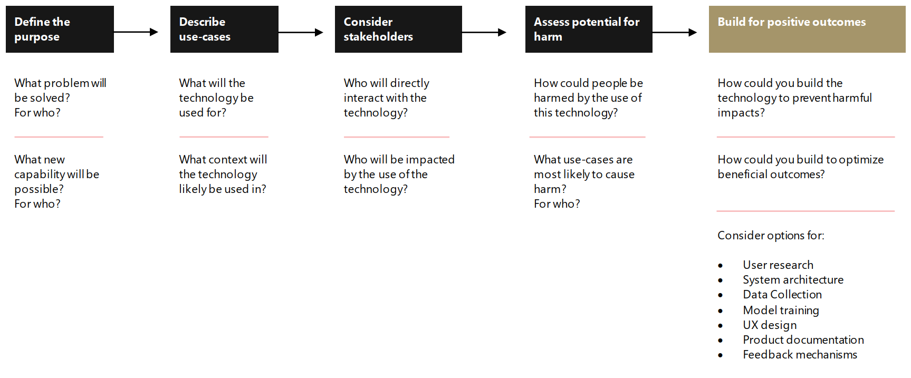
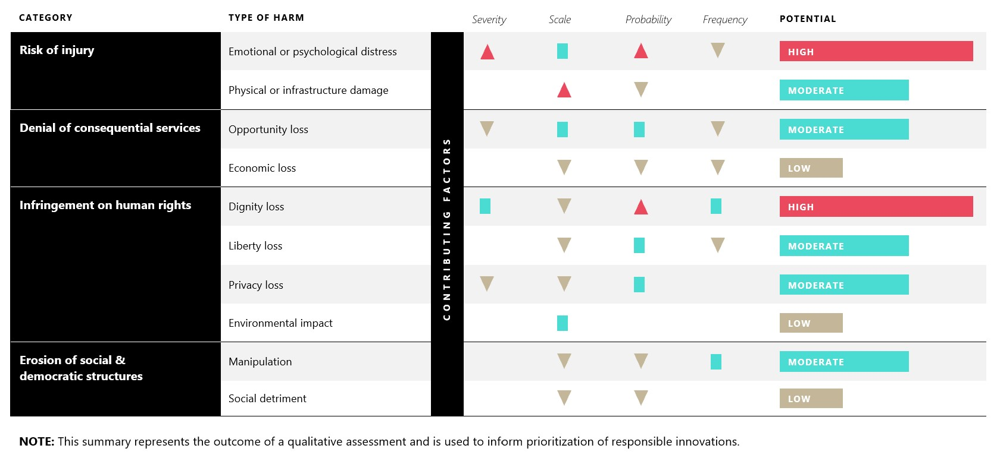

# Foundations of assessing harm

Harms Modeling is a practice designed to help you anticipate the potential for harm, identify gaps in product that could put people at risk, and ultimately create approaches that proactively address harm.

## Why harms modeling?

As technology builders, your work is global. Designing AI to be trustworthy requires creating solutions that reflect ethical principles deeply rooted in important and timeless values. In the process of designing and building your technologies, it is essential to evaluate not only ideal outcomes, but possible negative ones as well.

### Technology and human rights

It is as important as ever to be aware of how digital technology could impact human rights. In addition to continuing to protect privacy and security, we must address the risks of AI and other emerging technologies, such as facial recognition. History teaches us that human rights violations not only result from the nefarious use of technology, but also from a lack of awareness amongst those who have good intentions. As a part of our company's dedication to the protection of human rights, Microsoft forged a partnership with important stakeholders outside of our industry, including the United Nations (UN).

An important set of UN principles that our company firmly supports, which was ratified by over 250 nations, is the Universal Declaration of Human Rights (UDHR). The UDHR is a milestone document. Drafted by a diverse global group of legal and cultural experts, the Declaration was proclaimed by the United Nations General Assembly in 1948 as a common standard of achievements for all peoples and all nations. It sets out, for the first time, fundamental human rights to be universally protected. It has been translated into over 500 languages. Additionally, Microsoft is one of 4,700 corporate signatories to the UN Global Compact, an international business initiative designed to promote responsible corporate citizenship.

*Download in [Microsoft Word](../images/stakeholder-process-table.docx)*

## Human understanding

In addition to appreciating the importance of human rights, building trustworthy systems requires us to consider many people's perspectives. Asking who the stakeholders are, what they value, how they could benefit, and how they could be hurt by our technology, is a powerful step that allows us to design and build better products.

### Who does the technology impact?

#### Who are the customers?

- What do they value?
- How should they benefit?
- How could tech harm them?

#### Who are the non-customer stakeholders?

- What do they value?
- How should they benefit?
- How could tech harm them?

Asking these questions is a practice in [Value Sensitive Design](https://vsdesign.org/) and is the beginning to better understanding what is important to stakeholders, and how it plays into their relationship with the product.

### Types of stakeholders

#### Project sponsors

Backers, decision makers, and owners make up this category. Their values are articulated in the project strategy and goals.

#### Tech builders

Designers, developers, project managers, and people working directly on designing systems make up this group. They bring their own ethical standards and profession-specific values to the system.

#### Direct & indirect stakeholders

These stakeholders are significantly impacted by the system. Those who are impacted include end users, software staff, clients, bystanders, interfacing institutions, and even past or future generations. Non-human factors such as places, for example, historic buildings or sacred spaces, may also be included.

#### Marginalized populations

This category is made up of the population frequently considered a minority, vulnerable, or stigmatized. This category includes children, the elderly, members of the LGBTQ+ community, ethnic minorities, and other populations who often experience unique and disproportionate consequences.

## Assessing Harm

Once you have defined the technology purpose, use cases, and stakeholders, conduct a Harms Modeling exercise to evaluate potential ways the use of a technology you are building could result in negative outcomes for people and society.

*Download in [Microsoft Word](../images/harms-modeling.docx)*

The diagram above is an example of a harms evaluation. This model is a qualitative approach that's used to understand the potential magnitude of harm.

You can complete this ideation activity individually, but ideally it is conducted as collaboration between developers, data scientists, designers, user researcher, business decision-makers, and other disciplines that are involved in building the technology.

Suggestions for harm description statements:
- Intended use: If [feature] was used for [use case], then [stakeholder] could experience [harm description].
- Unintended use: If [user] tried to use [feature] for [use case], then [stakeholder] could experience [harm description].
- System error: If [feature] failed to function properly when used for [use case], then [stakeholder] could experience [harm description].
- Misuse: [Malicious actor] could potentially use [feature], to cause [harm description] to [stakeholder].

Use the categories, questions, and examples described in the [Types of harm](./type-of-harm.md) to generate specific ideas for how harm could occur. The article lists categories of harms, that are based upon common negative impact areas. Adapt and adopt additional categories that are relevant to you.

## Next Steps

Read [Types of harm](./type-of-harm.md) for further harms analysis.
