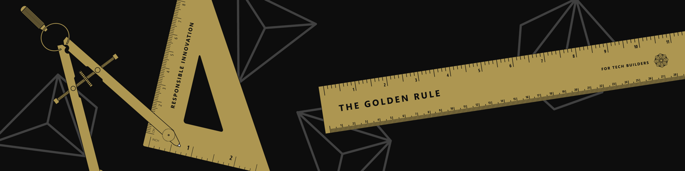
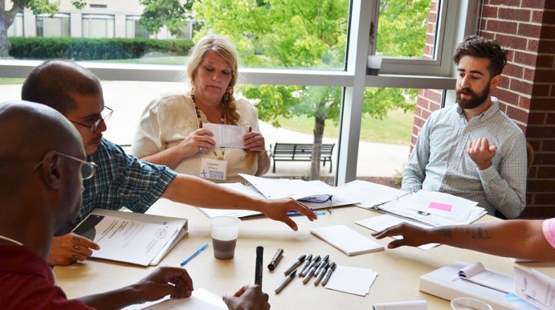

# Responsible Innovation: Best Practices Toolkit

Responsible Innovation is a commitment to put people first in the development of technology by understanding the stakeholders and impact of your technology. It means always considering the individual and societal impact of your technology and intentionally designing, developing and deploying your innovations with a genuine concern for the well-being of the people impacted by that innovation.

Building technology with consideration for context of use and potential impacts requires the application of new techniques for all phases of the software development lifecycle, including: data collection, data governance, model training, system architecture, user experience design, product documentation, feedback loops, and communication about the value and limitations of the technology.

It takes much more than great tools and technology to innovate responsibly, we also need to have practices that ensure our products are designed with consideration of all the people they could impact.

Today we're launching a toolkit of Responsible Innovation Practices based on our own experiences developing AI inside of Microsoft. We're launching this toolkit with these two best practices and will be adding more for you in the coming months:

:::row:::
   :::column span="":::
       
   :::column-end:::
   :::column span="2":::
        ## [Harms Modeling](./harms-modeling/index.md)
        A framework for product teams, grounded in four core pillars, to examine how people's lives can be negatively impacted by technology -- injuries, denial of consequential services, infringement on human rights, and erosion of democratic & societal structures. Similar to Security Threat Modeling, Harms Modeling enables product teams to anticipate potential real-world impacts of technology, which is a cornerstone of responsible development.
   :::column-end:::
:::row-end:::
:::row:::
   :::column span="":::
       
   :::column-end:::
   :::column span="2":::
        ## [Community Jury](./community-jury/index.md)
        An adaptation of the [citizen jury](https://jefferson-center.org/about-us/how-we-work/), is a technique bringing together diverse stakeholders who are impacted by a technology. Stakeholders are provided an opportunity to learn from experts about a project, deliberate together, and give feedback on use cases and product design. This technique allows project teams to collaborate with researchers to identify stakeholder values and understand the perceptions and concerns of impacted stakeholders.
   :::column-end:::
:::row-end:::

