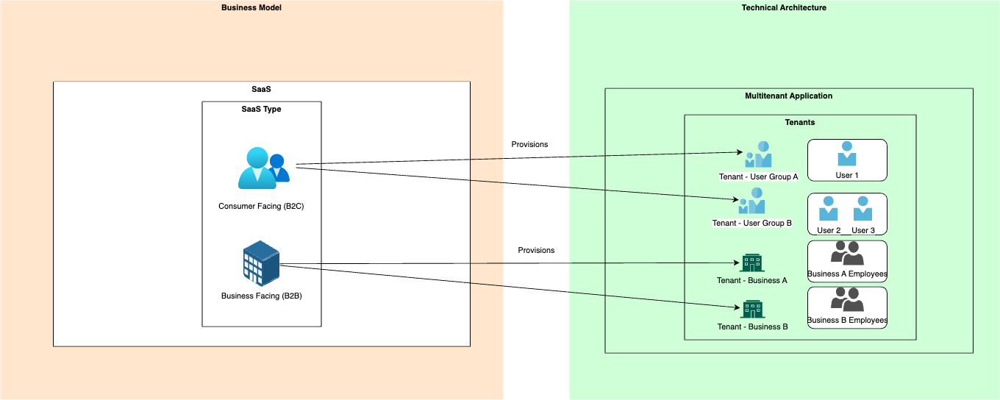
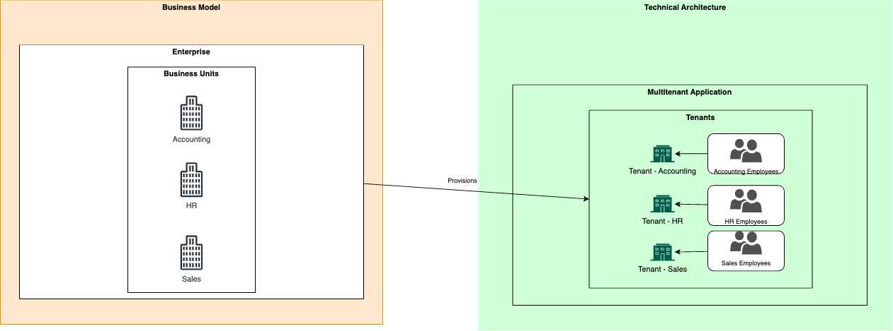

# SaaS and multitenant solution architecture

An organization can use software as a service (SaaS) to efficiently deliver software to its customers. Typically, a SaaS vendor operates and manages the software for their customers. Many independent software vendors (ISVs) are migrating from providing software that customers must install and manage by themselves to using a SaaS model because it improves customer experience and reduces overhead. This is an introduction to a series of articles that provide guidance and resources for organizations, including startups, that build SaaS solutions. It also provides extensive guidance about architecting multitenant solutions on Azure.

## Key concepts

The key concepts in this article are *SaaS*, *startups*, and *multitenancy*. These terms are related, so they're often mistakenly used interchangeably. It's important to understand how they're different. SaaS and startups are business concepts, and multitenancy is an architecture concept.

**SaaS is a business model.** An organization can choose to provide its software product as a service to its customers. SaaS products are sold to businesses, also known as business-to-business (B2B) or to consumers, also known as business-to-consumer (B2C). SaaS products are different from products that customers install and manage by themselves because the solution vendor hosts and maintains SaaS products. Many SaaS solutions use a multitenant architecture, but some don't. SaaS solutions might also use different multitenancy models or approaches.

**Startups are businesses in an early stage of their lifecycle.** Many software startups build SaaS solutions, but some might provide software in other ways. Startups often have specific concerns, including rapid innovation, finding a product and market fit, and anticipating scale and growth.

**Multitenancy is a way of architecting a solution to share components between multiple tenants, which usually correspond to customers.** You usually use multitenant architectures in SaaS solutions. You can also use multitenant architectures outside of SaaS, such as in organizations that build a platform for multiple business units to share. Multitenancy doesn't imply that every component in a solution is shared. Rather, it implies that at least *some* components of a solution are reused across multiple tenants. How you [define a tenant](../multitenant/considerations/tenancy-models.yml#define-a-tenant) and choose a [tenancy model](../multitenant/considerations/tenancy-models.yml#common-tenancy-models) depends on whether your business model is B2C SaaS or B2B SaaS or you're a large organization.

> [!NOTE]
> This series uses the term *tenant* to refer to **your** tenants, which might be your customers or groups of users. The guidance can help you build your own multitenant software solutions on top of the Azure platform.
>
> In Microsoft Entra ID, a tenant refers to individual directories, and multitenancy refers to interactions between multiple Microsoft Entra tenants. Although the terms are the same, the concepts are not. For clarity, this series uses the full term, Microsoft Entra tenant, when referring to the Microsoft Entra ID concept of a tenant.

This diagram illustrates the differences between these concepts for an organization that uses a SaaS business model:

This diagram illustrates how you can use a multitenant architecture in a non-SaaS business model:

The main difference between the two diagrams is the business model, which ultimately influences how you define a tenant in the context of your organization. Your business model also influences your design choices for the underlying multitenant architecture, but the principles of multitenancy always remain the same.

## Next steps

- [Plan your own journey to SaaS](../saas/plan-journey-saas.md)
- [Understand how startups architect their solutions](../startups/startup-architecture.md)
- [Learn about multitenant architectural approaches](../multitenant/overview.md)