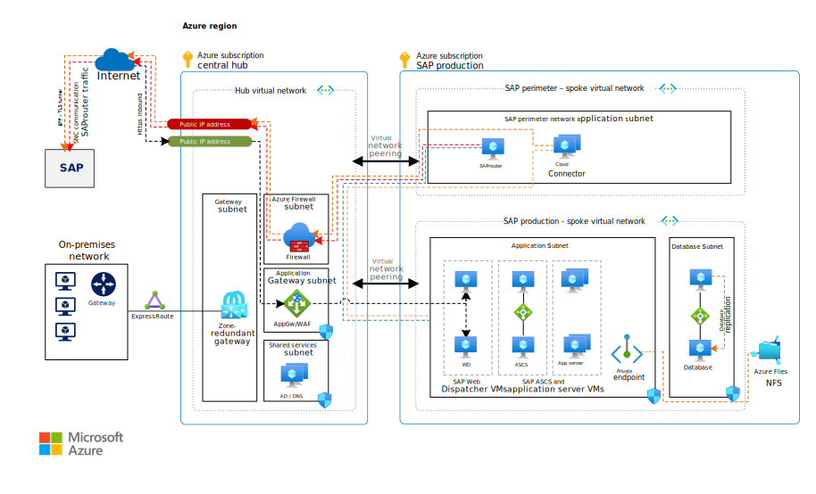
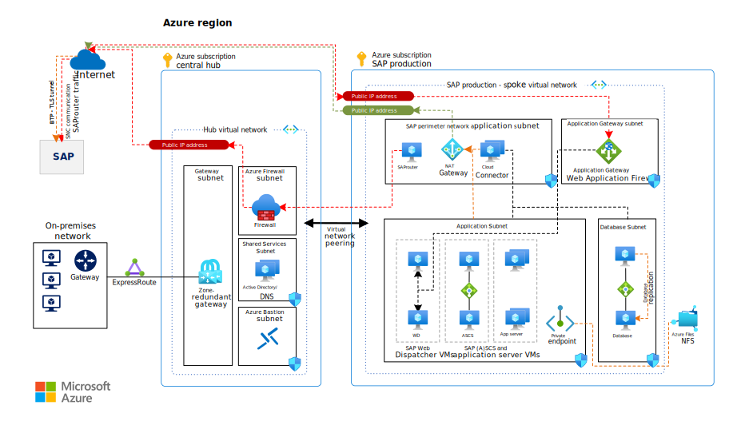

<!-- cSpell:ignore saprouter linky -->

This article provides a set of proven practices for improving the security of inbound and outbound internet connections for your SAP on Azure infrastructure.

## Architecture

_Download a [Visio file](https://arch-center.azureedge.net/sap-internet-communication-architecture.vsdx) of the architectures in this article._

This solution illustrates a common production environment. You can reduce the size and scope of the configuration to fit your requirements. This reduction might apply to the SAP landscape: fewer virtual machines (VMs), no high availability, or embedded SAP Web Dispatchers instead of discrete VMs. It can also apply to alternatives to the network design, as described later in this article.

Customer requirements, driven by business policies, will necessitate adaptations to the architecture, particularly to the network design. When possible, we've included alternatives. Many solutions are viable. Choose an approach that's right for your business. It needs to help you secure your Azure resources but still provide a performant solution.

Disaster recovery (DR) isn't covered in this architecture. For the network design, the same principles and design that are valid for primary production regions apply. In your network design, depending on the applications being protected by DR, consider enabling DR in another Azure region. For more information, see the article [Disaster recovery overview and infrastructure guidelines for SAP workload](/azure/sap/workloads/disaster-recovery-overview-guide)

### Workflow

- The on-premises network connects to a central hub via Azure ExpressRoute. The hub virtual network contains a gateway subnet, an Azure Firewall subnet, a shared services subnet, and an Azure Application Gateway subnet.
- The hub connects to an SAP production subscription via virtual network peering. This subscription contains two spoke virtual networks:
  - The SAP perimeter virtual network contains an SAP perimeter application subnet.
  - The SAP production virtual network contains an application subnet and a database subnet.
- The hub subscription and the SAP production subscription connect to the internet via public IP addresses.  

### Components

**Subscriptions.** This architecture implements the Azure [landing zone](/azure/cloud-adoption-framework/ready/landing-zone) approach. One Azure subscription is used for each workload. One or more subscriptions are used for central IT services that contain the network hub and central, shared services like firewalls or Active Directory and DNS. Another subscription is used for the SAP production workload. Use the [decision guide](/azure/cloud-adoption-framework/decision-guides/subscriptions) in the Cloud Adoption Framework for Azure to determine the best subscription strategy for your scenario.

**Virtual networks.** [Azure Virtual Network](https://azure.microsoft.com/services/virtual-network) connects Azure resources to each other with enhanced security. In this architecture, the virtual network connects to an on-premises environment via an ExpressRoute or virtual private network (VPN) gateway that's deployed in the hub of a [hub-spoke topology](../../reference-architectures/hybrid-networking/hub-spoke.yml). The SAP production landscape uses its own spoke virtual networks. Two distinct spoke virtual networks perform different tasks, and subnets provide network segregation.

Separation into subnets by workload makes it easier to use network security groups (NSGs) to set security rules for application VMs or Azure services that are deployed.

**Zone-redundant gateway.** A gateway connects distinct networks, extending your on-premises network to the Azure virtual network. We recommend that you use [ExpressRoute](https://azure.microsoft.com/services/expressroute) to create private connections that don't use the public internet. You can also use a [site-to-site](../../reference-architectures/hybrid-networking/expressroute.yml) connection. You can deploy ExpressRoute or VPN gateways across zones to help avoid zone failures. See [Zone-redundant virtual network gateways](/azure/vpn-gateway/about-zone-redundant-vnet-gateways) for an explanation of the differences between a zonal deployment and a zone-redundant deployment. For a zone deployment of the gateways, you need to use Standard SKU IP addresses.

**NSGs.** To restrict network traffic to and from the virtual network, create [NSGs](/azure/virtual-network/tutorial-filter-network-traffic-cli) and assign them to specific subnets. Provide security for individual subnets by using workload-specific NSGs.

**Application security groups.** To define fine-grained network security policies in your NSGs based on workloads that are centered on applications, use [application security groups](/azure/virtual-network/security-overview) instead of explicit IP addresses. By using application security groups, you can group VMs by purpose, for example, SAP SID. Application security groups help secure applications by filtering traffic from trusted segments of your network.

**Private endpoint.** Many Azure services operate as public services, by design accessible via the internet. To allow private access via your private network range, you can use private endpoints for some services. [Private endpoints](/azure/private-link/private-endpoint-overview) are network interfaces in your virtual network. They effectively bring the service into your private network space.

**Azure Application Gateway.** [Application Gateway](https://azure.microsoft.com/services/application-gateway) is a web-traffic load balancer. With its Web Application Firewall functionality, it's the ideal service to expose web applications to the internet with improved security. Application Gateway can service either public (internet) or private clients, or both, depending on the configuration.

In the architecture, Application Gateway, using a public IP address, allows inbound connections to the SAP landscape over HTTPS. Its back-end pool is two or more SAP Web Dispatcher VMs, accessed round-robin and providing high availability. The application gateway is a reverse proxy and web-traffic load balancer, but it doesn't replace the SAP Web Dispatcher. SAP Web Dispatcher provides application integration with your SAP systems and includes features that Application Gateway by itself doesn't provide. Client authentication, when it reaches the SAP systems, is performed by the SAP application layer natively or via single sign-on. When leveraging Azure DDoS protection, consider using [DDoS network protection SKU](/azure/ddos-protection/ddos-protection-sku-comparison) which discounts the use of Application Gateway Web Application Firewall.

For optimal performance, enable [HTTP/2 support](/azure/application-gateway/configuration-listeners#http2-support) for Application Gateway, [SAP Web Dispatcher](https://help.sap.com/docs/SAP_NETWEAVER_AS_ABAP_751_IP/683d6a1797a34730a6e005d1e8de6f22/c7b46000a76445f489e86f4c5814c7e8.html), and SAP NetWeaver.

**[Azure Load Balancer](https://azure.microsoft.com/services/load-balancer).** Azure [Standard Load Balancer](/azure/load-balancer/load-balancer-overview) provides networking elements for the high-availability design of your SAP systems. For clustered systems, Standard Load Balancer provides the virtual IP address for the cluster service, like ASCS/SCS instances and databases running on VMs. You also can use Standard Load Balancer to provide the IP address for the virtual SAP host name of non-clustered systems when [secondary IPs on Azure network cards](https://techcommunity.microsoft.com/t5/running-sap-applications-on-the/use-sap-virtual-host-names-with-linux-in-azure/ba-p/3251593) aren't an option. The use of Standard Load Balancer instead of Application Gateway to address outbound internet access is covered later in this article.

## Network design

The architecture uses two discrete virtual networks, both spoke virtual networks that are peered to the central hub virtual network. There's no spoke-to-spoke peering. A star topology is used, in which communication passes through the hub. The separation of networks helps to protect the applications from breaches.

An application-specific [perimeter network](/azure/cloud-adoption-framework/ready/azure-best-practices/perimeter-networks) (also known as a *DMZ*) contains the internet-facing applications, like SAProuter, SAP Cloud Connector, SAP Analytics Cloud Agent, and others. In the architecture diagram, the perimeter network is named *SAP perimeter -- spoke virtual network*. Because of dependencies on SAP systems, the SAP team typically does the deployment, configuration, and management of these services. That's why these SAP perimeter services frequently aren't located in a central hub subscription and network, where they would need to be managed by the central IT team. This constraint causes organizational challenges.

These are some of the benefits of using a separate SAP perimeter virtual network:

- Quick and immediate isolation of compromised services if a breach is detected. Removing virtual network peering from the SAP perimeter to the hub immediately isolates the SAP perimeter workloads and SAP application virtual network applications from the internet. Changing or removing an NSG rule that permits access affects only new connections and doesn't cut existing connections.
- More stringent controls on the virtual network and subnet, with a tight lockdown on communication partners in and out of the SAP perimeter network and SAP application networks. You can extend increased control to authorized users and access methods on SAP perimeter applications, with different authorization back ends, privileged access, or sign-in credentials for SAP perimeter applications.

The drawbacks are increased complexity and extra virtual network peering costs for internet-bound SAP traffic (because communication needs to pass through virtual network peering twice). The latency impact on spoke-hub-spoke peering traffic depends on any firewall that's in place and needs to be measured.

### Simplified architecture

To address the recommendations in this article but limit the drawbacks, you can use a single spoke virtual network for both the perimeter and the SAP applications. The following architecture contains all subnets in a single SAP production virtual network. The benefit of immediate isolation by termination of virtual network peering to the SAP perimeter if it's compromised isn't available. In this scenario, changes to NSGs affect only new connections.

_Download a [Visio file](https://arch-center.azureedge.net/sap-internet-communication-architecture.vsdx) of the architectures in this article._

For deployments that are smaller in size and scope, the simplified architecture might be a better fit, and it still adheres to the principles of the more complex architecture. This article, unless otherwise noted, refers to the more complex architecture.

The simplified architecture uses a NAT gateway in the SAP perimeter subnet. This gateway provides outbound connectivity for SAP Cloud Connector and SAP Analytics Cloud Agent and OS updates for the deployed VMs. Because SAProuter requires both incoming and outbound connections, the SAProuter communication path goes through the firewall instead of using the NAT gateway. The simplified architecture also places the Application Gateway with its own designated subnet in the SAP perimeter virtual network, as an alternative approach to hub virtual network.

A [NAT gateway](/azure/virtual-network/nat-gateway/nat-overview) is a service that provides static public IP addresses for outbound connectivity. The NAT gateway is assigned to a subnet. All outbound communications use the NAT gateway's IP addresses for internet access. Inbound connections don't use the NAT gateway. Applications like SAP Cloud Connector, or VM OS update services that access repositories on the internet, can use the NAT gateway instead of routing all outbound traffic through the central firewall. Frequently, [user-defined rules](/azure/virtual-network/ip-services/default-outbound-access) are implemented on all subnets to force internet-bound traffic from all virtual networks through the central firewall.

Depending on your requirements, you might be able to use the NAT gateway as an alternative to the central firewall, on outbound connections only. By doing so, you can reduce load on the central firewall while communicating with NSG-allowed public endpoints. You also get outbound IP control, because you can configure destination firewall rules on a set IP list of the NAT gateway. Examples include reaching Azure public endpoints that are used by public services, OS patch repositories, or third-party interfaces.

For a high-availability configuration, keep in mind that NAT gateway is deployed in a [specific zone only](/azure/virtual-network/nat-gateway/faq#how-does-virtual-network-nat-gateway-work-with-availability-zones) and isn't currently cross-zone redundant. With a single NAT gateway it's not ideal for SAP deployments that use zone-redundant (cross-zone) deployment for virtual machines.

### Use of network components across an SAP landscape

An architecture document typically depicts only one SAP system or landscape. This makes them easier to understand. The result is that frequently the bigger picture, how the architecture fits into a larger SAP landscape that includes several system tracks and tiers, isn't addressed.

Central networking services, like the firewall, NAT gateway, and proxy servers if they're deployed, are best used across the entire SAP landscape of all tiers: production, pre-production, development, and sandbox. Depending on your requirements, the size of your organization, and business policies, you might want to consider separate implementations per tier, or one production and one sandbox/testing environment.

Services that typically serve an SAP system are best separated as described here:

- **Load balancers** should be dedicated to individual services. The degree of separation is best dictated by company policy on naming and grouping. We recommend one load balancer for ASCS/SCS and ERS and another for database, separated for each SAP SID. Alternatively, a single load balancer for both (A)SCS, ERS and DB clusters of one SAP system is also good design. This configuration helps to ensure that troubleshooting doesn't get complex, with many front-end and back-end pools and load balancing rules all on a single load balancer. A single load balancer per SAP SID also ensures that placement in resource groups matches that of other infrastructure components.
- **Application Gateway**, like a load balancer, allows multiple back ends, front ends, HTTP settings, and rules. The decision to use one application gateway for multiple uses is more common here because not all SAP systems in the environment require public access. Multiple uses in this context include different web dispatcher ports for same SAP S/4HANA systems or different SAP environments. We recommend at least one application gateway per tier (production, non-production, and sandbox) unless the complexity and number of connected systems becomes too high.
- **SAP services**, like SAProuter, Cloud Connector, and Analytics Cloud Agent, are deployed based on application requirements, either centrally or split up. Production and non-production separation is often desired.

### Subnet sizing and design

When you design subnets for your SAP landscape, be sure to follow sizing and design principles:

- Several Azure platform as a service (PaaS) services require their own designated subnets.
- Application Gateway recommends a /24 subnet for scaling. If chosing to limit the Application Gateway scale a smaller subnet could be used, at the [minimum /26 or larger](/azure/application-gateway/configuration-infrastructure#size-of-the-subnet). You can't use both versions of Application Gateway (1 and 2) in the same subnet.
- If you use Azure NetApp Files for your NFS/SMB shares or database storage, a designated subnet is required. A /24 subnet is the default. Use your requirements to determine the [proper sizing](/azure/azure-netapp-files/azure-netapp-files-delegate-subnet).
- If you use SAP virtual host names, you need more address space in your SAP subnets, including the SAP perimeter.
- Central services like Azure Bastion or Azure Firewall, typically managed by a central IT team, require their own dedicated subnets of sufficient size.

By using dedicated subnets for SAP databases and applications, you can set NSGs to be more strict, which helps to protect both application types with their own sets of rules. You can then limit database access to SAP applications more easily, without needing to resort to application security groups for granular control. Separating your SAP application and database subnets also makes it easier to manage your security rules in NSGs.

## SAP services

### SAProuter

You can use SAProuter to enable third parties like SAP support or your partners to access your SAP system. SAProuter runs on one VM in Azure. Route permissions for using SAProuter are stored in a flat file called *saprouttab*. The *saprouttab* entries allow connection from any TCP/IP port to a network destination behind SAProuter, typically your SAP system VMs. Remote access by SAP support relies on SAProuter. The main architecture uses the design that's described earlier, with a SAProuter VM running within the designated SAP perimeter virtual network. Through virtual network peering, SAProuter then communicates with your SAP servers that run in their own spoke virtual network and subnets.

SAProuter is a tunnel to SAP or to your partners. This architecture describes the use of SAProuter with SNC use to establish an encrypted application tunnel (network layer 7) to SAP/partners. The use of IPSEC based tunnel is not covered in this architecture presently.  

The following features help protect the communication path over the internet:

- Azure Firewall or a third-party NVA provides the public IP entry point into your Azure networks. Firewall rules limit communication to only authorized IP addresses. For your connection to  SAP support, [SAP note 48243 - Integrating the SAProuter software into a firewall environment](https://launchpad.support.sap.com/#/notes/48243) documents the IP addresses of SAP routers.
- Like firewall rules, network security rules allow communication on SAProuter's port, typically 3299 with the designated destination.
- You maintain SAProuter allow/deny rules in the *saprouttab* file, specifying who can contact SAProuter and which SAP system can be accessed.
- Further NSG rules are in place on the respective subnets in the SAP production subnet that contains the SAP systems.

For steps for configuring SAProuter with Azure Firewall, see [SAProuter configuration with Azure Firewall](https://techcommunity.microsoft.com/t5/running-sap-applications-on-the/saprouter-configuration-with-azure-firewall/ba-p/3293496).

#### SAProuter security considerations

Because SAProuter doesn't operate in the same application subnet as your SAP systems, sign-in mechanisms for the OS might be different. Depending on your policies, you can use a separate sign-on domain or entirely host-only user credentials for SAProuter. If there's a security breach, cascading access to the internal SAP systems isn't possible because of the different credential base. Network separation in such a case, as described earlier, can decouple further access from a compromised SAProuter into your application subnets. You can accomplish this isolation by disconnecting the SAP perimeter virtual network peering.

#### SAProuter high availability considerations

Because SAProuter is a simple executable file with a file-based route permission table, it can be easily started. The application has no built-in high availability. If there's a VM or application failure, the service needs to start on another VM. Using a virtual host name for the SAProuter service is ideal. The virtual host name is bound to an IP, which is assigned as a secondary IP config with the VM's NIC or to an internal load balancer that's connected to the VM. In this configuration, if the SAProuter service needs to be moved to another VM, the service virtual host name's IP config can be removed. You then add the virtual host name on another VM without needing to change the route tables or firewall configuration. They're all configured to use the virtual IP address. For more information, see [Use SAP Virtual Host Names with Linux in Azure](https://techcommunity.microsoft.com/t5/running-sap-applications-on-the/use-sap-virtual-host-names-with-linux-in-azure/ba-p/3251593).

#### Cascading SAProuters

To implement cascading SAProuters, you can define as many as two SAProuters for SAP support connections. The first SAProuter, running in the SAP perimeter application subnet, provides access from the central firewall and from SAP or partner SAProuters. The only allowed destinations are other SAProuters, running with specific workloads. Cascading SAProuters can use per-tier, per-region, or per-SID separation, depending on your architecture. The second SAProuter accepts only internal connections from the first SAProuter and provides access to individual SAP systems and VMs. This design allows you to separate access and management between different teams if you need to. For an example of a cascading SAProuters, see [SAProuter configuration with Azure Firewall](https://techcommunity.microsoft.com/t5/running-sap-applications-on-the/saprouter-configuration-with-azure-firewall/ba-p/3293496).

### SAP Fiori and WebGui

SAP Fiori and other HTTPS front ends for SAP applications are often consumed from outside of the internal corporate network. The need to be available on the internet requires a high-security solution to help protect the SAP application. Application Gateway with [Web Application Firewall](/azure/web-application-firewall/ag/ag-overview) is the ideal service for this purpose.

For users who access the public host name of the public IP that's tied to Application Gateway, the HTTPS session is terminated on Application Gateway. A back-end pool of two or more SAP Web Dispatcher VMs gets round-robin sessions from the Application Gateway. This internal traffic application gateway to Web Dispatcher can be either HTTP or HTTPS, depending on requirements. The web application firewall helps to protect the SAP Web Dispatcher from attacks coming over the internet with the [OWASP core rule set](/azure/web-application-firewall/ag/application-gateway-crs-rulegroups-rules). SAP NetWeaver, often tied to Azure Active Directory via [single sign-on](/azure/active-directory/saas-apps/sap-fiori-tutorial) (SSO), performs user authentication. For the steps needed to configure SSO for Fiori by using Application Gateway, see [Single Sign On Configuration using SAML and Azure Active Directory for Public and Internal URLs](https://blogs.sap.com/2020/12/10/sap-on-azure-single-sign-on-configuration-using-saml-and-azure-active-directory-for-public-and-internal-urls).

Keep in mind that you need to secure the SAP Web Dispatcher in any situation. Even if it's open only internally, open toward Application Gateway via public IP, or accessible through any other network means. For more information, see [Security Information for SAP Web Dispatcher](https://help.sap.com/docs/ABAP_PLATFORM/683d6a1797a34730a6e005d1e8de6f22/489ab29948c673e8e10000000a42189b.html?version=1709.008).

#### Azure Firewall and Application Gateway

All web traffic provided by Application Gateway is HTTPS-based and encrypted with the provided TLS certificate. You can use Azure Firewall as an entry point to the corporate network, via its public IP, and then route SAP Fiori traffic from the firewall to Application Gateway through an internal IP address. For more information, see [Application Gateway after firewall](../../example-scenario/gateway/firewall-application-gateway.yml#application-gateway-after-firewall). Because the TCP/IP layer-7 encryption is already in place via TLS, there's limited benefit to using  a firewall in this scenario, and you can't perform packet inspection. Fiori communicates through the same external IP address for both inbound and outbound traffic, which typically isn't required for SAP Fiori deployments.

There are some benefits of a tandem Application Gateway and layer-4 firewall deployment:

- Possible integration with enterprise-wide security policy management.
- Network traffic that violates [security rules](/azure/firewall/threat-intel) is already discarded, so it doesn't require inspection.

This combined deployment is a good architecture. The method for handling inbound internet traffic depends on your overall enterprise architecture. You also need to consider how the overall network architecture fits with access methods from the internal IP address space, like on-premises clients. This consideration is covered in the next section.

#### Application Gateway for internal IP addresses (optional)

This architecture focuses on internet-facing applications. There are various options available for clients that access SAP Fiori, the web UI of an SAP NetWeaver system, or another SAP HTTPS interface through an internal, private IP address. One scenario is treating all access to Fiori as public access, through the public IP. Another option is using direct network access through the private network to the SAP Web Dispatchers, bypassing Application Gateway entirely. A third option is to use [both private and public IP](/azure/application-gateway/configuration-front-end-ip#public-and-private-ip-address-support) addresses on Application Gateway, providing access to both the internet and the private network.

You can use a similar configuration with a private IP address on Application Gateway for private-only network access to the SAP landscape. The public IP address in this case is used only for management purposes and doesn't have a listener associated with it.

As an alternative to using Application Gateway, you can use a load balancer internally. You can use a standard internal load balancer with Web Dispatcher VMs configured as a round-robin back end. In this scenario, the standard load balancer is placed with the Web Dispatcher VMs in the SAP production application subnet and provides [active/active](https://help.sap.com/docs/SAP_S4HANA_ON-PREMISE/683d6a1797a34730a6e005d1e8de6f22/489a9a6b48c673e8e10000000a42189b.html) load balancing between Web Dispatcher VMs.

For internet-facing deployments, we recommend Application Gateway with Web Application Firewall instead of a load balancer with a public IP.

### SAP Business Technology Platform (BTP)

SAP BTP is a large set of SAP applications, SaaS or PaaS, typically accessed through a public endpoint via the internet. [SAP Cloud Connector](https://help.sap.com/docs/CP_CONNECTIVITY/cca91383641e40ffbe03bdc78f00f681/e6c7616abb5710148cfcf3e75d96d596.html) is often used to provide communication for applications running in private networks, like an SAP S/4HANA system running on Azure. SAP Cloud Connector runs as an application in a VM. It requires outbound internet access to establish a TLS-encrypted HTTPS tunnel with SAP BTP. It acts as a reverse invoke proxy between the private IP range in your virtual network and SAP BTP applications. Because of this reverse invoke support, there's no need for open firewall ports or other access for inbound connections, because the connection from your virtual network is outbound.

By default, VMs have [outbound internet](/azure/virtual-network/ip-services/default-outbound-access) access natively on Azure. The public IP address that's used for outbound traffic, when there's no dedicated public IP address associated with the virtual machine, is  randomly chosen from the pool of public IPs in the specific Azure region. You can't control it. To ensure outbound connections are made through a controlled and identifiable service and IP address, you can use one of the following methods:
- A NAT gateway that's associated with the subnet or load balancer and its public IP address.
- HTTP proxy servers that you operate.
- A [user-defined route](/azure/virtual-network/ip-services/default-outbound-access) that forces the network traffic to flow to a network appliance like a firewall.

The architecture diagram shows the most common scenario: routing internet-bound traffic to the hub virtual network and through the central firewall. You need to configure [further settings](https://help.sap.com/docs/CLOUD_INTEGRATION/368c481cd6954bdfa5d0435479fd4eaf/642e87f1492146998a8eb0779cd07289.html) in SAP Cloud Connector to connect to your SAP BTP account.

#### High availability for SAP Cloud Connector

High availability is built into SAP Cloud Connector. Cloud Connector is installed on two VMs. The main instance is active, and the shadow instance is connected to it. They share configuration and are kept in sync natively. If the main instance isn't available, the secondary VM attempts to take over the main role and re-establish the TLS tunnel to SAP BTP. A high-availability Cloud Connector environment is shown in the architecture. You don't need any other Azure technologies, like a load balancer or cluster software, for the configuration. For details on configuration and operation, see the [SAP documentation](https://help.sap.com/docs/CP_CONNECTIVITY/cca91383641e40ffbe03bdc78f00f681/2f9250b0e6ac488286266461a82518e8.html).

#### SAP Analytics Cloud Agent

For some application scenarios, SAP Analytics Cloud Agent is an application that's installed in a VM. It uses SAP Cloud Connector for SAP BTP connectivity. In this architecture, the SAP Analytics Cloud Agent VM runs in the SAP perimeter application subnet, alongside the SAP Cloud Connector VMs. For the traffic flow from private networks like an Azure virtual network to SAP BTP via SAP Analytics Cloud Agent, see the [SAP documentation](https://help.sap.com/docs/SAP_ANALYTICS_CLOUD/00f68c2e08b941f081002fd3691d86a7/5339a2395ccd4befb047c625a15f8481.html).

#### SAP Private Link service on Azure

SAP provides [Private Link service](https://blogs.sap.com/2022/06/22/sap-private-link-service-on-azure-is-now-generally-available-ga) for SAP BTP. It enables private connections between selected SAP BTP services and selected services in your Azure subscription and virtual network. When you use Private Link service, the communication isn't routed through the public internet. It remains on the high-security Azure global network backbone. Communication to Azure services occurs via a private address space. Improved data exfiltration protection is built in when you use Private Link service, because the private endpoint maps the specific Azure service to an IP address. Access is limited to the mapped Azure service.

For some SAP BTP integration scenarios, the Private Link service approach is preferred. For others, SAP Cloud Connector is better. For information to help you decide which to use, see [Running Cloud Connector and SAP Private Link side-by-side](https://blogs.sap.com/2022/07/07/btp-private-linky-swear-with-azure-running-cloud-connector-and-sap-private-link-side-by-side).

### SAP RISE/ECS

If SAP operates your SAP system under an SAP RISE/ECS contract, SAP is the managed service partner. The SAP environment is deployed by SAP. On SAP's architecture, the architecture shown here doesn't apply to your systems that run in RISE with SAP/ECS. For information about integrating this type of SAP landscape with Azure services and your network, see the [Azure documentation](/azure/virtual-machines/workloads/sap/sap-rise-integration).

### Other SAP communication requirements

Additional considerations regarding internet-bound communications might apply to an SAP landscape operating on Azure. Traffic flow in this architecture uses a central Azure firewall for this outbound traffic. User-defined rules in the spoke virtual networks route internet-bound traffic requests to the firewall. Alternatively, you can use NAT gateways on specific subnets, [default Azure outbound](/azure/virtual-network/ip-services/default-outbound-access) communication, public IP addresses on VMs (not recommended), or a public load balancer with outbound rules.

For VMs that are behind a standard internal load balancer, like those in clustered environments, keep in mind that Standard Load Balancer modifies the behavior for public connectivity, as described in [Public endpoint connectivity for VMs using Azure Standard Load Balancer in SAP high-availability scenarios](/azure/virtual-machines/workloads/sap/high-availability-guide-standard-load-balancer-outbound-connections).

#### Operating system updates

Operating system updates are often located behind a public endpoint and accessed via the internet. If no enterprise repository and update management is in place, mirroring OS updates from vendors on private IP addresses / VMs, your SAP workload needs to access the update repositories of the vendors.

For Linux operating systems, you can access the following repositories if you obtain the OS license from Azure. If you purchase licenses directly and bring them to Azure (BYOS), contact the OS vendor about ways to connect to OS repositories and their respective IP address ranges.

- For SUSE Enterprise Linux, [SUSE maintains](https://pint.suse.com/?resource=servers&csp=microsoft) a list of servers in each Azure region.
- For Red Hat Enterprise Linux, [Red Hat Update Infrastructure is documented here](/azure/virtual-machines/workloads/redhat/redhat-rhui#the-ips-for-the-rhui-content-delivery-servers).
- For Windows, Windows Update is available via [FQDN tags](/azure/firewall/fqdn-tags#current-fqdn-tags) for Azure Firewall.

#### High-availability cluster management

Highly available systems like clustered SAP ASCS/SCS or databases might use a cluster manager with Azure fence agent as a STONITH device. These systems depend on reaching Azure Resource Manager. Resource Manager is used for status queries about Azure resources and for operations to stop and start VMs. Because Resource Manager is a public endpoint, available under management.azure.com, VM outbound communication needs to be able to reach it. This architecture relies on a central firewall with user-defined rules routing traffic from SAP virtual networks. For alternatives, see the preceding sections.

## Contributors

*This article is maintained by Microsoft. It was originally written by the following contributors.* 

Principal authors:

- [Robert Biro](https://www.linkedin.com/in/robert-biro-38991927) | Senior Architect  
- [Dennis Padia](https://www.linkedin.com/in/dennispadia) | Senior SAP Architect

Other contributor:

- [Mick Alberts](https://www.linkedin.com/in/mick-alberts-a24a1414) | Technical Writer

*To see non-public LinkedIn profiles, sign in to LinkedIn.*

## Communities

Consider using these communities to get answers to questions and for help with setting up a deployment:

- [Azure Community Support](https://azure.microsoft.com/support/forums)
- [SAP Community](https://www.sap.com/community.html)
- [Stack Overflow SAP](http://stackoverflow.com/tags/sap/info)

## Next steps

- [SAP Blogs | SAP on Azure: Azure Application Gateway Web Application Firewall v2 Setup for Internet-facing SAP Fiori Apps](https://blogs.sap.com/2020/12/03/sap-on-azure-application-gateway-web-application-firewall-waf-v2-setup-for-internet-facing-sap-fiori-apps)
- [SAP Blogs | Getting Started with BTP Private Link Service for Azure](https://blogs.sap.com/2021/12/29/getting-started-with-btp-private-link-service-for-azure)
- [SAP Blogs | BTP private linky swear with Azure – running Cloud Connector and SAP Private Link side-by-side](https://blogs.sap.com/2022/07/07/btp-private-linky-swear-with-azure-running-cloud-connector-and-sap-private-link-side-by-side)
- [SAP on Azure Tech Community | SAProuter configuration with Azure Firewall](https://techcommunity.microsoft.com/t5/running-sap-applications-on-the/saprouter-configuration-with-azure-firewall/ba-p/3293496)
- [SAP on Azure Tech Community | Use SAP Virtual Host Names with Linux in Azure](https://techcommunity.microsoft.com/t5/running-sap-applications-on-the/use-sap-virtual-host-names-with-linux-in-azure/ba-p/3251593)
- [SAP Documentation | What is Cloud Connector?](https://help.sap.com/docs/CP_CONNECTIVITY/cca91383641e40ffbe03bdc78f00f681/e6c7616abb5710148cfcf3e75d96d596.html)
- [SAP Documentation | What is SAP Analytics Cloud Agent?](https://help.sap.com/docs/SAP_ANALYTICS_CLOUD/00f68c2e08b941f081002fd3691d86a7/7cb6ffb38c294a5c871d6cc6ad5b1b36.html)
- [Default outbound access in Azure](/azure/virtual-network/ip-services/default-outbound-access)
- [Public endpoint connectivity for virtual machines using Azure Standard Load Balancer in SAP high-availability scenarios](/azure/virtual-machines/workloads/sap/high-availability-guide-standard-load-balancer-outbound-connections)
- [Subscription decision guide](/azure/cloud-adoption-framework/decision-guides/subscriptions)
- [SAP Blogs | SAP Fiori using Azure CDN for SAPUI5 libraries](https://blogs.sap.com/2021/03/22/sap-fiori-using-azure-cdn-for-sapui5-libraries/)
- [YouTube | Deploying Fiori at Scale](https://www.youtube.com/watch?v=IJQlSjxb8pE)

## Related resources

- [SAP workloads on Azure: planning and deployment checklist](/azure/virtual-machines/workloads/sap/sap-deployment-checklist?toc=/azure/architecture/toc.json&bc=/azure/architecture/_bread/toc.json)
- [Run SAP NetWeaver in Windows on Azure](./sap-netweaver.yml)
- [SAP S/4HANA in Linux on Azure](./sap-s4hana.yml) 
