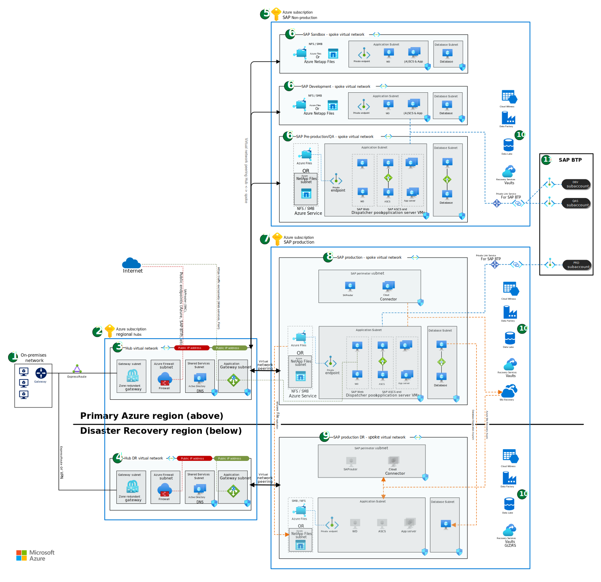
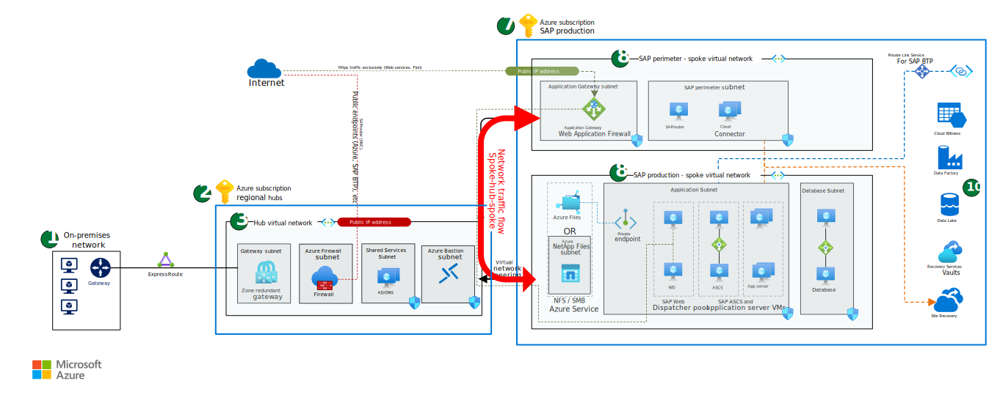

This article provides best practices for architecting an entire SAP landscape in Azure. The SAP landscape includes multiple SAP systems across hub, production, non-production, and disaster recovery environments. We provide recommendations that focus on network design and not specific SAP systems. The goal is to provide our recommendations for architecting a secure, high-performing, and resilient SAP landscape.

## Architecture

*Download a [Visio file](https://arch-center.azureedge.net/sap-whole-landscape.vsdx) of the architecture.*

### Workflow

1. *On-premises network*: ExpressRoute connection from on-premises network to connected Azure regions.
1. *Azure subscription regional hubs*: Azure subscription containing central services for the whole enterprise, not just SAP. The hub subscription provides connectivity by peering to spoke virtual networks containing SAP workloads.
1. *Hub virtual network*: A virtual network spoke for the central hub in the primary region or region A.
1. *Hub disaster recovery (DR) virtual network*: A virtual network spoke for the central hub in disaster recovery region. It mirrors the subnet design of the production virtual network in the primary region.
1. *Azure subscription SAP non-production*: An Azure subscription for all non-production SAP workloads. It includes pre-production, quality assurance, development, and sandbox environments.
1. *SAP non-production spoke virtual networks*: Separate virtual networks for SAP non-production workloads in the primary region. Each SAP environment has its own virtual network and subnets.
1. *Azure subscription SAP production*: An Azure subscription for all production SAP workloads.
1. *SAP production spoke virtual network*: A virtual network for the SAP production environment with multiple subnets. This virtual network is in the primary region.
1. *SAP production disaster recovery (DR) spoke virtual network*: A virtual network for SAP production in the secondary, disaster-recovery region. It mirrors the subnet design of the production virtual network in the primary region.
1. *Azure Services*: A sampling of Azure services that you can connect to the SAP landscape.
1. *SAP Business Technology Platform (BTP)*: The SAP environment accesses the SAP Business Technology Platform through Azure Private Link.

### Azure subscriptions

We recommend using a hub-spoke network design. With a hub-spoke design, you need at least three subscriptions to divide your SAP environments. You should have a subscription for the (1) regional hub virtual networks, (2) non-production virtual networks, and (3) production virtual networks. Subscriptions provide billing, policy, and security boundaries. There's no correct number of subscriptions. The number of subscriptions you use depends on your billing, policy, and security needs. In general, you want to avoid using too many subscriptions. Too many subscriptions can add unneeded management overhead and networking complexity. For example, you don't need a subscription for each SAP system. Our architecture uses three subscriptions:

- *Regional hubs*: An Azure virtual hub subscription where the hub virtual network exists for the primary and secondary regions. This subscription is for all central services and not just SAP.

- *SAP non-production*: An Azure SAP non-production subscription where non-production systems, including sandbox, development, quality assurance, or pre-production systems, reside.

- *SAP production*: An Azure SAP production subscription where we configured the production and disaster recovery systems.

For more information, see:

- [Limits for each subscription](/azure/azure-resource-manager/management/azure-subscription-service-limits)
- [Azure policies](/azure/governance/policy/overview)
- [Management groups](/azure/governance/management-groups/overview)

### Network design

A hub-spoke topology is the recommended network design for an SAP landscape. In this topology, the production hub virtual network acts as a central point of connectivity. It connects to the on-premises network and the various spoke virtual networks and enables users and applications access to the SAP workload. Within this hub-spoke topology, here are our recommendations for SAP network design.

**Use ExpressRoute for on-premises connection.** For SAP workloads, we recommend using ExpressRoute to connect the on-premises network to the Hub virtual network and Hub DR virtual network. You could use Azure virtual WAN topology if you have global locations. Consider setting up a site-to-site (S2S) VPN as a backup to Azure ExpressRoute or any third-party route requirements.

For more information, see:

- [Network topology and connectivity for an SAP migration](/azure/cloud-adoption-framework/scenarios/sap/eslz-network-topology-and-connectivity)
- [Hub and spoke architecture](/azure/architecture/reference-architectures/hybrid-networking/hub-spoke)
- [Azure virtual WAN](/azure/virtual-wan/virtual-wan-about)
- [S2S VPN as a backup for ExpressRoute private peering](/azure/expressroute/use-s2s-vpn-as-backup-for-expressroute-privatepeering)

**Use one virtual network per environment.** We recommend using one virtual network per environment (SAP deployment tier). The architecture uses a different virtual network for production, development, quality assurance, and sandbox. This network design is ideal for large enterprise architectures.

**Use a central firewall.** All the network traffic to the spoke virtual networks, including remote function call (RFC) connections, should pass through a central firewall in the Hub virtual network. Network communication between the spoke virtual networks (spoke-to-spoke communication) passes through the hub virtual network firewall in the Azure Firewall subnet of the Hub virtual network. Similarly, network communication between the spoke virtual networks and on-premises network also pass through the hub virtual network firewall. We used virtual network peering to connect the various spoke virtual networks to the hub virtual network. All the communication between the spoke virtual networks passes through the Hub virtual network firewall. You could also use a network virtual appliance instead of a firewall. For more information, see [network virtual appliance](https://azure.microsoft.com/solutions/network-appliances/).

Network traffic that stays in a virtual network shouldn't pass through a firewall. For example, don't put a firewall between the SAP application subnet and SAP database subnet. You can't place a firewall or network virtual appliances (NVAs) between the SAP application and the database management system (DBMS) layer of SAP systems running the SAP kernel.

**Avoid peering spoke virtual networks.** Virtual network peering between the spoke virtual networks should be avoided if possible. Spoke-to-spoke virtual network peering allows spoke-to-spoke communication to bypass the Hub virtual network firewall. You should only configure spoke-to-spoke virtual network peering when you have high-bandwidth requirements, for example, with database replication between SAP environments. All other network traffic should run through the Hub virtual network and firewall. For more information, see [inbound and outbound internet connections for SAP on Azure](./sap-internet-inbound-outbound.yml).

#### Subnets

It's a best practice to divide each SAP environment (production, pre-production, development, sandbox) into subnets and to use subnets to group related services. Here are our recommendations for subnetting an SAP landscape.

##### Number of subnets

The production virtual network in the architecture has five subnets. This design is ideal for large enterprise solutions. The number of subnets can be less or more. The number of resources in the virtual network should determine the number of subnets in the virtual network.

##### Subnet sizing

Ensure the subnets have sufficient network address space. If you use SAP virtual host names, you need more address space in your SAP subnets. Often each SAP instance requires 2-3 IP addresses and includes one IP address for the virtual machine hostname. Other Azure services might require their own dedicated subnet when deployed in the SAP workload virtual networks.

##### Application subnet

The application subnet contains virtual machines running SAP application servers, SAP Central Services (ASCS), SAP Enqueue Replication Services (ERS), and SAP Web Dispatcher instances. The subnet also contains a private endpoint to Azure Files. In the diagram, we grouped the virtual machines by role. We recommend using virtual machine scale sets with flexible orchestration, availability zones or availability sets for resilient deployment. For more information, see [next steps](#next-steps).

##### Database subnet

The database subnet holds virtual machines running databases. In the diagram, a pair of virtual machines with synchronous replication represent all the database virtual machines of one SAP environment.

##### Perimeter subnets

Perimeter subnets are internet facing and include an SAP perimeter subnet and an Application Gateway subnet. Here are our recommendations for designing these two subnets.

**SAP perimeter subnet**: The SAP perimeter subnet is a perimeter network that contains internet-facing applications such as SAProuter, SAP Cloud Connector, SAP Analytics Cloud Agent, and Application Gateway. These services have dependencies on SAP systems that an SAP team should deploy, manage, and configure. A central IT team shouldn't manage the services in the SAP perimeter subnet. For this reason, you should place these services in the SAP spoke virtual network and not the Hub virtual network. The architecture diagram only shows a production SAP perimeter network. It doesn't have an SAP perimeter subnet in the non-production virtual networks. The workloads in the non-production SAP subscription use the services in the SAP perimeter subnet.

You can create separate set SAP perimeter subnet in the non-production subscription. We only recommend this approach for critical workloads or workloads that change frequently. A dedicated non-production SAP perimeter is helpful for testing and new feature deployment. Less critical applications or applications that will only have few modifications over time don't need a separate non-production SAP perimeter subnet.

**Application Gateway subnet**: Azure Application Gateway requires its own subnet. Use it to allow traffic from the Internet that SAP services, such as SAP Fiori, can use. The recommended architecture places Azure Application Gateway together with its frontend public IP address in the Hub virtual network. An Azure Application Gateway requires at least a /29 size subnet. We recommend size /27 or larger. You can't use both versions of Application Gateway (v1 and v2) in the same subnet. For more information, see [subnet for Azure Application Gateway](/azure/application-gateway/configuration-infrastructure#virtual-network-and-dedicated-subnet).

**Place perimeter subnets in a separate virtual network for increased security**: For increased security, you can put the SAP perimeter subnet and Application Gateway subnet in a separate virtual network within the SAP production subscription. The SAP perimeter spoke virtual network is peered with the Hub virtual network, and all network traffic to public networks flows through the perimeter virtual network. This alternative approach shows Azure Application Gateway with its public IP address for inbound connections placed in a spoke virtual network for SAP use exclusively.

*Download a [Visio file](https://arch-center.azureedge.net/sap-whole-landscape-secured.vsdx) including this alternative architecture.*

This network design provides better incident response capabilities and fine-grained network access control. However, it also increases the management complexity, network latency, and cost of the deployment. Let's discuss each point.

*Better incident response*: The SAP perimeter spoke virtual network allows quick isolation of compromised services if you detect a breach. You can remove virtual network peering from the SAP perimeter spoke virtual network to the hub and immediately isolate the SAP perimeter workloads and SAP application virtual network applications from the internet. You don't want to rely on network security group (NSG) rules changes for incident response. Changing or removing an NSG rule only affects new connections and won't cut existing malicious connections.

*Fine-grained network access control*: The SAP perimeter virtual network provides more stringent network access control to and from the SAP production spoke virtual network.

*Increased complexity, latency, and cost*: The architecture increases management complexity, cost, and latency. Internet-bound communication from the SAP production virtual network is peered twice, once to the Hub virtual network and again to the SAP perimeter virtual network out to the internet. The firewall in the Hub virtual network has the greatest effect on latency. We recommend measuring the latency to see if your use case can support it.

For more information, see [perimeter network best practices](/azure/cloud-adoption-framework/ready/azure-best-practices/perimeter-networks).

##### Azure NetApp Files subnet

If you're using NetApp Files, you should have a delegated subnet to provide network file system (NFS) or server message block (SMB) file shares for different SAP on Azure scenarios. A /24 subnet is the default size for a NetApp Files subnet, but you can change the size to meet your needs. Use your own requirements to determine the proper sizing. For more information, see [delegated subnet](/azure/azure-netapp-files/azure-netapp-files-delegate-subnet).

##### Subnet security

Using subnets to group SAP resources that have the same security rule requirements makes it easier to manage the security.

**Network security groups (NSG)**: Subnets allow you to implement network security groups at the subnet level. Grouping resources in the same subnet that require different security rules requires network security groups at the subnet level and network-interface level. With this two-level setup, security rules easily conflict and can cause unexpected communication problems that are difficult to troubleshoot. NSG rules also affect traffic [within the subnet](/azure/virtual-network/network-security-group-how-it-works#intra-subnet-traffic). For more information on NSGs, see [network security groups](/azure/virtual-network/tutorial-filter-network-traffic-cli).

**Application security groups (ASG)**: We recommend using application security groups to group virtual machine network interfaces and reference the application security groups in the network-security-group rules. This configuration allows easier rule creation and management for SAP deployments. Each network interface can belong to multiple application security groups with different network-security-group rules. For more information, see [application security groups](/azure/virtual-network/application-security-groups).

#### Azure Private Link

We recommend using Azure Private Link to improve the security of network communications. Azure Private Link uses private endpoints with private IP addresses to communicate with Azure services. Azure Private Links avoids sending network communication over the internet to public endpoints. For more information, see [private endpoints on Azure services](/azure/private-link/private-endpoint-overview).

**Use private endpoints in the application subnet**: We recommend using private endpoints to connect the application subnet to supported Azure services. In the architecture, there's a private endpoint for Azure Files in the Application subnet of each virtual network. You can extend this concept to any supported Azure service.

**Use Azure Private Link for SAP Business Technology Platform (BTP)**: Azure Private Link for SAP Business Technology Platform (BTP) is now generally available. SAP Private Link Service supports connections from SAP BTP, the Cloud Foundry runtime, and other services. Example scenarios include SAP S/4HANA or SAP ERP running on the virtual machine. They can connect to Azure native services such as Azure Database for MariaDB and Azure Database for MySQL.

The architecture depicts an SAP Private Link Service connection from SAP BTP environments. SAP Private Link Service establishes a private connection between specific SAP BTP services and specific services in each network as service provider accounts. Private link allows BTP services to access your SAP environment through private network connections. It improves security by not using the public internet to communicate.

For more information, see:

- [Azure Private Link resources](https://help.sap.com/docs/PRIVATE_LINK/42acd88cb4134ba2a7d3e0e62c9fe6cf/e8bc0c6440834a47a0ff57cb4efc0dc2.html?locale=en-US)
- [Azure Database for MariaDB](https://help.sap.com/docs/PRIVATE_LINK/42acd88cb4134ba2a7d3e0e62c9fe6cf/862fa2958c574c3cbfa12a927ce1d5fe.html?locale=en-US)
- [Azure Database for MySQL](https://help.sap.com/docs/PRIVATE_LINK/42acd88cb4134ba2a7d3e0e62c9fe6cf/5c70499ee70b415d954145a795e43355.html?locale=en-US)
- [Internet connection for SAP on Azure](/azure/architecture/guide/sap/sap-internet-inbound-outbound)

### Network file system (NFS) and server message block (SMB) file shares

SAP systems often depend on network file system volumes or server message block shares. These file shares move files between virtual machines or function as a file interface with other applications. We recommend using native Azure services, such as Azure Premium Files and Azure NetApp Files, as your network file system (NFS) and server message block (SMB) file shares. Azure services have better combined availability, resilience, and service level agreements (SLAs) than operating-system-based tools.

For more information, see:

- [Azure Premium Files](/azure/virtual-machines/workloads/sap/planning-guide-storage#azure-premium-files)
- [Azure NetApp Files](/azure/virtual-machines/workloads/sap/planning-guide-storage#azure-netapp-files-anf)
- [SAP note 2015553 (requirements for storage services)](https://launchpad.support.sap.com/#/notes/2015553)

When architecting your SAP solution, you need to properly size the individual file share volumes and know which SAP system file share connects to. Keep scalability and performance targets of the Azure service in mind during planning. The following table outlines common SAP file shares and gives a brief description and recommended use in a whole SAP environment.

| File share name | Usage | Recommendation |
|:----------------|:------| :--------------|
| `sapmnt`          | Distributed SAP system, profile, and global directories | Dedicated share for each SAP system, no reuse               |
| `cluster`         | High-availability shares for ASCS, ERS, and database per respective design  | Dedicated share for each SAP system, no reuse               |
| `saptrans`        | SAP transport directory                                | One share for one or few SAP landscapes (ERP, Business Warehouse) |
| `interface`       | File exchange with non-SAP applications                | Customer specific requirements, separate file shares per environment (production, non-production) |

You can only share `saptrans` between different SAP environments, and, as such, you should carefully consider its placement. Avoid consolidating too many SAP systems into one `saptrans` share for scalability and performance reasons.

The corporate security policies will drive the architecture and separation of volumes between environments. A transport directory with separation per environment or tier needs RFC communication between SAP environments to allow SAP transport groups or transport domain links. For more information, see:

- [SAP transport groups](https://help.sap.com/docs/SAP_NETWEAVER_750/4a368c163b08418890a406d413933ba7/44b4a0ce7acc11d1899e0000e829fbbd.html)
- [Transport domain links](https://help.sap.com/docs/SAP_NETWEAVER_750/4a368c163b08418890a406d413933ba7/14c795388d62e450e10000009b38f889.html)

### Data services

The architecture contains Azure data services that help you extend and improve your SAP data platform. To help unlock business insights, we recommend you use services such as Azure Synapse Analytics, Azure Data Factory, and Azure Data Lake Storage. These data services help you analyze and visualize SAP data and non-SAP data.

For many data integration scenarios, an integration runtime is required. The Azure integration runtime is the compute infrastructure that Azure Data Factory and Azure Synapse Analytics pipelines use to provide data integration capabilities. We recommend the deployment of runtime virtual machines for these services for each environment separately. For more information, see:

- [Azure integration runtime](/azure/data-factory/concepts-integration-runtime)
- [Set up a self-hosted integration runtime to use in the SAP CDC solution](/azure/data-factory/sap-change-data-capture-shir-preparation)
- [Copy data from SAP HANA](/azure/data-factory/connector-sap-hana?tabs=data-factory)
- [Copy data from SAP Business Warehouse via Open Hub](/azure/data-factory/connector-sap-business-warehouse-open-hub)

### Shared services

SAP solutions rely on shared services. Load balancer and application gateways are examples of services that multiple SAP systems use. The architecture but your organizational needs should determine how you architect your shared services. Here's general guidance you should follow.

**Load balancers**: We recommend one load balancer per SAP system. This configuration helps minimize complexity. You want to avoid too many pools and rules on a single load balancer. This configuration also ensures naming and placement aligns with the SAP system and resource group. Each SAP system with a clustered high-availability (HA) architecture should have at least one load balancer. The architecture uses one load balancer for the ASCS virtual machines and a second load balancer for the database virtual machines. Some databases might not require load balancers to create a high-availability deployment. SAP HANA does. Check the database-specific documentation for more details.

**Application Gateway**: We recommend at least one application gateway per SAP environment (production, non-production, and sandbox) unless the complexity and number of connected systems is too high. You could use an application gateway for multiple SAP systems to reduce complexity since not all SAP systems in the environment require public access. A single application gateway could serve multiple web dispatcher ports for a single SAP S/4HANA system or be used by different SAP systems.

**SAP Web Dispatcher virtual machines**: The architecture shows a pool of two or more SAP Web Dispatcher VMs. We recommend that you don't reuse SAP Web Dispatcher virtual machines between different SAP systems. Keeping them separate allows you to size the Web Dispatcher virtual machines to meet the needs of each SAP system. For smaller SAP solutions, we recommend embedding the Web Dispatcher services in the ASCS instance.

**SAP services**: SAP services like SAProuter, Cloud Connector, and Analytics Cloud Agent, are deployed based on application requirements, either centrally or split up. No recommendation on reuse between SAP systems due to diverse customer requirements. Main decision to make is mentioned in networking section, if and when SAP perimeter subnet for non-production should be used. Otherwise with just production perimeter subnet for SAP, the SAP perimeter services are consumed by entire SAP landscape.

### Disaster recovery

Disaster recovery (DR) addresses the requirement for business continuity in case the primary Azure region is unavailable or compromised. From an overall SAP landscape perspective and shown in the diagram, here are our recommendations for disaster recovery design.

**Use different IP address ranges** Virtual networks only span a single Azure region. Any disaster recovery solutions should use a different region. You need to create a different virtual network in the secondary region. The virtual network in the DR environment needs a different IP address range to enable database synchronization through database native technology.

**Central services and connectivity to on-premises**: Connectivity to on-premises and key central services (DNS or firewalls) must be available in the disaster recovery region. Availability and change configuration of the central IT services need to be part your disaster recovery plan. Central IT services are key components for a functioning SAP environment.

**Use Azure Site Recovery** Azure Site Recovery replicates and protects managed disks and virtual machines configurations for application servers to the DR region.

**Ensure file share availability**: SAP depends on availability of key file shares. Backup or continuous file share replication is necessary to provide data on these file shares with minimal data loss in DR scenario.

**Database replication** Azure Site Recovery can't protect SAP database servers due to the high change rate and lack of database support by the service. You need to configure continuous and asynchronous database replication to the disaster recovery region.

For more information, see [disaster recovery overview and infrastructure guidelines for SAP workload](/azure/virtual-machines/workloads/sap/disaster-recovery-overview-guide).

### Smaller SAP architecture

For smaller SAP solutions, it might be beneficial to simplify the network design. Each SAP environment's virtual network would then be subnets inside such combined virtual network. Any simplification of the network and subscription design needs can affect security. You should reevaluate the network routing, access to and from public networks, access to shared services (file shares), and access other Azure services. Here are some options for shrinking the architecture to better meet organizational needs.

**Combine the SAP application and database subnets into one.** You can combine the application and database subnets to create one large SAP network. This network design mirrors many on-premises SAP networks. The combination of these two subnets requires higher attention to subnet security and network-security-group rules. Application security groups are important when using a single subnet for SAP application and database subnets.

**Combine SAP perimeter subnet and application subnet.** You can combine the perimeter subnet and SAP application subnet. A heightened attention must be placed on network-security-group rules and application security group use. We only recommend this simplification approach for small SAP estates.

**Combine SAP spoke virtual networks between different SAP environments** The architecture uses different virtual networks for each SAP environment (hub, production, non-production, and disaster recovery). Depending on the size of your SAP landscape, you can combine the SAP spoke virtual networks into fewer or even only one SAP spoke. You still need to divide between production and non-production environments. Each SAP production environment becomes a subnet in one SAP production virtual network. Each SAP non-production environment becomes a subnet in one SAP non-production virtual network.

## Contributors

*Microsoft maintains this article. It was originally written by the following contributors.*

**Principal authors:**

- [Robert Biro](https://www.linkedin.com/in/robert-biro-38991927) | Senior Architect
- [Pankaj Meshram](https://www.linkedin.com/in/pankaj-meshram-6922981a) | Principal Program Manager

## Next steps

- [SAP S/4HANA in Linux on Azure](./sap-s4hana.yml)
- [Run SAP NetWeaver in Windows on Azure](./sap-netweaver.yml)
- [Run SAP HANA in a scale-up architecture on Azure](/azure/architecture/reference-architectures/sap/run-sap-hana-for-linux-virtual-machines)
- [Cloud Adoption Framework - SAP scenario](/azure/cloud-adoption-framework/scenarios/sap/)
- [In- and Outbound internet connections for SAP on Azure](/azure/architecture/guide/sap/sap-internet-inbound-outbound)
- [SAP on Azure documentation](/azure/virtual-machines/workloads/sap/get-started).
- [Azure planning and implementation guide for SAP workloads](/azure/virtual-machines/workloads/sap/planning-guide)
- [SAP workloads on Azure: planning and deployment checklist](/azure/virtual-machines/workloads/sap/sap-deployment-checklist)
