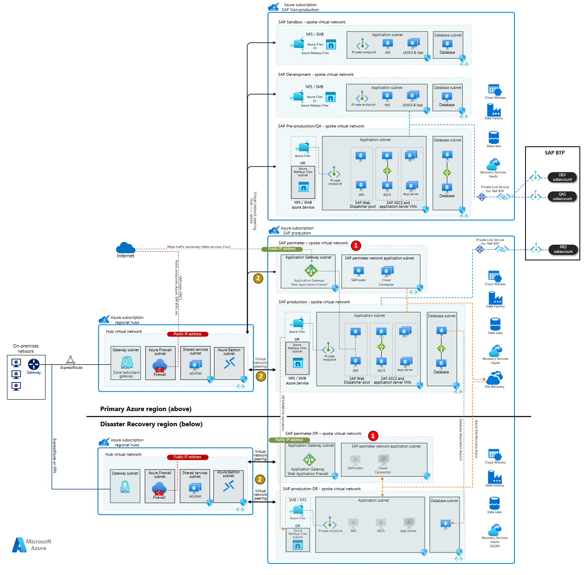
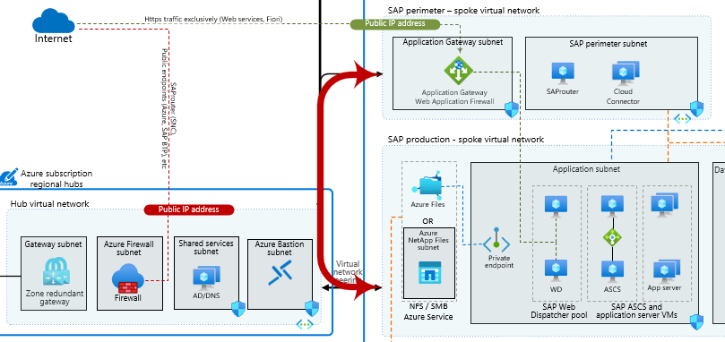

This article is an extension of the exiting best practices deploying multiple SAP systems and environments. It focuses on further securing the SAP landscape for multiple SAP systems across several environments (hub, production, non-production, disaster recovery). The network design is without detailing specific SAP system. The goal is to situate guidance for specific SAP systems in a broader architecture. For individual guides, see the links at the end of the article.

[Visio file]:https://arch-center.azureedge.net/sap-whole-landscape.vsdx

## Architecture

_Download a [Visio file] of the architectures in this article._

### Workflow

1. **On-premises**: ExpressRoute connection from on-premises network to connected Azure regions.
1. **Hub subscription**: Azure subscription containing central services for the whole enterprise, not just SAP. Acting as hub in hub-spoke model, provides connectivity through peering to workload specific spoke virtual networks.
1. **Hub virtual network**: Virtual network spoke for the central hub, in primary region or region A.
1. **Hub DR virtual network**: Virtual network spoke for the central hub in disaster recovery region, or region B. It mirrors the subnet design of the production virtual network in primary region.
1. **SAP non-production subscription**: Azure subscription for all non-productive SAP workloads. It includes pre-production, quality assurance, development and sandbox environments.
1. **SAP non-production virtual networks**: Virtual network for SAP non-product workloads in primary region or region A. Each SAP environment with own virtual network and subnets.
1. **SAP production subscription**: Azure subscription for all productive SAP workloads.
1. **SAP production virtual networks**: Virtual networks for SAP productive environment and perimeter, with multiple subnets. Location is primary region or region A.
1. **SAP DR virtual networks**: Virtual networks for SAP production workload and perimeter, in the disaster recovery region or region B. It mirrors the subnet design of the production virtual network in primary region.
1. **Azure Services**: Azure services connected to the SAP landscape.
1. **SAP BTP**: SAP Business Technology Platform (BTP) accessed through private link by the SAP environment.

## Differences

As noted in the introduction, this architecture is an extended version of the [Holistic SAP landscape architecture](./sap-whole-landscape.yml). This section assumes you are familiar with the [Holistic SAP landscape architecture](./sap-whole-landscape.yml) and lists only differences. Skip this chapter and [start with next if you aren't](#components-of-this-architecture).

The following changes show the differences:

- **SAP perimeter network as spoke VNet** Separated from the SAP production virtual network (VNet), the SAP perimeter VNet retains the subnets but places them in a dedicated SAP perimeter VNet.

- **Better incident response**: Quick and immediate isolation of compromised services if a breach is detected. Removing virtual network peering from the SAP perimeter to the hub immediately isolates the SAP perimeter workloads and SAP application virtual network applications from the internet. Changing or removing an NSG rule that permits access only affects new connections and doesn't cut existing connections.

- **Fine-grained network access control**: The "SAP Perimeter" VNet provides more stringent network access control to and from the "SAP production" network.

- **Increased complexity, latency, and cost**: The architecture increases management complexity, cost, and latency. Internet-bound communication from the SAP production virtual network is peered twice, once to the Hub virtual network and again to the SAP perimeter virtual network out to the internet. The firewall in the Hub virtual network has the greatest affect on latency. We recommend measure the latency to see if your use case can support it.

For more information, see [perimeter network best practices](/azure/cloud-adoption-framework/ready/azure-best-practices/perimeter-networks).

The architecture doesn't show a non-production SAP perimeter network. Non-production SAP workload uses SAP production perimeter services and network. The decision to create a non-production environment for shared SAP services (SAProuter, Cloud Connector) depends on your company policies and the size of your SAP landscape. One major driver to use a dedicated non-production SAP perimeter is the business criticality of processes depending on this connectivity path and the degree of change you foresee for these applications. A dedicated non-production SAP perimeter will be helpful during testing and new feature deployment. Should the applications be mostly served for less critical and secondary business processes with little change, the need for such additional non-production SAP perimeter is likely low.

## Components of this architecture

### Azure subscriptions

We recommend using a hub-spoke network design. With a hub-spoke design, you need at least three subscriptions to divide your SAP environments. You should have a subscription for the (1) hub virtual network, (2) non-production virtual networks, and (3) production virtual networks. Subscriptions provide a billing, policy, and security boundary. There's no correct number of subscriptions. The number of subscriptions you use depends on your billing, policy, and security needs. In general, you want to avoid using too many subscriptions. Too many subscriptions can add unneeded management overhead and networking complexity. For example, you don't need a subscription for each SAP system.

Our architecture uses three subscriptions:

- **Hub subscription**: An Azure virtual hub subscription where the hub virtual network (VNet) exists for the primary and secondary regions. This subscription is for all central services and not just SAP.
- **SAP production subscription**: An Azure SAP production subscription where the production and disaster recovery systems are configured.
- **SAP non-produciton subscription**: An Azure SAP non-production subscription where non-production systems, including sandbox, development, quality assurance, or pre-production systems, reside.

For more information on resource management, see:

- [Limits for each subscription](/azure/azure-resource-manager/management/azure-subscription-service-limits)
- [Azure policies](/azure/governance/policy/overview)
- [Management groups](/azure/governance/management-groups/overview)

### Network design

The architecture uses a hub-spoke topology. The hub VNet acts as a central point of connectivity. It connects to the on-premises network and the various spoke VNets, enabling user and application access to the SAP workload.

**Use ExpressRoute for on-premises connection.** For SAP workloads, we recommend using ExpressRoute to connect the hub on-premises network. You could use [Azure virtual WAN](/azure/virtual-wan/virtual-wan-about) topology if you have global locations. Consider setting up a site-to-site (S2S) VPN as a backup to Azure ExpressRoute or any third-party route requirements. As on-premises connection is assumed already in place for SAP use in this architecture, see any details and decision help between available options in the following documents:

- [Network topology and connectivity for an SAP migration](/azure/cloud-adoption-framework/scenarios/sap/eslz-network-topology-and-connectivity)
- [Hub and spoke architecture](/azure/architecture/reference-architectures/hybrid-networking/hub-spoke)
- [Azure virtual WAN](/azure/virtual-wan/virtual-wan-about)
- [S2S VPN as a backup for ExpressRoute private peering](/azure/expressroute/use-s2s-vpn-as-backup-for-expressroute-privatepeering)

**Use one virtual network per environment.** We recommend using one VNet per environment, often called SAP deployment tier. The architecture uses a different VNet for production, development, quality assurance, and sandbox. Additional VNet is exclusively for SAP production perimeter network, for SAP services directly communicating with public networks.

However, depending on the size of your SAP landscape, you can combine the SAP spoke virtual networks into fewer or even only one SAP spoke VNet. Each SAP environment's VNet would then be subnets inside such combined virtual network - SAP development subnets, SAP pre-production subnets, etc. For small SAP landscapes with few VMs and SAP systems, we recommend keeping at minimum a production and non-production division of subnets.

Any simplification and change of the network and subscription design needs to reevaluate the security impact on network routing, access to and from public networks and access of shared services like NFS / SMB file shares.

**Direct traffic outside the VNet to firewall** All network traffic to spoke VNets should traverse a firewall, including remote function call (RFC) connections. We've configured communication between the spoke VNets and communication between the spoke VNets and on-premises network to pass through the hub VNet firewall in the Azure Firewall subnet. We used VNet peering to connect the various spoke VNets to the hub VNet. All spoke-to-spoke VNet communication traverses the hub VNet firewall. You could also use a network virtual appliance instead of a firewall. For more information, see [network virtual appliance](https://azure.microsoft.com/solutions/network-appliances/).

Network traffic inside an SAP spoke VNet shouldn't pass through firewall. This applies especially for the communication path between SAP application and SAP system's database. Placement of any firewall or network virtual appliances in the communication path between the SAP application and the DBMS layer of SAP systems running the SAP kernel is unsupported.

**Limit spoke-to-spoke virtual network peering** VNet peering between the spoke VNets should be avoided if possible. Spoke-to-spoke VNet peering allows spoke-to-spoke communication to bypass the hub VNet firewall. You should only configure spoke-to-spoke VNet peering when you have high-bandwidth requirements. Examples include database replication between SAP environments. All other network traffic should run through the hub VNet and firewall.

Spoke-to-spoke VNet peering allows spoke-to-spoke communication to bypass the hub VNet firewall. You should only configure spoke-to-spoke VNet peering when you have high-bandwidth requirements. Examples include database replication between SAP environments or production to disaster recovery virtual network. All other network traffic should run through the hub VNet and firewall.

**Dedicate VNet spoke for SAP perimeter services** With SAP applications allowing internet facing communication, a dedicated VNet for such perimeter services. An own VNet allows immediate isolation of any compromised service if a breach is detected. Removing virtual network peering from the SAP perimeter to the hub immediately isolates the SAP perimeter workloads and SAP application virtual network applications from the internet. Changing or removing an NSG rule that permits access only affects new connections and doesn't cut existing connections. Additionally, an own VNet provides more stringent network access control to and from the "SAP production" network. This comes at the price of increased complexity, latency incurred due to passing through firewall and additional cost with double spoke-hub peering for any internet facing traffic.

**Internet in- and outbound traffic** For details on internet ingress and egress network traffic, follow a dedicated architecture on this topic at [Inbound and outbound internet connections for SAP on Azure](./sap-internet-inbound-outbound.yml)

#### Subnets

It's a best practice to divide each SAP environment's own VNet (production, pre-production, development, sandbox) into subnets and use subnets to group related services. The production virtual network in the architecture has five subnets. The network design you should use depends on the resources in the virtual network, but use the architecture and the following points to implement the right principles.

- **Application subnet**: The application subnet contains virtual machines running SAP application servers, (ABAP) SAP Central Services (A)SCS, SAP enqueue replication services ERS and SAP Web Dispatcher instances. The subnet also contains a private endpoint to Azure Files. In the diagram the VMs are grouped by role showing a typical, highly available, single SAP system using either availability sets or zones for resilient deployment. See individual SAP architecture guides linked at end for more details on individual SAP system.

- **Database subnet**: The database subnet holds virtual machines running databases. In the diagram, a pair of VMs for a highly available setup in synchronous replication are a representation for all database VMs of one SAP environment.

- **SAP perimeter subnet**: This subnet is a demilitarized zone (DMZ) that contains internet-facing applications such as SAProuter, SAP Cloud Connector, SAP Analytics Cloud Agent, and Application Gateway. These services have dependencies on SAP systems that an SAP team should deploy, manage, and configure, not a central IT team. For this reason, you should place these services in the SAP spoke VNet and not the Hub VNet.

The architecture doesn't show a non-production SAP perimeter subnet. Non-production SAP workload uses SAP production perimeter services and network. The decision to create a non-production environment for shared SAP services (SAProuter, Cloud Connector) depends on your company policies and the size of your SAP landscape. One major driver to use a dedicated non-production SAP perimeter is the business criticality of processes depending on this connectivity path and the degree of change you foresee for these applications. A dedicated non-production SAP perimeter will be helpful during testing and new feature deployment. If the applications be mostly served for less critical and secondary business processes with little change, the need for such extra non-production SAP perimeter is likely low.

- **Application Gateway subnet**: Azure Application Gateway requires its own subnet. Use it to allow traffic from the Internet that SAP services, such as SAP Fiori, can use. An Azure Application Gateway requires at least a /29 size subnet. We recommend size /27 or larger. You can't use both versions of Application Gateway (v1 and v2) in the same subnet. For more information, see [subnet for Azure Application Gateway](/azure/application-gateway/configuration-infrastructure#virtual-network-and-dedicated-subnet).

- **Azure NetApp Files subnet**: [A delegated subnet](/azure/azure-netapp-files/azure-netapp-files-delegate-subnet) if using NetApp Files to provide NFS / SMB file shares for different SAP on Azure scenarios. A /24 subnet is the default. Use your requirements to determine the proper sizing.

We have a few more notes on subnet design. Ensure sufficient network address space is provided for the subnets. If you use SAP virtual host names, you need more address space in your SAP subnets, including the SAP perimeter. Often 2-3 IPs are required for each SAP instance including the physical VM hostname. Other Azure services might require their own dedicated subnet, when deployed in the SAP workload VNets.

#### Network security groups (NSG)

Using subnets to divide makes it easier to implement and manage the security. It allows you to implement network security groups at the subnet level. Grouping resources in the same subnet when they require different security rules makes it difficult to implement and manage security rules. It requires network security groups at the subnet level and network-interface level. With these two levels, security rules easily conflict and can cause unexpected communication problems that are difficult to troubleshoot.

 NSG rules in place affect network traffic in- and out of the subnet, and also [within the subnet](/azure/virtual-network/network-security-group-how-it-works#intra-subnet-traffic). For more information on NSGs, see [network security groups](/azure/virtual-network/tutorial-filter-network-traffic-cli).

**Application security groups (ASG)**: We recommend using application security groups to group VM network interfaces and reference the ASGs in NSG rules. This allows easier rule creation and management, instead of IP ranges only, and are recommended for SAP deployments. Each network interface can belong to multiple application security groups, with different NSG rules. For more information, see [application security groups](/azure/virtual-network/application-security-groups).

#### Azure Private Link

We recommend using Azure Private Link to improve the security of network communications. Azure Private Link uses private endpoints with private IP addresses to communicate with Azure services. It lets you avoid sending network communication using public internet endpoints. For more information, see [private endpoints on Azure services](/azure/private-link/private-endpoint-overview).

**Private endpoints**: Azure Files is the connected service but the same concept can be extended to any supported Azure service.

**Azure Private Link SAP BTP connectivity**: Azure Private Link for SAP Business Technology Platform (BTP) is now generally available. SAP Private Link Service supports connections from SAP BTP, the Cloud Foundry runtime, and other services. Example scenarios include SAP S/4HANA or SAP ERP running on the virtual machine and connecting to Azure native services such as Azure Database for MariaDB and Azure Database for MySQL.

The architecture depicts an SAP Private Link Service connection from SAP BTP environments. SAP Private Link Service establishes a private connection between specific SAP BTP services and specific services in each network as service provider accounts. Private link allows BTP services to access your SAP environment through private network connections. It improves security by not using the public internet to communicate.

For more information, see:

- [Azure Private Link resources](https://help.sap.com/docs/PRIVATE_LINK/42acd88cb4134ba2a7d3e0e62c9fe6cf/e8bc0c6440834a47a0ff57cb4efc0dc2.html?locale=en-US)
- [Azure Database for MariaDB](https://help.sap.com/docs/PRIVATE_LINK/42acd88cb4134ba2a7d3e0e62c9fe6cf/862fa2958c574c3cbfa12a927ce1d5fe.html?locale=en-US)
- [Azure Database for MySQL](https://help.sap.com/docs/PRIVATE_LINK/42acd88cb4134ba2a7d3e0e62c9fe6cf/5c70499ee70b415d954145a795e43355.html?locale=en-US)
- [Internet connection for SAP on Azure](/azure/architecture/guide/sap/sap-internet-inbound-outbound)

### NFS / SMB file shares

SAP systems often depend on NFS volumes or SMB shares to share files between VMs of same or other SAP systems, or to act as file interface with other applications. We recommend using native Azure services for network file system (NFS) / server message block (SMB) file shares. They have better availability and resilience with service level agreements (SLAs) than operating-system-based tools.

For more information, see:

- [Azure Premium Files](/azure/virtual-machines/workloads/sap/planning-guide-storage#azure-premium-files)
- [Azure NetApp Files](/azure/virtual-machines/workloads/sap/planning-guide-storage#azure-netapp-files-anf)
- [SAP note 2015553](https://launchpad.support.sap.com/#/notes/2015553) lists requirements for storage services in Azure for SAP workloads

Your architecture needs to contain plans and sizing for individual volumes and to which SAP system each is connected to. Keep scalability and performance targets of the Azure service in mind during detail planning. The following table outlines common SAP file shares and gives a brief description and recommended use in a whole SAP environment.

| File share name | Usage | Recommendation |
|:----------------|:------| :--------------|
| sapmnt          | Distributed SAP system, profile and global directories | Dedicated share for each SAP system, no reuse               |
| cluster         | HA shares for ASCS, ERS, DB, as per respective design  | Dedicated share for each SAP system, no reuse               |
| saptrans        | SAP transport directory                                | One share for one or few SAP landscapes (ERP, BW) |
| interface       | File exchange with non-SAP applications                | Customer specific requirements, separate file shares per environment (prod, non-prod) |

As noted in the table, only transport can be shared between different SAP environments. This means determining the placement of such central share. Avoid consolidating too many SAP systems into one saptrans share for scalability and performance reasons. See guidance in service specific documentation linked in this chapter.

The corporate security policies will drive the architecture and possible separation of volumes between environments. A transport directory with separation per environment / tier will still need RFC communication between SAP environments to allow SAP transport groups or transport domain links. For more information, see:

- [SAP transport groups](https://help.sap.com/docs/SAP_NETWEAVER_750/4a368c163b08418890a406d413933ba7/44b4a0ce7acc11d1899e0000e829fbbd.html)
- [Transport domain links](https://help.sap.com/docs/SAP_NETWEAVER_750/4a368c163b08418890a406d413933ba7/14c795388d62e450e10000009b38f889.html)

### Data services

The architecture contains Azure data services that help you extend and improve your SAP data platform. We recommend you use services, such as Azure Synapse Analytics, Azure Data Factory, and Azure Data Lake Storage, to unlock business insights. These data services help you analyze and visualize SAP data and non-SAP data.

For many data integration scenarios, an integration runtime is required. The Azure integration runtime is the compute infrastructure that Azure Data Factory and Azure Synapse Analytics pipelines use to provide data integration capabilities. We recommend the deployment of runtime virtual machines for these services for each environment separately. Following examples show you how to connect SAP systems and deploy the Azure integration runtime.

- [Azure integration runtime](/azure/data-factory/concepts-integration-runtime)
- [Set up a self-hosted integration runtime to use in the SAP CDC solution](/azure/data-factory/sap-change-data-capture-shir-preparation)
- [Copy data from SAP HANA](/azure/data-factory/connector-sap-hana?tabs=data-factory)
- [Copy data from SAP Business Warehouse via Open Hub](/azure/data-factory/connector-sap-business-warehouse-open-hub)

## Reuse of services between SAP systems

A topic already touched upon with NFS / SMB file shares, when looking at the overall SAP landscape, the diagram shows several Azure services used by multiple SAP systems. While no single guidance is possible and many approaches are valid, a set of recommendations and design decisions are shared below. This document won't provide guidance on central IT services. Applications such as firewalls, network gateways, DNS or OS patch repositories, such central services are out of scope for this article.

Services that typically serve an SAP system are best separated as described here:

- **Load balancers**: Load balancers should be dedicated to individual services. For each SAP system with clustered high-availibility (HA) architecture, we recommend one load balancer for ASCS/SCS and Enqueue Replication Service (ERS). For database of the same SAP system, if running SAP HANA with high-availability architecture, a second load balancer should be used. Other databases than SAP HANA might not require load balancers at all even for HA deployment. See database specific documents for details of such load balancer design.  

Using one set of load balancers for a single SAP system helps to ensure that troubleshooting doesn't get complex, with many front- and back-end pools and load balancing rules all on a single load balancer. This configuration also ensures resource naming and placement in resource groups aligns with the SAP system and subnet used by load balancer frontend matches the SAP layer of database or application.

Alternatively to one load balancer for (A)SCS and ERS and second for SAP HANA, a single load balancer for all three services (A)SCS, ERS and DB clusters of one SAP system can also be considered.

- **Application Gateway**: We recommend at least one application gateway per SAP environment (production, non-production, and sandbox) unless the complexity and number of connected systems is too high. You could use an application gateway for multiple SAP systems to reduce complexity since not all SAP systems in the environment require public access. A single application gateway could serve multiple web dispatcher ports for a single SAP S/4HANA system or across different SAP environments.

- **SAP Web Dispatcher VMs:** This architecture in the sample, highly available SAP system within production environment shows a pool of 2 or more SAP Web Dispatcher VMs. First decision should be made to use standalone VMs for SAP Web Dispatcher or to embed the Web Dispatcher service with the (A)SCS VM for one individual SAP system. If standalone VMs are used for Web Dispatcher, we recommend to not reuse them between different SAP systems. Such design allows you to size the Web Dispatcher VMs individually for each SAP system. For smaller SAP systems where Web Dispatcher service is required, consider embedding them with the (A)SCS instance.

- **SAP services**: SAP services like SAProuter, Cloud Connector, and Analytics Cloud Agent, are deployed based on application requirements, either centrally or split up. No recommendation on reuse between SAP systems due to diverse customer requirements. Main decision to make is mentioned in networking section, if and when SAP perimeter subnet for non-production should be used. Otherwise with just production perimeter subnet for SAP, the SAP perimeter services are consumed by entire SAP landscape.

## Disaster recovery considerations

Disaster recovery (DR) addresses the requirement for business continuity in case the primary Azure region is unavailable or compromised. From an overall SAP landscape perspective and shown in the diagram, the requirements for cross-region DR are:

- **Use different IP address ranges** A virtual network doesn't span beyond a single Azure region, a different virtual network is required in secondary region. The virtual network in the DR environment needs different IP address range to enable database synchronization through database native technology.
- **Central services and connectivity to on-premises**: Connectivity to on-premises and key central services like DNS or firewalls must be available in the DR region. As key component for functioning SAP environment, availability and change configuration of the central IT services need to be part any DR plans.
- **Protecting SAP applications through ASR** Azure Site Recovery (ASR) enables protection of SAP application VMs and replication of all managed disks and VM configuration to the DR region. 
- **Ensure file share availability**: SAP depends on availability of key SMB or NFS file shares. Backup or continuos file share replication is necessary to provide data on these file shares with minimal data loss in DR scenario.
- **Database replication** Database servers for SAP can't be protected by ASR due to high change rate and lack of database support by the service, unlike SAP application servers. A continuos and asynchronous database native replication to DR region, with round the clock operation of database VMs in DR region is needed.

For details on disaster recovery guidance for SAP, see article [Disaster recovery overview and infrastructure guidelines for SAP workload](/azure/virtual-machines/workloads/sap/disaster-recovery-overview-guide).

## Consolidating SAP subnets and virtual networks

The architecture in this document represents proven best practices from successful SAP deployments in Azure. Driven by corporate policies and different requirements , this section contains alternatives for some design principles. Additionally, any requirement to decrease the number of required virtual networks and subnets for smaller SAP deployments, some changes to the main architecture design can be made. Ensure any modification to simplify and flatten the architecture are done only after careful consideration. These would be:

- **Combine the SAP application and database subnets into one**
  By combining the two subnets you simplify the overall network design and mirror what is often deployed in many SAP landscapes on-premises, one large network for SAP. By combining the subnets, an even higher attention needs to be placed on subnet security and your NSG rules. NSG rules in place affect network traffic in- and out of the subnet, and also [within the subnet](/azure/virtual-network/network-security-group-how-it-works#intra-subnet-traffic). Use of ASGs is recommended always, but particularly when using a single subnet for SAP application and database subnets.

- **Combine SAP perimeter subnet into application subnet**
  Another simplification possible on network level, is to place VMs from the perimeter subnet into SAP application subnet, eliminating the SAP perimeter subnet. Similarly to the point above with joint SAP app and DB subnet, a heightened attention must be placed on NSG rules and ASG use. Due to the typically small SAP perimeter subnet or virtual network, we only recommend this simplification approach for small SAP estates.

- **Combine SAP spoke VNets between different SAP environments / tiers**
  The architecture shown uses different virtual networks for each SAP environment / tier - production, development, etc. Depending on the size of your SAP landscape, you can combine the SAP spoke virtual networks into fewer or even only one SAP spoke. Each SAP environment's VNet would then be a subnet inside such combined virtual network - SAP development application subnet, SAP development database subnet, SAP pre-production application subnet, etc. Recommendation even for SAP landscapes with few VMs and SAP systems is to keep at least a production and non-production division of subnets. This alternative design goes together with having more or fewer Azure subscriptions for SAP workloads, from chapter [subscriptions](#azure-subscriptions) within this document.

## Contributors
  
_This article is maintained by Microsoft. It was originally written by the following contributors._

**Principal authors:** 

 * [Robert Biro](https://www.linkedin.com/in/robert-biro-38991927) | Senior Architect  
 * [Pankaj Meshram](https://ww.linkedin.com/in/pankaj-meshram-6922981a) | Principal Program Manager

## Next steps

- [SAP S/4HANA in Linux on Azure](./sap-s4hana.yml)
- [Run SAP NetWeaver in Windows on Azure](./sap-netweaver.yml)
- [Run SAP HANA in a scale-up architecture on Azure](/azure/architecture/reference-architectures/sap/run-sap-hana-for-linux-virtual-machines)
- [Cloud Adoption Framework - SAP scenario](/azure/cloud-adoption-framework/scenarios/sap/)
- [In- and Outbound internet connections for SAP on Azure](/azure/architecture/guide/sap/sap-internet-inbound-outbound)
- [SAP on Azure documentation](/azure/virtual-machines/workloads/sap/get-started).
- [Azure planning and implementation guide for SAP workloads](/azure/virtual-machines/workloads/sap/planning-guide)
- [SAP workloads on Azure: planning and deployment checklist](/azure/virtual-machines/workloads/sap/sap-deployment-checklist)
