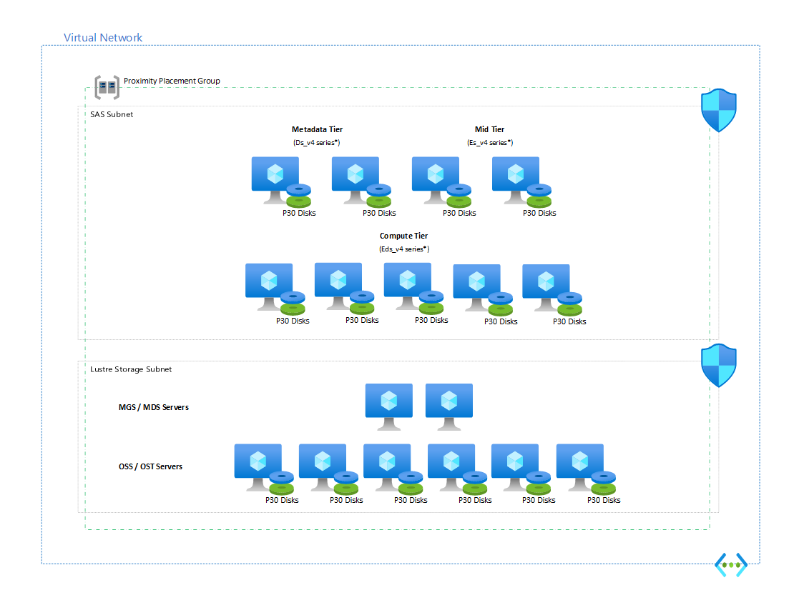

# SAS on Azure Architecture Guide

Microsoft and SAS are working as [partners](https://news.microsoft.com/2020/06/15/sas-and-microsoft-partner-to-further-shape-the-future-of-analytics-and-ai/) to develop a roadmap for organizations that innovate in the cloud. Through this partnership, the companies have migrated SAS analytics products and solutions to Azure.

This guide provides guidelines for using SAS analytics on Azure. It covers a variety deployment scenarios. For instance, multiple versions of SAS are available. You can run SAS software on self-managed virtual machines (VMs). You can also deploy container-based versions by using Azure Kubernetes Service. Besides discussing different implementations, this guide also follows guidance in the [Microsoft Azure Well-Architected Framework](../../framework/index.md) on achieving excellence in the areas of cost, DevOps, resiliency, scalability, and security. But consult with your SAS team about your use case to ensure a high-quality deployment.

## Introduction to SAS

SAS analytics software provides a suite of services and tools for drawing insights from data and making intelligent decisions. SAS platforms fully support the company's solutions for areas such as data management, fraud detection, risk analysis, and visualization. SAS offers these primary platforms:

- SAS Grid 9.4
- SAS Viya 3.5
- SAS Viya 4.0

Microsoft has validated and documented all three. The systems used these architectures:

- For Viya 3.5, both symmetric multiprocessing (SMP) and massively parallel processing (MPP) architectures
- For SAS Viya 4.0, an MPP architecture on AKS

The following architectures have also been tested:

- SAS Viya 3.5 SMP and MPP architectures on Linux
- SAS Viya 4.0 on AKS
- SAS Grid 9.4 on Linux
- SAS 9 Foundation

This guide provides general information for running SAS on Azure, not platform-specific information. These guidelines assume that you host your own SAS solution on Azure in your own tenant. SAS doesn't host a solution for you on Azure. See [SAS Managed Application Services](https://www.sas.com/en_us/solutions/cloud/sas-cloud/managed-application-services.html) for more information on Azure hosting and management services that SAS provides.

## Architectural overview

SAS deployments often contain three layers:

- An API or visualization tier
- A compute platform
- A storage tier



## Prerequisites

Before deploying a SAS workload, ensure the following components are in place:

- A sizing recommendation from an SAS sizing team
- An SAS license file
- Access to a resource group that you can deploy resources in
- A virtual central processing unit (vCPU) subscription quota that takes into account your sizing document and VM choice
- Access to Lightweight Directory Access Protocol (LDAP) services

SAS documentation provides requirements per core, or per physical CPU core. Azure provides vCPU listings. The ratio of vCPU to physical cores on the VMs that Azure uses for SAS is 2:1. As a result, to calculate the value of a vCPU requirement, use half of the core requirement value. For instance, a physical core requirement of 150 MBps translates to 75 MBps per vCPU. For More information on Azure computing performance, see [Azure compute unit (ACU)](/azure/virtual-machines/acu).

## Design recommendations for all SAS solutions

### Operating systems

Linux works best for running SAS workloads. SAS supports 64 bit versions of RedHat 7 or higher, SLES 12.2 and Oracle Linux 6 or higher. Consult the [SAS Operating System support matrix](https://support.sas.com/supportos/list?requestAction=summary&outputView=sasrelease&sasrelease=9.4&platformGroup=UNIX&platformName=Linux+64-bit) for your SAS release of choice. In multi machine environments it is recommended to run the same version of Linux on all machines. Linux 32-bit deployments are not supported on Azure.

For the best results, we recommend that you start with a marketplace provided operating system image to ensure best compatibility and integration with Azure. Custom images will require additional configuration to ensure proper SAS performance.

#### Kernel issues and non-maskable interrupts (NMI)

An issue is present in Linux 3.x and pre 4.4 kernels, which includes all of RHEL 7.x series and the following may be seen in the system logs:

```console
Message from syslogd@ronieuwe-sas-e48-2 at Sep 13 08:26:08
kernel:NMI watchdog: BUG: soft lockup - CPU#12 stuck for 22s! [swapper/12:0]
```

This is a problem within the [memory and IO management of Linux and HyperV](https://access.redhat.com/solutions/22621).

<!-- There are two possible solutions:

1. Decrease the ringbuffer size and increase the vCPUs per channel by adding this to grub (**recommended**):
`hv_storvsc.storvsc_ringbuffer_size=131072 hv_storvsc.storvsc_vcpus_per_sub_channel=1024`

2. Disable blk-mq by adding this to grub:
`scsi_mod.use_blk_mq=n`

Either of these changes will require a modification to grub.conf and the virtual machine will need to be rebooted to take effect. -->

An additional issue exists in older versions of RedHat with Linux kernels lower than 3.10.0-957.27.2 and that are using NVMe drives. The generic Linux NVMe driver contains a bug that can occur when the system is under high memory pressure. During this condition, the NVMe driver may be unable to allocate sufficient memory for a write operation resulting in reports of a soft lockup that stems from an actual deadlock. The recommendation is to upgrade your kernel.

_**Possible workaround:** set /sys/block/nvme0n1/queue/max_sectors_kb to the value “128” instead of the default value of “512”. This needs to be done for each NVMe device in the VM and on _each_ VM boot._

```shell
# cat /sys/block/nvme0n1/queue/max_sectors_kb
512
# echo 128 >/sys/block/nvme0n1/queue/max_sectors_kb
# cat /sys/block/nvme0n1/queue/max_sectors_kb
128
```

### Virtual machine sizing recommendations

We _recommend_ you work with the SAS Sizing Team to get the correct sizing of your SAS deployments. Please work with your SAS support team to get the sizing completed before continuing with your deployment on Azure. The following VM SKUs are frequently used:

* **Edsv4** - often using constrained cores; Good CPU-to-Memory ratio and a high throughput locally attached disk for SASWORK or CAS_CACHE. This is the default SAS machine.
* **M-series** - using constrained cores; This machine gives high memory for heavy memory based workloads and high throughput to remote disk for SASWORK. Very often used for SPRE with Viya or specific Grid workloads.
* **LSv2** - used when fast and large SASWORK or CAS_CACHE are needed.

> [!NOTE]
> SAS has been optimized for the Intel Math Kernel Library. Non Intel based SKUs should be avoided for math heavy workloads. Validate the performance and use of MKL when selecting your CPU.

> [!WARNING]
> When possible, avoid using the Lsv2 VMs because the CPU generations can be different per node in your cluster.

Azure allows you to scale your SAS Viya 4.0 systems based on demand. You can increase the compute capacity of the node pool or scale horizontally by adding more nodes using the AKS [Cluster Autoscaler](/azure/aks/cluster-autoscaler). You may also scale up your infrastructure temporarily to accelerate a SAS workload to meet deadlines. Scaling horizontally or vertically is not supported for Viya 3.5 and Grid workloads.

### Network and Virtual Machine placement considerations

Often times, SAS Workloads can be chatty resulting in significant amounts of data transfer. The following recommendations are in place for all SAS platforms:

* Deploy SAS and storage platforms on the same Virtual Network. This avoids significant peering costs.
* Place SAS nodes in a [Proximity Placement Group](/azure/virtual-machines/co-location) to reduce latency between nodes.
* When possible, use the same proximity placement group for your VM based data storage platforms.
* Deploy SAS and storage appliances in the same availability zone to avoid cross zone latency.

SAS is very specific about the FQDN for a virtual machine. Ensure that DNS services are provided and the FQDN for machines are set correctly. Either do this through /etc/hosts or using FQDN with Azure DNS.

> [!NOTE]
> Accelerated networking should be enabled on all nodes in the SAS deployment at all times. Not enabling >accelerated networking has serious performance impacts.
>  
> Execute `az network nic update -n <name_of_NIC> -g <resource_group_name> --accelerated-networking true` to enable accelerated networking on machines that have it turned off. The virtual machine must be powered off and deallocated before the command is ran.

When migrating data or interacting with SAS in Azure, we recommend using an [Azure ExpressRoute](https://azure.microsoft.com/services/expressroute/) circuit or a virtual private network (VPN) between on-premises resources and Azure. For production SAS workloads in Azure, we recommend ExpressRoute to create a private, dedicated connection that offers reliability, faster speed, lower latency, and tighter security than site-to-site VPN.

Be mindful of latency-sensitive interfaces between SAS and non-SAS applications. You may need to move systems closer to SAS that are frequently used as a data source/sink target.

### Identity management

SAS platforms can use local user accounts or via an LDAP server. It is recommended to have a domain controller running in Azure so that your infrastructure can be domain joined and security access managed properly. If you do not have domain controllers set up, consider deploying [AD Domain Services](/azure/architecture/reference-architectures/identity/adds-extend-domain). When domain joining, ensure machine names do not exceed the 15 character limit.

## Data sources

SAS solutions often need to access data from multiple systems. These data sources are separated into SAS datasets (often called SASDATA) and databases that will need to be accessed. Often times, SAS will create a heavy load on these systems. For the best performance, it is recommended that your data sources are as close as possible to the SAS infrastructure. This includes limiting the number of network hops / appliances between your SAS infrastructure and the data sources.

> [!NOTE]
> Avoid executing analytics against data sources under stress or at distance, instead do ETL first and analytics later. Strongly consider bringing these systems closer to your SAS infrastructure.

### Permanent remote storage for SAS Data

SAS and Microsoft have tested a series of data platforms for SAS that are used to host SAS datasets. The results are documented on the SAS blogs in great detail, including the performance characteristics. The following platforms have been tested:

* [Sycomp Storage Fueled by IBM Spectrum Scale (GPFS)](https://azuremarketplace.microsoft.com/en-us/marketplace/apps/sycompatechnologycompanyinc1588192103892.sycompstoragefueledbyibmspectrumscalewithrhel?tab=overview)
* [EXAScaler Cloud by DDN (Lustre)](https://azuremarketplace.microsoft.com/en-us/marketplace/apps/ddn-whamcloud-5345716.exascaler_cloud_app?tab=overview)
* [Azure NetApp Files (NFS)](https://azure.microsoft.com/services/netapp/)

The RHEL-IO test script provided by SAS has been ran against these resources by both Microsoft and SAS which have been made available online on the [SAS Forums](https://communities.sas.com/t5/Administration-and-Deployment/bd-p/sas_admin).

### Sycomp Storage Fueled by IBM Spectrum Scale (GPFS)

SAS [reviewed Sycomp for SAS Grid](https://communities.sas.com/t5/Administration-and-Deployment/Sycomp-Storage-Fueled-by-IBM-Spectrum-Scale-A-new-shared-file/m-p/701508#M20810) and performance meets expectations.

Sizing recommendations by Sycomp are to provide 1 GPFS scale node per 8 core at a 150MB/s configuration per core and with a minimum of 5 P30 drives per instance.

### DDN EXAScaler Cloud (Lustre)

DDN acquired WhamCloud and with that the WhamCloud and Lustre offerings. This offer is now provided under the DDN EXAScaler Cloud umbrella and is available in the Azure Marketplace. The offer is based on the Lustre parallel filesystem and is designed for data intensive deployment. It proves high throughput at low cost.

[Testing for DDN EXAScaler](https://communities.sas.com/t5/Administration-and-Deployment/EXAScaler-Cloud-by-DDN-A-shared-file-system-to-use-with-SAS-Grid/m-p/714234#M21291) has been completed and it meets the requirements to run SAS workloads in a parallel manner. There are some optimizations that are recommended to apply to all client nodes when deploying EXAScaler or Lustre in general:

```shell
lctl set_param mdc.*.max_rpcs_in_flight=128 osc.*.max_pages_per_rpc=16M osc.*.max_rpcs_in_flight=16 osc.*.max_dirty_mb=1024 llite.*.max_read_ahead_mb=2048 osc.*.checksums=0  llite.*.max_read_ahead_per_file_mb=256
```

#### Azure NetApp Files (NFS)

SAS has [tested and validated NetApp performance for SAS Grid](https://communities.sas.com/t5/Administration-and-Deployment/Azure-NetApp-Files-A-shared-file-system-to-use-with-SAS-Grid-on/td-p/579437). Azure NetApp Files is a viable primary storage option for SAS Grid clusters of limited size. Testing has been successful for clusters up to 32 physical cores in size, across multiple machines. Azure NetApp Files is not recommended for larger clusters currently.  

Good performance of Azure NetApp Files has been seen for both on Viya 3.5 and Viya 4.0 deployments. It is not recommended to use Azure NetApp Files for CAS_CACHE in Viya, as the latency and write throughput is not meeting the needs. If possible, use the local ephemeral disk in your virtual machine instead.

Azure NetApp Files for SASWORK and SASDATA on SAS 9 Foundation has been positive, with good performance.

It is recommended to deploy Azure NetApp Files with at least a Premium Tier for performance needs. Based on the amount of data that is required an Ultra Tier may be needed. Users can switch from Premium to Ultra, so consider starting with Premium to see if this meets your needs.

### Other data sources

SAS supports a large variety of data sources in its platforms, including many Azure services. For Example:

* Azure Blob Storage including [Hierarchical Namespace](https://communities.sas.com/t5/SAS-Communities-Library/SAS-Viya-3-5-CAS-accessing-Azure-Data-Lake-files/ta-p/635147), also known as ADLS Gen2
* [Azure Synapse](https://blogs.sas.com/content/subconsciousmusings/2020/12/04/3-steps-to-better-models-with-sas-and-azure-synapse/)
* Hadoop and Hive on [HDInsight](https://communities.sas.com/t5/SAS-Communities-Library/SAS-Viya-CAS-accessing-Azure-HDInsight/ta-p/700597)
* SQL Server using SQL Server or ODBC

## Deployment

Generally, it is best practice to deploy your workloads using Infrastructure as Code (IaC). SAS workloads can be extremely sensitive to misconfigurations often found in manual deployments resulting in lost business productivity.

There are various repositories available with Quickstart material to use as a reference when building your environment:

* [Automating SAS Deployment on Azure using Github Actions](https://github.com/grtn316/viya4-iac-azure)
* [CoreCompete SAS 9 or Viya on Azure](https://github.com/corecompete/sas94-viya)

<!--More details can be found in the pages specific to [Viya 3.5](sas-viya-35-overview.md) and [Grid](sas-grid-94-overview.md). -->

## Security

The output of your SAS workloads is probably a critical asset for your organization, providing insight into internal efficiencies or perhaps plays a critical role in your reporting strategy. It is strongly recommended that you spend time focusing on securing access to your SAS architecture by way of secure authentication and network vulnerabilities. Any data coming in and out of your architecture should be protected through encryption methods.

SAS on Azure is delivered using the infrastructure as a service (IaaS) cloud model. This means security protections are built into the service by Microsoft at the following levels: physical datacenter, physical network, physical host, and hypervisor. For the areas above the hypervisor—such as the guest operating system for SAS—you need to carefully evaluate the services and technologies you select to ensure you are providing the proper security controls for your architecture.

For authentication to SAS, it will resemble a similar strategy as on-premises as SAS currently does not support [Azure Active Directory](/azure/active-directory/) (Azure AD). Azure AD will still be used for authentication to the portal and management of your IaaS resources. When using Azure Active Directory Domains Services (AADDS) please be cautious with using B2B invites, as these are not supported by AADDS and can cause permission conflicts. Specifically, do not invite users with the same sAMAccountName - you have to rename one of the users.

[Network security groups](/azure/virtual-network/security-overview) (NSGs) allow you to filter network traffic to and from resources in your [virtual network](/azure/virtual-network/virtual-networks-overview). You can define NSG rules to allow or deny access to your SAS services—for instance, allowing access to the CAS Worker ports from on-premises IP addresses ranges and denying public internet access.

With regard to data integrity, [Azure Disk Encryption](/azure/security/azure-security-disk-encryption-faq) helps you encrypt your SAS virtual machine disks. Both the operating system and data volumes can be encrypted at rest in storage.

[Server-side encryption of Azure Disk Storage](/azure/virtual-machines/disk-encryption) protects your data and helps you meet your organizational security and compliance commitments. SSE automatically encrypts your data stored on Azure managed disks (OS and data disks) at rest by default when persisting it to the cloud. You can rely on platform-managed keys for the encryption of your managed disk, or you can manage encryption using your own keys.

### Protecting your infrastructure

Control access to the Azure resources that you deploy. Every Azure subscription has a [trust relationship](/azure/active-directory/active-directory-how-subscriptions-associated-directory) with an Azure AD tenant. Use [Azure role-based access control (Azure RBAC)](/azure/role-based-access-control/overview) to grant users within your organization the correct permissions to Azure resources. Grant access by assigning Azure roles to users or groups at a certain scope. The scope can be a subscription, a resource group, or a single resource. Make sure to [audit](/azure/azure-resource-manager/resource-group-audit) all changes to infrastructure.

Remote access to your Virtual Machines should be managed through a [Bastion Host](https://azure.microsoft.com/services/azure-bastion/#get-started) and not exposed on the public internet. It is strongly recommended not to expose ssh or rdp ports to the public internet.

## Related resources

SAS provides free templates to help you get started. Although not officially supported by Microsoft, they can help jump-start your automation process. For example:

* [SAS Viya 4 Infrastructure as Code](https://github.com/sassoftware/viya4-iac-azure)
* [SAS Viya 3.5 Guide](https://github.com/sassoftware/sas-viya-3.5-ha-deployment/blob/main/sas-viya-3.5-ha-deployment-on-microsoft-azure/SAS-Viya-HA-Deployment-Azure.md)
* [SAS 9.4 Grid](https://github.com/corecompete/sas94grid-viya)

## Next steps

The following resources can help you get started:

* [Implement a Secure Hybrid Network](/azure/architecture/reference-architectures/dmz/secure-vnet-dmz?tabs=portal)
* [Edsv4 Series VMs](/azure/virtual-machines/edv4-edsv4-series)
* [Proximity Placement Groups](/azure/virtual-machines/co-location)
* [Azure Availability Zones](/azure/availability-zones/az-overview)
