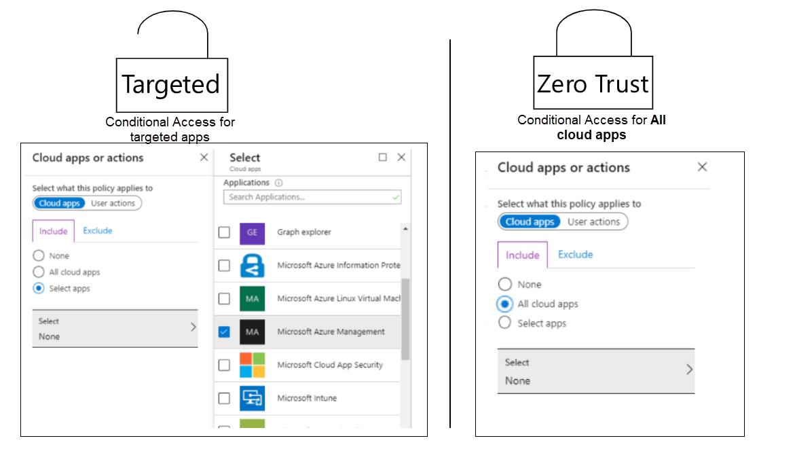
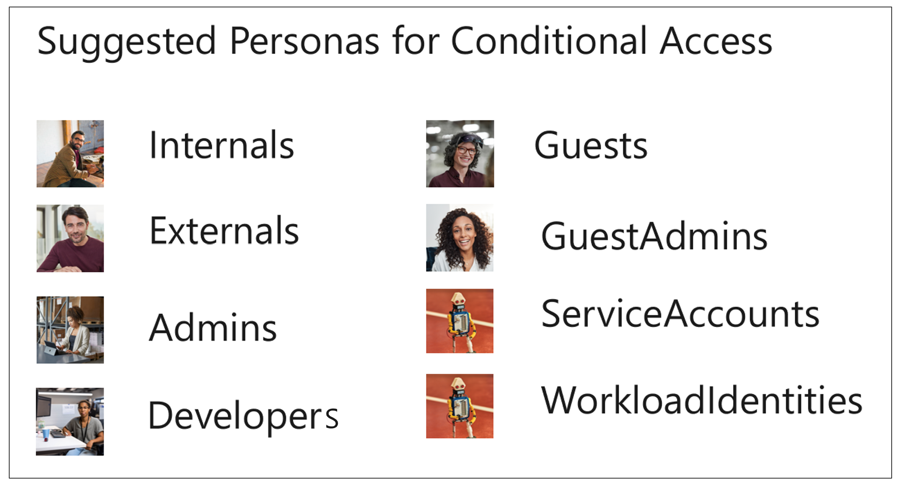
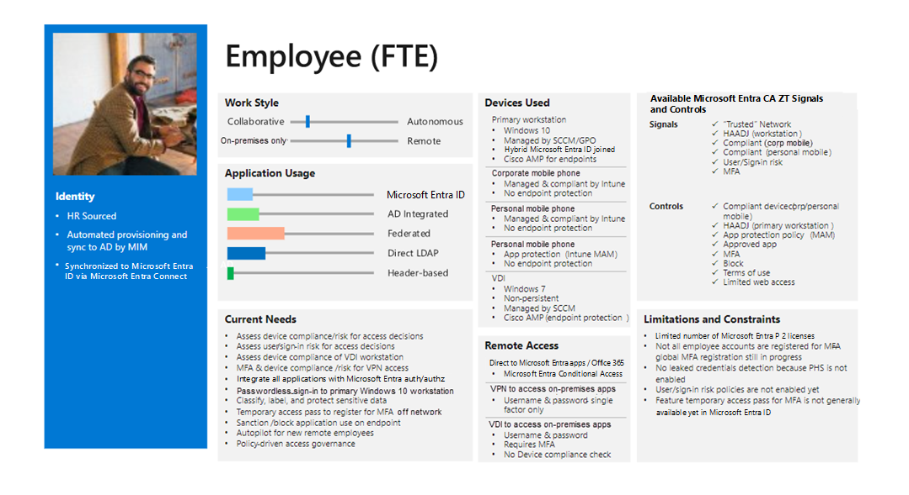

This article describes a Conditional Access architecture that adheres to Zero Trust principles. The architecture uses a persona-based approach to form a structured Conditional Access framework.

## Conditional Access Zero Trust architecture 

You first need to choose an architecture. We recommend that you consider either a Targeted or a Zero Trust Conditional Access architecture. This diagram shows the corresponding settings:

The Zero Trust Conditional Access architecture is the one that best fits the principles of Zero Trust. If you select the **All cloud apps** option in a Conditional Access policy, all endpoints are protected by the provided grant controls, like known user and known or compliant device. But the policy doesn't just apply to the endpoints and apps that support Conditional Access. It applies to any endpoint that the user interacts with.

An example is a device-login flow endpoint that's used in various new PowerShell and Microsoft Graph tools. Device-login flow provides a way to allow sign-in from a device on which it's not possible to show a sign-in screen, like an IoT device.

A device-based sign-in command is run on the given device, and a code is shown to the user. This code is used on another device. The user goes to [https://aka.ms/devicelogin](https://aka.ms/devicelogin) and specifies their user name and password. After sign-in from the other device, the sign-in succeeds on the IoT device in that user context.

The challenge with this sign-in is that it doesn't support device-based Conditional Access. This means that nobody can use the tools and commands if you apply a baseline policy that requires known user and known device for all cloud apps. There are other applications that have the same problem with device-based Conditional Access.

The other architecture, the *targeted* one, is built on the principle that you target only individual apps that you want to protect in Conditional Access policies. In this case, device-login for endpoints previously covered by all cloud apps, such as graph calls to Azure Active Directory, is not protected by the Conditional Access policies, so they continue to work.

When using device-login as an example to differentiate the two architectures, you can authenticate with device-login. Device-login can potentially be allowed for one or a few individual applications, given that each application is targetable and thereby can be excluded in a Conditional Access policy that requires device-based login.

The challenge with the *targeted* architecture is that you might forget to protect all your cloud apps. Even so, you would choose all the selectable applications in the Conditional Access policies. You leave access to the applications that can't be selected unprotected. Examples include access to the Office portal, the Azure EA (Enterprise Agreement) portal, and the security information portal, which are all very sensitive portals. 

Another consideration is that the number of Office 365 and Azure Active Directory (Azure AD) apps increases over time, as Microsoft and partners release new features and as your IT admins integrate various applications with Azure AD. Access to all such applications is protected only if you have a mechanism that detects any new app that supports Conditional Access and that automatically applies a policy to it. Creating and maintaining such a script might be difficult.

Also, the maximum supported number of apps for any one Conditional Access policy is approximately 250. You might be able to add as many as 600 apps before you get an error about payload being exceeded, but that number isn't supported.

## Conditional Access personas

There are many ways to structure Conditional Access policies. One approach is to structure policies based on the sensitivity of the resource being accessed. In practice, this approach can be difficult to implement in a way that still protects access to resources for various users. 

For example, you could define a Conditional Access policy that requires a known user and a known device for access to a sensitive resource that needs to be accessed by both guests and employees. When guests attempt access from a managed device, the access request won't work. You'd need to adjust the Conditional Access policy to meet both requirements, which would typically result in a policy that meets the less secure requirement.

Another approach is to try to define access policies based on where a user is in the organization. This approach might result in many Conditional Access policies and might be unmanageable.

A better approach is to structure policies related to common access needs and bundle a set of access needs in a persona for a group of users who have the same needs. Personas are identity types that share common enterprise attributes, responsibilities, experiences, objectives, and access.

Understanding how enterprise assets and resources are accessed by various personas is integral to developing a comprehensive Zero Trust strategy.

Some suggested Conditional Access personas from Microsoft are shown here:

Microsoft also recommends defining a separate persona for identities that aren't part of any other persona group. This is called the Global persona. Global is meant to enforce policies for identities that aren't in a persona group and policies that should be enforced for all personas.

The following sections describe some recommended personas. 

**Global** 

Global is a persona/placeholder for policies that are general in nature. It's used to define policies that apply to all personas or that don't apply to one specific persona. Use it for policies that aren't covered by other personas. You need this persona to protect all relevant scenarios. 

For example, assume that you want to use one policy to block legacy authentication for all users. You can make it a global policy instead of using a group of legacy policies that might be different for various personas. 

Another example: you want to block a given account or user from specific applications, and the user or account isn't part of any of the personas. For example, if you create a cloud identity in the Azure AD tenant, this identity isn't part of any of the other personas because it isn't assigned any Azure AD roles. You still might want to block the identity from access to Office 365 services. 

You might want to block all access from identities that aren't covered by any persona group. Or you might just want to enforce multi-factor authentication.

**Admins** 

In this context, an admin is any non-guest identity, cloud or synced, that has any Azure AD or other Microsoft 365 admin role (for example, in Microsoft Defender for Cloud Apps, Exchange, Defender for Endpoint, or Compliance Manager). Because guests who have these roles are covered in a different persona, guests are excluded from this persona. 

Some companies have separate accounts for the sensitive admin roles that this persona is based on. Optimally, admins use these sensitive accounts from a Privileged Access Workstation (PAW). But we often see that admin accounts are used on standard workstations, where the user just switches between accounts on one device. 

You might want to differentiate based on the sensitivity of cloud admin roles and assign less sensitive Azure roles to the Internals persona rather than using separate accounts. You could then use Just-In-Time (JIT) elevation instead. In this case, a user is targeted by two sets of Conditional Access policies, one for each persona. If you use PAWs, you might also want to introduce policies that use device filters in Conditional Access to restrict access so that admins are allowed only on PAWs.

**Developers**

The Developers persona contains users who have unique needs. They're based on Active Directory accounts that are synced to Azure AD, but they need special access to services like Azure DevOps, CI/CD pipelines, device code flow, and GitHub. The Developers persona can include users who are considered internal and others considered external, but a person should be in only one of the personas.

**Internals**

Internals contains all users who have an Active Directory account synced to Azure AD, who are employees of the company, and who work in a standard end-user role. We recommend that you add internal users who are developers to the Developers persona.

**Externals**

This persona holds all external consultants who have an Active Directory account synced to Azure AD. We recommend that you add external users who are developers to the Developers persona.

**Guests**

Guests holds all users who have an Azure AD guest account that's been invited to the customer tenant.

**GuestAdmins**

The GuestAdmins persona holds all users who have an Azure AD guest account that's assigned any of the previously mentioned admin roles.

**Microsoft365ServiceAccounts**

This persona contains cloud (Azure AD) user-based service accounts that are used to access Microsoft 365 services when no other solution meets the need, like using a managed service identity.

**AzureServiceAccounts**

This persona contains cloud (Azure AD) user-based service accounts that are used to access Azure (IaaS/PaaS) services when no other solution meets the need, like using a managed service identity.

**CorpServiceAccounts**

This persona contains user-based service accounts that have all of these characteristics: 
- Originate from on-premises Active Directory. 
- Are used from on-premises or from an IaaS-based virtual machine in another (cloud) datacenter, like Azure.
- Are synced to an Azure AD instance that accesses any Azure or Microsoft 365 service.
 
 This scenario should be avoided.

**WorkloadIdentities**

This persona contains machine identities, like Azure AD service principals and managed identities. Conditional Access now supports protecting access to resources from these accounts, with some limitations in regards to which conditions and grant controls are available.

## Access template cards

We recommend that you use access template cards to define the characteristics for each persona. Here's an example: 

The template card for each persona provides input for creating the specific Conditional Access policies for each persona.

## Conditional Access guidance

Review a [Conditional Access framework](/azure/architecture/guide/security/conditional-access-framework) that includes a structured approach for grouping policies based on the personas created.

## Contributors

*This article is maintained by Microsoft. It was originally written by the following contributors.* 

Principal author:

 - [Claus Jespersen](https://www.linkedin.com/in/claus-jespersen-25b0422/) | Principal Consultant ID&Sec

*To see non-public LinkedIn profiles, sign in to LinkedIn.*

## Next steps

- [Learning path: Implement and manage identity and access](/training/paths/implement-manage-identity-access)
- [What is Conditional Access?](/azure/active-directory/conditional-access/overview)
- [Common Conditional Access policies](/azure/active-directory/conditional-access/concept-conditional-access-policy-common)

## Related resources
- [Conditional Access overview](/azure/architecture/guide/security/conditional-access-zero-trust)
- [Conditional Access design principles and dependencies](/azure/architecture/guide/security/conditional-access-design)
- [Conditional Access framework and policies](/azure/architecture/guide/security/conditional-access-framework)
- [Azure Active Directory IDaaS in security operations](/azure/architecture/example-scenario/aadsec/azure-ad-security)
