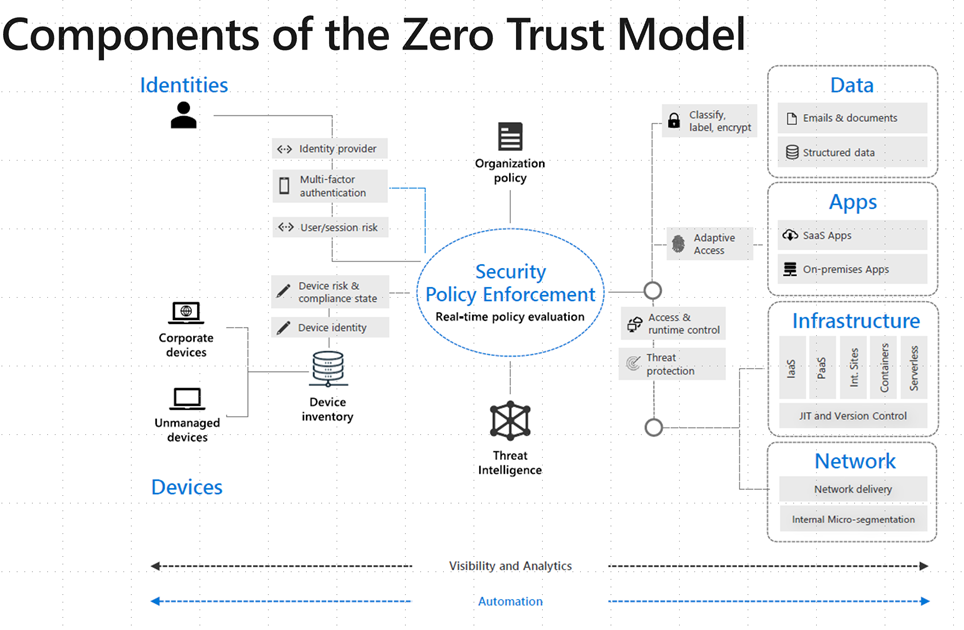
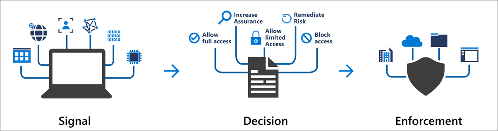
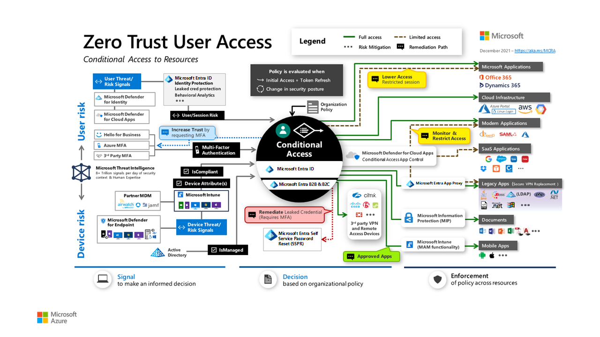
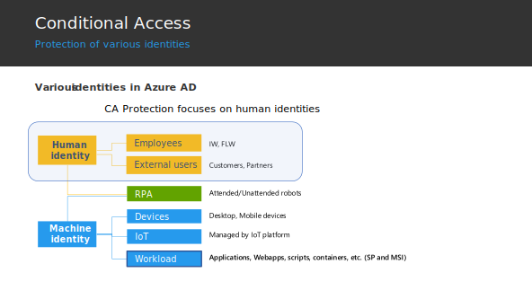
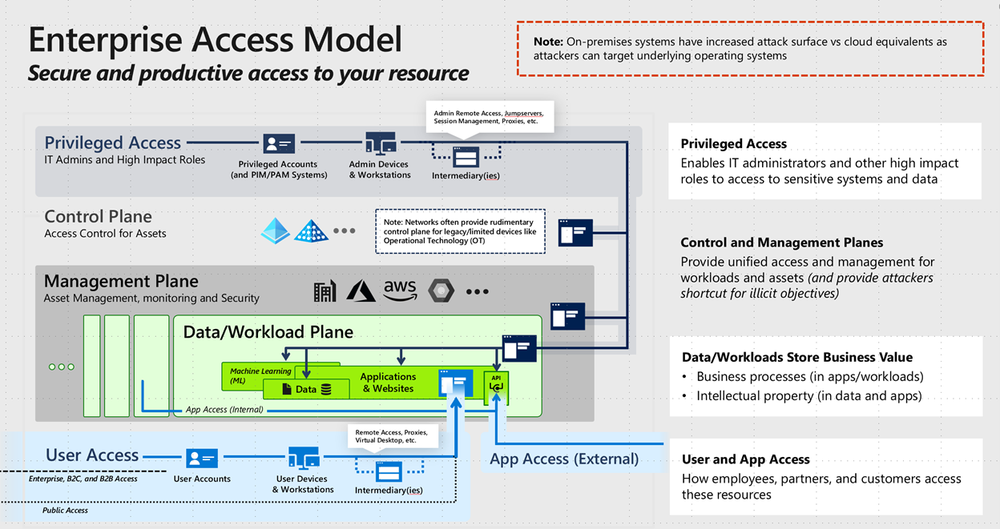
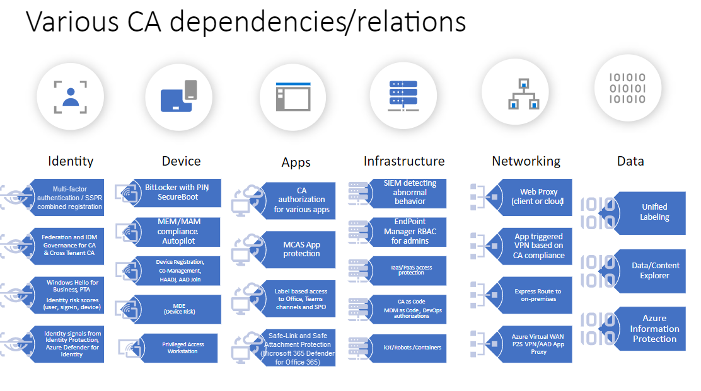

In this article, you'll learn about design principles and dependencies for a Conditional Access scenario that's based on Zero Trust.

## Design principles

We'll start out with some design principles.

### Conditional Access as a Zero Trust policy engine

The Microsoft approach to Zero Trust includes Conditional Access as the main policy engine. Here's an overview of that approach:

 

visio 

 Conditional Access is used as the policy engine for a Zero Trust architecture that covers both policy definition and policy enforcement. Based on various signals or conditions, Conditional Access can block or give limited access to resources, as shown here:

 

 Here's a more detailed view of the elements of Conditional Access and what it covers:

 

 This diagram shows Conditional Access and related elements that can help protect user access to resources, as opposed to non-interactive or non-human access. The following diagram describes these identities: 

 

Non-human access to resources also must be protected. Currently, you need to protect non-human access to cloud resources by other means, like grant controls for OAuth-based access.

> [!NOTE] 
> Functionality for targeting service principals and helping to protect access to resources for machine or workload identities based on location is currently in preview. See the persona section for more details.

### Enterprise access model

In the past, Microsoft provided guidance and principles for access to on-premises resources based on a tiering model: 
- Tier 0: Domain controllers, public key infrastructure (PKI), Active Directory Federation Services (AD FS) servers and management solutions that manage these servers 
- Tier 1: Servers that host applications 
- Tier 2: Client devices 

This model is still relevant for on-premises resources, but for helping to protect access to resources in the cloud, Microsoft recommends an access control strategy that:

- Is comprehensive and consistent.
- Rigorously applies security principles throughout the technology stack.
- Is flexible enough to meet the needs of your organization.

Based on these principles, Microsoft created the following enterprise access model:

The enterprise access model replaces the legacy tier model, which was focused on containing unauthorized escalation of privilege in an on-premises Windows Server Active Directory environment. Tier 0 expands to become the control plane, Tier 1 consists of the management and data plane, and Tier 2 covers user and app access.

Microsoft recommends moving control and management into cloud services that use Conditional Access as the main control plane and policy engine, thus defining and enforcing access.

You can extend the Azure Active Directory Conditional Access policy engine to other policy enforcement points, including:

- Modern applications: Applications that use modern authentication protocols.
- Legacy applications: Via Azure Active Directory (Azure AD) Application Proxy.
- VPN and remote access solutions: Solutions like Microsoft Always On VPN, Cisco AnyConnect, Palo Alto Networks, F5, Fortinet, Citrix, and Zscaler.
- Documents, email, and other files: Via Microsoft Information Protection.
- SaaS applications.

### Principles of Zero Trust

The three main Zero Trust principles that Microsoft defines seem to be understood, especially by security departments. However, sometimes the importance of usability is overlooked during the design of Zero Trust solutions.

Usability should always be considered an implicit principle.

### Principles of Conditional Access

Based on the preceding information, here's a summary of suggested principles. Microsoft recommends that you create an access model based on Conditional Access that's aligned with the three main Microsoft Zero Trust principles:

**Verify explicitly**

- Move the control plane to the cloud. Integrate apps with Azure AD and protect them by using Conditional Access.
- Consider all clients as external.

**Use least privileged access**
- Evaluate access based on compliance and risk, including user risk, sign-in, risk and device risk.
- Use these access priorities:
  - Access the resource directly, protected by Conditional Access
  - Publish access to the resource by using Azure AD Application Proxy, protected by Conditional Access.
  - Use Conditional Access—based VPN to access the resource. Restrict access to the level of the app or DNS name.

**Assume breach**

- Segment network infrastructure.
- Minimize use of enterprise PKI.
- Migrate single sign-on (SSO) from AD FS to password hash synchronization (PHS).
- Minimize dependencies on DCs by using Kerberos KDC in Azure AD.
- Move the management plane to the cloud. Manage devices by using Microsoft Endpoint Manager.

Here are some more detailed principles and recommended practices for Conditional Access:

- Apply Zero Trust principles to Conditional Access.
- Use report-only mode before putting a policy into production.
- Test both positive and negative scenarios.
- Use change and revision control on Conditional Access policies.
- Automate the management of Conditional Access policies by using tools like Azure DevOps / GitHub or Azure Logic Apps.
- Use block mode for general access only if and where you need to.
- Ensure all applications and your platform are protected. Conditional Access has no implicit "deny all."
- Protect privileged users in all Microsoft 365 role-based access control (RBAC) systems.
- Require password change and multi-factor authentication for high-risk users and sign-ins.
- Restrict access from high-risk devices. Use an Intune compliance policy with a compliance check in Conditional Access.
- Protect privileged systems, like the Azure portal, AWS, and GCP.
- Prevent persistent browser sessions for admins and on untrusted devices.
- Block legacy authentication.
- Restrict access from unknown or unsupported device platforms.
- Restrict strong credential registration.
- Consider using default session policy that allows sessions to continue in the case of an outage, if the appropriate conditions were satisfied before the outage.

## Design dependencies and related technologies

The following diagram shows dependencies and related technologies. Some of the technologies are prerequisites for Conditional Access. Others depend on Conditional Access. The design described in this document mainly focuses on Conditional Access and not on the related technologies.

## Next steps

[Conditional Access design based on Zero Trust and personas]

## Related resources