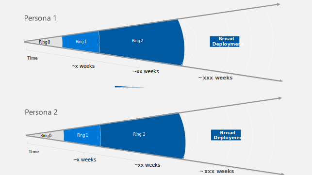

# Conditional Access framework and policies

This article provides a framework for implementing a persona-based Conditional Access architecture, like the one described in [Conditional Access Zero Trust architecture](/azure/architecture/guide/security/conditional-access-architecture). In this article, there are details on how to form and name the Conditional Access policies. There's also a starting point for creating policies.

If you don't use a framework like the one provided here, including a naming standard, policies tend to be created over time by different people in an ad-hoc way.
This can result in policies that overlap. If the person who created a policy is no longer available, it can be difficult for others to know the purpose of the policy.

Following a structured framework makes it easier to understand the policies. It also makes it easier to cover all scenarios and avoid conflicting policies that are difficult to troubleshoot.

## Naming conventions

A properly defined naming convention helps you and your colleagues understand the purpose of a policy, which enables easier policy management and troubleshooting. Your naming convention should fit the framework you use to structure your policies.

The recommended naming policy is based on personas, policy types, and apps. It looks like this:

**\<CANumber>-\<Persona>-\<PolicyType>-\<App>-\<Platform>-\<GrantControl>-\<OptionalDescription>**

The components of this name are described here:

|Naming component|Description/Example|
|----------|-----------------------|
|CA Number|Used to quickly identify Policy Type scope and order. Example: CA001-CA099.|
|Persona |Global, Admins, Internals, Externals, GuestUsers, GuestAdmins, Microsoft365ServiceAccounts, AzureServiceAccounts, CorpServiceAccounts.|
|Policy Type|BaseProtection, AppProtection, DataProtection, IdentityProtection, AttackSurfaceReduction, Compliance.|
|App|AllApps, O365 (for all Office 365 services), EXO (for Exchange Online).|
|Platform| AnyPlatform, Unknown, WindowsPhone, macOS, iOS, Android.|
|Grant Control|Block, ADHJ, Compliant, Unmanaged (where unmanaged is specified in the device state condition).|
|Description|Optional description of the purpose of the policy.|

## Numbering scheme

To make administration easy, we suggest this numbering scheme:

|Persona group|Number allocation|
|-------------|-----------------|
|CA-Persona-Global|CA001-CA099|
|CA-Persona-Admins|CA100-CA199|
|CA-Persona-Internals|CA200-CA299|
|CA-Persona-Externals|CA300-CA399|
|CA-Persona-GuestUsers|CA400-CA499|
|CA-Persona-GuestAdmins|CA500-CA599|
|CA-Persona-M365ServiceAccounts|CA600-CA699|
|CA-Persona-AzureServiceAccounts|CA700-CA799|
|CA-Persona-CorpServiceAccounts|CA800-CA899|
|CA-Persona-WorkloadIdentities|CA900-CA999|
|CA-Persona-Developers|CA1000-CA1099|

## Policy types

These are the recommended policy types:

|Policy type|Description/Examples|
|-----------|--------------------|
|BaseProtection|For each persona, there's a baseline protection that's covered by this policy type. For users on managed devices, this typically is known user and known device. For external guests, it might be known user and multi-factor authentication.   The base protection is the default policy for all apps for users in the given persona. If a specific app should have a different policy, exclude that app from the base protection policy and add an explicit policy that targets only that app.   Example: Assume the base protection for Internals is to require known user and known device for all cloud apps, but you want to allow Outlook on the web from any device. You could exclude Exchange Online from the base protection policy and add a separate policy for Exchange Online, where you require known device OR multi-factor authentication.|
|IdentityProtection|On top of the base protection for each persona, you can have Conditional Access policies that relate to identity.   Examples: Block legacy authentication, require extra multi-factor authentication for high user or sign-in risk, require known device for multi-factor authentication registration.|
|DataProtection|This policy type indicates delta policies that protect data as an extra layer on top of the base protection.   Examples: <ul><li>App protection policies for iOS and Android that you can use to encrypt data on a phone and that provide improved protection of that data. (App protection policies also include app protection.) <li> Session policies where Azure Information Protection helps secure data during download if the data is sensitive.|
|AppProtection|This policy type is another addition to the base protection.   Examples:<ul><li> Assume you want to allow web access to Exchange Online from any device. You could exclude Exchange from the base policy and create a new explicit policy for access to Exchange, where, for example, you allow only read-only access to Exchange Online. <li>Assume you require multi-factor authentication for Microsoft Endpoint Manager enrollment. You could exclude Intune Endpoint Manager enrollment from the base policy and add an app protection policy that requires multi-factor authentication for Endpoint Manager enrollment.|
|AttackSurfaceReduction|The purpose of this type of policy is to mitigate various attacks.   Examples:<ul><li> If an access attempt comes from an unknown platform, it might be an attempt to bypass Conditional Access policies in which you require a specific platform. You can block requests from unknown platforms to mitigate this risk. <li> Block access to Office 365 services for Azure Administrators or block access to an app for all users if the app is a known to be bad.|
|Compliance|You can use a compliance policy to require a user to view the terms of use for guests who access customer services. |

## App 

The following table describes the App component of a policy name:

|App name|Description/Examples|
|--------|--------------------|
|AllApps|AllApps indicates that all cloud apps are targeted in the Conditional Access policy. All endpoints are covered, including those that support Conditional Access and those that don't. In some scenarios, targeting all apps doesn't work well. We recommend targeting all apps in the base policy so that all endpoints are covered by that policy. New apps that appear in Azure AD will also automatically adhere to the policy.|
|\<AppName>|\<AppName> is a placeholder for the name of an app that the policy addresses. Avoid making the name too long.  Example names: <ul><li>EXO for Exchange Online<li>SPO for SharePoint Online   |

## Platform type

The following table describes the Platform component of a policy name:

|Platform type|Description|
|-------------|--------------------|
|AnyPlatform|The policy targets any platform. You typically configure this by selecting **Any Device**. (In Conditional Access policies, both the word *platform* and the word *device* are used.)|
|iOS|The policy targets Apple iOS platforms.|
|Android|The policy targets Google Android platforms.|
|Windows|This policy targets Windows platform.|
|Linux|This policy targets the Linux platforms.|
|WindowsPhone|The policy targets Windows Phone platforms.|
|macOS|The policy targets the macOS platforms|
|iOSAndroid|The policy targets both iOS and Android platforms.|
|Unknown|The policy targets any platform not listed previously. You typically configure this by including **Any Device** and excluding all the individual platforms.|

## Grant control types

The following table describes the Grant Control component of a policy name:

|Grant type|Description/Examples|
|----------|--------------------|
|Block|The policy blocks sign-in|
|MFA|The policy requires multi-factor authentication.|
|Compliant|The policy requires a compliant device, as determined by Endpoint Manager, so the device needs to be managed by Endpoint Manager.|
|CompliantorAADHJ|The policy requires a compliant device OR a Hybrid Azure AD joined device. A standard company computer that's domain joined is also Hybrid Azure AD  joined. Mobile phones and Windows 10 computers that are co-managed or Azure AD joined can be compliant.|
|CompliantandAADHJ|The policy requires a device that's compliant AND Hybrid Azure AD joined.|
|MFAorCompliant|The policy requires a compliant device OR multi-factor authentication if it's not compliant.|
|MFAandCompliant|The policy requires a compliant device AND multi-factor authentication.|
|MFAorAADHJ|The policy requires a Hybrid Azure AD joined computer OR multi-factor authentication if it's not a Hybrid Azure AD joined computer.|
|MFAandAADHJ|The policy requires a Hybrid Azure AD joined computer AND multi-factor authentication.|
|RequireApprovedClient|The policy requires approved client app.|
|AppProtection|The policy requires app protection|
|Unmanaged|The policy targets devices that aren't known by Azure AD. For example, you can use this grant type to allow access to Exchange Online from any device.|

## Named locations

We recommend that you define these standard locations for use in Conditional Access policies:

- **Trusted IPs / Internal networks.** These IP subnets represent locations and networks that have physical access restrictions or other controls in place, like computer system management, network-level authentication, or intrusion detection. These locations are more secure, so Conditional Access enforcement can be relaxed. Consider whether Azure or other datacenter locations (IPs) should be included in this location or have their own named locations.
- **Citrix-trusted IPs.** If you have Citrix on-premises, it might be useful to configure separate outgoing IPv4 addresses for the Citrix farms, if you need to be able to connect to cloud services from Citrix sessions. In that case, you can exclude those locations from Conditional Access policies if you need to.
- **Zscaler locations, if applicable.** Computers have a ZPA agent installed and forward all traffic to the internet to or through Zscaler cloud. So it's worth defining Zscaler source IPs in Conditional Access and requiring all requests from non-mobile devices to go through Zscaler.
- **Countries/regions with which to allow business.** It can be useful to divide countries/regions into two location groups: one that represents areas of the world where employees typically work and one that represents other locations. This allows you to apply additional controls to requests that originate from outside the areas where your organization normally operates.
- **Locations where multi-factor authentication might be difficult or impossible.** In some scenarios, requiring multi-factor authentication could make it difficult for employees to do their work. For example, staff might not have the time or opportunity to respond to frequent multi-factor authentication challenges. Or, in some locations, RF screening or electrical interference can make the use of mobile devices difficult. Typically, you'd use other controls in these locations, or they might be trusted.

Location-based access controls rely on the source IP of a request to determine the location of the user at the time of the request. It's not easy to perform spoofing on the public internet, but protection afforded by network boundaries might be considered less relevant than it once was. We don't recommend relying solely on location as a condition for access. But for some scenarios it might be the best control that you can use, like if you're securing access from a service account from on-premises that's used in a non-interactive scenario.

## Recommended Conditional Access policies

We've created a spreadsheet that contains recommended Conditional Access policies. You can [download the spreadsheet here](https://github.com/microsoft/ConditionalAccessforZeroTrustResources/raw/main/ConditionalAccessSamplePolicies/Microsoft%20Conditional%20Access%20for%20Zero%20trust%20persona%20based%20policies.xlsx).

Use the suggested policies as a starting point.

Your policies will probably change over time to accommodate use cases that are important to your business. Here are a few examples of scenarios that might require changes:

- Implement read-only access to Exchange Online for employees using any unmanaged device based on multi-factor authentication, app protection, and an approved client app.
- Implement information protection to ensure that sensitive information isn't downloaded without improved protection provided by Azure Information Protection.
- Provide protection against copy and paste by guests.
  
Multiple previews are currently going into public preview, so expect updates to the suggested set of Conditional Access (CA) starter policies soon.
  
## Conditional Access guidance

Now that you have a starter set of Conditional Access policies, you need to deploy them in a controlled and phased way. We suggest that you use a deployment model.

Here's one approach:

The idea is to first deploy policies to a small number of users within one persona group. You can use an associated Azure AD group called Persona Ring 0 for this deployment. After you verify that everything works, you change the assignment to a group, Persona Ring 1, that has more members, and so on.

You then enable the policies by using the same ring-based approach until all policies are deployed.

You typically manage the members of ring 0 and ring 1 manually. A ring 2 or 3 group that contains hundreds or even thousands of users could be managed via a dynamic group that's based on a percentage of the users in a given persona.

The use of rings as part of a deployment model isn't just for initial deployment. You can also use it when new policies or changes to existing policies are required.

With a finished deployment, you should also design and implement the monitoring controls that were discussed in the [Conditional Access principles](/azure/architecture/guide/security/conditional-access-design#principles-of-conditional-access).

In addition to automating the initial deployment, you might want to automate changes to policies by using CI/CD pipelines. You could use Microsoft365DSC for this automation.
  
## Contributors

*This article is maintained by Microsoft. It was originally written by the following contributors.* 

Principal author:

 - [Claus Jespersen](https://www.linkedin.com/in/claus-jespersen-25b0422/) | Principal Consultant ID&Sec

*To see non-public LinkedIn profiles, sign in to LinkedIn.*

## Next steps
- [Learning path: Implement and manage identity and access](/training/paths/implement-manage-identity-access)
- [Conditional Access policies](/azure/active-directory/conditional-access/concept-conditional-access-policies)

## Related resources
- [Conditional Access overview](/azure/architecture/guide/security/conditional-access-zero-trust)
- [Conditional Access design principles and dependencies](/azure/architecture/guide/security/conditional-access-design)
- [Conditional Access design based on Zero Trust and personas](/azure/architecture/guide/security/conditional-access-architecture)
- [Azure Active Directory IDaaS in security operations](/azure/architecture/example-scenario/aadsec/azure-ad-security)
