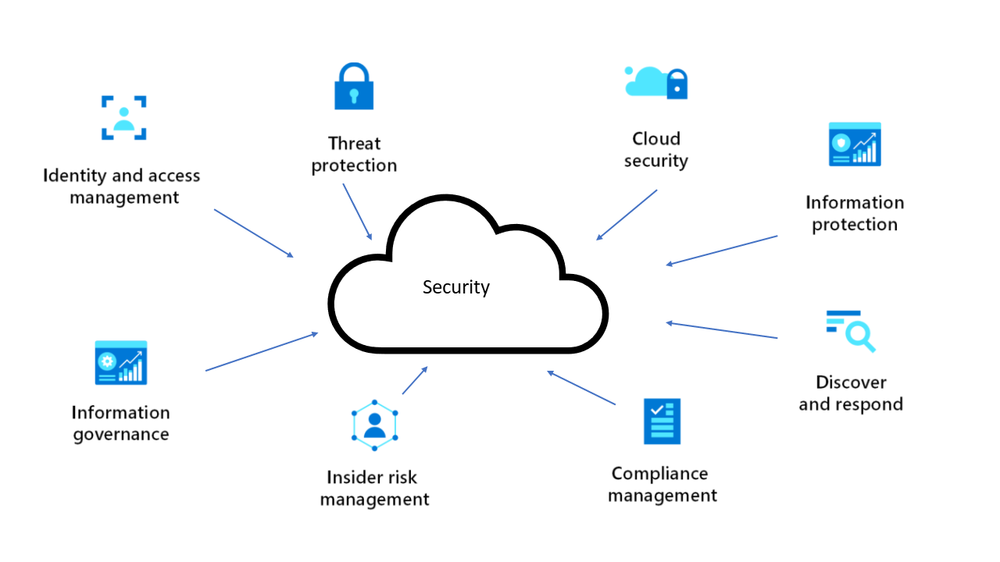

Information security has always been a complex subject, and it evolves quickly with the creative ideas and implementations of attackers and security researchers.  

Security is one of the most important aspects of any architecture. Good security provides confidentiality, integrity, and availability assurances against deliberate attacks and abuse of your valuable data and systems. Losing these assurances can harm your business operations and revenue, and your organization's reputation.

> [!NOTE]
> Learn how cloud security is an ongoing journey of incremental progress and maturity, in [Security in the Microsoft Cloud Adoption Framework for Azure](/azure/cloud-adoption-framework/secure). Learn how to build security into your solution, in the Azure Well-Architected Framework [Overview of the security pillar](/azure/architecture/framework/security/overview).

Here are some broad categories to consider when you design a security system: 

 

Azure provides a wide range of security tools and capabilities. These are just some of the key security services available in Azure:
- [Microsoft Defender for Cloud](https://azure.microsoft.com/services/defender-for-cloud). A unified infrastructure security management system that strengthens the security posture of your datacenters. It also provides advanced threat protection across your hybrid workloads in the cloud and on-premises.
- [Azure Active Directory (Azure AD)](https://azure.microsoft.com/services/active-directory). The Microsoft cloud-based identity and access management service.  
- [Azure Front Door](https://azure.microsoft.com/services/frontdoor). A global, scalable entry-point that uses the Microsoft global edge network to create fast, highly secure, and widely scalable web applications.
- [Azure Firewall](https://azure.microsoft.com/services/azure-firewall). A cloud-native, intelligent network firewall security service that provides threat protection for your cloud workloads that run in Azure.
- [Azure Key Vault](https://azure.microsoft.com/services/key-vault). A high-security secret store for tokens, passwords, certificates, API keys, and other secrets. You can also use Key Vault to create and control the encryption keys used to encrypt your data.
- [Azure Private Link](https://azure.microsoft.com/services/private-link). A service that enables you to access Azure PaaS services, Azure-hosted services that you own, or partner services over a private endpoint in your virtual network. 
- [Azure Application Gateway](https://azure.microsoft.com/services/application-gateway). An advanced web traffic load balancer that enables you to manage traffic to your web applications. 
- [Azure Policy](https://azure.microsoft.com/services/azure-policy). A service that helps you enforce organizational standards and assess compliance. 

For a more comprehensive description of Azure security tools and capabilities, see [End-to-end security in Azure](/azure/security/fundamentals/end-to-end).

## Introduction to security on Azure

If you're new to security on Azure, the best way to learn more is with [Microsoft Learn training](/training/?WT.mc_id=learnaka). This free online platform provides interactive training for Microsoft products and more.

Here are two learning paths to get you started:

- [Microsoft Azure Fundamentals: Describe general security and network security features](/training/paths/az-900-describe-general-security-network-security-features)

- [Microsoft Security, Compliance, and Identity Fundamentals: Describe the capabilities of Microsoft security solutions](/training/paths/describe-capabilities-of-microsoft-security-solutions)

## Path to production

- To secure Azure application workloads, you use protective measures like authentication and encryption in the applications themselves. You can also add security layers to the virtual machine (VM) networks that host the applications. See [Firewall and Application Gateway for virtual networks](../../example-scenario/gateway/firewall-application-gateway.yml) for an overview.
- Zero Trust is a proactive, integrated approach to security across all layers of the digital estate. It explicitly and continuously verifies every transaction, asserts least privilege, and relies on intelligence, advanced detection, and real-time response to threats.
   - For an implementation strategy for web apps, see [Zero Trust network for web applications with Azure Firewall and Application Gateway](../../example-scenario/gateway/application-gateway-before-azure-firewall.yml). 
   - For an architecture that shows how to incorporate Azure AD identity and access capabilities into an overall Zero Trust security strategy, see [Azure Active Directory IDaaS in security operations](../../example-scenario/aadsec/azure-ad-security.yml).
- Azure governance establishes the tooling needed to support cloud governance, compliance auditing, and automated guardrails. See [Azure governance design area guidance](/azure/cloud-adoption-framework/ready/landing-zone/design-area/governance) for information about governing your Azure environment. 

## Best practices

The Azure Well-Architected Framework is a set of guiding tenets, based on five pillars, that you can use to improve the quality of your architectures. For information, see [Overview of the security pillar](/azure/architecture/framework/security/overview) and [Security design principles in Azure](/azure/architecture/framework/security/security-principles).

The Well-Architected Framework also provides these checklists:

- [Azure identity and access management considerations](/azure/architecture/framework/security/design-identity)
- [Network security](/azure/architecture/framework/security/design-network)
- [Data protection considerations](/azure/architecture/framework/security/design-storage) 
- [Governance, risk, and compliance](/azure/architecture/framework/security/design-governance)

 
For information about security for sensitive IaaS workloads, see [Security considerations for highly sensitive IaaS apps in Azure](../../reference-architectures/n-tier/high-security-iaas.yml).

## Security architectures
 
### Identity and access management

- [Secure OAuth 2.0 On-Behalf-Of refresh tokens for web services](../../example-scenario/secrets/secure-refresh-tokens.yml)
- [Resilient identity and access management with Azure AD](/azure/architecture/guide/resilience/resilience-overview)
- [Azure Active Directory identity management and access management for AWS](../../reference-architectures/aws/aws-azure-ad-security.yml)

### Threat protection

- [Threat indicators for cyber threat intelligence in Microsoft Sentinel](../../example-scenario/data/sentinel-threat-intelligence.yml)
- [Multilayered protection for Azure virtual machine access](../../solution-ideas/articles/multilayered-protection-azure-vm.yml)
- [Real-time fraud detection](../../example-scenario/data/fraud-detection.yml)

### Information protection

- [Confidential computing on a healthcare platform](../../example-scenario/confidential/healthcare-inference.yml)
- [Homomorphic encryption with SEAL](../../solution-ideas/articles/homomorphic-encryption-seal.yml)
- [SQL Managed Instance with customer-managed keys](../../example-scenario/data/sql-managed-instance-cmk.yml)
- [Virtual network integrated serverless microservices](../../example-scenario/integrated-multiservices/virtual-network-integration.yml)

### Discover and respond

- [Long-term security log retention with Azure Data Explorer](../../example-scenario/security/security-log-retention-azure-data-explorer.yml)

## Stay current with security

Get the latest updates on [Azure security services and features](https://azure.microsoft.com/updates/?category=security).

## Additional resources

### Example solutions 

- [Hybrid Security Monitoring using Microsoft Defender for Cloud and Microsoft Sentinel](../../hybrid/hybrid-security-monitoring.yml)
- [Improved-security access to multitenant web apps from an on-premises network](../../web-apps/guides/networking/access-multitenant-web-app-from-on-premises.yml)
- [Restrict interservice communications](../../example-scenario/service-to-service/restrict-communications.yml)
- [Securely managed web applications](../../example-scenario/apps/fully-managed-secure-apps.yml)
- [Secure your Microsoft Teams channel bot and web app behind a firewall](../../example-scenario/teams/securing-bot-teams-channel.yml)
- [Web app private connectivity to Azure SQL database](../../example-scenario/private-web-app/private-web-app.yml)

[Browse all our security architectures](/azure/architecture/browse/?azure_categories=security).

### AWS or Google Cloud professionals

- [Security and identity with Azure and AWS](../../aws-professional/security-identity.md)
- [AWS to Azure services comparison - Security](../../aws-professional/services.md#security-identity-and-access)
- [Google Cloud to Azure services comparison - Security](../../gcp-professional/services.md#security-and-identity)

## Next steps

Security architecture is part of a comprehensive set of security guidance that also includes:

- [Security in the Microsoft Cloud Adoption Framework for Azure](/azure/cloud-adoption-framework/secure): A high-level overview of a cloud security end state.
- [Azure Well-Architected Framework](/azure/architecture/framework/security/overview): Guidance on securing your workloads on Azure.
- [Azure security benchmarks](/security/benchmark/azure/): Prescriptive best practices and controls for Azure security.
- [End-to-end security in Azure](/azure/security/fundamentals/end-to-end): Documentation that introduces you to the security services in Azure.
- [Top 10 security best practices for Azure](/azure/cloud-adoption-framework/secure/security-top-10): Top Azure security best practices that Microsoft recommends based on lessons learned across customers and our own environments.
- [Microsoft Cybersecurity Architectures](/security/cybersecurity-reference-architecture/mcra): The diagrams describe how Microsoft security capabilities integrate with Microsoft platforms and 3rd-party platforms.
