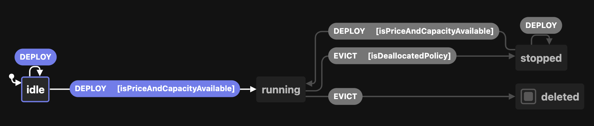
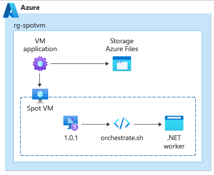
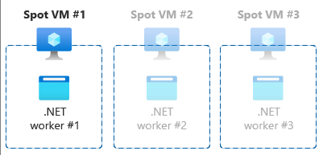
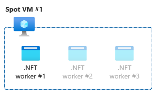

You can take advantage of Azure's unused capacity at a significant cost savings by using Spot [virtual machines](/azure/virtual-machines/overview) (VM) and [scale sets](/azure/virtual-machine-scale-sets/overview). However, at any point in time when Azure needs the capacity back, the Azure infrastructure will evict Azure Spot VMs. Therefore, This means that Azure Spot VMs should only be used for workloads that can handle interruptions like delayable batch or queue processing jobs, non-critical dev/test environments, and large, delayable compute workloads.

Azure Spot VM and scale sets do not have an SLA once created, which means that they can be terminated at any moment with *up to* 30 seconds of notice. Whenever Azure needs the capacity back, the Azure infrastructure will send your compute instance an eviction notice and proceed to evict that same instance based on your configured eviction policy.

This guide is meant to walk you through Azure Spot Eviction fundamentals and help you design a solution to support workload interruptions.

<!--- NOTE: Team will add a diagram here after publishing to further clarify this solution. --->

## Cost optimization

Azure provisions its spare capacity along all its offered regions so it can respond on demand when new resources are created. While that capacity remains idle, you have an opportunity to deploy VMs in your subscription at [discount prices and capped at pay-as-you-go prices using Azure Spot VMs and virtual machine scale sets](https://azure.microsoft.com/pricing/spot-advisor/).

Keeping operational expenses under control is common practice when running solutions on the cloud and the [cost optimizations pillar from the Well Architected Framework](/azure/architecture/framework/cost/overview) can help you find the right strategy for your architecture.

We recommend that you use the [Retail Rates Prices API](/rest/api/cost-management/retail-prices/azure-retail-prices) to get retail prices for all Azure services. You will want to get familiar with this pricing API, because it will be another input parameter to consider along with eviction rates based on location and SKUs.

For more details on how to plan with costs in mind, see [step 2 in the Planning section](https://github.com/mspnp/interruptible-workload-on-spot/blob/main/README.md#planning) of our implementation process.

## Purpose

While the number one reason to choose Azure Spot is the significant cost savings at the infrastructure level, keep in mind that you need to build reliable **interruptible** workloads that can run on top of this Azure managed service.

The goal is to design a workload that is fault tolerant and resilient, so that it's capable of being unexpectedly and reliably interrupted. Successful designs have workloads that are able to deal with high levels of uncertainty at the time of being deployed and can recover after being forcedly shut down. Even better, they can gracefully shut down with under 30 seconds of notice prior to eviction.

## Technology choice

Avoid using Azure Spot if:

- Your application is under a strict SLA that could be compromised by compute interruptions
- You're planning to provision sticky session solutions
- Your workload isn't specifically designed and tested to be interrupted
- Your workload is stateful by nature

If you find that Azure Spot is not the right service for you, go to [Choose an Azure compute service](/azure/architecture/guide/technology-choices/compute-decision-tree) for further assistance.

Some good candidates to run on top of Azure Spot VMs are:

- Batch processing applications
- Workloads that aren't time critical for background processing jobs
- Large workloads that aren't required to finish in a certain period of time (ex. data analytics)
- Tasks that are optional or have lower priority (ex. spawning a CI/CD agent for a dev/test environment)
- Short lived jobs that can lose their progress repeatedly without having an effect on the end result

Azure Virtual Machine Scale Sets are also offered with priority **Spot** and is an underlying service that will represent nodes for an Azure Kubernetes Service (AKS) cluster. As a result, stateless applications and opportunistic scale-out scenarios are possible candidates to build with Azure Spot [virtual machine scale sets](/azure/virtual-machine-scale-sets/overview) in mind if they're meant to run from an AKS cluster.

## Considerations

Azure Spot VM and scale sets are compute infrastructure as a service (IaaS) available in Azure that serves without an SLA once created. This means that it can be terminated at any moment with *up to* 30 seconds of notice. In other words, at any point in time when Azure needs the capacity back, the Azure infrastructure will evict the service by deallocating or deleting the resources based on your configured eviction policy.

You're acquiring unused (if any) ephemeral compute capacity that offers no high availability guarantees. Given that, Azure Spot VM and scale sets are a limited resource that won’t always be at your disposal and you should event prepare to overcome a potential scenario in which a VM is evicted right after being created.

### Deployment strategies

We recommend that any production workloads keep a guaranteed number of Azure VM instances with _regular_ priority in addition to VMs with _spot_ priority. This way you can optimize your costs and remain in compliance with your application SLA. If your workload is capable of being consistently interrupted and it doesn't need an SLA, you might consider going full _spot_ priority even in production. The following are some strategies to consider:

- The **Priority Swap** strategy consist of running Spot VMs initially. If after a considerable or safe amount of time you can't complete a job because it gets interrupted, then you would swap over to using regular VMs. An example of a good candidate for this type of strategy would be running automated tests (CI).
- The **Priority Balanced** strategy is good for getting a mix of regular and Spot VMs initially based on your workload requirements. There is a chance under extreme circumstances that you might never get an Azure Spot VM at all.

> [!CAUTION]
> At a macro level in production, it is especially important for you to anticipate and plan for evictions as they will greatly impact your performance. For example, if you have 100 Spot VMs allocated and you lose 10% of your capacity on compute as a result of an eviction, that is going to noticeably impact the overall throughput of your application.

## Spot VM states

When architecting interruptible workloads, it's important to understand the characteristics of the application platform you are running on. Azure Spot VM and scale sets instances will transition states and your workload must be able to behave accordingly. Considering these states and their transitions can help in the designing of your system. The diagram below visualizes the following states:

1. Stopped or Deleted (eviction policy based)
1. Running (based on capacity and max price you set)

The following table breaks down the expected outcome and state for a Spot VM based on the VMs current state, the input it receives from the Azure infrastructure, and the conditions you set (price limits and eviction policy).

| Current State  | Input   | Conditions                                                                     | Next State | Output                                                                                                               |
|----------------|---------|------------------------------------------------------------------------------- |------------|----------------------------------------------------------------------------------------------------------------------|
| *              | Deploy  | Max Price >= Current Price and Capacity = Available                            | Running    | You pay the Max Price you set and underlying disks                                                                  |
| Running        | Evict   | Max Price =  -1            and Capacity = Available                            | Running    | You pay the VM Price and underlying disks                                                                           |
| Running        | Evict   |                                Capacity = Unavailable and Policy = Deallocate  | Stopped     | Compute capacity gets deallocated while you pay for underlying disk. It's possible to restart the machine          |
| Running        | Evict   |                                Capacity = Unavailable and Policy = Delete      | Deleted    | You're not charged at this point since disks are deleted                                                            |
| Running        | Evict   | Max Price <  Current Price                            and Policy = Deallocate  | Stopped     | You pay for underlying disk and can restart the machine                                                             |
| Running        | Evict   | Max Price <  Current Price                            and Policy = Delete      | Delete     | You're not charged at this point since disks are deleted                                                            |
| Stopped         | Restart | Max Price <  Current Price                            and Policy = Deallocate  | Stopped     | You pay for underlying disk and can restart the machine                                                             |
| Stopped         | Restart | Max Price <  Current Price                            and Policy = Delete      | Delete     | You're not charged at this point since disks are deleted                                                            |
| Stopped         | Restart | Max Price >= Current Price and Capacity = Available                            | Running    | You pay the Max Price you set and underlying disks                                                                  |

> [!IMPORTANT]
> If a constraint capacity event occurs at a particular location and/or the current market price surpass the Max Price you set, the Azure infrastructure will collect its compute capacity for the Azure Spot VM according to your configured **Eviction Policy**. If you configured your Azure Spot VM for **deallocation** under an eviction event, it's the application operator's responsibility to automatically or manually restart the Azure Spot VM once the capacity becomes available.

## Concepts

There are several important considerations when architecting solutions on top of Azure Spot VM instances.

### Subscription Limits

The number of cores in a subscription are variable, depending on the subscription type and other considerations. Some subscription types aren't supported. Refer to [Azure subscription and service limits, quotas, and constraints](/azure/azure-resource-manager/management/azure-subscription-service-limits#virtual-machines-limits) for more information.

### Eviction

There are several conditions that affect an eviction. When architecting solutions to maximize cost optimization by using spot, having an understanding of what factors you'll be facing that cause interruption are important. The following list goes into detail on every element you should consider.

1. **Rate** - The rate is nothing more but the chances of being evicted at a specific location, based on historical trends. The eviction rates are available by SKU to help in compute sizing choices. To help with the selection process, query the [pricing history view in the Azure portal](/azure/virtual-machines/spot-vms#pricing-and-eviction-history) in addition to [Azure Spot advisor](https://azure.microsoft.com/pricing/spot-advisor/).

1. **Type** - You can choose between **Max Price or Capacity** or **Capacity Only**.

    1. **Capacity** - If the Azure infrastructure evicted and took back capacity, this configuration looks for spare capacity. If space capacity is located, the configuration will attempt to redeploy your deallocated instances on top of them. This configuration provides your Azure Spot virtual machines with better chances of surviving next time an eviction event kicks in.
    
        Your architecture is most likely to thrive with this type when you have built in intentional flexibility in VM SKU, operating region, and calendar/time.  Meaning your architecture and ops processes are explicitly designed with the intent that you will need to likely switch VM SKUs, regions, and/or pick up work at a later date/time.  Designing that flexibility into your architecture for this type of workload is recommended.

        1. VM Configuration: as flexible as choosing the SKU, the better are chances to allocate Azure Spot VM and scale sets. Some SKU(s) like B-series or Promo versions of any size aren't supported.
        1. Location: same as in SKU, if your workload can run from any region, it improves the chances to be deployed as well as with fewer chances of being deallocated if you choose carefully considering the eviction rates. Take into account that Microsoft Azure China 21Vianet isn't supported.
        1. Time of the day, weekends, seasons, and other time based considerations are important factors when making a final decision between Azure Spot over regular VMs and scale sets.

    1. **Current VM Price vs Max Price** (you set): if you're willing to pay up to the **Pay as you go** rate, it's possible to prevent being evicted based on pricing reasons by setting the **Max Price** to `-1`, which is known as **Eviction Type Capacity Only**. If pricing is a constraint for your business organization goals, **Eviction Type Max Price or Capacity Only** is recommended instead, and in this case you can adjust the right **Max Price** at any moment by taking into account that changing this value requires to deallocate the VM or scale set first to take effect. If you choose the latter, it's a good idea to analyze the price history, and **Eviction Rate** for the regions you're targeting.
    
    > [!NOTE]
    > If you have chosen a **Max Price and Capacity** eviction type, it is good practice to regularly use the [Azure Retail Prices API](/rest/api/cost-management/retail-prices/azure-retail-prices) to check whether the **Max Price** you set is doing well against **Current Price**. Consider scheduling this query and respond with Max Price changes as well as gracefully deallocating the Virtual Machine as needed.

1. **Policy** - The Policy configuration is an important consideration during eviction events. We recommend to choose the **Deallocate** policy if you are planning to start the same machine, provided your workload can wait for Azure to release capacity within the same location and SKU. Alternatively, we recommend the **Delete** policy to reduce costs, since you would be re-deploying your entire Spot infrastructure on demand, ideally changing location and/or SKU for more flexibility.

    1. Delete
        1. You free up the Cores from your Subscription
        1. You're no longer charged for the disk as they get deleted along with the Azure Spot VM
        1. Shared subscriptions or multiple workloads using Azure Spot VM instances can befitted from this policy
    1. Deallocate
        1. Change VM state to the stopped-deallocated state
        1. Allows you to redeploy it later
        1. You're still being charge for the underlying disks
        1. It consumes Cores quota from your Subscription

1. **Simulation** - It's possible to [simulate an eviction event](/azure/virtual-machines/spot-portal#simulate-an-eviction.md) when Azure needs the capacity back. We recommend you become familiar with this concept so that you can simulate interruptions from dev/test environments to guarantee your workload is fully interruptible before deploying to production.

### Events

[Azure Scheduled Events](/azure/virtual-machines/windows/scheduled-events.md) is a metadata service in Azure that signal about forthcoming events associated to the Virtual Machine resource type. The general recommendation when using Virtual Machines is to routinely query this endpoint to discover when maintenance will occur, so you're given the opportunity to prepare for disruption. One of the platform event types being scheduled that you'll want to notice is `Preempt` as this signals the imminent eviction of your spot instance. This event is scheduled with a minimum amount of time of 30 seconds in the future. Given that, you must assume that you're going to have less than that amount of time to limit the impact. The recommended practice here is to check this endpoint based on the periodicity your workload mandates (every 10 seconds) to attempt having a graceful interruption.

## The Workload

One workload types to consider for Azure Spot VMs are [Batch processing apps](/azure/batch). The reference implementation guide contains a simple asynchronously queue-processing worker (C#, .NET) implemented in combination with [Azure Queue Storage](/azure/storage/queues/storage-queues-introduction). This guide demonstrates how to query the [Azure Scheduled Events REST](/virtual-machines/linux/scheduled-events) endpoint. The endpoint allows your workload to receive a signal prior to eviction so that it can anticipate the disruption event, prepare for the interruption, and limit its impact.

### Planning for being Fault Tolerant

#### Application states

When building reliable and interruptible workloads, you'll be focused on four main stages during the workload lifecycle. These stages will translate into changes of states within your application.

1. **Start**: After the application `warmup` state is completed, you could consider internally transitioning into the `processing` state. One important thing to consider is if there was a forced shutdown previously, then there might be some incomplete processing and we recommend that you implement idempotency as applicable. Additionally, it's good practice to save the context by creating checkpoints regularly. Doing so will create a more efficient recovery strategy, which is to recover from the latest well-known checkpoint instead of starting all over on processing.

1. **Shutdown**: Your application is in the `processing` state and at the same time an eviction event is triggered by the Azure infrastructure. Compute capacity must be collected from Azure Spot instances, and as a result, an eviction notice will take place in your application. At this time, your application will change its state to `evicted` and implement the logic that responds to the eviction notice. It will gracefully shut down within 30 secs by releasing resources such us draining connections and event logging, or it will prepare to be forcedly deallocated or deleted based on your **Eviction Policy**. In the latter configuration, as a general rule, you can't persist any progress or data on the file system, because disks are being removed along with the Azure VM.

1. **Recover**: In this stage, your workload is `redeployed` or `recreated` depending on your **Eviction Policy**. During recovery, these possible states are detected based on your scenario. You can implement the logic to deal with a prior forced shutdown, so your application is able to recover from a previous backup or checkpoint if necessary.

1. **Resume**: The application is about to continue processing after a best effort to recover the context prior to eviction. It's good idea to transition into a `warmup` state to ensure the workload is healthy and ready to start.

<!--- diagram here --->

> [!NOTE]
> The aforementioned states are just a reduced list of possible valid conditions for a reliable interruptible workload. You might find other states that are convenient for your own workloads.

#### System states

In the reference implementation you'll notice we're using a **Distributed Producer Consumer** system type, where the interruptible workload is nothing but a batch processing app acting as the consumer. Since you're mainly considering Azure Spot VMs to save costs, we recommend looking into the issues that can arise with this kind of solution and get them mitigated to avoid wasting compute cycles. One example is the concurrency problems we show below.

1. Deadlock
1. Starvation

In general, we recommend that you always take edge cases and common pitfalls associated to the system types you're building into account. Design their architectures to be good citizens while running on top of Azure Spot VMs.

> [!NOTE]
> The reference implementation follows the simple concurrency strategy: **Do-Nothing**. Since you're going to deploy a single interruptible workload instance (consumer) and produce a moderate and discrete amount of messages, do not expect a `Deadlock` or `Starvation` as system states. One recommendation to prevent your system from running into such states is to consider handling them if detected at the time of **Orchestration** as another mitigation strategy. However, we will not explore that process in the reference implementation.

#### Orchestration

As mentioned in the previous section, the orchestration can be scoped to coordinate at the application level or beyond to implement broader capabilities, like system recovery. However, the reference implementation is focused specifically on scheduling the interruptible workload into the Azure Spot VM operating system, thereby executing the worker app at the VM startup time.

It will be helpful to kick off the application after eviction or the first time the Azure Spot VM gets deployed. This way, the application will be able to continue processing messages without human intervention from the queue once started. Once the application is running, it will transition through the `Recover`, `Resume`, and `Start` application stages.

By design, the orchestration could have more or less responsibilities like running after the machine has started up, downloading the workload package from an Azure Storage Account, decompressing files, executing the process, coordinating how many instances are going to be running in parallel, system recovery, and more. In the reference implementation, [the orchestration](https://github.com/mspnp/interruptible-workload-on-spot/blob/main/orchestrate.sh) scope is for installing and uninstalling purposes only. The interruptible workload is installed as a Linux service and the operating system is in charge of resuming your workload after the VM gets redeployed (restarted) if you have configured **Eviction Policy Type Deallocate**.

<!--- diagram here --->

Another important orchestration related aspect to understand is how to scale your workload within a single VM instance, so it's more resource efficient.

- **Scale up strategy**

    In the reference implementation, your workload is built with no artificial constraints and will grow to consume available resources in your VM instance without exhausting them. From the orchestration point of view, you want to ensure that it's running a SINGLETON of the workload and let it organically request resources as designed.

    <!--- diagram here --->
    

- **Scale out strategy**

    Alternatively, if the workload resources specs are limited by design and it can't grow to consume VM resources, ensure your VM is the right size to orchestrate multiple whole instances of your workload. Doing so will ensure there's no wasted over-provisioning of compute resources in your Spot VM.  This will impact your workload orchestration strategy.

    

## Deploy this solution

 An implementation of this guidance is available on [GitHub: Interruptible workloads on Azure Spot VM/VMSS instances](https://github.com/mspnp/interruptible-workload-on-spot). You can use that implementation to explore the topics addressed above in this article.

## Next step

* See the Azure Well-Architected Framework's [cost optimization guidance for Virtual Machines](/azure/architecture/framework/services/compute/virtual-machines/virtual-machines-review#cost-optimization).
* Explore [VM Applications](/azure/virtual-machines/vm-applications) as part of your workload orchestration.