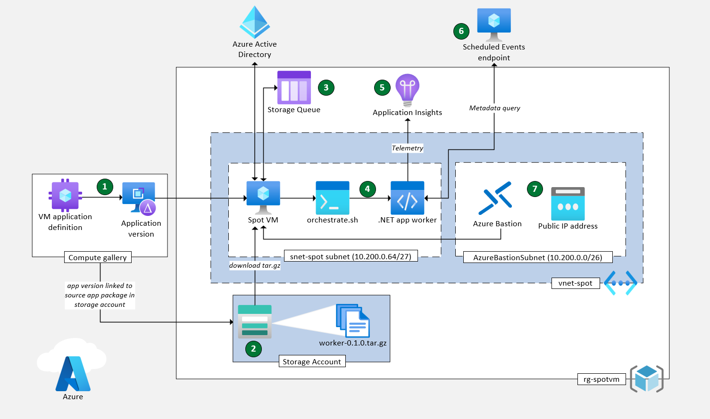

Spot VMs provide access to compute resources at significant discounts and are an attractive solution for cost savings. In this article, you'll learn how to architect interruptible workloads with Azure Spot virtual machines (VMs). The cost-saving potential of Spot VMs creates a range of new possibilities. 

The goal of this article is to help you harness those possibilities. It's important to understand what Spot VMs are and identify the right workload candidates. Spots VMs are only recommended for interruptible workloads. Hosting interruptible workloads on Spot VMs requires knowledge of eviction, pricing, and orchestration best practices.

## Understand Spot VMs

A VM is a package with an operating system, bins/libs, and application(s). It runs on servers in an Azure datacenter. These servers have a hypervisor that creates and manages VMs. The severs and hypervisor provide the *compute capacity*.

**(1) No SLA once created** - Spot VMs don't have an SLA once created. They can lose access to compute capacity at any time. The loss of access to compute capacity is called an eviction. Spot VMs are cheaper because of the eviction possibility. Whenever Azure needs the capacity back, an eviction notice will be sent and evict the VM based on the eviction policy. The time between the eviction notice and the eviction is only up to 30 seconds.

**(2) Low priority access** - The only different between a pay-as-you-go VM and a spot VM is its access priority to compute capacity. Spot VMs have low-priority access to compute resources. Pay-as-you-go VMs have high-priority access and VMs get priority access to compute resources. Spot VMs can only use spare compute capacity. Spot VMs use whatever high-priority VMs don't. The measurement of compute capacity is at the datacenter/zone level, not region. Zone 1 could have no compute capacity while Zones 2 and 3 in the same region have plenty. Spot VMs will only deploy and persist where there's spare compute capacity. High-priority VMs can take compute resources from active Spot VMs.

## Understand interruptible workloads

Spot VMs great for interruptible workloads. Interruptible workloads run processes that can be interrupted and resumed without harming essential capabilities. have minimal time constraints, priority, and processing times. Some examples are:

- Message queue
- Batch processing applications
- Background processing
- Data analytics
- CI/CD agent for a dev/test

Spot VMs shouldn’t be the single source of compute capacity for non-interruptible workloads. These feature of non-interruptible workloads:

- Service level agreements (SLAs)
- Sticky sessions requirements
- Stateful workloads

## Understand eviction

 An eviction is when access to compute resources is revoked. Spot VMs have two configuration options that affect eviction. You set the *eviction type* and *eviction policy* when you create Spot VMs. *Eviction type* determines when eviction occurs. *Eviction policy* determines what eviction does.

Let's address each type in more detail.

**(1) Eviction type** - There are two causes of eviction: capacity changes and price change. The way these affect spot VMs depends on the eviction type chosen when you create the spot VM. Eviction type defines the general conditions of eviction. There are two eviction types: *capacity only* and *price or capacity*.

- ***Capacity only eviction*** - The *capacity only eviction* type triggers an eviction occurs when excess capacity disappears. Use the *capacity only eviction* type to create more reliability.
- ***Price or capacity eviction*** - The *price or capacity eviction* type triggers an eviction when excess capacity disappears or the cost of the VM exceeds your max price. When you create spot VM, you set a maximum price. The *price or capacity eviction* type accounts for the maximum price and triggers and eviction even if capacity exists. Use the *price or capacity eviction* type to save more money.

**(2) Eviction policy** - The eviction policy chose for a spot VM affects how its orchestration. There are two types of eviction policies: *Stop/Deallocate* and *Delete*.

- ***Stop/Deallocate policy*** - The *Stop/Deallocate* policy puts the VM in the stopped-deallocated state. The VM remains but loses non-static IP addresses and access to compute capacity. The data disks remains and incurs charges. The VM still occupies cores in the subscription. VMs cannot be moved from their region or zone even the stopped/deallocated state. So the *Stop/Deallocate* eviction policy is best when the workload can wait for release capacity within the same location and VM type.
- ***Delete policy*** - The *Delete* policy deletes the VM and data disk. It doesn't occupy cores in subscriptions. Deleting a VM allows it a replacement to be deployed where there's immediate capacity. Use the "Delete" policy if the workload can change location and VM type.

For more information, see [eviction policy](/azure/virtual-machines/spot-vms#eviction-policy).

## Understand spot price

The Spot VMs discount depends on VM size, region of deployment, and operating system. The price of spot VMs fluctuates with demand. The table below gives examples of the cost difference between spot VMs and pay-as-you-go VMs:

| VM size | OS | Region | Spot price (USD) | Pay-as-you-go price (USD) |
| --- | --- | --- | --- | --- |
|**D1 v2** | Windows   RHEL | East US West US  East US West US | $55.15 $18.93  $65.11 $50.81 | $91.98 $91.98  $97.09 $94.90
|**E2a v4**| Windows   RHEL | East US West US  East US West US | $23.87 $25.40  $53.00 $54.02 | $159.14 169.36  $135.78 $146.00|

For more information, see:

- [Spot VM pricing](/azure/virtual-machines/spot-vms#pricing)
- [Spot VM pricing tool](https://azure.microsoft.com/pricing/spot-advisor/)

## Recommendations

## Design for flexibility

Workloads on Spot VMs need flexibility. You should design your architecture to switch VM types, VM sizes, regions, zone, and resume work later. We recommend identifying a few VM types that have the power to run the application and fit within budget constraints. It will give your orchestration more options to choose from and find spare compute capacity faster.

**DO YOU RECOMMEND DELETION EVICTION POLICY TO INCREASE FLEXIBILITY?**

### Prepare for immediate eviction

**WE NEED TO PROVIDE REOMMENDATIONS FOR IMMEDIATE EVICTION**

## Plan for multiple simultaneous evictions

You should architect the workload to withstand multiple simultaneous evictions. The workload could lose 10% compute capacity, and it will have a significant effect on the throughput of the application.

## Implement CI/CD

**WHAT RECOMMENDATIONS DO YOU HAVE TO SET UP CI/CD?**

### Set up telemetry

Telemetry is the key to workload reliability on Spot VMs. Spot VMs are unreliable. They can be evicted at any time. The only way to have reliability with Spot VMs is knowing when they're going to be evicted.

Each VM in Azure has an endpoint that lets you know when a VM is going to be evicted. The Azure Metadata Service provides a queryable endpoint that indicates an upcoming eviction. The endpoint sends out the `Preempt` signal about 30 seconds before an eviction.

Any interruptible workload running on Spot VMs needs to query these metadata endpoints every 10 seconds or less to provide sufficient time for a graceful interruption. The endpoints are an API queryable from a static, non-routable IP address.

For more information, see:

- [Scheduled events](/azure/virtual-machines/windows/scheduled-events)
- [Application Insights telemetry](/azure/azure-monitor/app/data-model)

### Ensure a graceful shutdown

An ideal shutdown implements logic to shutdown in under 10 seconds. The shutdown process should release resources, drain connections, and flush event logs. It's good practice to save the context by creating checkpoints regularly. Doing so will create a more efficient recovery strategy, which is to recover from the latest well-known checkpoint instead of starting all over on processing.

### Build indempotent consumers

We recommend designing idempotent consumers. Evictions can lead to forced shutdowns despite efforts to ensure graceful shutdowns. Forced shutdowns can terminate processes before completion. Idempotent consumers can receive the same message more than once and the outcome remains the same.

For more information, see [idempotency](/azure/architecture/serverless/event-hubs-functions/resilient-design#idempotency).

**Any special considerations for Spot VMs or do the general rules of idempotency apply?**

### Orchestrate eviction recovery

Recovery is the process of replacing a Spot VM after an eviction. Application architecture and logic should be able to recover from a previous backup or checkpoint if necessary.

The eviction policy of the evicted Spot VM affects the replacement process.

**(1) Replace VMs** - You'll need a plan to replace evicted VMs. The plan has to account for the eviction policy of the VM. A Spot VM with a *Stop/Deallocate policy* will need to be reallocated. A Spot VM with a *Delete policy* will need to be recreated. The different between reallocation and recreation affect when and where Spot VM replacements

***When using an Azure Spot Instance, what is the best way to have it reallocate when it is evicted?***

- ***Stopped / Deallocated VM*** - A stopped / deallocated Spot VM remains accessible in Azure. The Spot VM package (OS, bins/libs, app) has been removed from a physical compute resource, but the VM package remains in Azure. You cannot move VMs between datacenters/zones. The reallocation of a stopped / deallocated VM has to be in the same region and zone it was in. You can replicate, deploy, and delete to simulate movement.

If your workload was designed around **deallocate** then you'll need a mechanism to be made aware of when your compute instance can come back online. **WHAT MECHANISM DO YOU RECOMMEND?**

- ***Deleted VM*** - A deleted Spot VM is removed from Azure. A replacement needs to be *created*, not just reallocated to a compute resource. Deletion allows the orchestration to deploy replacement spot VMs to new zones and regions. This deployment flexibility can help your workload find spare compute capacity faster than a stopped / deallocated VM. Stopped / deallocated VMs have to wait for spare compute capacity in the same zone it was created in. You'll need a process to monitor for evictions external to the application and initiative remediation by deploying to alternative regions or SKUs.

**(2) Conduct health check** - It's a good idea to transition into a warmup state to ensure the workload is healthy and ready to start. After the application *warmup* state is completed, you could consider internally transitioning into the *processing* state.

### Conduct testing

We recommend simulating eviction events to test orchestration in dev/test environments.

For more information, see [simulate eviction](/azure/virtual-machines/linux/spot-cli#simulate-an-eviction).

## Example scenario

The example scenario is for a queue processing application. It uses a producer-consumer dataflow. The scripts in the scenario are illustrative. They aren't the key to success on SpotVMs. The most important aspect of the example is the continuous integration / continuous development (CI/CD) pipeline to orchestrate the spot VMs. The scenario does a one-time push to deploy the ARM template for the example, but a push/pull mechanism should be in place to enable orchestration.

The bicep template deploys an Ubuntu image (22_04-lts-gen2) on a Standard_D2s_v3 VM with a premium managed disk and local redundant storage (LRS). These configurations meet the needs of this application and aren't general recommendations for your applications.

1. **VM application definition:** The VM application definition is created in the Azure Compute Gallery. It defines the application name, location, operating system, and metadata.
1. **Application version:** The application version is a numbered version of the VM application definition. The application version is an instantiation of the VM application. It needs to be in the same region as the spot VM.
1. **Storage account:**  The storage account holds the source application package `worker-0.1.0.tar.gz`. The tar.gz file contains the `orchestrate.sh` file.
1. **Spot VM:** The spot VM deploys. It must be in the same region as the application version.
1. **Source application package:** The application version links to the source application package in the storage account. It downloads `worker-0.1.0.tar.gz` to the VM after deployment and installs the .NET worker application.
1. **.Net worker application:** The orchestrate.sh script installs a .NET worker application that runs two background services.
1. **Query metadata endpoint:** An API request is sent to a static non-routable IP address 169.254.169.254​ in the VM. The API request queries the metadata endpoint for the VM from the Metadata Service endpoint.
1. **Application Insights:** The listens for the preempt eviction signal. For more information, see [enable live metrics from .NET application](/azure/azure-monitor/app/live-stream#enable-live-metrics-using-code-for-any-net-application).
1. **Storage Queue:** The other service running in the .NET worker contains message queue logic.
1. **Azure AD:** Grants access the spot VM access to the storage queue with a user assigned identity using RBAC.

**WHERE SHOULD 9 AND 10 GO? I THOUGHT YOU SAID THIS WAS A MQ APP? I'M NOT SURE HOW THE QUEUE FACTORS IN. I WOULD ASSUME IT HOLDS SOME STATEFUL INFORMATION FOR IDEMPOTENCY BUT WE HAVEN'T REALLY GO INTO THAT YET**

## Deploy this scenario

An implementation of this guidance is available on [GitHub: Interruptible workloads on Azure Spot VM](https://github.com/mspnp/interruptible-workload-on-spot). You can use that implementation to explore the topics addressed above in this article.

## Next step

 See the Azure Well-Architected Framework's [cost optimization guidance for Virtual Machines](/azure/architecture/framework/services/compute/virtual-machines/virtual-machines-reviewcost-optimization).
 Explore [VM Applications](/azure/virtual-machines/vm-applications) as part of your workload orchestration.

## Extra content

### Spot VM states

The diagram below visualizes the following states:

- Stopped or Deleted (eviction policy based)
- Running (based on capacity and max price you set)

| Current State  | Input   | Conditions                                                                     | Next State | Output                                                                                                               |
|----------------|---------|------------------------------------------------------------------------------- |------------|----------------------------------------------------------------------------------------------------------------------|
| *              | Deploy  | Max Price >= Current Price and Capacity = Available                            | Running    | You pay the Max Price you set and underlying disks                                                                  |
| Running        | Evict   | Max Price =  -1            and Capacity = Available                            | Running    | You pay the VM Price and underlying disks                                                                           |
| Running        | Evict   |                                Capacity = Unavailable and Policy = Deallocate  | Stopped     | Compute capacity gets deallocated while you pay for underlying disk. It's possible to restart the machine          |
| Running        | Evict   |                                Capacity = Unavailable and Policy = Delete      | Deleted    | You're not charged at this point since disks are deleted                                                            |
| Running        | Evict   | Max Price <  Current Price                            and Policy = Deallocate  | Stopped     | You pay for underlying disk and can restart the machine                                                             |
| Running        | Evict   | Max Price <  Current Price                            and Policy = Delete      | Delete     | You're not charged at this point since disks are deleted                                                            |
| Stopped         | Restart | Max Price <  Current Price                            and Policy = Deallocate  | Stopped     | You pay for underlying disk and can restart the machine                                                             |
| Stopped         | Restart | Max Price <  Current Price                            and Policy = Delete      | Delete     | You're not charged at this point since disks are deleted                                                            |
| Stopped         | Restart | Max Price >= Current Price and Capacity = Available                            | Running    | You pay the Max Price you set and underlying disks                                                                  |

- **Simulation** - It's possible to [simulate an eviction event](/azure/virtual-machines/spot-portal#simulate-an-eviction.md) when Azure needs the capacity back. We recommend you become familiar with this concept so that you can simulate interruptions from dev/test environments to guarantee your workload is fully interruptible before deploying to production.

### Events

[Azure Scheduled Events](/azure/virtual-machines/windows/scheduled-events) is a metadata service in Azure that signal about forthcoming events associated to the Virtual Machine resource type. The general recommendation when using Virtual Machines is to routinely query this endpoint to discover when maintenance will occur, so you're given the opportunity to prepare for disruption. One of the platform event types being scheduled that you'll want to notice is `Preempt` as this signals the imminent eviction of your spot instance. This event is scheduled with a maximum amount of time of 30 seconds in the future. Given that, you must assume that you're going to have less than that amount of time to limit the impact to your running workload. The recommended practice here is to check this endpoint based on the periodicity your workload mandates (such as every 10 seconds) to attempt having a graceful interruption.

## The workload

One common workload type for Azure Spot VMs is queue processing applications. The reference implementation guide contains a simple, asynchronous queue-processing worker (C#, .NET) implemented in combination with [Azure Queue Storage](/azure/storage/queues/storage-queues-introduction). This implementation demonstrates how to query the [Azure Scheduled Events REST](/azure/virtual-machines/linux/scheduled-events) endpoint, as mentioned above.

### Planning for workload interruption

#### Application states

When architecting reliable and interruptible workloads, you'll want to focus on four main stages during the workload's lifecycle. These stages will translate into changes of states within your application.

- **Start**: After the application _warmup_ state is completed, you could consider internally transitioning into the _processing_ state. One important thing to consider is if there was a forced shutdown previously, then there might be some incomplete processing and we recommend that you implement idempotency as applicable. Additionally, it's good practice to save the context by creating checkpoints regularly. Doing so will create a more efficient recovery strategy, which is to recover from the latest well-known checkpoint instead of starting all over on processing.

- **Shutdown**: Your application is in the _processing_ state and at the same time an eviction event is triggered by the Azure infrastructure. Compute capacity must be collected from Azure Spot instances, and as a result, an eviction notice will take place in your VM instance, which your application was actively monitoring for. At this time, your application will change its state to _evicted_ and implement the logic you've programmed that responds to the eviction notice. It will gracefully shut down in under 30 seconds (best to target 10 or less seconds) by releasing resources such as draining connections and event log flushing, or it will prepare to be forcedly deallocated or deleted based on your **Eviction Policy**. In the latter configuration, as a general rule, you can't persist any progress or data on the file system, because disks are being removed along with the Azure VM.

- **Recover**: In this stage, your workload is _redeployed_ or _recreated_ depending on your **Eviction Policy**. During recovery, these possible states are detected based on your scenario. You can implement the logic to deal with a prior forced shutdown, so your application is able to recover from a previous backup or checkpoint if necessary.

- **Resume**: The application is about to continue processing after a best effort to recover the context prior to eviction. It's a good idea to transition into a _warmup_ state to ensure the workload is healthy and ready to start.

> [!NOTE]
> The aforementioned states are just a reduced list of possible conditions for a reliable interruptible workload. You might find other states that are convenient for modeling the lifecycle of your own workloads.

#### System states

The implementation uses a **Distributed Producer Consumer** system type, where the interruptible workload represents a batch processing application acting as the consumer. Since you'd mainly consider Azure Spot VMs for cost optimization, we recommend looking into the issues that can arise with this kind of solution and architect mitigations to avoid wasting excess compute cycles. One class of examples would be concurrency problems.

* [Deadlock](https://wikipedia.org/wiki/Producer%E2%80%93consumer_problem)
* [Starvation](https://wikipedia.org/wiki/Scheduling_(computing)#Scheduling_disciplines), by evaluating which scheduling system you're using and avoiding a solution would lead to starvation. For example, a fixed-priority preemptive scheduling system isn't advised for max priority queues that are never expected to be emptied.

In general, we recommend that you always take edge cases and common pitfalls associated to the system types you're building into account. Design their architectures to maximize the system type's expected behavior will benefit while running on top of Azure Spot VMs.

> [!NOTE]
> The reference implementation follows the simple concurrency strategy: **do nothing**. Since you're going to deploy a single interruptible workload instance (consumer) and produce a moderate and discrete number of messages, there would be no expectations of a deadlock or starvation as a system state. One recommendation to prevent your system from running into such states is to consider handling them if detected at the time of workload orchestration.

#### Orchestration

Orchestration in this context is about workload recovery after eviction.  Your choice of **delete** or **deallocate** will influence how you architect your solution to "resume operations" after your instance(s) have been evicted.  If your workload was designed around **delete** you'll need a process to monitor for evictions external to the application and initiative remediation by deploying to alternative regions or SKUs.  

Either way, the end goal is the same.  The interruptible workload begins executing on an Azure Spot VM at startup time.

It will be helpful to kick off the application after eviction or the first time the Azure Spot VM gets deployed. This way, the application will be able to continue processing messages without human intervention from the queue once started. Once the application is running, it will transition through the `Recover`, `Resume`, and `Start` application stages.

By design, the orchestration could have more or less responsibilities like running after the machine has started up, downloading the workload package from an Azure Storage Account, decompressing files, executing the process, coordinating how many instances are going to be running in parallel, system recovery, and more.

Consider using [VM Applications](/azure/virtual-machines/vm-applications) to package and distribute your interruptible workloads as part of your orchestration process. This mechanism allows for VMs to be defined, declaratively, with the specific workload in mind.  Using VM Applications can simplify your pipelines and provide a helpful separation of concerns between the management of Spot VM instances and the instantiation of the workload on those instances.  The implementation in GitHub demonstrates this.

Another important orchestration related aspect to understand is how to scale your workload within a single VM instance, so it's using its resources efficiently.  Many workloads will span multiple VMs, but this guidance is still applicable to each VM within that system.

- **Scale up strategy**

    If your workload is built with no artificial constraints and it will grow to consume available resources in your VM instance without exhausting them. You'll want to ensure that it's running a singleton of the workload and let it organically request resources as designed. If you design your application to consume all available resources, this will give you compute SKU flexibility to include smaller or larger SKUs in your application.  You may find running mixed SKUs in your solution common.

    

- **Scale out strategy**

    Alternatively, if the workload resources specs are limited by design and it can't grow to consume VM resources, ensure your VM is the right size to orchestrate multiple whole instances of your workload. Doing so will ensure there's no wasted over-provisioning of compute resources in your Spot VM.  This will impact your workload orchestration strategy.

    
