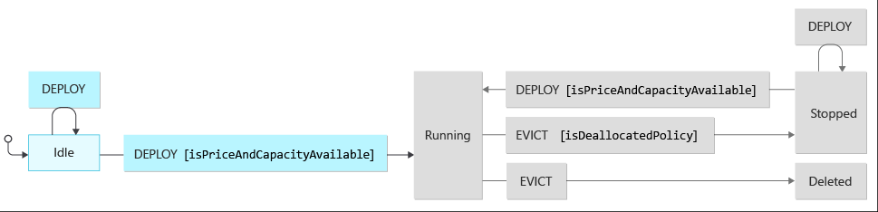

## What is this article about

Show you how best practices for building workloads on Azure spot virtual machines. These workloads must be interruptible.
They must be

## Why use spot vms

## When should you use spot vms

Avoid using Azure Spot if:

- Service level agreements (SLAs)
- Sticky sessions
- Stateful workload

Aren't time critical, lower priority, short processing times

Examples:

- Batch processing applications
- Background processing
- Data analytics
- CI/CD agent for a dev/test

## How to use spot VMs

- **Priority Swap** strategy consist of running Spot VMs and swapping to regular VMs. Examples:
    - running automated tests (CI).
- **Priority Balanced** mix regular and Spot VMs. might never get an Azure Spot VM at all.

### Spot VM states

The diagram below visualizes the following states:

- Stopped or Deleted (eviction policy based)
- Running (based on capacity and max price you set)

| Current State  | Input   | Conditions                                                                     | Next State | Output                                                                                                               |
|----------------|---------|------------------------------------------------------------------------------- |------------|----------------------------------------------------------------------------------------------------------------------|
| *              | Deploy  | Max Price >= Current Price and Capacity = Available                            | Running    | You pay the Max Price you set and underlying disks                                                                  |
| Running        | Evict   | Max Price =  -1            and Capacity = Available                            | Running    | You pay the VM Price and underlying disks                                                                           |
| Running        | Evict   |                                Capacity = Unavailable and Policy = Deallocate  | Stopped     | Compute capacity gets deallocated while you pay for underlying disk. It's possible to restart the machine          |
| Running        | Evict   |                                Capacity = Unavailable and Policy = Delete      | Deleted    | You're not charged at this point since disks are deleted                                                            |
| Running        | Evict   | Max Price <  Current Price                            and Policy = Deallocate  | Stopped     | You pay for underlying disk and can restart the machine                                                             |
| Running        | Evict   | Max Price <  Current Price                            and Policy = Delete      | Delete     | You're not charged at this point since disks are deleted                                                            |
| Stopped         | Restart | Max Price <  Current Price                            and Policy = Deallocate  | Stopped     | You pay for underlying disk and can restart the machine                                                             |
| Stopped         | Restart | Max Price <  Current Price                            and Policy = Delete      | Delete     | You're not charged at this point since disks are deleted                                                            |
| Stopped         | Restart | Max Price >= Current Price and Capacity = Available                            | Running    | You pay the Max Price you set and underlying disks                                                                  |

- **Simulation** - It's possible to [simulate an eviction event](/azure/virtual-machines/spot-portal#simulate-an-eviction.md) when Azure needs the capacity back. We recommend you become familiar with this concept so that you can simulate interruptions from dev/test environments to guarantee your workload is fully interruptible before deploying to production.

### Events

[Azure Scheduled Events](/azure/virtual-machines/windows/scheduled-events) is a metadata service in Azure that signal about forthcoming events associated to the Virtual Machine resource type. The general recommendation when using Virtual Machines is to routinely query this endpoint to discover when maintenance will occur, so you're given the opportunity to prepare for disruption. One of the platform event types being scheduled that you'll want to notice is `Preempt` as this signals the imminent eviction of your spot instance. This event is scheduled with a maximum amount of time of 30 seconds in the future. Given that, you must assume that you're going to have less than that amount of time to limit the impact to your running workload. The recommended practice here is to check this endpoint based on the periodicity your workload mandates (such as every 10 seconds) to attempt having a graceful interruption.

## The workload

One common workload type for Azure Spot VMs is queue processing applications. The reference implementation guide contains a simple, asynchronous queue-processing worker (C#, .NET) implemented in combination with [Azure Queue Storage](/azure/storage/queues/storage-queues-introduction). This implementation demonstrates how to query the [Azure Scheduled Events REST](/azure/virtual-machines/linux/scheduled-events) endpoint, as mentioned above.

### Planning for workload interruption

#### Application states

When architecting reliable and interruptible workloads, you'll want to focus on four main stages during the workload's lifecycle. These stages will translate into changes of states within your application.

- **Start**: After the application _warmup_ state is completed, you could consider internally transitioning into the _processing_ state. One important thing to consider is if there was a forced shutdown previously, then there might be some incomplete processing and we recommend that you implement idempotency as applicable. Additionally, it's good practice to save the context by creating checkpoints regularly. Doing so will create a more efficient recovery strategy, which is to recover from the latest well-known checkpoint instead of starting all over on processing.

- **Shutdown**: Your application is in the _processing_ state and at the same time an eviction event is triggered by the Azure infrastructure. Compute capacity must be collected from Azure Spot instances, and as a result, an eviction notice will take place in your VM instance, which your application was actively monitoring for. At this time, your application will change its state to _evicted_ and implement the logic you've programmed that responds to the eviction notice. It will gracefully shut down in under 30 seconds (best to target 10 or less seconds) by releasing resources such as draining connections and event log flushing, or it will prepare to be forcedly deallocated or deleted based on your **Eviction Policy**. In the latter configuration, as a general rule, you can't persist any progress or data on the file system, because disks are being removed along with the Azure VM.

- **Recover**: In this stage, your workload is _redeployed_ or _recreated_ depending on your **Eviction Policy**. During recovery, these possible states are detected based on your scenario. You can implement the logic to deal with a prior forced shutdown, so your application is able to recover from a previous backup or checkpoint if necessary.

- **Resume**: The application is about to continue processing after a best effort to recover the context prior to eviction. It's a good idea to transition into a _warmup_ state to ensure the workload is healthy and ready to start.

> [!NOTE]
> The aforementioned states are just a reduced list of possible conditions for a reliable interruptible workload. You might find other states that are convenient for modeling the lifecycle of your own workloads.

#### System states

The implementation uses a **Distributed Producer Consumer** system type, where the interruptible workload represents a batch processing application acting as the consumer. Since you'd mainly consider Azure Spot VMs for cost optimization, we recommend looking into the issues that can arise with this kind of solution and architect mitigations to avoid wasting excess compute cycles. One class of examples would be concurrency problems.

* [Deadlock](https://wikipedia.org/wiki/Producer%E2%80%93consumer_problem)
* [Starvation](https://wikipedia.org/wiki/Scheduling_(computing)#Scheduling_disciplines), by evaluating which scheduling system you're using and avoiding a solution would lead to starvation. For example, a fixed-priority preemptive scheduling system isn't advised for max priority queues that are never expected to be emptied.

In general, we recommend that you always take edge cases and common pitfalls associated to the system types you're building into account. Design their architectures to maximize the system type's expected behavior will benefit while running on top of Azure Spot VMs.

> [!NOTE]
> The reference implementation follows the simple concurrency strategy: **do nothing**. Since you're going to deploy a single interruptible workload instance (consumer) and produce a moderate and discrete number of messages, there would be no expectations of a deadlock or starvation as a system state. One recommendation to prevent your system from running into such states is to consider handling them if detected at the time of workload orchestration.

#### Orchestration

Orchestration in this context is about workload recovery after eviction.  Your choice of **delete** or **deallocate** will influence how you architect your solution to "resume operations" after your instance(s) have been evicted.  If your workload was designed around **delete** you'll need a process to monitor for evictions external to the application and initiative remediation by deploying to alternative regions or SKUs.  If your workload was designed around **deallocate** then you'll need a mechanism to be made aware of when your compute instance can come back online.

Either way, the end goal is the same.  The interruptible workload begins executing on an Azure Spot VM at startup time.

It will be helpful to kick off the application after eviction or the first time the Azure Spot VM gets deployed. This way, the application will be able to continue processing messages without human intervention from the queue once started. Once the application is running, it will transition through the `Recover`, `Resume`, and `Start` application stages.

By design, the orchestration could have more or less responsibilities like running after the machine has started up, downloading the workload package from an Azure Storage Account, decompressing files, executing the process, coordinating how many instances are going to be running in parallel, system recovery, and more.

Consider using [VM Applications](/azure/virtual-machines/vm-applications) to package and distribute your interruptible workloads as part of your orchestration process. This mechanism allows for VMs to be defined, declaratively, with the specific workload in mind.  Using VM Applications can simplify your pipelines and provide a helpful separation of concerns between the management of Spot VM instances and the instantiation of the workload on those instances.  The implementation in GitHub demonstrates this.

Another important orchestration related aspect to understand is how to scale your workload within a single VM instance, so it's using its resources efficiently.  Many workloads will span multiple VMs, but this guidance is still applicable to each VM within that system.

- **Scale up strategy**

    If your workload is built with no artificial constraints and it will grow to consume available resources in your VM instance without exhausting them. You'll want to ensure that it's running a singleton of the workload and let it organically request resources as designed. If you design your application to consume all available resources, this will give you compute SKU flexibility to include smaller or larger SKUs in your application.  You may find running mixed SKUs in your solution common.

    

- **Scale out strategy**

    Alternatively, if the workload resources specs are limited by design and it can't grow to consume VM resources, ensure your VM is the right size to orchestrate multiple whole instances of your workload. Doing so will ensure there's no wasted over-provisioning of compute resources in your Spot VM.  This will impact your workload orchestration strategy.

    

## Deploy this scenario

 An implementation of this guidance is available on [GitHub: Interruptible workloads on Azure Spot VM/VMSS instances](https://github.com/mspnp/interruptible-workload-on-spot). You can use that implementation to explore the topics addressed above in this article.

## Next step

* See the Azure Well-Architected Framework's [cost optimization guidance for Virtual Machines](/azure/architecture/framework/services/compute/virtual-machines/virtual-machines-review#cost-optimization).
* Explore [VM Applications](/azure/virtual-machines/vm-applications) as part of your workload orchestration.
