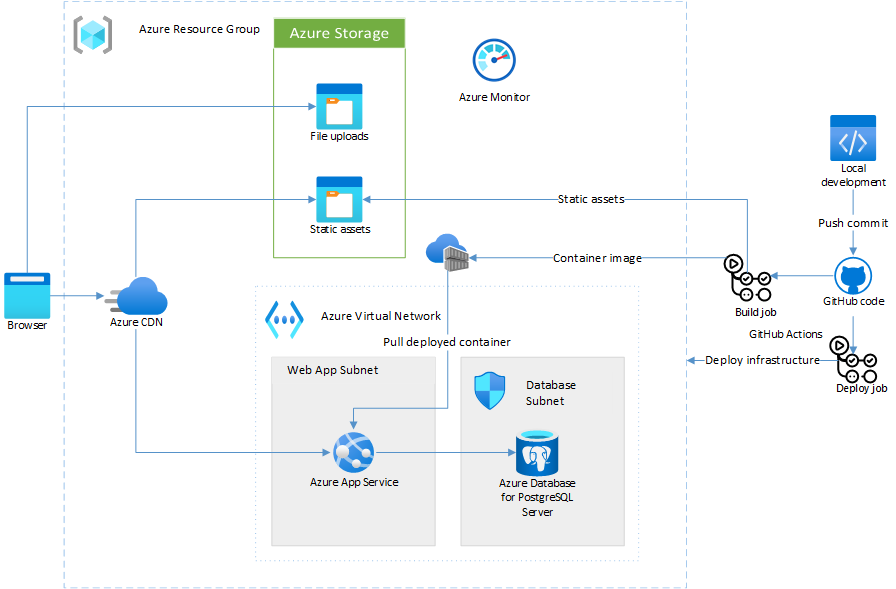

Many lessons you learn in larger companies aren't directly applicable to a startup's first stack. A service-oriented or microservices architecture might work for a business in the [expand](startup-architecture.md#expand) or [extract](startup-architecture.md#extract) phases of product development. This type of architecture is rarely right for a startup that hasn't yet found product/market fit or commercial traction.

In a product's initial [explore](startup-architecture.md#explore) stage, you need to optimize deployment for speed, cost, and optionality. This article presents an example and discusses the components of a simple core startup deployment stack.

## Architecture

A startup, Contoso, has built an early application prototype with a [Rails](https://rubyonrails.org) back end and a [React](https://reactjs.org) front end written in [TypeScript](https://www.typescriptlang.org). Contoso has been running demos on their laptop, but now it's time to deploy their app for the first customer sales meetings.

While the app is ambitious, it doesn't yet need a complex, microservice-driven enterprise architecture. Contoso opted for a simpler monolithic design that limits the time spent managing infrastructure. The design still provides ample ability to scale as the startup wins more customers.

- [Azure Virtual Network](/azure/virtual-network/virtual-networks-overview) segments network traffic and keeps internal services protected from threats on the open internet. Application servers use [virtual network integration](/azure/app-service/web-sites-integrate-with-vnet) to communicate with the database without exposing it to the internet.
- [Azure App Service](/azure/app-service/overview) provides a simple app server to deploy scalable applications without configuring servers, load balancers, or other infrastructure.
- [Azure Database for PostgreSQL](/azure/postgresql/overview) is an Azure database service for a leading open-source relational database management system (RDBMS). You can concentrate on developing your application rather than managing database servers.
- [Azure Monitor](/azure/azure-monitor/overview) monitors and analyzes what's happening across your application's infrastructure.
- [GitHub Actions]() builds continuous integration and continuous deployment (CI/CD) into your source code management. GitHub Actions has extensive support for different languages, and strong integration with Azure services.
- [Azure Blob storage](/azure/storage/blobs/storage-blobs-overview) stores static assets while moving load away from the application servers.
- [Azure Content Delivery Network (CDN)](/azure/cdn/cdn-overview) accelerates content delivery to users by using a global network.

## Core startup stack components

A complex stack can produce bugs that require constant attention, or be so sophisticated that it detracts from building your product. Bugs aren't caused by complexity, but a complex stack makes it easier to ship bugs. Not all sophisticated architectures are a waste of energy, but they can waste your resources if you haven't yet found product/market fit. A first startup stack should be simple and get out of your way, so you can concentrate on product development.

The following simple diagram shows the core startup stack, a recommended set of components that are just enough to get your product off the ground and into the hands of your customers. For 80% of startups, this stack is all you need to test the basic hypotheses built into your product. Startups working in machine learning, internet of things (IoT), or highly regulated environments might require more components.

### CDN

With few customers to start, a CDN might seem like a premature optimization. However, adding a CDN to a product already in production can have unexpected side effects, so it's best to implement a CDN up front. A CDN caches static content closer to your customers, and provides a façade behind which you can iterate on your APIs and your architecture.

### App Server

Your code needs to run somewhere. Ideally, this platform should make deployments easy, while requiring the least possible operational input. The app server should scale horizontally, but some manual scaling intervention is fine while you're still in the explore stage.

Like most of this stack, the app server should essentially run itself. Traditionally, the app server was a virtual machine, or a web server instance running on a bare-metal server. Now, you can look to platform-as-a-service (PaaS) options and containers to remove operational overhead.

### Static content

Serving static content from your app server wastes resources. Once you configure a CI/CD pipeline, the work to build and deploy static assets with each release is trivial. Most production web frameworks deploy static assets with CI/CD, so it's worthwhile to start out by aligning with this best practice.

### Database

Once your app is running, you need to store your data in a database. For most cases, a relational database provides multiple access methods and the speed that comes from using a longstanding solution. Relational databases include [Azure SQL Database](https://azure.microsoft.com/products/azure-sql/database), [Azure Database for PostgreSQL](https://azure.microsoft.com/services/postgresql), and [Azure Database for MariaDB](https://azure.microsoft.com/services/mariadb). Some use cases need a document database or NoSQL database like [MongoDB](https://www.mongodb.com/mongodb-on-azure) or [Azure Cosmos DB](https://azure.microsoft.com/services/cosmos-db).

### Log aggregation

If something goes wrong with your app, you want to spend as little time as possible diagnosing the problems. Monitor your application by aggregating logs and using application tracing from the beginning. Monitoring has many benefits. Your team can focus on the problems themselves, rather than accessing a file on the app server and poring over logs to get the data.

### CI/CD

The lack of repeatable and rapid deployments is one of the greatest impediments to speed when you're iterating on a product. A well-configured CI/CD pipeline streamlines the code deployment process on your app server. Quick and easy deployment means that you see the results of your labor quickly. Frequent integration avoids divergent code bases that lead to merge conflicts.

## Deploy this architecture

You can see a sample core startup stack implementation [on GitHub](https://github.com/Azure-Samples/core-startup-stack-rails). This sample uses a Ruby on Rails app. The concepts and techniques are the same for most projects you build using a [Dockerfile](https://docs.docker.com/engine/reference/builder).

## Next steps

- [Automate your workflow with GitHub Actions](/learn/paths/automate-workflow-github-actions)

## Related resources

- [Architecture for startups](startup-architecture.md)
- [Best practices in cloud applications](../../best-practices/index-best-practices.md)
- [Best practices for using content delivery networks (CDNs)](../../best-practices/cdn.md)
- [Ten design principles for Azure applications](../design-principles/index.md)

