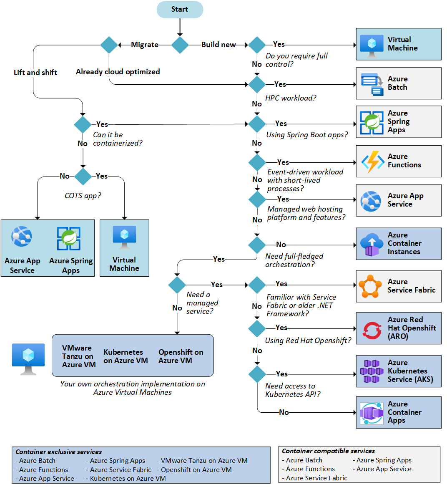

Azure offers a number of ways to host your application code. The term *compute* refers to the hosting model for the computing resources that your application runs on. The following flowchart will help you to choose a compute service for your application.

If your application consists of multiple workloads, evaluate each workload separately. A complete solution may incorporate two or more compute services.

## Choose a candidate service

Use the following flowchart to select a candidate compute service.

Definitions:

- **"Lift and shift"** is a strategy for migrating a workload to the cloud without redesigning the application or making code changes. Also called *rehosting*. For more information, see [Azure migration and modernization center](https://azure.microsoft.com/migration).
- **Cloud optimized** is a strategy for migrating to the cloud by refactoring an application to take advantage of cloud-native features and capabilities.

The output from this flowchart is a **starting point** for consideration. Next, perform a more detailed evaluation of the service to see if it meets your needs.

This article includes several tables which may help you to make these tradeoff decisions. Based on this analysis, you may find that the initial candidate isn't suitable for your particular application or workload. In that case, expand your analysis to include other compute services.

> [!NOTE]
> Learn more about reviewing your compute requirements for cloud adoption, in the [Microsoft Cloud Adoption Framework for Azure](/azure/cloud-adoption-framework/ready/considerations/compute-options).

## Understand the basic features

If you're not familiar with the Azure service selected in the previous step, read the overview documentation to understand the basics of the service.

- [App Service](/azure/app-service). A managed service for hosting web apps, mobile app back ends, RESTful APIs, or automated business processes.
- [Azure Spring Cloud](/azure/spring-cloud). A managed service designed and optimized for hosting Spring Boot apps.
- [Azure Kubernetes Service](/azure/aks/intro-kubernetes) (AKS). A managed Kubernetes service for running containerized applications.
- [Batch](/azure/batch/batch-technical-overview). A managed service for running large-scale parallel and high-performance computing (HPC) applications
- [Container Instances](/azure/container-instances/container-instances-overview). The fastest and simplest way to run a container in Azure, without having to provision any virtual machines and without having to adopt a higher-level service.
- [Functions](/azure/azure-functions/functions-overview). A managed FaaS service.
- [Service Fabric](/azure/service-fabric/service-fabric-overview). A distributed systems platform that can run in many environments, including Azure or on premises.
- [Virtual machines](/azure/virtual-machines). Deploy and manage VMs inside an Azure virtual network.

## Understand the hosting models

Cloud services, including Azure services, generally fall into three categories: IaaS, PaaS, or FaaS. (There is also SaaS, software-as-a-service, which is out of scope for this article.) It's useful to understand the differences.

**Infrastructure-as-a-Service** (IaaS) lets you provision individual VMs along with the associated networking and storage components. Then you deploy whatever software and applications you want onto those VMs. This model is the closest to a traditional on-premises environment, except that Microsoft manages the infrastructure. You still manage the individual VMs.

**Platform-as-a-Service** (PaaS) provides a managed hosting environment, where you can deploy your application without needing to manage VMs or networking resources. Azure App Service is a PaaS service.

**Functions-as-a-Service** (FaaS) goes even further in removing the need to worry about the hosting environment. In a FaaS model, you simply deploy your code and the service automatically runs it. Azure Functions is a FaaS service.

> [!NOTE]
> Azure Functions is an [Azure serverless](https://azure.microsoft.com/solutions/serverless/#solutions) compute offering. You may read [Choose the right integration and automation services in Azure](/azure/azure-functions/functions-compare-logic-apps-ms-flow-webjobs) to know how this service compares with other Azure serverless offerings, such as Logic Apps which provides serverless workflows.

There is a spectrum from IaaS to pure PaaS. For example, Azure VMs can autoscale by using virtual machine scale sets. This automatic scaling capability isn't strictly PaaS, but it's the type of management feature found in PaaS services.

In general, there is a tradeoff between control and ease of management. IaaS gives the most control, flexibility, and portability, but you have to provision, configure and manage the VMs and network components you create. FaaS services automatically manage nearly all aspects of running an application. PaaS services fall somewhere in between.

| Criteria | Virtual Machines | App Service | Azure Spring Cloud| Service Fabric | Azure Functions | Azure Kubernetes Service | Container Instances | Azure Batch |
|----------|-----------------|-------------|-------------|----------------|-----------------|-------------------------|----------------|-------------|
| Application composition | Agnostic | Applications, containers | Applications, microservices |Services, guest executables, containers | Functions | Containers | Containers | Scheduled jobs  |
| Density | Agnostic | Multiple apps per instance via app service plans | Multiple apps per service instance | Multiple services per VM | Serverless <a href="#note1">1</a> | Multiple containers per node |No dedicated instances | Multiple apps per VM |
| Minimum number of nodes | 1 <a href="#note2">2</a>  | 1 | 2 | 5 <a href="#note3">3</a> | Serverless <a href="#note1">1</a> | 3 <a href="#note3">3</a> | No dedicated nodes | 1 <a href="#note4">4</a> |
| State management | Stateless or Stateful | Stateless | Stateless | Stateless or stateful | Stateless | Stateless or Stateful | Stateless | Stateless |
| Web hosting | Agnostic | Built in | Built in |Agnostic | Not applicable | Agnostic | Agnostic | No |
| Can be deployed to dedicated VNet? | Supported | Supported<a href="#note5">5</a> | Supported |Supported | Supported <a href="#note5">5</a> | [Supported](/azure/aks/networking-overview) | [Supported](/azure/container-instances/container-instances-vnet) | Supported |
| Hybrid connectivity | Supported | Supported <a href="#note6">6</a>  |Supported | Supported | Supported <a href="#note7">7</a> | Supported | Not supported | Supported |

Notes

1. If using Consumption plan. If using App Service plan, functions run on the VMs allocated for your App Service plan. See [Choose the correct service plan for Azure Functions][function-plans].
2. Higher SLA with two or more instances.
3. Recommended for production environments.
4. Can scale down to zero after job completes.
5. Requires App Service Environment (ASE).
6. Use [Azure App Service Hybrid Connections][app-service-hybrid].
7. Requires App Service plan or [Azure Functions Premium plan][func-premium].

## DevOps

| Criteria | Virtual Machines | App Service | Azure Spring Cloud | Service Fabric | Azure Functions | Azure Kubernetes Service | Container Instances | Azure Batch |
|----------|-----------------|-------------| -------------|----------------|-----------------|-------------------------|----------------|-------------|
| Local debugging | Agnostic | IIS Express, others <a href="#note1b">1</a> | Visual Studio Code, Intellij, Eclipse | Local node cluster | Visual Studio or Azure Functions CLI | Minikube, others | Local container runtime | Not supported |
| Programming model | Agnostic | Web and API applications, WebJobs for background tasks | Spring Boot, Steeltoe | Guest executable, Service model, Actor model, Containers | Functions with triggers | Agnostic | Agnostic | Command line application |
| Application update | No built-in support | Deployment slots | Rolling upgrade, Blue-green deployment | Rolling upgrade (per service) | Deployment slots | Rolling update | Not applicable |

Notes

1. Options include IIS Express for ASP.NET or node.js (iisnode); PHP web server; Azure Toolkit for IntelliJ, Azure Toolkit for Eclipse. App Service also supports remote debugging of deployed web app.
2. See [Resource Manager providers, regions, API versions and schemas][resource-manager-supported-services].

## Scalability

| Criteria | Virtual Machines | App Service |   Azure Spring Cloud | Service Fabric | Azure Functions | Azure Kubernetes Service | Container Instances | Azure Batch |
|----------|-----------------|-------------|----------------|----------------|-----------------|-------------------------|----------------|-------------|
| Autoscaling | Virtual machine scale sets | Built-in service | Built-in service | Virtual machine scale sets | Built-in service | Pod auto-scaling<a href="#note1c">1</sip></a>, cluster auto-scaling<a href="#note2c">2</sip></a> | Not supported | N/A |
| Load balancer | Azure Load Balancer | Integrated | Integrated | Azure Load Balancer | Integrated | Azure Load Balancer or Application Gateway |  No built-in support | Azure Load Balancer |
| Scale limit<a href="#note3c">3</a> | Platform image: 1000 nodes per scale set, Custom image: 600 nodes per scale set | 30 instances, 100 with App Service Environment | 500 app instances in Standard |100 nodes per scale set | 200 instances per Function app | 100 nodes per cluster (default limit) |20 container groups per subscription (default limit). | 20 core limit (default limit). |

Notes

1. See [Autoscale pods](/azure/aks/tutorial-kubernetes-scale#autoscale-pods).
2. See [Automatically scale a cluster to meet application demands on Azure Kubernetes Service (AKS)](/azure/aks/cluster-autoscaler).
3. See [Azure subscription and service limits, quotas, and constraints](/azure/azure-subscription-service-limits).

## Availability

| Criteria | Virtual Machines | App Service | Azure Spring Cloud |  Service Fabric | Azure Functions | Azure Kubernetes Service | Container Instances | Azure Batch |
|----------|-----------------|-------------| -------------|----------------|-----------------|-------------------------|----------------|-------------|
| SLA | [SLA for Virtual Machines][sla-vm] | [SLA for App Service][sla-app-service] | [SLA for Azure Spring Cloud][sla-azure-spring-cloud]|[SLA for Service Fabric][sla-sf] | [SLA for Functions][sla-functions] | [SLA for AKS][sla-acs] | [SLA for Container Instances](https://azure.microsoft.com/support/legal/sla/container-instances/) | [SLA for Azure Batch][sla-batch] |
| Multi region failover | Traffic manager | Traffic manager | Traffic manager, Multi-Region Cluster | [Azure Front Door](/azure/azure-functions/functions-geo-disaster-recovery) | Traffic manager | Not supported | Not Supported |

For guided learning on Service Guarantees, review [Core Cloud Services - Azure architecture and service guarantees](/learn/modules/explore-azure-infrastructure).

## Security

Review and understand the available security controls and visibility for each service

- [App Service](/azure/app-service/overview-security)
- [App Spring Cloud](/azure/spring-cloud/concept-security-controls)
- [Azure Kubernetes Service](/azure/aks/security-baseline)
- [Batch](/azure/batch/security-baseline)
- [Container Instances](/azure/container-instances/security-baseline)
- [Functions](/azure/azure-functions/security-baseline)
- [Service Fabric](/azure/service-fabric/security-baseline)
- [Virtual machine - Windows](/azure/virtual-machines/windows/security-baseline)
- [Virtual machine - LINUX](/azure/virtual-machines/linux/security-baseline)

## Other criteria

| Criteria | Virtual Machines | App Service | App Spring Cloud | Service Fabric | Azure Functions | Azure Kubernetes Service | Container Instances | Azure Batch |
|----------|-----------------|-------------|----------------|----------------|-----------------|-------------------------|----------------|-------------|
| SSL | Configured in VM | Supported | Supported  | Supported |  Supported | [Ingress controller](/azure/aks/ingress) | Use [sidecar](../../patterns/sidecar.md) container | Supported |
| Cost | [Windows][cost-windows-vm], [Linux][cost-linux-vm] | [App Service pricing][cost-app-service] | [Azure Spring Cloud pricing][cost-azure-spring-cloud] | [Service Fabric pricing][cost-service-fabric] | [Azure Functions pricing][cost-functions] | [AKS pricing][cost-acs] | [Container Instances pricing](https://azure.microsoft.com/pricing/details/container-instances/) | [Azure Batch pricing][cost-batch]
| Suitable architecture styles | [N-Tier][n-tier], [Big compute][big-compute] (HPC) | [Web-Queue-Worker][w-q-w], [N-Tier][n-tier] | Spring Boot, [Microservices][microservices] | [Microservices][microservices], [Event-driven architecture][event-driven] | [Microservices][microservices], [Event-driven architecture][event-driven] | [Microservices][microservices], [Event-driven architecture][event-driven] | [Microservices][microservices], task automation, batch jobs  | [Big compute][big-compute] (HPC) |

The output from this flowchart is a **starting point** for consideration. Next, perform a more detailed evaluation of the service to see if it meets your needs.

## Consider limits and cost

Perform a more detailed evaluation looking at the following aspects of the service:

- [Service limits](/azure/azure-subscription-service-limits)
- [Cost](https://azure.microsoft.com/pricing/)
- [SLA](https://azure.microsoft.com/support/legal/sla/)
- [Regional availability](https://azure.microsoft.com/global-infrastructure/services/)
- [Compute comparison tables](./compute-decision-tree.yml)

## Next steps

- [Core Cloud Services - Azure compute options](/learn/modules/intro-to-azure-compute/). This Microsoft Learn module explores how compute services can solve common business needs.

[cost-linux-vm]: https://azure.microsoft.com/pricing/details/virtual-machines/linux
[cost-windows-vm]: https://azure.microsoft.com/pricing/details/virtual-machines/windows
[cost-app-service]: https://azure.microsoft.com/pricing/details/app-service
[cost-service-fabric]: https://azure.microsoft.com/pricing/details/service-fabric
[cost-azure-spring-cloud]: https://azure.microsoft.com/pricing/details/spring-cloud/
[cost-functions]: https://azure.microsoft.com/pricing/details/functions
[cost-acs]: https://azure.microsoft.com/pricing/details/kubernetes-service
[cost-batch]: https://azure.microsoft.com/pricing/details/batch

[function-plans]: /azure/azure-functions/functions-scale
[sla-acs]: https://azure.microsoft.com/support/legal/sla/kubernetes-service
[sla-app-service]: https://azure.microsoft.com/support/legal/sla/app-service
[sla-azure-spring-cloud]: https://azure.microsoft.com/support/legal/sla/spring-cloud
[sla-batch]: https://azure.microsoft.com/support/legal/sla/batch
[sla-functions]: https://azure.microsoft.com/support/legal/sla/functions
[sla-sf]: https://azure.microsoft.com/support/legal/sla/service-fabric
[sla-vm]: https://azure.microsoft.com/support/legal/sla/virtual-machines

[resource-manager-supported-services]: /azure/azure-resource-manager/resource-manager-supported-services

[n-tier]: ../architecture-styles/n-tier.md
[w-q-w]: ../architecture-styles/web-queue-worker.md
[microservices]: ../architecture-styles/microservices.md
[event-driven]: ../architecture-styles/event-driven.yml
[big-compute]: ../architecture-styles/big-compute.yml

[app-service-hybrid]: /azure/app-service/app-service-hybrid-connections
[func-premium]: /azure/azure-functions/functions-premium-plan#private-network-connectivity
