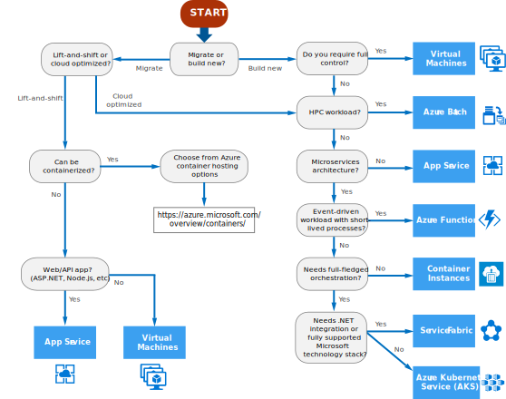

# Choose an Azure compute service for your application

Azure offers a number of ways to host your application code. The term *compute* refers to the hosting model for the computing resources that your application runs on. The following flowchart will help you to choose a compute service for your application.

If your application consists of multiple workloads, evaluate each workload separately. A complete solution may incorporate two or more compute services.

## Choose a candidate service

Use the following flowchart to select a candidate compute service.

Definitions:

- **"Lift and shift"** is a strategy for migrating a workload to the cloud without redesigning the application or making code changes. Also called *rehosting*. For more information, see [Azure migration center](https://azure.microsoft.com/migration/).
- **Cloud optimized** is a strategy for migrating to the cloud by refactoring an application to take advantage of cloud-native features and capabilities.

The output from this flowchart is a **starting point** for consideration. Next, perform a more detailed evaluation of the service to see if it meets your needs. 

## Understand the basic features

If you're not familiar with the Azure service selected in the previous step, read one of the following overview articles:

- [App Service](/azure/app-service/)
- [Azure Kubernetes Service](/azure/aks/intro-kubernetes)
- [Batch](/azure/batch/batch-technical-overview)
- [Container Instances](/azure/container-instances/container-instances-overview)
- [Functions](/azure/azure-functions/functions-overview)
- [Service Fabric](/azure/service-fabric/service-fabric-overview)
- [Virtual machines](/azure/virtual-machines/)

## Consider limits and cost

Next, perform a more detailed evaluation, looking at the following aspects of the service:

- [Service limits](/azure/azure-subscription-service-limits)
- [Cost](https://azure.microsoft.com/pricing/)
- [SLA](https://azure.microsoft.com/support/legal/sla/)
- [Regional availability](https://azure.microsoft.com/global-infrastructure/services/)
- [Compute comparison tables](./compute-comparison.md)

Based on this analysis, you may find that the initial candidate isn't suitable for your particular application or workload. In that case, expand your analysis to include other compute services. 

## Next steps

- For more information about your options for hosting containers in Azure, see [Container services](https://azure.microsoft.com/product-categories/containers/).

- [Core Cloud Services - Azure compute options](/learn/modules/intro-to-azure-compute/). This Microsoft Learn module explores how compute services can solve common business needs. 
