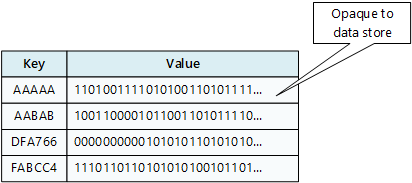
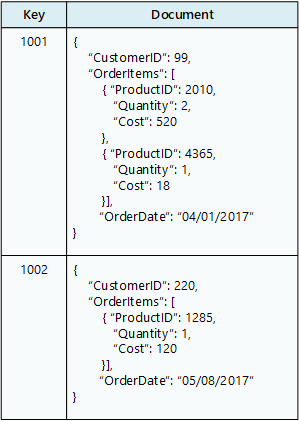
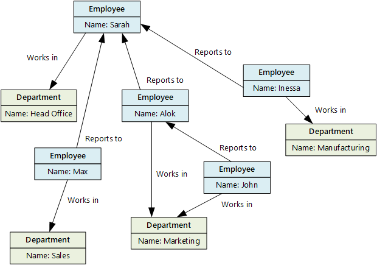
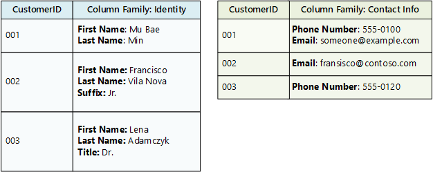

# Understand data store models

Modern business systems manage increasingly large volumes of heterogeneous data. This heterogeneity means that a single data store is usually not the best approach. Instead, it's often better to store different types of data in different data stores, each focused toward a specific workload or usage pattern. The term *polyglot persistence* is used to describe solutions that use a mix of data store technologies. Therefore, it's important to understand the main storage models and their tradeoffs.

Selecting the right data store for your requirements is a key design decision. There are literally hundreds of implementations to choose from among SQL and NoSQL databases. Data stores are often categorized by how they structure data and the types of operations they support. This article describes several of the most common storage models. Note that a particular data store technology may support multiple storage models. For example, a relational database management systems (RDBMS) may also support key/value or graph storage. In fact, there is a general trend for so-called *multi-model* support, where a single database system supports several models. But it's still useful to understand the different models at a high level.

Not all data stores in a given category provide the same feature-set. Most data stores provide server-side functionality to query and process data. Sometimes this functionality is built into the data storage engine. In other cases, the data storage and processing capabilities are separated, and there may be several options for processing and analysis. Data stores also support different programmatic and management interfaces.

Generally, you should start by considering which storage model is best suited for your requirements. Then consider a particular data store within that category, based on factors such as feature set, cost, and ease of management.

> [!NOTE]
> Learn more about identifying and reviewing your data service requirements for cloud adoption, in the [Microsoft Cloud Adoption Framework for Azure](/azure/cloud-adoption-framework/ready/considerations/data-options). Likewise, you can also learn about [selecting storage tools and services](/azure/cloud-adoption-framework/ready/considerations/storage-options).

## Relational database management systems

Relational databases organize data as a series of two-dimensional tables with rows and columns. Most vendors provide a dialect of the Structured Query Language (SQL) for retrieving and managing data. An RDBMS typically implements a transactionally consistent mechanism that conforms to the ACID (Atomic, Consistent, Isolated, Durable) model for updating information.

An RDBMS typically supports a schema-on-write model, where the data structure is defined ahead of time, and all read or write operations must use the schema.

This model is very useful when strong consistency guarantees are important &mdash; where all changes are atomic, and transactions always leave the data in a consistent state. However, an RDBMS generally can't scale out horizontally without sharding the data in some way. Also, the data in an RDBMS must be normalized, which isn't appropriate for every data set.

### Azure services

- [Azure SQL Database][sql-db] | [(Security Baseline)](/security/benchmark/azure/baselines/sql-database-security-baseline)
- [Azure Database for MySQL][mysql] | [(Security Baseline)](/azure/mysql/security-baseline)
- [Azure Database for PostgreSQL][postgres] | [(Security Baseline)](/azure/postgresql/security-baseline)
- [Azure Database for MariaDB][mariadb] | [(Security Baseline)](/azure/mariadb/security-baseline)

### Workload

- Records are frequently created and updated.
- Multiple operations have to be completed in a single transaction.
- Relationships are enforced using database constraints.
- Indexes are used to optimize query performance.

### Data type

- Data is highly normalized.
- Database schemas are required and enforced.
- Many-to-many relationships between data entities in the database.
- Constraints are defined in the schema and imposed on any data in the database.
- Data requires high integrity. Indexes and relationships need to be maintained accurately.
- Data requires strong consistency. Transactions operate in a way that ensures all data are 100% consistent for all users and processes.
- Size of individual data entries is small to medium-sized.

### Examples

- Inventory management
- Order management
- Reporting database
- Accounting

## Key/value stores

A key/value store associates each data value with a unique key. Most key/value stores only support simple query, insert, and delete operations. To modify a value (either partially or completely), an application must overwrite the existing data for the entire value. In most implementations, reading or writing a single value is an atomic operation.

An application can store arbitrary data as a set of values. Any schema information must be provided by the application. The key/value store simply retrieves or stores the value by key.

Key/value stores are highly optimized for applications performing simple lookups, but are less suitable if you need to query data across different key/value stores. Key/value stores are also not optimized for querying by value.

A single key/value store can be extremely scalable, as the data store can easily distribute data across multiple nodes on separate machines.

### Azure services

- [Azure Cosmos DB for Table][cosmos-table] and [Azure Cosmos DB for NoSQL][cosmos-sql-key-value] | [(Azure Cosmos DB Security Baseline)](/azure/cosmos-db/security-baseline)
- [Azure Cache for Redis][redis] | [(Security Baseline)](/azure/azure-cache-for-redis/security-baseline)
- [Azure Table Storage][table-storage-classic] | [(Security Baseline)](/azure/storage/common/security-baseline)

### Workload

- Data is accessed using a single key, like a dictionary.
- No joins, lock, or unions are required.
- No aggregation mechanisms are used.
- Secondary indexes are generally not used.

### Data type

- Each key is associated with a single value.
- There is no schema enforcement.
- No relationships between entities.

### Examples

- Data caching
- Session management
- User preference and profile management
- Product recommendation and ad serving

## Document databases

A document database stores a collection of *documents*, where each document consists of named fields and data. The data can be simple values or complex elements such as lists and child collections. Documents are retrieved by unique keys.

Typically, a document contains the data for single entity, such as a customer or an order. A document may contain information that would be spread across several relational tables in an RDBMS. Documents don't need to have the same structure. Applications can store different data in documents as business requirements change.

### Azure service

- [Azure Cosmos DB for NoSQL][cosmos-db] | [(Azure Cosmos DB Security Baseline)](/azure/cosmos-db/security-baseline)

### Workload

- Insert and update operations are common.
- No object-relational impedance mismatch. Documents can better match the object structures used in application code.
- Individual documents are retrieved and written as a single block.
- Data requires index on multiple fields.

### Data type

- Data can be managed in de-normalized way.
- Size of individual document data is relatively small.
- Each document type can use its own schema.
- Documents can include optional fields.
- Document data is semi-structured, meaning that data types of each field are not strictly defined.

### Examples

- Product catalog
- Content management
- Inventory management

## Graph databases

A graph database stores two types of information, nodes and edges. Edges specify relationships between nodes. Nodes and edges can have properties that provide information about that node or edge, similar to columns in a table. Edges can also have a direction indicating the nature of the relationship.

Graph databases can efficiently perform queries across the network of nodes and edges and analyze the relationships between entities. The following diagram shows an organization's personnel database structured as a graph. The entities are employees and departments, and the edges indicate reporting relationships and the departments in which employees work.

This structure makes it straightforward to perform queries such as "Find all employees who report directly or indirectly to Sarah" or "Who works in the same department as John?" For large graphs with lots of entities and relationships, you can perform very complex analyses very quickly. Many graph databases provide a query language that you can use to traverse a network of relationships efficiently.

### Azure services

- [Azure Cosmos DB for Apache Gremlin][cosmos-gremlin] | [(Security Baseline)](/azure/cosmos-db/security-baseline)
- [SQL Server][sqlserver] | [(Security Baseline)](/security/benchmark/azure/baselines/sql-database-security-baseline)

### Workload

- Complex relationships between data items involving many hops between related data items.
- The relationship between data items are dynamic and change over time.
- Relationships between objects are first-class citizens, without requiring foreign-keys and joins to traverse.

### Data type

- Nodes and relationships.
- Nodes are similar to table rows or JSON documents.
- Relationships are just as important as nodes, and are exposed directly in the query language.
- Composite objects, such as a person with multiple phone numbers, tend to be broken into separate, smaller nodes, combined with traversable relationships

### Examples

- Organization charts
- Social graphs
- Fraud detection
- Recommendation engines

## Data analytics

Data analytics stores provide massively parallel solutions for ingesting, storing, and analyzing data. The data is distributed across multiple servers to maximize scalability. Large data file formats such as delimiter files (CSV), [parquet][prq], and [ORC][orc] are widely used in data analytics. Historical data is typically stored in data stores such as blob storage or [Azure Data Lake Storage Gen2][datalakegen2], which are then accessed by Azure Synapse, Databricks, or HDInsight as external tables. A typical scenario using data stored as parquet files for performance, is described in the article [Use external tables with Synapse SQL][synapseexternal].

### Azure services

- [Azure Synapse Analytics][sql-dw] | [(Security Baseline)](/azure/synapse-analytics/security-baseline)
- [Azure Data Lake][data-lake] | [(Security Baseline)](/azure/data-lake-analytics/security-baseline)
- [Azure Data Explorer](https://azure.microsoft.com/services/data-explorer/) | [(Security Baseline)](/azure/data-explorer/security-baseline)
- [Azure Analysis Services][analysissvc]
- [HDInsight][hdinsight] | [(Security Baseline)](/azure/hdinsight/security-baseline)
- [Azure Databricks][databricks] | [(Security Baseline)](/azure/databricks/scenarios/security-baseline)

### Workload

- Data analytics
- Enterprise BI

### Data type

- Historical data from multiple sources.
- Usually denormalized in a &quot;star&quot; or &quot;snowflake&quot; schema, consisting of fact and dimension tables.
- Usually loaded with new data on a scheduled basis.
- Dimension tables often include multiple historic versions of an entity, referred to as a <em>slowly changing dimension</em>.

### Examples

- Enterprise data warehouse

## Column-family databases

A column-family database organizes data into rows and columns. In its simplest form, a column-family database can appear very similar to a relational database, at least conceptually. The real power of a column-family database lies in its denormalized approach to structuring sparse data.

You can think of a column-family database as holding tabular data with rows and columns, but the columns are divided into groups known as *column families*. Each column family holds a set of columns that are logically related together and are typically retrieved or manipulated as a unit. Other data that is accessed separately can be stored in separate column families. Within a column family, new columns can be added dynamically, and rows can be sparse (that is, a row doesn't need to have a value for every column).

The following diagram shows an example with two column families, `Identity` and `Contact Info`. The data for a single entity has the same row key in each column-family. This structure, where the rows for any given object in a column family can vary dynamically, is an important benefit of the column-family approach, making this form of data store highly suited for storing structured, volatile data.

Unlike a key/value store or a document database, most column-family databases store data in key order, rather than by computing a hash. Many implementations allow you to create indexes over specific columns in a column-family. Indexes let you retrieve data by columns value, rather than row key.

Read and write operations for a row are usually atomic with a single column-family, although some implementations provide atomicity across the entire row, spanning multiple column-families.

### Azure services

- [Azure Cosmos DB for Apache Cassandra][cassandra] | [(Security Baseline)](/azure/cosmos-db/security-baseline)
- [HBase in HDInsight][hbase] | [(Security Baseline)](/azure/hdinsight/security-baseline)

### Workload

- Most column-family databases perform write operations extremely quickly.
- Update and delete operations are rare.
- Designed to provide high throughput and low-latency access.
- Supports easy query access to a particular set of fields within a much larger record.
- Massively scalable.

### Data type

- Data is stored in tables consisting of a key column and one or more column families.
- Specific columns can vary by individual rows.
- Individual cells are accessed via get and put commands
- Multiple rows are returned using a scan command.

### Examples

- Recommendations
- Personalization
- Sensor data
- Telemetry
- Messaging
- Social media analytics
- Web analytics
- Activity monitoring
- Weather and other time-series data

## Search Engine Databases

A search engine database allows applications to search for information held in external data stores. A search engine database can index massive volumes of data and provide near real-time access to these indexes.

Indexes can be multi-dimensional and may support free-text searches across large volumes of text data. Indexing can be performed using a pull model, triggered by the search engine database, or using a push model, initiated by external application code.

Searching can be exact or fuzzy. A fuzzy search finds documents that match a set of terms and calculates how closely they match. Some search engines also support linguistic analysis that can return matches based on synonyms, genre expansions (for example, matching `dogs` to `pets`), and stemming (matching words with the same root).

### Azure service

- [Azure Search][search] | [(Security Baseline)](/azure/search/security-baseline)

### Workload

- Data indexes from multiple sources and services.
- Queries are ad-hoc and can be complex.
- Full text search is required.
- Ad hoc self-service query is required.

### Data type

- Semi-structured or unstructured text
- Text with reference to structured data

### Examples

- Product catalogs
- Site search
- Logging

## Time series databases

Time series data is a set of values organized by time. Time series databases  typically collect large amounts of data in real time from a large number of sources. Updates are rare, and deletes are often done as bulk operations. Although the records written to a time-series database are generally small,  there are often a large number of records, and total data size can grow rapidly.

### Azure service

- [Azure Time Series Insights][time-series]

### Workload

- Records are generally appended sequentially in time order.
- An overwhelming proportion of operations (95-99%) are writes.
- Updates are rare.
- Deletes occur in bulk, and are made to contiguous blocks or records.
- Data is read sequentially in either ascending or descending time order, often in parallel.

### Data type

- A timestamp is used as the primary key and sorting mechanism.
- Tags may define additional information about the type, origin, and other information about the entry.

### Examples

- Monitoring and event telemetry.
- Sensor or other IoT data.

## Object storage

Object storage is optimized for storing and retrieving large binary objects (images, files, video and audio streams, large application data objects and documents, virtual machine disk images). Large data files are also popularly used in this model, for example, delimiter file (CSV), [parquet][prq], and [ORC][orc]. Object stores can manage extremely large amounts of unstructured data.

### Azure service

- [Azure Blob Storage][blob] | [(Security Baseline)](/azure/storage/common/security-baseline)
- [Azure Data Lake Storage Gen2][datalakegen2] | [(Security Baseline)](/azure/data-lake-analytics/security-baseline)

### Workload

- Identified by key.
- Content is typically an asset such as a delimiter, image, or video file.
- Content must be durable and external to any application tier.

### Data type

- Data size is large.
- Value is opaque.

### Examples

- Images, videos, office documents, PDFs
- Static HTML, JSON, CSS
- Log and audit files
- Database backups

## Shared files

Sometimes, using simple flat files can be the most effective means of storing and retrieving information. Using file shares enables files to be accessed across a network. Given appropriate security and concurrent access control mechanisms, sharing data in this way can enable distributed services to provide highly scalable data access for performing basic, low-level operations such as simple read and write requests.

### Azure service

- [Azure Files][file-storage] | [(Security Baseline)](/azure/storage/common/security-baseline)

### Workload

- Migration from existing apps that interact with the file system.
- Requires SMB interface.

### Data type

- Files in a hierarchical set of folders.
- Accessible with standard I/O libraries.

### Examples

- Legacy files
- Shared content accessible among a number of VMs or app instances

Aided with this understanding of different data storage models, the next step is to evaluate your workload and application, and decide which data store will meet your specific needs. Use the [data storage decision tree](./data-store-decision-tree.md) to help with this process.

## Next steps

- [Azure Cloud Storage Solutions and Services](https://azure.microsoft.com/products/category/storage)
- [Review your storage options](/azure/cloud-adoption-framework/ready/considerations/storage-options)
- [Introduction to Azure Storage](/azure/storage/common/storage-introduction)
- [Introduction to Azure Data Explorer](/training/modules/intro-to-azure-data-explorer)

## Related resources

- [Databases architecture design](../../data-guide/databases-architecture-design.yml)
- [Big data architectures](../../data-guide/big-data/index.yml)
- [Choose a data storage technology](../../data-guide/technology-choices/data-storage.md)
- [Data store decision tree](data-store-decision-tree.md)

<!-- links -->

[blob]: https://azure.microsoft.com/services/storage/blobs/
[cosmos-db]: /azure/cosmos-db/
[cosmos-gremlin]: /azure/cosmos-db/graph-introduction
[data-lake]: https://azure.microsoft.com/services/data-lake-analytics/
[file-storage]: https://azure.microsoft.com/services/storage/files/
[hbase]: /azure/hdinsight/hdinsight-hbase-overview
[mysql]: https://azure.microsoft.com/services/mysql/
[postgres]: https://azure.microsoft.com/services/postgresql/
[mariadb]: https://azure.microsoft.com/services/mariadb/
[redis]: https://azure.microsoft.com/services/cache/
[search]: https://azure.microsoft.com/services/search/
[sql-db]: https://azure.microsoft.com/services/sql-database
[sql-dw]: https://azure.microsoft.com/services/sql-data-warehouse/
[time-series]: https://azure.microsoft.com/services/time-series-insights/
[sqlserver]: /sql/relational-databases/graphs/sql-graph-overview
[hdinsight]: https://azure.microsoft.com/services/hdinsight/
[databricks]: https://azure.microsoft.com/free/databricks/
[analysissvc]: /azure/analysis-services/analysis-services-overview
[datalakegen2]: /azure/storage/blobs/data-lake-storage-introduction
[prq]: https://parquet.apache.org/docs/
[orc]: https://orc.apache.org/docs/
[synapseexternal]: /azure/synapse-analytics/sql/develop-tables-external-tables?tabs=sql-pool
[cassandra]: /azure/cosmos-db/cassandra-introduction
[table-storage-classic]: /azure/cosmos-db/table-storage-overview
[cosmos-sql-key-value]: /azure/cosmos-db/sql-query-getting-started
[cosmos-etcd]: /azure/cosmos-db/etcd-api-introduction
[cosmos-table]: /azure/cosmos-db/table-introduction
