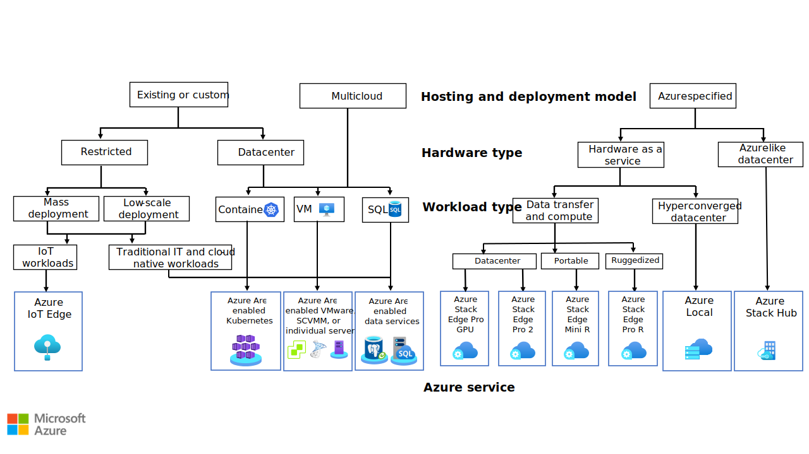
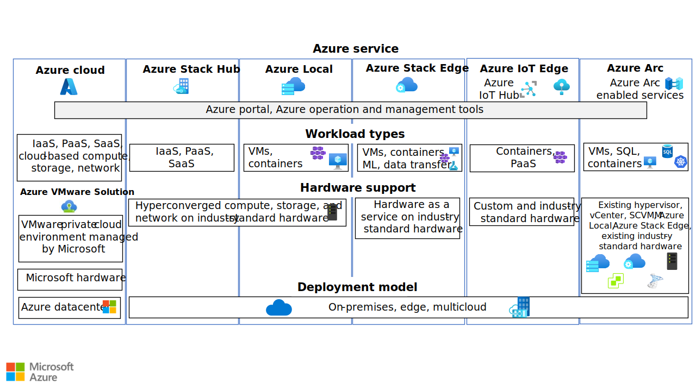

Azure offers several hybrid solutions that can host applications and workloads, extend Azure services, and provide security and operational tooling for hybrid environments. Azure hybrid services range from virtualized hardware that hosts traditional IT apps and databases to integrated platform as a service (PaaS) solutions for on-premises, edge, and multicloud scenarios. This guide helps you choose a hybrid solution that meets your business requirements.

## Hybrid concepts

Hybrid environments include the following types of hosting locations and infrastructure:

- *Hybrid cloud* environments combine public cloud services with on-premises infrastructure. This hybrid strategy is common for organizations that have strict data sovereignty regulations, low latency requirements, or crucial resiliency and business continuity needs.

- *Edge* environments host devices that provide on-premises computing and data storage. This approach is common for organizations and applications that need to remain close to the data, reduce latency, or compute data in near real time.

- *Multicloud* environments use multiple cloud computing services and providers. This strategy provides flexibility, can reduce risk, and lets organizations investigate and use different providers for specific applications. But this approach often requires cloud-specific knowledge and adds complexity to management, operations, and security.

Hybrid solutions encompass a system's [control plane and data plane](/azure/azure-resource-manager/management/control-plane-and-data-plane).

- The *control plane* refers to resource management operations, such as creating Azure virtual machines (VMs). Azure uses [Azure Resource Manager](/azure/azure-resource-manager/management/overview) to handle the control plane.

- The *data plane* uses the capabilities of resource instances that the control plane creates, such as accessing Azure VMs over remote desktop protocol (RDP).

Azure hybrid solutions can extend Azure control plane operations outside of Azure datacenters, or run dedicated control plane instances, to provide data plane capabilities.

## Hybrid considerations

To make a hybrid solution decision, you must consider hardware, hosting and deployment, and application or workload requirements and constraints. Hybrid solutions must also support developer operations (DevOps) and comply with organizational and industry standards and regulations.

### Hardware

Depending on workload type, you might need traditional datacenter hardware that can run VMs, containers, and databases. For other scenarios, like IoT deployments, restricted hardware devices are a better fit and can run on rack, portable, or ruggedized servers.

Consider whether to refresh, repurpose, or replace existing hardware. Brownfield scenarios use existing hardware in modern hybrid workload approaches. Greenfield scenarios acquire new hardware or use hardware as a service with a monthly fee.

### Hosting and deployment

Consider whether to use on-premises datacenter, edge, Azure cloud, or multicloud hosting with a consistent cloud-native technology approach. Business, compliance, cost, or security requirements might determine hosting location.

A large-scale application deployment is different from smaller-scale implementations. A traditional IT deployment to VMs and databases is different from deployments to containers or distributed devices.

Distributed, complex, large-scale deployments must be able to massively scale service implementation, and might address concerns like business continuity differently than traditional IT.

### Application or workload

Consider whether applications or workloads are distributed, containerized, or traditional IT hosted on VMs or databases. [Azure IoT Hub](/azure/iot-hub), [Azure Kubernetes Service (AKS)](https://azure.microsoft.com/services/kubernetes-service) clusters, or PaaS solutions outside Azure datacenters can host hybrid workloads.

Traditional applications that run on VMs benefit from hyperconverged infrastructure (HCI) and Azure operational, security, and management tooling for day-two operations. Cloud-native applications are better suited to run on container orchestrators like AKS and use Azure PaaS solutions.

If you need to deploy models built and trained in the cloud and run them on-premises, monitor IoT devices at scale, or provide Azure data transfer options, consider edge deployments and solutions.

## Choose a hybrid solution

All the preceding factors are important for the final solution, but depending on requirements, background, and expertise, organizations might approach solution evaluation from different perspectives. Organizations might start with their hardware and hosting requirements and constraints, or by investigating Azure services from an application and workload perspective. DevOps teams might focus on mass deployments and restricted or purpose-built hardware, while systems administrators might emphasize hosting location or hardware and hypervisor usage.

The following sections present a hybrid solution decision tree based on deployment model, and an Azure hybrid service matrix describing supported workloads, hardware types, and deployment models. Work through these illustrations to choose a candidate solution. Then, carry out a detailed evaluation of the candidate services to see if they meet your needs.

### Hybrid solution decision tree

The following decision tree starts with choosing an existing or custom, multicloud, or Azure-specified hybrid solution. The tree proceeds through decision points to select an appropriate Azure hybrid service.

*Download a [PowerPoint file](https://arch-center.azureedge.net/choose-azure-hybrid-service.pptx) of all diagrams in this article.*

For **existing or custom** deployments:

1. Decide whether the hardware is **restricted** or deployed in a **datacenter**.

1. For **restricted** hardware, decide whether the deployment is **mass** or **low scale**.

1. For **datacenter** and **multicloud** deployments, determine whether the workload type uses **containers** or traditional IT deployment in **VMs** or **SQL** databases.

1. Existing and custom **IoT workloads** can use [Azure IoT Edge](/azure/iot-edge). Existing and custom traditional, database, and cloud-native deployments can use [Azure Arc](/azure/azure-arc/overview)-enabled servers and services.

1. **Container-based** deployments can use Azure Arc-enabled Kubernetes. **VM-based** deployments can use Azure Arc-enabled servers. **SQL** database deployments can use Azure Arc-enabled data services.

For **Azure-specified** deployments:

1. Decide whether you want **hardware as a service** or **Azure datacenter-like** deployments. Azure **datacenter-like** deployments can use [Azure Stack Hub](/azure-stack/operator/azure-stack-overview).

1. For **hardware as a service**, decide whether your workload type uses **data transfer and compute**, or a [hyperconverged](/windows-server/hyperconverged) infrastructure (HCI). For a **hyperconverged** solution, you can use [Azure Stack HCI](/azure-stack/hci).

1. **Data transfer and compute** workloads can use [Azure Stack Edge](/azure/databox-online). **Datacenter** deployments can use [Azure Stack Edge Pro 2](/azure/databox-online/azure-stack-edge-pro-2-overview), **portable** deployments can use [Azure Stack Edge Mini R](/azure/databox-online/azure-stack-edge-mini-r-overview), and **ruggedized** deployments can use [Azure Stack Edge Pro R](/azure/databox-online/azure-stack-edge-pro-r-overview).

## Azure hybrid services matrix

The following decision matrix presents supported workloads, hardware capabilities, and deployment models for several Azure hybrid services. All Azure services include the Azure portal and other Azure operations and management tools.

*Download a [PowerPoint file](https://arch-center.azureedge.net/choose-azure-hybrid-service.pptx) of all diagrams in this article.*

- The **Azure cloud** provides cloud-based software as a service (SaaS), infrastructure as a service (IaaS), and PaaS compute, storage, and network services. The services run on Microsoft hardware in Azure datacenters.

- [Azure Stack](/azure-stack/) is a family of products and solutions that extend Azure to the edge or to on-premises datacenters. Azure Stack provides several solutions for various use cases.

  - [Azure Stack Hub](https://azure.microsoft.com/products/azure-stack/hub) extends Azure to run apps in on-premises environments. Azure Stack Hub provides SaaS, IaaS, and PaaS hyperconverged compute, storage, and network services, and runs on industry-standard hardware on-premises or in multicloud datacenters. Azure Stack Hub delivers Azure services to datacenters with integrated systems, and can run on connected or disconnected environments.
  - [Azure Stack HCI](https://azure.microsoft.com/products/azure-stack/hci) is a hyperconverged solution that uses validated hardware to run virtualized and containerized workloads on-premises. Azure Stack HCI provides VM-based and AKS-based hyperconverged compute, storage, and network services, and runs on industry-standard hardware on-premises or in multicloud datacenters. Azure Stack HCI connects workloads to Azure for cloud services and management.
  - [Azure Stack Edge](/azure/databox-online/) delivers Azure capabilities such as compute, storage, networking, and hardware-accelerated machine learning to edge locations. Azure Stack Edge provides VM-based, AKS-based, machine learning, and data transfer services on industry-standard hardware as a service, and runs on-premises or in multicloud datacenters.

- [Azure IoT Edge](https://azure.microsoft.com/services/iot-edge) and [IoT Hub](https://azure.microsoft.com/services/iot-hub) deploy custom functionality to mass devices. IoT Edge natively integrates with IoT Hub to provide DevOps, PaaS, and containerized services on custom and industry-standard hardware, and runs on-premises or in multicloud datacenters.

- [Azure Arc](https://azure.microsoft.com/services/azure-arc) provides application delivery and management by using Azure Arc-enabled services for VMs, SQL databases, and Kubernetes. Azure Arc projects existing bare metal, VM, and Kubernetes infrastructure resources into Azure to handle operations with Azure management and security tools. Azure Arc simplifies governance and management by delivering a consistent multicloud and on-premises management platform for Azure services.

  Azure Arc runs on existing industry-standard hardware, hypervisors, Azure Stack HCI, or Azure Stack Edge, on-premises or in multicloud datacenters. Azure Arc includes the following capabilities:
  
  - [Azure Arc-enabled servers](/azure/azure-arc/servers/overview)
  - [SQL Server on Azure Arc-enabled servers](/sql/sql-server/azure-arc/overview)
  - [Azure Arc-enabled Kubernetes](/azure/azure-arc/kubernetes/overview)
  - [Azure Arc-enabled vSphere](/azure/azure-arc/vmware-vsphere/overview)
  - [Arc-enabled System Center Virtual Machine Manager](/azure/azure-arc/system-center-virtual-machine-manager/overview)
  - [Azure Arc-enabled VMs on Azure Stack HCI](/azure-stack/hci/manage/azure-arc-enabled-virtual-machines)

  Azure Arc-enabled services let you create on-premises and multicloud applications with Azure PaaS and data services such as [Azure App Service, Azure Functions, Azure Logic Apps](/azure/app-service/overview-arc-integration), [Azure SQL Managed Instance](/azure/azure-arc/data/managed-instance-overview), [PostgreSQL Hyperscale](/azure/azure-arc/data/what-is-azure-arc-enabled-postgres-hyperscale), and [Azure Machine Learning](/azure/machine-learning/how-to-attach-kubernetes-anywhere). You can run these services anywhere and use existing infrastructure.

## Contributors

*This article is maintained by Microsoft. It was originally written by the following contributors.*

**Principal authors:**

- [Robert Eichenseer](https://www.linkedin.com/in/roberteichenseer) | Sr Service Engineer
- [Laura Nicolas](https://www.linkedin.com/in/lauranicolasd) | Sr Software Engineer

*To see non-public LinkedIn profiles, sign in to LinkedIn.*
 
 ## Next steps

- [Overview of a hybrid workload](/azure/architecture/framework/hybrid/hybrid-overview)
- [Azure hybrid and multicloud patterns and solutions documentation](/hybrid/app-solutions)
- [Introduction to hybrid and multicloud](/azure/cloud-adoption-framework/scenarios/hybrid)
- [Introduction to Azure hybrid cloud services (Learn module)](/training/modules/intro-to-azure-hybrid-services)

## Related resources

- [Hybrid architecture design](../../hybrid/hybrid-start-here.md)
- [DevOps in a hybrid environment](../../solution-ideas/articles/devops-in-a-hybrid-environment.yml)
- [Run containers in a hybrid environment](../../hybrid/hybrid-containers.yml)
- [Implement a secure hybrid network](../../reference-architectures/dmz/secure-vnet-dmz.yml)
