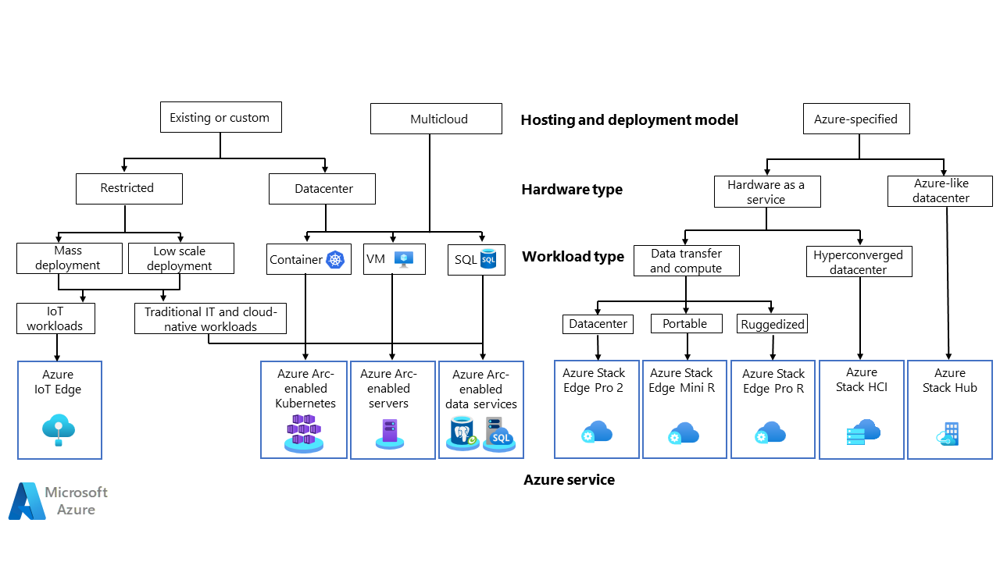
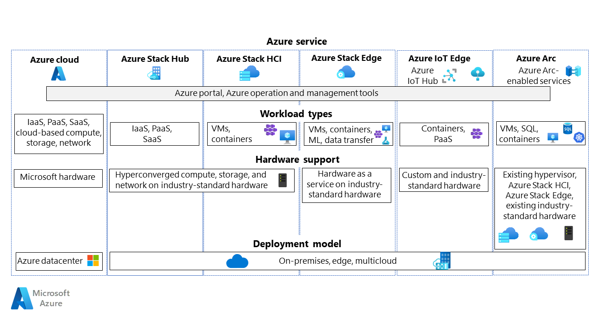

## Perspectives
Azure enables you to run your application code in a hybrid environment by offering several hybrid solutions. These services span from hardware to host your workloads, to being able to extend Azure PaaS services, security and operational tooling to your on-premises, edge and multicloud environment.

This article provides guidance so you can choose the hybrid solution, consisting of hardware and software, that better fits your business use case. To bring clarity to the  process of choosing a technology, the article maps the decision making process to two perspectives:
- Based on hardware aspects (SysAdmin perspective)
- Based on Azure service usage (DevOps perspective)

Depending on your background, concerns and expertise you may approach these solutions starting from the application and workload requirements or starting from the hardware and hosting location constraints. Keep in mind that these perspectives are not specific to a role, however you might naturally lean more towards one approach than the other.

## Concepts
Before selecting a hybrid service to run your workloads it is important to establish certain criteria and concepts that will guide the decision-making process. First, it is important to understand the differences hybrid, multi-cloud and edge.

- **Hybrid cloud:** is a cloud environment that combines public clouds and on-premises infrastructure. This is a strategy common across organizations that have strict data sovereignty regulations to meet, low latency requirements or that are enhancing their resiliency and business continuity strategy.
- **Multi-cloud:** in these types of environments multiple cloud computing services and providers are being used. This strategy is common across organizations that are looking for more flexibility, reduce risk or looking into different cloud providers to hosts specific applications. This usually requires cloud specific knowledge and tends to add complexity in management, operations and security.
- **Edge computing:** in this cloud environment the compute and data storage power is provided by devices hosted on-premises. This is a common approach for organizations and applications that need to run close to the data, reduced latency or compute data in near real time.

Besides the hosting location and the type of infrastructure that is being used, there are another set of concepts that will play an important role like [control plane and data plane](/azure/azure-resource-manager/management/control-plane-and-data-plane). Understanding the differences between the control plane and the data plane is key as these Azure Hybrid solutions will extend Azure's operations outside of a Microsoft data center extending capabilities of its control plane or you running a dedicated instance of it.

- **Control Plane:**  the control plane is used and accessed every time you manage resources. In the case of Azure, these requests are handled by Azure Resource Manager (ARM). The control plane for example is used to create a Virtual Machine.
- **Data Plane:** the data plane however is used to access capabilities exposed by the instance of a resource type you deployed via the control plane, for example once you access a Virtual Machine over RDP.

## Choose a candidate service

Based on these previously described concepts you can see that there are different criteria or approaches you can use to select the hybrid solution that fits your needs, if you are a developer, you will very likely be looking into criteria like: mass deployments, restricted hardware or purpose built, whereas if you are DevOps or systems administrator, you will focus more on the hosting location, hardware and hypervisors being used, etc.

### Decide based on Azure Services (DevOps perspective)

As a Developer or DevOps, you may look into criteria like:

- **Deployment type:** working with a large scale deployment for your applications is different than working with smaller scale implementations. A traditional IT deployment of VMs and databases will be very different than one based on containers or where distributed devices will be involved. In those distributed, more complex, at scale deployments it is important to make sure that the design incorporates the ability to massively scale the implementation of the service and concerns like business continuity might be addressed differently than it is in traditional IT.
- **Hardware requirements:** depending on the type of workload you might need a traditional data center hardware where you are able to run VMs, containers and databases; whereas, in other instances like IoT deployments a restricted hardware device is a better fit and can choose from rack, portable or ruggedized servers.
- **Use case:** the workload and use case will also be a very important criteria. A traditional application that runs on virtual machines will benefit from hyperconverged infrastructure and Azure's operational, security and management tooling for day-two operations, whereas a cloud-native application will be better suited to run on a container orchestrator like Azure Kubernetes Service, as well as, leveraging Azure PaaS solutions. If you need to deploy models built and trained in the cloud and run them on-premises, monitor IoT devices at scale or even provide Azure data transfer options then edge deployments and solutions will be in consideration.

Use the following flowcharts to select a candidate hybrid service, you can choose depending on your background and selection criteria:

### Decide based on hardware constraints (SysAdmin perspective)

As a System Administrator or DevOps you might choose a hybrid and multicloud service based on a different criteria:

- **Hardware refresh or repurposing hardware:** in brown field scenarios existing hardware needs to be included and represented in modern hybrid workload approaches. In green field scenarios decisions to buy or use hardware as a service with a monthly fee needs to be taken. The following decision matrix will guide you on selecting Azure services to renew or include existing hardware.
- **Hosting location:** where will the workload be deployed might be another area of concern that Azure Hybrid can address in different ways. You may choose to run your application in an on-premises data center, in Azure or multicloud while still having a consistent approach of your operations with cloud-native technologies. Choosing a hosting location might be determined by business, compliance, cost or security decisions
- **Workload type:** aside from the hardware and location of the servers, the type of workload to run needs to be considered as depending on the Azure Hybrid services that you choose you will be able to run: VMs, Azure Kubernetes Service Clusters, IoT Hub, data bases or PaaS solutions outside of a Microsoft datacenter.

Use the following flowcharts to navigate the different options and criteria:

## Disclaimer

The output from this flowchart is a **starting point** for consideration. Next, perform a more detailed evaluation of the service to see if it meets your needs. Review the contents of this article as it includes an overview of the different services as well as resources which may help you to make these tradeoff decisions.

## Understand the hybrid solutions

If you're not familiar with one Azure hybrid services selected in the previous step, read the overview documentation to understand the basics of the service.

- [Azure Stack](/azure-stack/):Azure Stack is a family of products and solutions that extend Azure to your data center or the edge. Within Azure Stack you can find several solutions for different use cases:
  - [Azure Stack Hub](/azure-stack/operator/azure-stack-overview?view=azs-2108): is an extension of Azure that provides a way to run apps in an on-premises environment and deliver Azure services in your data center with integrated systems and that can run on connected or disconnected environments.
  - [Azure Stack HCI](/azure-stack/hci/): is a hyperconverged solution that uses validated hardware to run virtualized and containerized workloads on-premises, while being able to connect them to Azure for cloud services and management.
  - [Azure Stack Edge](/azure/databox-online/): allows you to deliver Azure capabilities such as compute, storage, networking, and hardware-accelerated machine learning at an edge location.
- [Azure Arc](/azure/azure-arc/overview): simplifies governance and management by delivering a consistent multi-cloud and on-premises management platform and Azure services. Within Azure Arc there are several offers that can be classified into:
  - Azure Arc enabled infrastructure allows you to project your existing infrastructure resources both bare metal, VMs and Kubernetes clusters into Azure so its operations can be handled with Azure’s management and security tools.  This simplifies management, application delivery and consistency. This includes:
    - [Azure Arc-enabled servers](/azure/azure-arc/servers/overview)
    - [SQL Server on Azure Arc-enabled servers](/sql/sql-server/azure-arc/overview?view=sql-server-ver16)
    - [Azure Arc-enabled Kubernetes](/azure/azure-arc/kubernetes/overview)
    - [Azure Arc-enabled vSphere](/azure/azure-arc/vmware-vsphere/overview)
    - [Arc-enabled System Center Virtual Machine Manager](/azure/azure-arc/system-center-virtual-machine-manager/overview)
    - [Azure Arc-enabled VMs on Azure Stack HCI](/azure-stack/hci/manage/azure-arc-enabled-virtual-machines)
  - Azure Arc enabled Services: allows you to create on-premises and multi-cloud applications faster with Azure PaaS and data services such as [App Service, Functions, Logic Apps](/azure/app-service/overview-arc-integration), [Azure SQL Managed Instance](/azure/azure-arc/data/managed-instance-overview), [PostgreSQL Hyperscale](/azure/azure-arc/data/what-is-azure-arc-enabled-postgres-hyperscale), [Azure Machine Learning](/azure/machine-learning/how-to-attach-kubernetes-anywhere?tabs=deploy-extension-with-cli%2Ccli) amongst other solutions and run them
 anywhere while using existing infrastructure.
- [Azure IoT Edge](/azure/iot-edge/?view=iotedge-2020-11): Allows developers to mass deploy custom functionality to devices. IoT Edge is natively integrated with [IoT Hub](/azure/iot-hub/) and provides a natural DevOps experience to developers. Azure IoT Edge addresses IoT workloads but isn't reduced to it.
